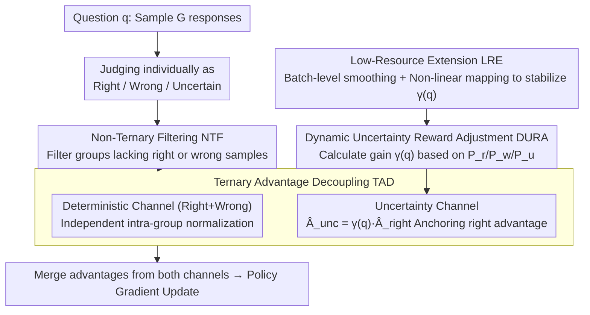

# UCPO: Uncertainty-Aware Policy Optimization

**Conference**: ICML2026  
**arXiv**: [2601.22648](https://arxiv.org/abs/2601.22648)  
**Code**: https://github.com/xzhouzeng/ucpo  
**Area**: LLM Reasoning  
**Keywords**: Uncertainty representation, Reinforcement Learning, Policy Optimization, Trustworthy AI, Overconfidence Mitigation  

## TL;DR
UCPO addresses the advantage bias caused by fixed uncertainty rewards in existing RL paradigms through two mechanisms: Ternary Advantage Decoupling (TAD) and Dynamic Uncertainty Reward Adjustment (DURA). This enables LLMs to reliably express uncertainty at knowledge boundaries, achieving 79.63% PAQ in mathematical reasoning on Qwen3-8B.

## Background & Motivation

**Background**: LLMs perform excellently on complex reasoning tasks but tend to provide incorrect assertions overconfidently (hallucination) when faced with problems beyond their knowledge boundaries. Building trustworthy AI requires the metacognitive ability of the model to "know what it doesn't know."

**Limitations of Prior Work**: Existing uncertainty alignment methods follow two routes: (1) SFT route—imitation learning using datasets with abstention labels, which suffers from high data synthesis costs and the inability of static data to capture dynamic uncertainty during reasoning; (2) RL route—assigning fixed intermediate rewards (e.g., 0.5) to uncertain responses, but such static rewards are extremely sensitive to hyperparameters. On difficult tasks, models exhibit "reward hacking" by over-rejecting to obtain stable rewards (avoidance degradation); on simple tasks, the uncertainty signal is overwhelmed by high rewards for correct answers, leaving the model still overconfident.

**Key Challenge**: RL frameworks like GRPO generate a fundamental "advantage bias" after introducing ternary rewards (Correct/Wrong/Uncertain). In high-performance intervals, the advantage of uncertain samples becomes negative (suppressed by the majority), punishing the model for expressing doubt. In low-performance intervals, the advantage of uncertain samples dominates the gradient (reward hacking), causing the model to degenerate into outputting only uncertainty.

**Goal**: Design an adaptive RL framework that achieves a dynamic balance in the ternary decision space (Correct/Wrong/Uncertain) without exhaustive hyperparameter tuning.

**Key Insight**: Theoretically analyze the mathematical mechanism by which fixed rewards cause advantage bias in the GRPO framework—the sign of the advantage function for uncertain samples flips across different performance intervals, which is a structural issue that static rewards cannot resolve.

**Core Idea**: Decouple deterministic and uncertainty paths into independent channels for advantage estimation (eliminating semantic interference), while dynamically adjusting the uncertainty reward weight based on the model's real-time capability and sample difficulty.

## Method

### Overall Architecture
UCPO aims to solve the following: after introducing "Correct/Wrong/Uncertain" ternary rewards in GRPO, the advantage of uncertain samples flips sign depending on the model's performance interval—it is suppressed to negative values in high-performance intervals (punishing caution) and dominates gradients in low-performance intervals (collective degeneration into abstention). It performs two "surgeries" on standard GRPO: for a question $q$, the model first samples $G$ responses and classifies each as correct, wrong, or uncertain; instead of global advantage normalization, it uses Ternary Advantage Decoupling (TAD) to split deterministic and uncertain samples into two independent channels for advantage calculation. The intensity of the uncertainty channel is handled by Dynamic Uncertainty Reward Adjustment (DURA), which calculates a gain coefficient $\gamma(q)$ based on the real-time ratio of correct/wrong/uncertain samples in the current group, allowing the reward to adapt to the model's capability instead of relying on a manually tuned fixed value. Extreme distributions and high variance in small groups are covered by Non-Ternary Filtering (NTF) and Low-Resource Expansion (LRE).

### Key Designs

**1. Ternary Advantage Decoupling (TAD): Isolating uncertainty signals from the global average into a separate channel**

The root cause of "majority suppression" is that GRPO's global normalization assigns advantages by comparing against the group average. As the model strengthens and correct samples predominate, a reasonable uncertain response is assigned a negative advantage due to its "below-average reward"—punishing the very caution that should be encouraged. TAD splits the $G$ rollouts into a deterministic set $\mathcal{S}_{det}$ (Right + Wrong) and an uncertainty set $\mathcal{S}_{unc}$, ensuring the two channels do not interfere. Within the deterministic channel, independent normalization is performed: $\hat{A}_{i,t}^{det} = (r_i - \text{mean}(\mathbf{r}_{det})) / (\text{std}(\mathbf{r}_{det}) + \epsilon)$, where correct paths receive positive reinforcement and wrong paths receive negative punishment. The key lies in the uncertainty channel—its advantage is no longer calculated independently but is dynamically projected by anchoring to the advantage of correct samples:

$$\hat{A}_{i,t}^{unc} = \gamma(q) \cdot \hat{A}_{right}$$

Essentially, the advantage of correct samples serves as a "performance anchor," allowing the incentive for abstention to scale automatically with the model's current peak reasoning capability. This prevents the uncertainty signal from competing with the global average (avoiding the suppression effect) while ensuring its strength is always linked to "how well the model can actually solve this problem." Groups lacking correct or wrong samples are discarded by NTF.

**2. Dynamic Uncertainty Reward Adjustment (DURA): Adapting abstention rewards to capability and difficulty without manual tuning**

The problem with a fixed intermediate reward $r_u$ (e.g., 0.5) is its one-size-fits-all nature. As model capability increases and task difficulties vary during training, the same $r_u$ can induce avoidance degradation (over-rejection for stable rewards) on difficult tasks or be drowned out by high rewards for correct answers on simple tasks. DURA breaks down the gain coefficient $\gamma(q)$ into a push-and-pull mechanism:

$$\gamma(q) = \underbrace{\frac{P_w}{P_u + P_w + \epsilon}(1 - P_u)}_{\text{Uncertainty Gain Term}} - \underbrace{w \cdot \frac{P_r}{P_r + P_w + \epsilon}P_u}_{\text{Uncertainty Suppression Term}}$$

Where $P_r, P_w, P_u$ are the ratios of correct/wrong/uncertain rollouts in the current group. The gain term amplifies the abstention incentive when the error rate is high ($P_w$ is large), pushing the model from "incorrect assertions" toward "honest doubt," while the $(1-P_u)$ factor prevents saturation into universal abstention. The suppression term punishes unnecessary avoidance as the model strengthens ($P_r$ increases), pushing it toward deterministic correct answers. This creates a "regulation buffer" that suppresses hallucinations early in training and promotes precision later, without manual scanning of $r_u$.

**3. Non-Ternary Filtering (NTF) and Low-Resource Expansion (LRE): Mitigating variance from extreme distributions and small groups**

Since DURA's $\gamma(q)$ is calculated based on intra-group ternary ratios, the estimation can be volatile when groups are small or distributions are extreme. NTF handles the latter by filtering groups that lack correct or wrong rollouts, logically equivalent to how standard GRPO treats all-correct or all-wrong groups with zero advantage. LRE addresses high variance in small groups: when $G$ is small (e.g., $G=4$), single-group ratio noise is high, causing $\gamma(q)$ to fluctuate violently. LRE stabilizes the gain estimation using batch-level smoothing and non-linear mapping. Together, they ensure training stability even with small rollout budgets.

## Key Experimental Results

### Main Results (Mathematical Reasoning, PAQ Metric)

| Method | AIME24 | AMC | MATH500 | Minerva | OlympiadBench | Average PAQ |
|------|--------|-----|---------|---------|---------------|---------|
| Qwen3-8B Baseline | 73.33 | 91.57 | 96.80 | 45.96 | 69.63 | 75.46 |
| GRPO | 77.01 | 88.35 | 96.46 | 47.18 | 69.22 | 75.64 |
| GRPO-UC ($r_u=0.2$) | 83.75 | 88.98 | 96.31 | 48.60 | 70.68 | 77.66 |
| **UCPO** | **86.11** | **91.95** | **97.28** | **49.15** | **73.67** | **79.63** |
| Llama-3.1-8B Baseline | 3.33 | 15.66 | 45.80 | 15.81 | 14.96 | 19.11 |
| GRPO-UC ($r_u=0.5$) | 0.00 | 21.43 | 57.61 | 26.16 | 19.28 | 24.90 |
| **UCPO** | **5.13** | **28.12** | **60.95** | **22.50** | **25.56** | **28.45** |

### Ablation Study (Llama-3.1-8B, Mathematical Reasoning)

| Configuration | Uncertainty Ratio | PAQ | F1 |
|------|-------------|-----|-----|
| w/o TAD | 50.33 | 22.56 | 16.21 |
| w/o DURA | 79.91 | 35.22 | 13.16 |
| w/o NTF | 37.96 | 28.51 | 22.93 |
| w/o LRE | 43.19 | 27.83 | 21.12 |
| Full UCPO | **39.09** | **28.45** | **22.65** |

### Key Findings
- Fixed rewards in GRPO-UC are extremely fragile: on Llama-3.1-8B math tasks, $r_u \geq 0.5$ triggers reward hacking, with the uncertainty ratio skyrocketing to 100% and F1 collapsing to single digits (9.01); meanwhile, on general tasks, $r_u = 0.2$ is insufficient to incentivize uncertainty learning.
- Removing TAD leads to a significant drop in PAQ (28.45 → 22.56), and removing DURA causes the uncertainty ratio to surge to 79.91% (reward hacking), proving both components are indispensable.
- UCPO achieves an average PAQ of 79.63% on Qwen3-8B, approximately 2 percentage points higher than the best GRPO-UC variant, without requiring $r_u$ hyperparameter tuning.
- A group size of $G=8$ is optimal for PAQ, while $G=16$ is better for F1, indicating that larger groups provide more stable advantage estimates.

## Highlights & Insights
- **Anchoring uncertainty advantage to correct sample advantage** $\hat{A}_{unc} = \gamma(q) \cdot \hat{A}_{right}$ is an elegant design: it ensures the incentive for uncertainty scales automatically with the model's current peak reasoning capability, avoiding both the suppression effect of global normalization and the hacking risks of fixed rewards. This "performance anchoring" concept is transferable to any RL scenario requiring a balance of multi-type rewards.
- The DURA dual-term formula implements a self-stabilizing system: it encourages abstention when errors are frequent and suppresses it when capability is high. This adaptive mechanism is a fundamental improvement over manual tuning of $r_u$—moving from "one hyperparameter fits all" to "automatic adjustment based on current state."
- The theoretical analysis of the ternary imbalance problem is very clear—utilizing ternary plots to visualize the behavior of the advantage function across different performance intervals intuitively reveals the mathematical mechanism behind the failure of fixed rewards.

## Limitations & Future Work
- The authors acknowledge that the rollout type distribution (initial ratios of $P_r, P_w, P_u$) might affect uncertainty learning, though this wasn't fully explored.
- In multiple-choice scenarios, F1 might decrease because "lucky guesses" are converted to uncertainty—UCPO optimizes for reliability (PAQ) rather than coverage.
- The DURA gain formula depends on intra-group statistics and may degenerate in extreme distributions (e.g., all correct or all wrong), requiring NTF as a fallback.
- Future work could explore continuous uncertainty expressions (e.g., confidence scores) rather than discrete abstention decisions.

## Related Work & Insights
- TruthRL / KnowRL: Representative methods using fixed intermediate rewards for uncertainty alignment; hyperparameter sensitivity is their core bottleneck.
- GRPO / DeepSeek-R1: The foundational RL framework for UCPO, upon which UCPO introduces the ternary decision space.
- DAPO / Dr.GRPO: Concurrent works improving GRPO training stability, focusing on sampling strategies and clipping mechanisms rather than uncertainty modeling.

<!-- RELATED:START -->

## Related Papers

- [\[ICML 2026\] Are Tools Always Beneficial? Learning to Invoke Tools Adaptively for Dual-Mode Multimodal LLM Reasoning](are_tools_always_beneficial_learning_to_invoke_tools_adaptively_for_dual-mode_mu.md)
- [\[ICLR 2026\] Slow-Fast Policy Optimization: Reposition-Before-Update for LLM Reasoning](../../ICLR2026/llm_reasoning/slow-fast_policy_optimization_reposition-before-update_for_llm_reasoning.md)
- [\[CVPR 2026\] APPO: Attention-guided Perception Policy Optimization for Video Reasoning](../../CVPR2026/llm_reasoning/appo_attention-guided_perception_policy_optimization_for_video_reasoning.md)
- [\[ACL 2026\] Think Outside the Policy: In-Context Steered Policy Optimization](../../ACL2026/llm_reasoning/think_outside_the_policy_in-context_steered_policy_optimization.md)
- [\[ICML 2026\] Verifying Meta-Awareness via Predictive Rewards in Reasoning Models](verifying_meta-awareness_via_predictive_rewards_in_reasoning_models.md)

<!-- RELATED:END -->
