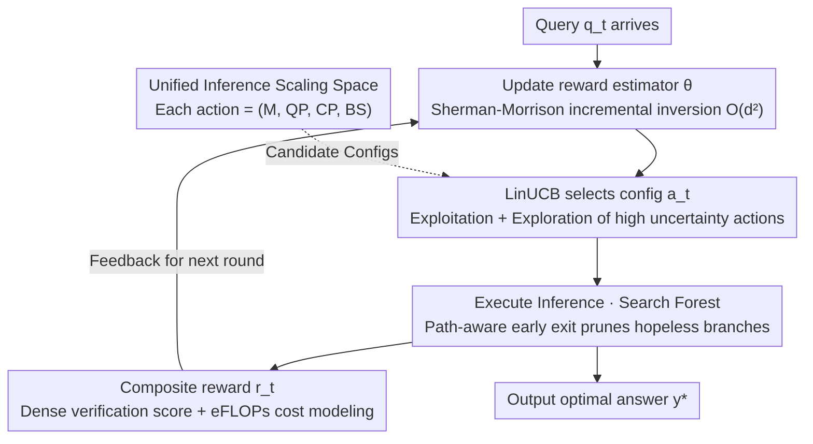

# UniScale: Adaptive Unified Inference Scaling through Online Joint Optimization of Model Routing and Test-Time Scaling

**Conference**: ICML 2026  
**arXiv**: [2605.30898](https://arxiv.org/abs/2605.30898)  
**Code**: TBD  
**Area**: LLM Inference  
**Keywords**: Model Routing, Test-time Scaling, Joint Optimization, LinUCB, Contextual Multi-Armed Bandits

## TL;DR
The authors propose the UniScale framework, which unifies model routing and test-time scaling (TTS) into a single decision space. It leverages LinUCB contextual multi-armed bandits for online learning of adaptive inference strategies, addressing the fine-grained quality-cost tradeoff in LLM deployment.

## Background & Motivation

**Background**: LLM deployment requires balancing inference quality and computational cost. Existing methods typically operate along two independent dimensions: model routing (switching between models of different scales) and test-time scaling (TTS, increasing computation during inference within a fixed model).

**Limitations of Prior Work**: Model routing only supports discrete transitions, resulting in coarse-grained performance changes; single-model TTS is constrained by the model's inherent capacity, leading to diminishing returns as computation increases; these two mechanisms are designed independently and fail to collaborate in dynamic environments.

**Key Challenge**: How to provide continuous, fine-grained quality-cost tradeoffs spanning from model scale to inference depth while maintaining computational efficiency?

**Goal**: To construct a Unified Inference Scaling (UIS) paradigm that treats model selection and TTS parameters as configurations within a single optimization space, supporting online adaptation.

**Key Insight**: Modeling UIS configuration selection as a contextual multi-armed bandit problem allows the system to capture the alignment between query complexity and system capability, enabling continuous policy adjustment under environmental drift.

**Core Idea**: Jointly optimize model routing and TTS so they complement each other—TTS fills the performance gaps between discrete models, while routing provides larger models when TTS hits diminishing returns.

## Method

### Overall Architecture
UniScale addresses the issue where choosing a larger model versus performing more intensive searches are traditionally tuned separately. It integrates them into an online closed-loop for joint decision-making. For each incoming query, the system executes a cycle: first, it updates the reward estimator with historical feedback; then, it uses the LinUCB acquisition function to select an optimal configuration from the unified space; next, it executes inference using path-aware early exit to prune hopeless branches; finally, it feeds back a composite reward—combining validator scores and computational costs—to optimize the policy. In essence, both model scale and search breadth are learned online by the same bandit.

### Key Designs

**1. Unified Inference Scaling Space: Consolidating model routing and TTS into a single decision variable**

In traditional approaches, model routing can only jump between discrete scales, resulting in coarse performance steps. Conversely, increasing computation for a single model's TTS quickly hits a capacity ceiling with diminishing returns. UniScale’s solution is to parameterize a single inference instance as a joint configuration $(M, QP, CP, BS)$—where $M$ denotes the base model, and $QP$ (Question Parallelism), $CP$ (Candidate Parallelism), and $BS$ (Beam Size) characterize the search intensity on that model. Consequently, the performance gaps between discrete models are filled by scaling search intensity. When search gains plateau, the system switches to a larger $M$. These two mechanisms thus complement each other to form a continuous, fine-grained quality-cost frontier.

**2. Online Adaptive Learning based on LinUCB: Learning configuration selection during deployment**

With a continuous configuration space, the difficulty lies in choosing the right configuration for a specific query, especially as online environments drift. UniScale models this as a contextual multi-armed bandit problem. It encodes the query and candidate actions into a joint semantic representation $\mathbf{x}_{t,a}$, estimates the expected reward using a linear predictor $\hat{r}_t = \langle \mathbf{x}_{t,a}, \boldsymbol{\theta} \rangle$, and selects the action based on the LinUCB acquisition function:

$$a_t = \arg\max_{a \in \mathcal{A}}\left(\hat{\boldsymbol{\theta}}_t^\top \mathbf{x}_{t,a} + \alpha\sqrt{\mathbf{x}_{t,a}^\top \mathbf{A}_t^{-1} \mathbf{x}_{t,a}}\right)$$

The first term represents exploitation of the current optimal estimate, while the second term provides an exploration bonus for configurations with high uncertainty, with $\alpha$ balancing the two. This captures the alignment between query complexity and system intensity while ensuring fast convergence in non-stationary environments. The covariance matrix $\mathbf{A}_t$ is updated using the Sherman-Morrison formula for incremental inversion, reducing per-step complexity from $\mathcal{O}(d^3)$ to $\mathcal{O}(d^2)$, ensuring negligible overhead during online inference.

**3. Path-Aware Early Exit + Dense Verification + Cost Modeling: Reducing costs and densifying reward signals**

Broad search consumes significant computation, and bandits require informative feedback for rapid learning. This trio of mechanisms addresses both sides. Path-aware early exit dynamically prunes branches: if the optimistic upper bound of a path at step $j$ is lower than the current best threshold, it is abandoned:

$$\frac{j \cdot V(p_{i,j}) + (H_{\max}-j) \cdot v_{\sup}}{H_{\max}} < V_{\max}$$

where $V(p_{i,j})$ is the verification score of the traversed path and $(H_{\max}-j)\cdot v_{\sup}$ compensates for remaining steps with the most optimistic score. This significantly lowers inference costs across configurations. Dense verification feedback incorporates both binary correctness and continuous validator scores. Cost modeling uses equivalent FLOPs (eFLOPs) to measure computation and memory overhead on a unified scale. These elements form the composite reward for LinUCB:

$$r_t = w_1 \cdot \text{Correct}(a_t) + w_2 \cdot \text{Score}(a_t) + w_3 \cdot (1-\tilde{C}_{\text{UIS}}(a_t))$$

Weights balance correctness, process quality, and normalized cost—ensuring that computational savings do not compromise quality while providing richer training signals than simple binary outcomes.

## Key Experimental Results

### Main Results

| Method | Cost-Sensitive Reward | Cost-Sensitive Accuracy | Quality-Priority Reward | Quality-Priority Accuracy |
|------|------------|------------|------------|------------|
| Random | 0.5731 | 55.00% | 0.6175 | 52.88% |
| Greedy | 0.5589 | 45.00% | 0.5780 | 52.88% |
| k-NN | 0.6590 | 41.38% | 0.5807 | 46.75% |
| **Ours (TTS)** | **0.7184** | **43.75%** | **0.6184** | **46.50%** |
| **Ours (Routing)** | **0.5873** | **34.12%** | **0.5459** | **50.00%** |
| **Ours (UIS)** | **0.5589** | **45.00%** | **0.5780** | **52.88%** |

### Ablation Study

| Configuration | Full Model Reward | w/o Path-Aware Early Exit | w/o Dense Verification | w/o Cost Model |
|------|---------|----------|---------|---------|
| UIS Full | 0.6590 | -8.2% | -5.7% | -4.3% |
| TTS Only | 0.7184 | -6.1% | -3.9% | -2.8% |

### Key Findings
- UIS improves reward by 8.2% and 12.1% compared to standalone TTS and routing, respectively, validating the effectiveness of joint optimization.
- Path-aware early exit is the most significant contributor to performance gains (-8.2% in ablation), followed by dense verification feedback (-5.7%).
- The method performs optimally in both cost-sensitive and quality-priority modes, demonstrating universal adaptability.

## Highlights & Insights
- **Innovative Problem Reformulation**: Merges independent model routing and TTS into a unified decision space.
- **Efficient Online Learning**: The combination of LinUCB and Transformer encoders ensures fast convergence with low computational overhead.
- **Engineering Completeness**: The three-layer mechanism (early exit, verification, cost modeling) works in concert to address specific pain points of practical deployment.

## Limitations & Future Work
- Cost modeling assumptions—the mapping of eFLOPs may still exhibit bias across heterogeneous hardware.
- Validator dependence—the performance upper bound is limited by the quality of the validator.
- Future directions: Integrating quantitative model tuning and dynamic verifier updates; extending the framework to streaming or multi-turn dialogue scenarios.

## Related Work & Insights
- **vs. Ensemble Routing**: Traditional routing uses discrete switches, whereas this work uses continuous scaling.
- **vs. Single-Model TTS**: TTS is limited by capacity under a fixed model; this work breaks through that limit via routing.
- **vs. RL Methods**: LinUCB provides theoretical guarantees (regret bounds) and exhibits higher online efficiency.

## Rating
- Novelty: ⭐⭐⭐⭐⭐ High originality in unified framework design.
- Experimental Thoroughness: ⭐⭐⭐⭐ Covers TTS, Routing, and UIS dimensions; baselines could be further expanded.
- Writing Quality: ⭐⭐⭐⭐⭐ Clear logic and natural problem introduction.
- Value: ⭐⭐⭐⭐⭐ Directly addresses practical LLM deployment needs; the framework is easily generalizable.

<!-- RELATED:START -->

## Related Papers

- [\[ICML 2026\] Beyond Two-Stage Training: Cooperative SFT and RL for LLM Reasoning](beyond_two-stage_training_cooperative_sft_and_rl_for_llm_reasoning.md)
- [\[ICML 2026\] Verifying Meta-Awareness via Predictive Rewards in Reasoning Models](verifying_meta-awareness_via_predictive_rewards_in_reasoning_models.md)
- [\[ICML 2026\] When to Re-Plan: Subgoal Persistence in Hierarchical Latent Reasoning](when_to_re-plan_subgoal_persistence_in_hierarchical_latent_reasoning.md)
- [\[ICML 2026\] Conformal Thinking: Risk Control for Reasoning on a Compute Budget](conformal_thinking_risk_control_for_reasoning_on_a_compute_budget.md)
- [\[ICML 2026\] A Formal Comparison Between Chain of Thought and Latent Thought](a_formal_comparison_between_chain_of_thought_and_latent_thought.md)

<!-- RELATED:END -->
