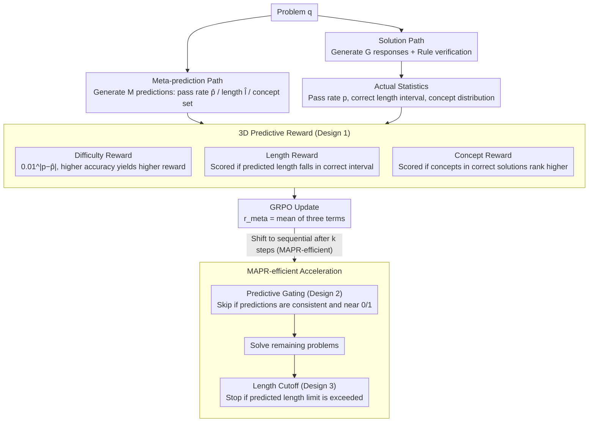

# Verifying Meta-Awareness via Predictive Rewards in Reasoning Models

**Conference**: ICML 2026  
**arXiv**: [2510.03259](https://arxiv.org/abs/2510.03259)  
**Code**: https://github.com/akatigre/MAPR-RL  
**Area**: LLM Reasoning  
**Keywords**: Metacognition, Reasoning Models, Reinforcement Learning, Predictive Rewards

## TL;DR
Metacognition in reasoning models is optimized by aligning self-predictions of solution length, pass rate, and required concepts with actual statistics, significantly enhancing mathematical reasoning performance and accelerating training.

## Background & Motivation

**Background**: Large Reasoning Models (LRMs) post-trained via RL algorithms like GRPO significantly enhance LLM mathematical reasoning. However, current methods rely solely on answer-level verification and lack awareness of the model's own knowledge boundaries and thought processes.

**Limitations of Prior Work**: Traditional methods face three key issues: (1) models cannot accurately estimate their own solving capabilities (blurred knowledge boundaries); (2) generation of excessively long but incorrect reasoning paths wastes computation; (3) lack of self-awareness regarding problem difficulty prevents adaptive allocation of computational resources.

**Key Challenge**: A significant deviation exists between the model's "metacognition" and its actual reasoning ability. Models trained with GRPO exhibit pronounced overconfidence, where predicted difficulty is severely misaligned with true pass rates.

**Goal**: Construct a self-verifying metacognitive optimization framework where the model is optimized through the consistency between self-generated predictions and ground-truth statistics without external supervision.

**Key Insight**: The model can generate two reasoning trajectories in parallel: one for solving the problem and one for meta-prediction. Aligning the predicted values from both trajectories with actual statistics allows the model to learn accurate self-assessment.

**Core Idea**: Replace traditional "answer rewards" with "predictive rewards" (requiring the model to predict difficulty, length, and concepts and aligning them with ground truth) to drive metacognitive alignment.

## Method

### Overall Architecture
MAPR requires the model to execute two parallel reasoning paths for the same problem: the **solution path** generates $G$ responses as usual, validated by rules to obtain the true pass rate $p$ and the length range of correct solutions $[l_{\min}, l_{\max}]$; the **meta-prediction path** generates $M$ "meta-predictions" where the model estimates its pass rate $\hat{p}$, expected length $\hat{l}$, and the set of required concepts $\hat{\mathcal{G}}_{\text{notion}}$ before solving. Both paths share parameters and are updated under the GRPO framework. The accuracy of the predictions is transformed into an optimizable reward signal (**three-dimensional predictive reward**). In the accelerated version, **MAPR-efficient**, the process shifts from parallel to sequential after $k$ training steps: meta-prediction is performed first, using **predictive gating** to filter out trivial or unsolvable problems, followed by solving the remaining problems with **length cutoff** applied to realize computational savings.

### Key Designs

**1. Three-dimensional Predictive Reward: Self-calibration across difficulty, length, and concepts**

Models trained via GRPO often suffer from overconfidence. MAPR decomposes "self-awareness" into three verifiable dimensions. For difficulty, an exponential decay $r_{\text{difficulty}}=0.01^{|p-\hat{p}|}$ is used; rewards collapse rapidly even with slight deviations in $\hat{p}$, forcing precise estimation. For length, an indicator function $r_{\text{length}}=\mathbb{1}[l_{\min}\leq\hat{l}\leq l_{\max}]$ is used. For concepts, $r_{\text{notion}}=\mathbb{E}_{n}[\mathbb{1}[c_{\text{corr,n}}>c_{\text{wrong,n}}]]$ rewards the model for ranking concepts present in correct solutions higher than those in incorrect ones. This decomposition is effective as it expands "understanding a problem" from simple difficulty guessing to multi-faceted cognition involving duration and knowledge points.

**2. Predictive Gating: Filtering trivial and unsolvable problems before solving**

Parallel sampling wastes computation on problems that are either extremely easy or impossible. MAPR uses the meta-prediction path as a front-end filter: when the standard deviation of $M$ meta-predictions $\sigma<\sigma_{\text{pg}}$ (consensus) and the mean prediction approaches 0 or 1, gating is triggered to skip the problem. This is enabled after $k$ steps once meta-predictions stabilize. Unlike DAPO's posterior pruning, predictive gating shifts judgment before execution, achieving a filtering precision of 0.94 and recall of 0.87.

**3. Length Cutoff: Immediate termination at predicted limits**

Reasoning length strongly signals correctness; excessive length often indicates the model is looping in an incorrect path. After MAPR training, $\hat{l}$ becomes an accurate predictor for correct solutions. A hard limit $l_{\text{limit}}=\hat{l}\times l_{\text{LC}}$ is set; generation is forcibly truncated if it exceeds this line, as correct answers are rarely produced beyond this point. This serves as a generation constraint that saves redundant tokens with negligible impact on accuracy.

### Loss & Training
MAPR is based on GRPO. The reward for the solution path $r_{\text{sol}}$ comes from rule verification, while the reward for the meta-prediction path is the mean of the three dimensions: $r_{\text{meta}}=\frac{r_{\text{difficulty}}+r_{\text{length}}+r_{\text{notion}}}{3}$. In MAPR-efficient, the process switches from parallel to sequential after $k=80$ steps to realize computational gains from meta-cognition.

## Key Experimental Results

### Main Results

Comparison with GRPO baselines on six math benchmarks (Qwen3-4B/8B/14B):

| Dataset | GRPO (4B) | MAPR (4B) | Gain | GRPO (8B) | MAPR (8B) | Gain |
|--------|-----------|-----------|------|-----------|-----------|------|
| AIME'24 | 17.50±4.00 | 26.15±3.32 | +49.43% | 28.54±4.12 | 34.17±5.54 | +19.72% |
| AIME'25 | 11.77±4.56 | 21.56±4.40 | +83.18% | 22.19±3.63 | 28.44±5.41 | +28.17% |
| AMC23 | 59.30±6.40 | 70.16±4.78 | +18.11% | 73.67±5.60 | 79.53±4.26 | +7.95% |
| MATH500 | 79.61±0.91 | 84.52±0.74 | +6.17% | 85.75±0.66 | 88.05±0.82 | +2.68% |
| Minerva | 42.27±1.53 | 41.12±2.00 | -3.18% | 43.21±2.12 | 47.21±1.74 | +9.26% |
| OlympiadBench | 44.47±1.04 | 53.38±0.96 | +20.04% | 54.03±1.22 | 56.86±0.85 | +5.24% |
| **Average** | **42.49** | **49.48** | **+13.04%** | **51.23** | **55.71** | **+8.74%** |

### Ablation Study

| Configuration | AIME'24 | AIME'25 | AMC23 | Description |
|------|---------|---------|-------|------|
| Difficulty Reward Only | 23.41 | 18.92 | 66.28 | Single dimension insufficient |
| Length Reward Only | 24.67 | 20.13 | 68.55 | Length signal is weaker |
| Concept Reward Only | 22.89 | 19.56 | 65.87 | Concept dimension is weakest |
| **Full 3D** | **26.15** | **21.56** | **70.16** | Full model is optimal |

Shapley value decomposition: Difficulty reward contributes most (43%), followed by length (35%) and concepts (22%).

### Key Findings
- MAPR achieves the largest gains on medium-difficulty problems (AIME/AMC/Olympiad, +20% to +83%), while performance saturates on easy problems (MATH500).
- Metacognitive improvement drives performance beyond training steps—at equal steps, the slope of performance gain vs. $\Delta r_{\text{pred}}$ growth is 1.8x.
- Predictive gating achieves 94% precision and 87% recall, reliably filtering zero-variance problems.
- MAPR-efficient acceleration: 0.78x computation required to reach baseline performance, or 15% performance gain under equal computation.

## Highlights & Insights
- **Metacognition as Internal Signal**: Breaks the paradigm of RL using only answer rewards. Parallel "thought process prediction" allows the model to self-verify capability estimates.
- **Prediction-to-Control Inversion**: Typically, prediction is for passive understanding; here, it actively drives computational resource scheduling.
- **Transferability of 3D Decomposition**: The difficulty + length + concept framework is applicable to any task requiring adaptive reasoning.

## Limitations & Future Work
- Concept prediction accuracy is limited—the Shapley value for concepts is only 22%, mainly due to reliance on manual rules for matching.
- Diminishing returns with model scale—13% gain for 4B, 8.7% for 8B, and 6.6% for 14B.
- Dataset bias—training was restricted to DeepScaleR.
- Future improvements: Replace rule matching with learnable concept extractors; explore fine-grained meta-predictions; improve cross-task generalization.

## Related Work & Insights
- **vs. DAPO**: DAPO performs posterior pruning; MAPR prior filtering is more efficient.
- **vs. Confidence Threshold Stopping**: Traditional heuristics lack true metacognitive alignment; MAPR enforces self-calibration via rewards.
- **vs. External Verifiers**: External PRMs or multi-agent verification require additional models; MAPR self-verification is more lightweight.

## Rating
- Novelty: ⭐⭐⭐⭐⭐  Innovative combination of metacognition and predictive rewards.
- Experimental Thoroughness: ⭐⭐⭐⭐⭐  6 math benchmarks, 3 model scales, detailed ablation, and Shapley decomposition.
- Writing Quality: ⭐⭐⭐⭐  Main ideas are clear, though some concepts are described briefly.
- Value: ⭐⭐⭐⭐⭐  Improves performance (13%+) and accelerates training by 1.28x.

<!-- RELATED:START -->

## Related Papers

- [\[ICLR 2026\] Dynamics-Predictive Sampling for Active RL Finetuning of Large Reasoning Models](../../ICLR2026/llm_reasoning/dynamics-predictive_sampling_for_active_rl_finetuning_of_large_reasoning_models.md)
- [\[ICML 2026\] Hidden Error Awareness in Chain-of-Thought Reasoning: The Signal Is Diagnostic, Not Causal](hidden_error_awareness_in_chain-of-thought_reasoning_the_signal_is_diagnostic_no.md)
- [\[ICLR 2026\] Verifying Chain-of-Thought Reasoning via Its Computational Graph](../../ICLR2026/llm_reasoning/verifying_chain-of-thought_reasoning_via_its_computational_graph.md)
- [\[ACL 2026\] Self-Awareness before Action: Mitigating Logical Inertia via Proactive Cognitive Awareness](../../ACL2026/llm_reasoning/self-awareness_before_action_mitigating_logical_inertia_via_proactive_cognitive_.md)
- [\[NeurIPS 2025\] Smaller Models, Smarter Rewards: A Two-Sided Approach to Process and Outcome Rewards](../../NeurIPS2025/llm_reasoning/smaller_models_smarter_rewards_a_two-sided_approach_to_process_and_outcome_rewar.md)

<!-- RELATED:END -->
