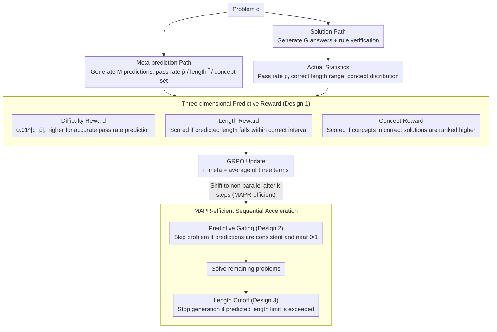

# Verifying Meta-Awareness via Predictive Rewards in Reasoning Models

**Conference**: ICML 2026  
**arXiv**: [2510.03259](https://arxiv.org/abs/2510.03259)  
**Code**: https://github.com/akatigre/MAPR-RL  
**Area**: LLM Reasoning  
**Keywords**: Metacognition, Reasoning Models, Reinforcement Learning, Predictive Rewards

## TL;DR
Optimizing model metacognition by requiring reasoning models to self-predict solution length, pass rates, and necessary concepts—aligning predictions with ground-truth statistics—significantly enhances mathematical reasoning performance and accelerates training.

## Background & Motivation

**Background**: Post-training Large Reasoning Models (LRMs) via RL algorithms like GRPO has significantly enhanced LLM mathematical reasoning. However, current methods rely solely on answer-level verification and lack awareness of the model's own knowledge boundaries and thought processes.

**Limitations of Prior Work**: Traditional approaches face three key issues: (1) Models cannot accurately estimate their own problem-solving capabilities (blurred knowledge boundaries); (2) Generating ultra-long but incorrect reasoning paths wastes computation; (3) A lack of self-awareness regarding problem difficulty prevents adaptive allocation of computational resources.

**Key Challenge**: A significant discrepancy exists between a model's "metacognition" and its actual reasoning ability. Models trained with GRPO exhibit pronounced overconfidence, where predicted difficulty is severely misaligned with actual pass rates.

**Goal**: To construct a self-verifying metacognitive optimization framework that allows the model to derive optimization signals through consistency between self-generated predictions and actual statistics, without requiring external supervision.

**Key Insight**: The model can generate two reasoning trajectories in parallel—one for problem-solving and one for meta-prediction. Aligning the predicted values from both trajectories with actual statistics facilitates accurate self-assessment learning.

**Core Idea**: Replace traditional "answer rewards" with "predictive rewards" (requiring the model to predict difficulty, length, and concepts, then aligning these with ground truth) to drive the alignment of model metacognition.

## Method

### Overall Architecture
MAPR requires the model to execute two parallel reasoning paths for the same problem: The **Solution Path** generates $G$ responses as usual, using rule-based verification to obtain the actual pass rate $p$ and the length range $[l_{\min}, l_{\max}]$ of correct solutions; the **Meta-prediction Path** generates $M$ "meta-predictions," requiring the model to state its estimated pass rate $\hat{p}$, expected length $\hat{l}$, and the set of required concepts $\hat{\mathcal{G}}_{\text{notion}}$ before solving. Both paths share parameters and are updated under the GRPO framework, turning prediction accuracy into an optimizable reward signal (**Three-dimensional Predictive Reward**). This is the base version of MAPR. Once training exceeds $k$ steps and meta-predictions stabilize, the accelerated **MAPR-efficient** version switches from parallel to sequential: it runs meta-prediction first, uses competitive **Predicting Gating** to filter out trivial or unsolvable problems, and then applies **Length Cutoff** to the remaining problems, translating metacognitive gains into actual computational savings (predicted concepts can also be fed as hints to the solution path).

### Key Designs

**1. Three-dimensional Predictive Reward: Calibrating Difficulty, Length, and Concepts**

Models trained via GRPO often suffer from overconfidence, where self-reported difficulty poorly matches actual pass rates. MAPR decomposes this "self-awareness" into three verifiable dimensions, each providing a reward. For difficulty, an exponential decay $r_{\text{difficulty}}=0.01^{|p-\hat{p}|}$ is used; any slight deviation of predicted $\hat{p}$ from actual $p$ causes the reward to collapse, forcing the model to provide precise rather than coarse estimates. For length, an indicator function $r_{\text{length}}=\mathbb{1}[l_{\min}\leq\hat{l}\leq l_{\max}]$ awards points only if the predicted length falls within the actual range of correct solutions. For concepts, $r_{\text{notion}}=\mathbb{E}_{n}[\mathbb{1}[c_{\text{corr,n}}>c_{\text{wrong,n}}]]$ rewards models for ranking concepts present in correct solutions higher than those in incorrect ones. This decomposition is effective because it expands "understanding a problem" from a simple difficulty guess to a multi-faceted cognitive assessment of "how long it takes and which knowledge points to use," where deviation in any dimension prevents a maximum score.

**2. Predictive Gating: Filtering Trivial and Unsolvable Problems Before Solving**

A major source of computational waste in parallel sampling is repeatedly solving problems that are either "effortlessly correct" or "persistently wrong." MAPR utilizes the meta-prediction path for pre-filtering: when the standard deviation of $M$ meta-predictions $\sigma<\sigma_{\text{pg}}$ (model consensus) and the average prediction approaches 0 or 1 (unanimous belief of failure or success), gating is triggered to skip the problem. Gating is enabled only after $k$ steps when meta-predictions stabilize. Unlike DAPO’s post-hoc pruning, predictive gating moves judgment before the solution phase, using metacognition to eliminate invalid sampling. Testing shows a filtering precision of 0.94 and recall of 0.87, reliably removing zero-variance problems.

**3. Length Cutoff: Stopping Generation at the Predicted Upper Bound**

Length is a strong signal of reasoning correctness—excessive length often implies a model is looping on an incorrect path. After MAPR training, $\hat{l}$ provides an accurate prediction of correct solution lengths. A hard limit $l_{\text{limit}}=\hat{l}\times l_{\text{LC}}$ is set; generation is forced to truncate if it crosses this line, as correct answers are rarely produced beyond this length. This effectively turns the model's own length prediction into a generation constraint, saving significant redundant tokens with almost no loss in accuracy.

### Loss & Training
MAPR is built on GRPO: the solution path reward $r_{\text{sol}}$ comes from rule-based verification, while the meta-prediction reward is the average of the three dimensions $r_{\text{meta}}=\frac{r_{\text{difficulty}}+r_{\text{length}}+r_{\text{notion}}}{3}$. Its accelerated version, MAPR-efficient, switches from parallel to sequential after $k=80$ steps: meta-prediction is run first to trigger gating for problem filtering, followed by solving the remaining problems, thereby realizing computational efficiency gains from metacognition.

## Key Experimental Results

### Main Results

Comparison with GRPO baselines on six math benchmarks (Qwen3-4B/8B/14B):

| Dataset | GRPO (4B) | MAPR (4B) | Gain | GRPO (8B) | MAPR (8B) | Gain |
|--------|-----------|-----------|------|-----------|-----------|------|
| AIME'24 | 17.50±4.00 | 26.15±3.32 | +49.43% | 28.54±4.12 | 34.17±5.54 | +19.72% |
| AIME'25 | 11.77±4.56 | 21.56±4.40 | +83.18% | 22.19±3.63 | 28.44±5.41 | +28.17% |
| AMC23 | 59.30±6.40 | 70.16±4.78 | +18.11% | 73.67±5.60 | 79.53±4.26 | +7.95% |
| MATH500 | 79.61±0.91 | 84.52±0.74 | +6.17% | 85.75±0.66 | 88.05±0.82 | +2.68% |
| Minerva | 42.27±1.53 | 41.12±2.00 | -3.18% | 43.21±2.12 | 47.21±1.74 | +9.26% |
| OlympiadBench | 44.47±1.04 | 53.38±0.96 | +20.04% | 54.03±1.22 | 56.86±0.85 | +5.24% |
| **Average** | **42.49** | **49.48** | **+13.04%** | **51.23** | **55.71** | **+8.74%** |

### Ablation Study

| Configuration | AIME'24 | AIME'25 | AMC23 | Description |
|------|---------|---------|-------|------|
| Difficulty Reward Only | 23.41 | 18.92 | 66.28 | Single-dimension prediction is insufficient |
| Length Reward Only | 24.67 | 20.13 | 68.55 | Length signal is relatively weak |
| Concept Reward Only | 22.89 | 19.56 | 65.87 | Concept dimension is the weakest |
| **Full 3D** | **26.15** | **21.56** | **70.16** | Full model is optimal |

Shapley value decomposition: Difficulty reward contributes the most (43%), followed by length (35%) and concepts (22%).

### Key Findings
- MAPR achieves the largest gains on medium-difficulty problems (AIME/AMC/Olympiad, +20%-+83%), while saturating on easy problems (MATH500).
- Metacognitive improvements drive performance faster than training steps—at equal steps, the slope of performance growth vs. $\Delta r_{\text{pred}}$ growth is 1.8x.
- Predictive gating has a precision of 94% and recall of 87%, reliably filtering zero-variance problems.
- MAPR-efficient acceleration—achieves baseline performance with only 0.78x computation or provides a 15% performance boost at equivalent computation.

## Highlights & Insights
- **Metacognition as an Internal Signal**: Breaks the traditional RL paradigm that relies solely on answer rewards. Models self-verify their capability estimates through parallel "thought process prediction."
- **Inversion of Prediction to Control**: Typically, prediction is used to passively understand a system; this work inverts it to actively drive computational resource scheduling using predictive results.
- **Portability of Three-dimensional Decomposition**: The difficulty + length + concept decomposition framework is generalizable to any task requiring adaptive reasoning.

## Limitations & Future Work
- Limited concept prediction accuracy—the concept dimension's Shapley value is only 22%, mainly due to the manual rules required for concept matching.
- Diminishing returns with model size—13% gain for 4B models, 8.7% for 8B, and 6.6% for 14B.
- Dataset bias—training was conducted only on DeepScaleR.
- Improvements: Replace rule-based matching with learnable concept extractors; explore finer-grained meta-predictions (e.g., intermediate step accuracy); cross-task generalization.

## Related Work & Insights
- **vs. DAPO**: DAPO performs post-hoc pruning; MAPR’s prior filtering is more efficient.
- **vs. Confidence Threshold Stopping**: Traditional heuristics lack true metacognitive alignment; MAPR enforces self-calibration via rewards.
- **vs. External Verifiers**: External PRMs or multi-agent verification require additional models; MAPR’s self-verification is more lightweight.

## Rating
- Novelty: ⭐⭐⭐⭐⭐  Innovative combination of metacognition and predictive rewards.
- Experimental Thoroughness: ⭐⭐⭐⭐⭐  6 math benchmarks + 3 model scales + detailed ablation + Shapley decomposition.
- Writing Quality: ⭐⭐⭐⭐  Main ideas are clear, though some conceptual descriptions are slightly hurried.
- Value: ⭐⭐⭐⭐⭐  Not only improves performance (13%+) but also accelerates training by 1.28x.

<!-- RELATED:START -->

## Related Papers

- [\[ICLR 2026\] Dynamics-Predictive Sampling for Active RL Finetuning of Large Reasoning Models](../../ICLR2026/llm_reasoning/dynamics-predictive_sampling_for_active_rl_finetuning_of_large_reasoning_models.md)
- [\[NeurIPS 2025\] The Hawthorne Effect in Reasoning Models: Evaluating and Steering Test Awareness](../../NeurIPS2025/llm_reasoning/the_hawthorne_effect_in_reasoning_models_evaluating_and_steering_test_awareness.md)
- [\[ICML 2026\] Hidden Error Awareness in Chain-of-Thought Reasoning: The Signal Is Diagnostic, Not Causal](hidden_error_awareness_in_chain-of-thought_reasoning_the_signal_is_diagnostic_no.md)
- [\[ACL 2026\] Self-Awareness before Action: Mitigating Logical Inertia via Proactive Cognitive Awareness](../../ACL2026/llm_reasoning/self-awareness_before_action_mitigating_logical_inertia_via_proactive_cognitive_.md)
- [\[ICLR 2026\] Verifying Chain-of-Thought Reasoning via Its Computational Graph](../../ICLR2026/llm_reasoning/verifying_chain-of-thought_reasoning_via_its_computational_graph.md)

<!-- RELATED:END -->
