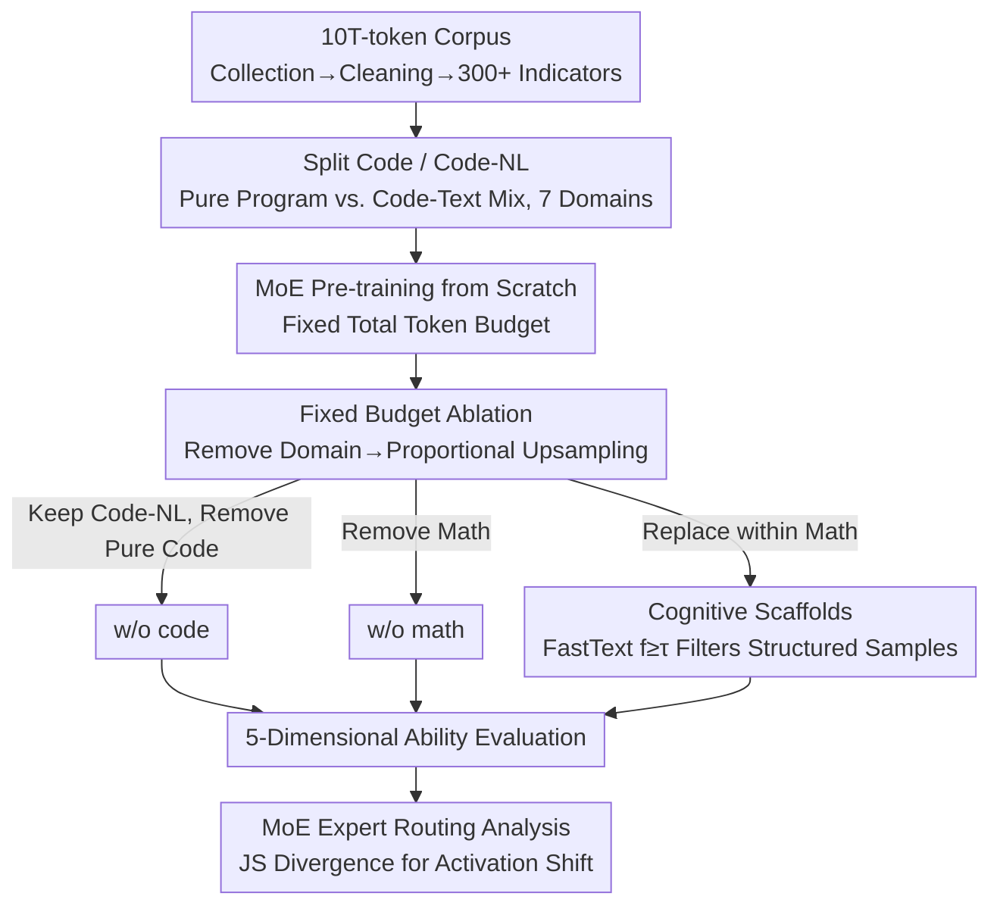

# What Really Improves Mathematical Reasoning: Structured Reasoning Signals Beyond Pure Code

**Conference**: ICML2026  
**arXiv**: [2605.19762](https://arxiv.org/abs/2605.19762)  
**Code**: Anonymous repository, public URL not provided  
**Area**: LLM Pre-training / Mathematical Reasoning  
**Keywords**: Data mixing, Mathematical reasoning, Code pre-training, MoE, Cognitive scaffolds  

## TL;DR
This paper, through controlled experiments featuring a 10T-token corpus and MoE pre-trained from scratch, points out that what truly enhances complex mathematical reasoning is not pure executable code itself, but cross-domain structured reasoning signals, specifically "cognitive scaffolds" in mathematical corpora that explicitly expose intermediate steps.

## Background & Motivation
**Background**: Pre-training corpora for modern general-purpose LLMs typically contain a significant proportion of code data. Many empirical conclusions suggest that the strict syntax, control flow, and algorithmic structure of code not only improve programming ability but also spill over into mathematical, logical, and scientific reasoning. Another related direction is data mixing and selection, i.e., how to distribute data across different domains like Web, Code, Math, Wikipedia, and Books under a fixed token budget.

**Limitations of Prior Work**: Many past studies treated "code" as a coarse-grained whole, often grouping executable code, notebooks, Markdown, HTML/CSS, problem-solving text, and mathematical proofs containing code snippets into the same category. The conclusion that "code improves reasoning" derived this way might mix two different signals: pure programming syntax and executable programs versus cross-domain reasoning trajectories where natural language, mathematical symbols, and procedural structures are intertwined.

**Key Challenge**: Under a fixed training budget, adding data from one domain is not a free gain; it displaces others. Pure code may enhance programming but reduce the model's exposure to knowledge-dense or mathematically complex derivations. Mathematical data might enhance competitive programming but weaken some comprehensive reasoning tasks. The problem thus shifts from "is code useful" to "which type of structural signal is useful for which task, and at what cost."

**Goal**: The authors aim to re-examine the relationship between code, mathematics, and reasoning using more fine-grained data definitions: first separating Code from Code-NL, then performing fixed-budget ablations on a 10T-token corpus, and finally filtering "cognitive scaffolds" with explicit step-by-step structures from the mathematical domain to observe if they enhance complex mathematical reasoning without significantly harming programming ability.

**Key Insight**: The paper decouples "structure" from "code files." Pure Code is strictly defined as executable functions, scripts, and program fragments, excluding comments and explanations; Code-NL retains structured materials mixing code and natural language. Subsequently, the authors use a FastText structure classifier to find samples containing sub-goals, step-by-step derivations, symbolic manipulations, and verification processes within mathematical corpora to serve as more direct reasoning scaffolds.

**Core Idea**: Instead of broadly increasing the proportion of code, it is better to increase the density of structured mathematical reasoning samples within a fixed mathematical budget, using visible intermediate reasoning trajectories to train the model to solve high-difficulty mathematical problems.

## Method

### Overall Architecture
This paper does not propose a new architecture but conducts large-scale data causal attribution experiments on whether code truly helps mathematical reasoning. The authors strictly partition the 10T-token corpus into seven domains: Web, Code, Code-NL, Math, Wikipedia, Books, and Multilingual (each passing 300+ quality indicators). They then pre-train core models from scratch—a 20-layer autoregressive MoE with a hidden size of 2048, 16 heads, and 16 experts per layer using top-2 routing. The real experiment lies in the data configuration: starting from the full data, they respectively remove pure Code, remove Math, or replace ordinary samples with structured samples within the Math domain, and then observe changes across five ability dimensions. The key constraint of the design is a **fixed total training token count**—when a domain is removed, the remaining domains are upsampled proportionally. Thus, score differences reflect "data substitution effects" rather than a reduction in training volume. Finally, expert routing distributions are used to explain how data mixing rewrites internal model activations at the mechanistic level.

### Key Designs

**1. Splitting Code and Code-NL to Isolate the Marginal Contribution of Pure Programs**

Past research often counted executable programs, notebooks, Markdown, solutions, and math derivations with code snippets as "code," so the conclusion that "code improves reasoning" actually conflated two completely different signals. The authors' approach is to strictly limit pure Code to executable functions, scripts, and program fragments—requiring an executable code density above a threshold, followed by syntax, length, deduplication, and low-quality filtering. Materials such as web pages, notebooks, Q&A, Markdown, and HTML/CSS, where natural language, formulas, and code are intertwined, are categorized separately as Code-NL. During ablation, only pure Code is removed, while Code-NL is always retained. Consequently, if mathematical reasoning does not drop—or even improves—after removing pure Code, it indicates that previously observed reasoning gains likely stemmed from the structured explanations and derivations in Code-NL rather than the executable programs themselves. This split allows the first clean estimation of the marginal contribution of pure code.

**2. Fixed-Budget Ablation to Force Competition and Negative Coupling Between Data Domains**

The hardest constraint in real large model training is a fixed token budget; adding data from one domain is never a free gain but displaces others. Accordingly, the authors train w/o code and w/o math models from the full corpus. When a domain is removed, the total tokens are not reduced; instead, other domains are proportionally filled. Evaluation is then split into five dimensions: general knowledge, programming ability, mathematical ability, comprehensive reasoning, and professional knowledge. The value of this setup is revealed in negative coupling: pure code might enhance programming but squeeze out opportunities to encounter knowledge-dense or complex mathematical derivations. Mathematical data might help contest programming but interfere with some mixed-code reasoning. The question shifts from "is code useful" to "which signal is useful for what task, and at what cost."

**3. Screening Cognitive Scaffolds with FastText and Validating as Cross-Domain Stable Signals using MoE**

If the effective signal is indeed "explicit intermediate reasoning structure" rather than code semantics, it should be possible to directly increase this structural density within the math domain. The authors train a lightweight FastText classifier using 200,000 code samples as positive examples and 200,000 non-code samples as negative examples to learn to recognize explicit structural patterns (sub-goals, step-by-step derivations, symbolic operations, verification processes). This classifier is then applied to the Math corpus to select samples with a score of $f_\theta(x)\geq\tau$ as cognitive scaffolds—where $f_\theta(x)$ is the classifier's score for the sample's structural degree and $\tau$ is the admission threshold. The classifier itself is reliable: validation set accuracy 0.9696, positive precision 0.9998, and recall 0.9665. While the selected scaffolds were not based on hand-written rules, post-hoc statistics show they have higher symbolic density, more derivation steps, higher indentation ratios, and longer text. More critically, routing analysis shows that deleting Code or Math causes significant shifts in corresponding expert distributions, but replacing with scaffolds causes smaller, more dispersed shifts, suggesting it is not a new narrow domain but a cross-domain stable reasoning signal.

### Loss & Training
The model uses a standard autoregressive language modeling objective. On the MoE side, it adopts dropless routing, load-balancing loss, and router z-loss, with a stochastic routing warmup added in the early stages—interpolating learned routing logits with random logits at $\alpha=\min(t_c/t_w,1)$ to alleviate early expert congestion. The optimizer is AdamW with a learning rate of $5\times10^{-5}$, 2000 steps warmup, bfloat16 + FP8 mixed precision, training for 24,000 iterations with checkpoints saved every 1,200 iterations. Cognitive scaffolds are not scheduled as a separate new domain but replace ordinary math samples within the fixed Math budget, ensuring the comparison is between structural density rather than the total volume of math data.

## Key Experimental Results

### Main Results

| Research Question | Metric / Dataset | Key Result | Baseline | Conclusion |
|-------------------|------------------|------------|----------|------------|
| Does pure code improve math reasoning? | Math Ability Avg | full data is 14.38% lower than w/o code | Code-NL remains constant | Pure executable code is not a general math reasoning enhancer |
| Impact of code on complex math tasks | Minerva-Math / OlympiadBench / MATH | -71.53% / -47.16% / -22.64% | w/o code is better | Code clearly competes with math knowledge/derivation budget on hard math |
| Impact of math data on programming | CodeForces / LiveCodeBench | +37.11% / +11.26% | w/o math is worse | Math data helps in competitive programming-type algorithmic tasks |
| Negative coupling of math data | CruxEval / MBPP | -17.30% / -6.12% | w/o math is better | Math data can interfere with some mixed-code reasoning tasks |
| Cognitive scaffolds | Math Ability Avg | +17.56% | Fixed Math token budget | Structured math samples significantly improve complex math reasoning |

### Ablation Study

| Configuration | Key Metric | Description |
|---------------|------------|-------------|
| full data (32e) | Math overall 36.20 / Programming overall 26.94 | Full corpus baseline for a 32-expert MoE |
| w/o code (32e) | Math overall 38.52 / Programming overall 14.25 | Math avg is higher without pure Code, but programming drops significantly |
| w/o math (32e) | Math overall 17.71 / Programming overall 24.25 | Math ability collapses without Math data; programming avg slightly lower than full |
| cognitive scaffold replacement | College Math +30.05%, MATH +23.17%, OlympiadBench +47.78%, MathBench +14.51% | Increasing structured sample density within fixed math budget yields max gains on complex tasks |
| scaffold side effect | GSM8K -6.29%, CMath -2.00%, code benchmarks approx. -1% | Slight competition for simple NL math problems; minimal impact on code ability |

### Key Findings
- The paper refutes the coarse-grained claim that "pure code naturally enhances reasoning," but does not deny that structured data is useful. Transferred effective signals come from explicit steps, symbolic operations, hierarchical decomposition, and verification processes.
- Code-NL is the key control variable in explaining discrepancies. When past work grouped Markdown, HTML, solutions, and notebooks into code, the observed reasoning gains likely came from these mixed structured texts.
- Cognitive scaffolds offer significant gains for complex mathematical tasks but slightly harm performance on GSM8K and CMath, which can be solved with more direct natural language, indicating that "more structure" is not always better.
- MoE routing results show that removing Code or Math causes significant shifts in expert distributions for those domains, whereas removing scaffolds causes smaller and more dispersed shifts, supporting their interpretation as cross-domain stable reasoning signals.

## Highlights & Insights
- This paper advances the pre-training data discussion from "which domain ratio is larger" to "which structural features within the same domain are effective." This is more operationally valuable than simply debating code ratios, as it guides data selection rather than just data mixing.
- The fixed-budget design is crucial. Many data ablations that simply reduce tokens confound data quality with training volume; by keeping total tokens constant, this paper stays closer to the resource allocation problem in real large model training.
- The FastText structure classifier design is simple yet effective. Rather than training a complex reward model, the authors use code samples to learn transferable explicit structures and then filter reasoning trajectories in the Math domain, reflecting a low-cost data engineering mindset.
- Expert routing analysis ensures conclusions stay beyond downstream scores. While routing patterns are not a strict causal explanation, they provide mechanistic evidence: different data configurations indeed alter the way experts are utilized within the MoE.

## Limitations & Future Work
- The definition of cognitive scaffolds remains operational rather than a universal theory. The "structure" learned by FastText might include surface features like formatting, length, and indentation, despite the authors' pollution audits and post-hoc statistics.
- The paper does not systematically scan the scaffold replacement ratio, so it cannot conclude that "higher scaffold ratio is always better." Current conclusions only hold under a specific fixed replacement setting.
- Training costs are high, posing a barrier to experimental replication. While a 10T-token corpus and pre-training MoE from scratch enhance the credibility of conclusions, they also limit external validation.
- Evaluation is primarily on pre-training ability dimensions and has not yet fully covered whether these data effects persist in instruction tuning, RLHF, or tool-use agent scenarios.

## Related Work & Insights
- **vs. To Code or Not to Code / code-ratio studies**: Existing work often conflates code and structured text. By retaining Code-NL and only ablating pure Code, this work points out that reasoning gains likely come from mixed structured samples.
- **vs. DoReMi / REGMIX**: Data mixing methods focus on domain-level ratio optimization. This paper further demonstrates that intra-domain instance structure is equally critical; in the future, cognitive scaffolds could be integrated as a learnable subdomain in mixing optimization.
- **vs. Data Selection Methods**: The scaffold screening in this paper can be viewed as offline data selection for reasoning. Unlike general quality scoring, it emphasizes the visibility of intermediate steps and symbolic procedural structure.
- **Insights**: For LLM pre-training, enhancing mathematical reasoning does not necessarily require increasing the ratio of the entire Math domain; one can increase the density of "traceable reasoning trajectories" within a fixed budget. Similarly, code data should be differentiated into executable programs, solutions, notebooks, and annotated derivations.

## Rating
- Novelty: ⭐⭐⭐⭐ The topic of code data has been studied, but the contribution of decoupling Code/Code-NL and locating cognitive scaffolds is very insightful.
- Experimental Thoroughness: ⭐⭐⭐⭐⭐ The combination of 10T corpus, multiple MoE/dense scales, fixed-budget ablation, and routing analysis is solid.
- Writing Quality: ⭐⭐⭐⭐ The main thread is clear and figures are sufficient, though the appendix tables are somewhat heavy to parse.
- Value: ⭐⭐⭐⭐⭐ Highly practical for pre-training data engineering, directly indicating that "structured reasoning sample density" is more controllable than broadly increasing code data.

<!-- RELATED:START -->

## Related Papers

- [\[ICML 2026\] Biases in the Blind Spot: Detecting What LLMs Fail to Mention](biases_in_the_blind_spot_detecting_what_llms_fail_to_mention.md)
- [\[ACL 2025\] STRICTA: Structured Reasoning in Critical Text Assessment for Peer Review and Beyond](../../ACL2025/llm_reasoning/stricta_structured_reasoning_peer_review.md)
- [\[ICML 2026\] Beyond Test-Time Memory: State-Space Optimal Control for LLM Reasoning](beyond_test-time_memory_state-space_optimal_control_for_llm_reasoning.md)
- [\[ICML 2026\] FloorplanQA: A Benchmark for Spatial Reasoning in LLMs Using Structured Representations](floorplanqa_a_benchmark_for_spatial_reasoning_in_llms_using_structured_represent.md)
- [\[NeurIPS 2025\] Beyond Accuracy: Dissecting Mathematical Reasoning for LLMs Under Reinforcement Learning](../../NeurIPS2025/llm_reasoning/beyond_accuracy_dissecting_mathematical_reasoning_for_llms_u.md)

<!-- RELATED:END -->
