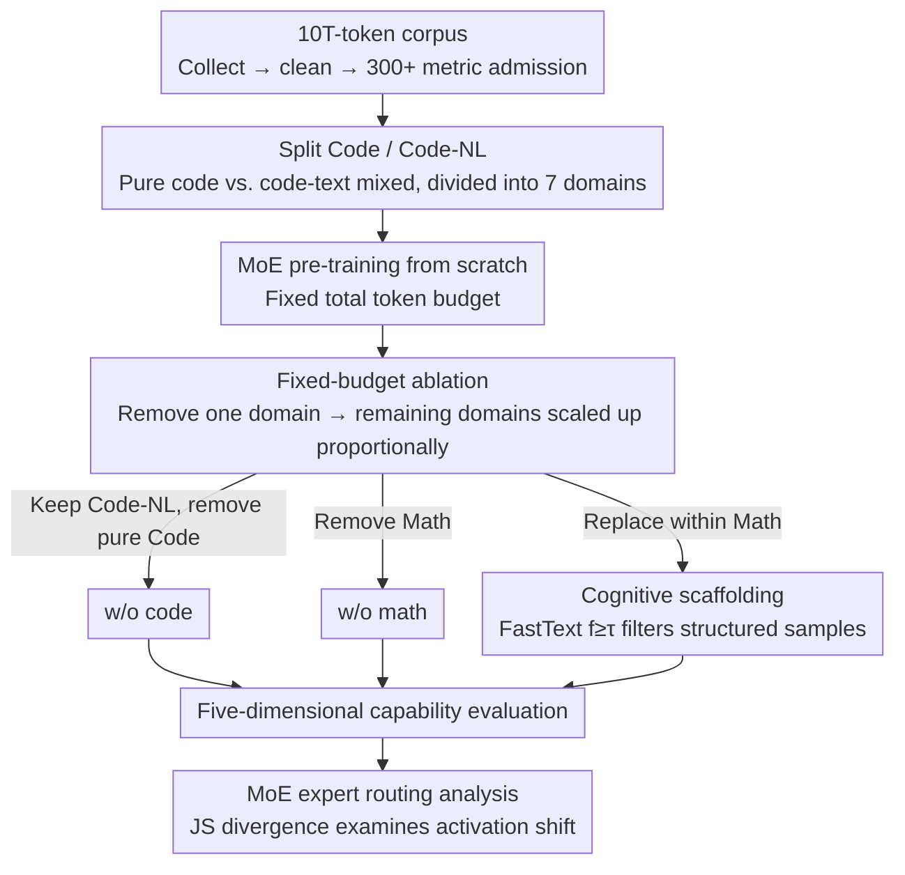

# What Really Improves Mathematical Reasoning: Structured Reasoning Signals Beyond Pure Code

**Conference**: ICML2026  
**arXiv**: [2605.19762](https://arxiv.org/abs/2605.19762)  
**Code**: Anonymous repository, public URL not provided for caching  
**Area**: LLM Pre-training / Mathematical Reasoning  
**Keywords**: Data Mixture, Mathematical Reasoning, Code Pre-training, MoE, Cognitive Scaffolding  

## TL;DR
Through controlled experiments involving 10T-token corpus and MoE pre-training from scratch, this paper indicates that what truly improves complex mathematical reasoning is not pure executable code itself, but cross-domain structured reasoning signals, particularly the "cognitive scaffolds" in mathematical corpora that explicitly expose intermediate steps.

## Background & Motivation
**Background**: Pre-training corpora for modern general LLMs typically contain a significant proportion of code data. Many empirical conclusions suggest that the strict syntax, control flow, and algorithmic structure of code not only improve programming ability but also spill over into mathematical, logical, and scientific reasoning. Another related direction is data mixing and selection—how to distribute data across domains like Web, Code, Math, Wikipedia, and Books under a fixed token budget.

**Limitations of Prior Work**: Many past studies treated "code" as a coarse-grained whole, often grouping executable code, notebooks, Markdown, HTML/CSS, solution texts, and mathematical derivations containing code snippets into the same category. Conclusions drawn this way might mix two distinct signals: pure programming syntax and executable programs versus cross-domain reasoning trajectories interwoven with natural language, mathematical symbols, and procedural structures.

**Key Challenge**: Under a fixed training budget, adding data from one domain is not a cost-free gain; it displaces data from other domains. Pure code might enhance programming but reduce the model's exposure to knowledge-dense or mathematically complex derivations. Mathematical data might enhance competitive programming while weakening certain comprehensive reasoning tasks. The question shifts from "is code useful" to "which type of structural signal is useful for which task, and at what cost."

**Goal**: The authors aim to re-examine the relationship between code, math, and reasoning using a more fine-grained data definition: first separating Code from Code-NL, then conducting fixed-budget ablations on a 10T-token corpus, and finally filtering "cognitive scaffolds" with explicit step-by-step structures from the math domain to observe if they enhance complex mathematical reasoning without significantly harming programming ability.

**Key Insight**: The paper decouples "structure" from "code files." Pure Code is strictly defined as executable functions, scripts, and program fragments, excluding comments and explanations. Code-NL preserves structured materials mixing code and natural language. Subsequently, the authors use a FastText structure classifier to find samples in the math corpus containing sub-goals, step-by-step derivations, symbol manipulations, and verification processes to serve as direct reasoning scaffolds.

**Core Idea**: Instead of generically increasing the code ratio, the density of structured mathematical reasoning samples should be increased within a fixed math budget, using visible intermediate reasoning trajectories to train models to solve advanced mathematical problems.

## Method

### Overall Architecture
This paper does not propose a new architecture but designs a suite of large-scale causal attribution experiments to determine the actual contribution of code to mathematical reasoning. The authors strictly partition the 10T-token corpus into seven domains: Web, Code, Code-NL, Math, Wikipedia, Books, and Multilingual (each passing 300+ quality indicators). Core models are pre-trained from scratch—a 20-layer autoregressive MoE with a hidden size of 2048, 16 heads, and 16 experts per layer using top-2 routing. The critical experiments lie in the data configuration: starting from the full data, they respectively remove pure Code, remove Math, or replace ordinary samples with structured samples within the Math domain, then observe changes across five ability dimensions. The key constraint is **fixed total training tokens**—when a domain is removed, the remaining domains are up-scaled proportionally to compensate. Thus, score differences reflect "data replacement effects" rather than a reduction in training volume. Finally, expert routing distributions are used to explain how data mixtures rewrite the model's internal activations at a mechanistic level.

### Key Designs

**1. Separating Code and Code-NL to isolate the marginal contribution of pure programs**

Past research often counted executable programs, notebooks, Markdown, solutions, and math derivations with code snippets as "code," mixing two entirely different signals into the conclusion that "code improves reasoning." The authors strictly define pure Code as executable functions, scripts, and program fragments—requiring executable code density to exceed a threshold, followed by syntax, length, deduplication, and low-quality filtering. Materials where natural language, formulas, and code are interwoven, such as web pages, notebooks, Q&A, and Markdown, are separately categorized as Code-NL. During ablation, only pure Code is removed, while Code-NL is always retained. Consequently, if mathematical reasoning does not decline or even improves after removing pure Code, it indicates that previously observed reasoning gains likely stemmed from structured explanations and mathematical derivations in Code-NL rather than executable programs themselves. This separation allows the first clean estimation of pure code's marginal contribution.

**2. Fixed-budget ablation to expose competition and negative coupling between data domains**

The hardest constraint in real large model training is a fixed token budget. Adding data from one domain never yields a cost-free gain; it displaces other domains. Accordingly, the authors train w/o code and w/o math models from the full corpus. When a domain is removed, the total token count is not reduced; instead, other domains are proportionally scaled up. Evaluation is split into five dimensions: general knowledge, programming ability, mathematical ability, comprehensive reasoning, and professional knowledge. The value of this setup is that it exposes negative coupling: pure code might enhance programming but squeeze out opportunities to encounter complex mathematical derivations, while math data might help competitive programming but interfere with some mixed-code reasoning. The question becomes "which type of signal is useful for which task, and at what cost."

**3. Identifying cognitive scaffolds with FastText and verifying cross-domain stability via MoE routing**

If the effective signal is indeed "explicit intermediate reasoning structure" rather than code semantics, it should be possible to directly increase the density of such structures within the math domain. The authors train a lightweight FastText classifier using 200,000 code samples as positive examples and 200,000 non-code samples as negative examples to learn explicit structural patterns (sub-goals, step-by-step derivations, symbol operations, verification processes). The classifier is then applied to the Math corpus to select samples with scores $f_\theta(x)\geq\tau$ as cognitive scaffolds—where $f_\theta(x)$ is the structural degree score and $\tau$ is the threshold. The classifier is highly reliable: validation accuracy is 0.9696, precision is 0.9998, and recall is 0.9665. The selected scaffolds, though not based on manual rules, statistically show higher symbol density, more derivation steps, higher indentation ratios, and longer text. More crucially, routing analysis shows that deleting Code or Math causes significant offsets in domain expert distributions, but replacing math with scaffolds causes smaller and more scattered offsets, supporting the interpretation that they act as cross-domain stable reasoning signals.

### Loss & Training
The model uses a standard autoregressive language modeling objective. The MoE side employs dropless routing, load-balancing loss, router z-loss, and stochastic routing warmup in the early stages—interpolating learned routing logits with random logits at $\alpha=\min(t_c/t_w,1)$ to alleviate early expert congestion. The optimizer is AdamW with a learning rate of $5\times10^{-5}$, 2000 steps of warmup, and bfloat16 + FP8 mixed precision. It is trained for 24,000 iterations, with checkpoints saved every 1200 iterations. Cognitive scaffolds are not scheduled as a separate new domain but replace ordinary math samples within the fixed Math budget to ensure the comparison focuses on structural density rather than the total volume of math data.

## Key Experimental Results

### Main Results

| Experimental Question | Metric / Dataset | Key Results | Control | Conclusion |
|--------|------|------|----------|------|
| Does pure code improve math reasoning | Math ability average | full data is 14.38% lower than w/o code | Code-NL remains constant | Pure executable code is not a universal math reasoning enhancer |
| Impact of code on complex math tasks | Minerva-Math / OlympiadBench / MATH | -71.53% / -47.16% / -22.64% | w/o code is better | Code clearly competes with math knowledge/derivation budgets in advanced math |
| Impact of math data on programming | CodeForces / LiveCodeBench | +37.11% / +11.26% | w/o math is worse | Math data helps in algorithmic competitive programming tasks |
| Negative coupling of math data | CruxEval / MBPP | -17.30% / -6.12% | w/o math is better | Math data also interferes with some mixed-code reasoning tasks |
| cognitive scaffolds | Math ability average | +17.56% | Fixed Math token budget | Structured math samples significantly boost complex math reasoning |

### Ablation Study

| Configuration | Key Metrics | Description |
|------|---------|------|
| full data (32e) | Math overall 36.20 / Programming overall 26.94 | Full corpus baseline for 32-expert MoE |
| w/o code (32e) | Math overall 38.52 / Programming overall 14.25 | Removing pure Code results in higher math average, but programming ability drops significantly |
| w/o math (32e) | Math overall 17.71 / Programming overall 24.25 | Removing Math causes math ability to collapse; programming average is slightly lower than full |
| cognitive scaffold replacement | College Math +30.05%, MATH +23.17%, OlympiadBench +47.78%, MathBench +14.51% | Increasing structure density within fixed math budget yields largest gains on complex tasks |
| scaffold side effect | GSM8K -6.29%, CMath -2.00%, code benchmarks approx -1% | Slight competition for simple NL math problems; minimal impact on code ability |

### Key Findings
- The paper refutes the coarse-grained claim that "pure code naturally enhances reasoning," but does not deny the utility of structured data. The truly effective signals come from explicit steps, symbol manipulation, hierarchical decomposition, and verification processes.
- Code-NL is the critical control variable for explaining the discrepancy. When previous studies categorized Markdown, HTML, solutions, and notebooks as code, the observed reasoning gains likely came from these mixed structured texts.
- Cognitive scaffolds yield significant gains for complex mathematical tasks but are slightly detrimental to problems like GSM8K or CMath that can be solved with direct natural language, indicating that "more structure is not always better."
- MoE routing results show that removing Code or Math causes significant offsets in corresponding domain expert distributions, while removing scaffolds causes smaller and more dispersed offsets, supporting their interpretation as cross-domain stable reasoning signals.

## Highlights & Insights
- This paper advances the discussion of pre-training data from "which domain ratio is larger" to "which structural features within the same domain are effective." This is more operationally valuable than simple debates over code ratios, as it guides data selection rather than just data allocation.
- The fixed budget design is crucial. Many data ablations that simply reduce tokens confuse data quality with training volume; this paper maintains total tokens, aligning closer to resource allocation problems in real LLM training.
- The FastText structure classifier design is simple yet effective. Rather than training complex reward models, the authors used code samples to learn transferable explicit structures and applied them to the Math domain to filter reasoning trajectories, embodying a low-cost data engineering mindset.
- Expert routing analysis ensures conclusions go beyond downstream scores. While routing patterns are not strictly causal explanations, they provide mechanistic evidence that different data configurations indeed alter the internal expert utilization of the MoE.

## Limitations & Future Work
- The definition of cognitive scaffold remains an operational one, not a universal theory. The "structure" learned by FastText might include surface features such as formatting, length, and indentation, despite audit and statistical analysis by the authors.
- The paper did not systematically scan scaffold replacement ratios; thus, it cannot conclude that "higher scaffold ratios are always better." The current conclusion holds only under a specific fixed replacement setting.
- Training costs are high, creating a high barrier for replication. While the 10T-token corpus and training MoE from scratch improve the credibility of the conclusions, it limits external verification.
- Evaluations are primarily on pre-training ability dimensions and do not yet fully cover whether these data effects persist after instruction tuning, RLHF, or in tool-use agent scenarios.

## Related Work & Insights
- **vs To Code or Not to Code / code-ratio studies**: Existing work often mixes code and structured text. This paper, by retaining Code-NL while ablating pure Code, points out that reasoning gains likely come from these mixed structured samples.
- **vs DoReMi / REGMIX**: While data mixing methods focus on domain-level ratio optimization, this work shows that intra-domain instance structure is equally critical; cognitive scaffolds could be added as a learnable subdomain in future mixed optimization.
- **vs Data Selection Methods**: The scaffold filtering in this paper can be viewed as offline data selection for reasoning. Unlike general quality scoring, it emphasizes the visibility of intermediate steps and symbolic procedural structure.
- **Insights**: For LLM pre-training, enhancing math reasoning does not necessarily require increasing the overall Math domain ratio; instead, the density of "traceable reasoning trajectories" can be increased within a fixed budget. For code data, one should also distinguish between executable programs, solutions, notebooks, and annotated derivations.

## Rating
- Novelty: ⭐⭐⭐⭐ While many studies on code data exist, the contribution of separating Code/Code-NL and identifying cognitive scaffolds is very insightful.
- Experimental Thoroughness: ⭐⭐⭐⭐⭐ The combination of 10T corpus, multiple scales for MoE/dense, fixed-budget ablation, and routing analysis is very solid.
- Writing Quality: ⭐⭐⭐⭐ The main thread is clear and figures are sufficient, but parsing the appendix tables is demanding; readers must carefully distinguish relative changes from raw scores.
- Value: ⭐⭐⭐⭐⭐ Highly practical for pre-training data engineering, directly indicating that "density of structured reasoning samples" is more controllable than generically increasing code.

<!-- RELATED:START -->

## Related Papers

- [\[ICML 2026\] Is Code Better Than Language for Algorithmic Reasoning?](is_code_better_than_language_for_algorithmic_reasoning.md)
- [\[ICLR 2026\] Beyond English-Centric Training: How Reinforcement Learning Improves Cross-Lingual Reasoning in LLMs](../../ICLR2026/llm_reasoning/beyond_english-centric_training_how_reinforcement_learning_improves_cross-lingua.md)
- [\[ICML 2026\] Biases in the Blind Spot: Detecting What LLMs Fail to Mention](biases_in_the_blind_spot_detecting_what_llms_fail_to_mention.md)
- [\[ACL 2025\] STRICTA: Structured Reasoning in Critical Text Assessment for Peer Review and Beyond](../../ACL2025/llm_reasoning/stricta_structured_reasoning_peer_review.md)
- [\[ICML 2026\] The Quality-Utility Paradox: Why High-Reward Data Impairs Small Model Mathematical Reasoning](the_quality-utility_paradox_why_high-reward_data_impairs_small_model_mathematica.md)

<!-- RELATED:END -->
