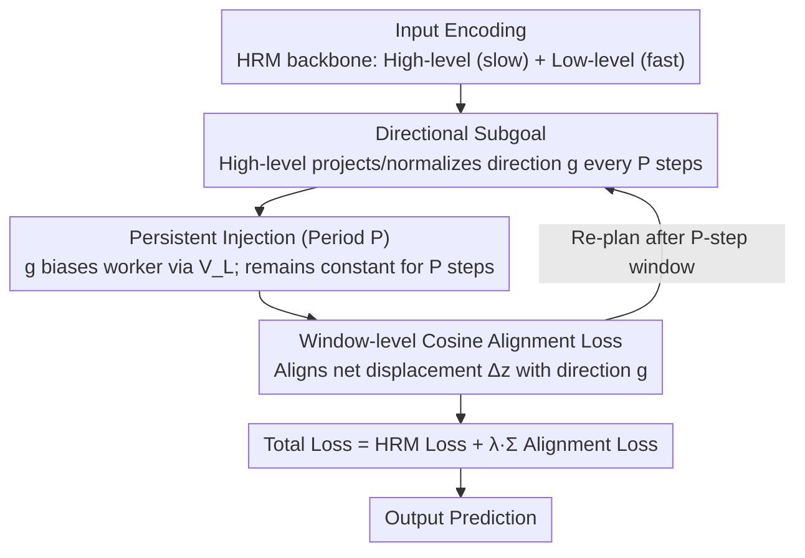

# When to Re-Plan: Subgoal Persistence in Hierarchical Latent Reasoning

**Conference**: ICML 2026  
**arXiv**: [2606.03741](https://arxiv.org/abs/2606.03741)  
**Code**: No public code  
**Area**: LLM Reasoning / Latent Reasoning Architecture  
**Keywords**: Hierarchical Reasoning, Latent Computation, Subgoal Persistence, HRM, Planning Stability  

## TL;DR
This paper introduces manager-worker style persistent subgoals into the Hierarchical Reasoning Model (HRM). It discovers that the critical factor in latent reasoning is not just the injection of subgoals, but ensuring that subgoals persist for $P=3$ to $6$ low-level update steps. Excessive re-planning disrupts compositional structures, whereas overly aggressive alignment interferes with task learning.

## Background & Motivation
**Background**: Long-range reasoning systems typically follow two trajectories. One is explicit chain-of-thought, representing reasoning as a token sequence; the other is latent reasoning, which compresses multi-step computation into hidden states and performs iterative updates internally. Hierarchical latent architectures like HRM implement deeper internal computation using slow high-level states and fast low-level states.

**Limitations of Prior Work**: Explicit token reasoning naturally possesses a temporal structure where "each token constrains subsequent tokens," whereas latent reasoning updates lack such external commitments. High-level states can change their intent at every step or remain unchanged for long periods; the architecture itself does not specify the duration for which mid-term intentions should persist.

**Key Challenge**: If subgoals are re-issued at every step, the goal is overwritten before the worker can organize multi-step computation around it. Conversely, if subgoals persist too long, the worker's hidden state drifts, making old goals rigid. In other words, a latent planner needs to find an optimal re-planning period between stability and adaptability.

**Goal**: The authors aim to empirically characterize the role of subgoal persistence by explicitly adding feudal-style subgoals to HRM and scanning the manager period $P$ and alignment weight $\lambda$ to determine when to re-plan.

**Key Insight**: The paper ports the concept of "commitment time" from reinforcement learning (options/feudal hierarchy) to latent reasoning. Here, the action is not an environmental move but a low-level hidden state update; the manager's output is a direction vector in the latent space.

**Core Idea**: A high-level module issues a normalized directional subgoal $g$ every $P$ micro-steps. This subgoal continuously biases low-level updates within $P$ steps, and a cosine alignment loss ensures the low-level net displacement follows this direction.

## Method
The method is termed Subgoal-Augmented HRM. It retains the original HRM's slow high-level state $z^H$ and fast low-level state $z^L$, adding an explicit subgoal interface between them. Instead of implicitly influencing the low level via recurrent coupling, the high-level state periodically projects a direction vector, steering the worker's internal computation across multiple update steps.

### Overall Architecture
The HRM backbone consists of two latent states: the low-level state updates every micro-step, while the high-level state updates every $T$ low-level steps. Subgoal-Augmented HRM introduces a manager period $P$. At time $t_k=kP$, the high-level state outputs $\tilde g_k=W_g z^H_{t_k}$ via $W_g$, which is then normalized to $g_k=\tilde g_k/(\|\tilde g_k\|_2+\epsilon)$. This $g_k$ remains constant for the next $P$ low-level updates.

During low-level updates, the subgoal is added as a steering term via projection $V_L$. To prevent the subgoal from being an unconstrained bias, the paper calculates a cosine alignment loss between the low-level net displacement $\Delta z^L_k=z^L_{t_k+P}-z^L_{t_k}$ and $g_k$ over each commitment window. The pipeline is summarized as: High-level state periodically issues directional subgoals → Continuous bias injected into the worker over $P$ steps → Window-level alignment loss constrains the worker's actual displacement → Re-plan after the window ends.

### Key Designs
**1. Directional Subgoals instead of Target States**: To provide a mid-term intention, the most direct approach is for the manager to specify an absolute hidden state to reach. However, latent hidden dynamics are non-stationary, and the worker state drifts constantly; chasing a fixed target is fragile. Instead, the paper outputs a unit direction: at $t_k$, the manager projects the high-level state via $W_g$ and L2-normalizes it to $g_k=\tilde g_k/(\|\tilde g_k\|_2+\epsilon)$, expressing "where to go next" rather than "where to be." An optional commitment gate $\alpha_k=\sigma(w_\alpha^\top z^H_{t_k})\in(0,1)$ can soften the commitment strength under uncertainty. Direction provides minimal structure for mid-term intent without over-specifying execution details.

**2. Persistence Period $P$ for Stability-Adaptability Tradeoff**: The architecture does not inherently define the duration of a latent intention—the core "knob" this paper explores. The issued direction remains constant ($g(t)=g_k$) during the $P$ micro-steps $t\in[t_k,t_k+P)$ and is injected as an additive bias: $z^L_{t+1}=f_L(z^L_t,z^H_t,\tilde x_t+\alpha(t)V_Lg(t);\theta_L)$. The core hypothesis is that compositional latent computation requires several consecutive steps focused on the same intent. Without persistence ($P=1$), the structure fails, as verified by the fact that $P=1$ performs worse than the baseline.

**3. Window-level Cosine Alignment Loss**: Continuous injection only biases individual steps; it doesn't guarantee the worker's trajectory matches the subgoal. The paper computes the net displacement $\Delta z^L_k=z^L_{t_k+P}-z^L_{t_k}$ and uses $\mathcal{L}_{align}^{(k)}=1-\cos(\Delta z^L_k,g_k)$ to reward consistency. The total loss is $\mathcal{L}=\mathcal{L}_{HRM}+\lambda\sum_k\mathcal{L}_{align}^{(k)}$. This elevates subgoals from "additional input features" to "internal priors" constraining geometric updates. However, $\lambda$ must be small ($\approx0.05$ is optimal); $\lambda\ge0.20$ becomes harmful by competing with task gradients.

### Loss & Training
The objective combines the original HRM task loss and ACT halting loss with the subgoal alignment loss. The HRM backbone is fixed: hidden size 512, 4 high-level and 4 low-level transformer layers, 8 heads, max 16 internal steps. Training uses AdamATan2, base learning rate $10^{-4}$, and weight decay 0.1.

Two experimental regimes are reported: the main study scans $P$ and $\lambda$ on CPU with a global batch size of 768 on arc-aug-1000 data. An ablation study uses a single NVIDIA L4 with batch size 64 to compare full, baseline, and random directions under $\lambda=0.10, P=4$.

## Key Experimental Results

### Main Results
Evaluations were conducted on arc-aug-1000 (derived from ARC-AGI and ConceptARC). Key metrics include training LM loss, token-level accuracy, alignment loss, and ACT halting depth.

| Setting | Metric | Result | vs. | Gain |
|--------|------|------|----------|------|
| No Subgoal Baseline | LM loss ↓ | 1.640 | Vanilla HRM | Reference |
| $P=1, \lambda=0.05$ | LM loss ↓ | 1.674 | Baseline 1.640 | Worse; illustrates harm of rapid re-planning |
| $P=2, \lambda=0.05$ | LM loss ↓ | 1.638 | Baseline 1.640 | Minimal improvement |
| $P=3, \lambda=0.05$ | LM loss ↓ | 1.544 | Baseline 1.640 | -0.096; optimal point |
| $P=3$ to $P=8$ | LM loss Range | [1.544, 1.590] | Baseline 1.640 | Moderate over-commitment is acceptable |
| ConceptARC-mini | LM loss ↓ | 2.308 | Baseline 2.316 | Consistent direction, small magnitude |

### Ablation Study
When $\lambda=0.10$ exceeds the optimal point, does performance degradation stem from architectural capacity, auxiliary loss, or the learned directions themselves?

| Configuration | Key Metric | Description |
|------|---------|------|
| A_full | Train LM loss 1.327 | Learned directions + injection + alignment; strong direction causes interference |
| B_baseline| Train LM loss 1.227 | No injection or alignment; reverts to vanilla HRM |
| E_random | Train LM loss 1.230 | Random unit directions; performance nearly identical to baseline |
| A_full vs E_random | Gap 0.097 | Interference stems from learned directional content, not the modules themselves |
| $\lambda$ sweep | $\lambda\approx0.05$ optimal | Alignment acts as a soft prior; unsuitable as a hard constraint |

### Key Findings
- Persistence is a necessary condition. $P=1$ is worse than having no subgoals, suggesting that the "goal" must persist long enough to organize multi-step computation.
- The optimal range for persistence is $P \in [3, 6]$. Decay is slow up to $P=8$, suggesting stale subgoals are less harmful than no commitment.
- The weight for alignment loss has a narrow optimal window. $\lambda=0.05$ serves as a planning prior, whereas $\lambda \ge 0.20$ competes with task objectives.
- Random direction ablation proves that learned subgoals are functional; they can assist at appropriate weights but cause interference when over-constrained.

## Highlights & Insights
- The research question is precisely targeted: latent reasoning requires deciding how long internal intentions should persist. This time-scale issue is masked by token sequences in CoT but must be explicitly designed for latent computation.
- The failure of $P=1$ is a compelling negative result. It rules out the explanation that simply adding a subgoal module is beneficial, attributing gains specifically to the persistence mechanism.
- The random direction ablation is elegant. E_random's similarity to the baseline shows that learned subgoals carry meaningful intent that can conflict or assist.

## Limitations & Future Work
- Evaluation is primarily on ARC/ConceptARC-style tasks with training LM loss as the main metric. While it demonstrates mechanism behavior, it does not yet prove generalization across broader reasoning tasks.
- Conclusions are primarily empirical and behavioral; there is a lack of representation-level analysis to determine if subgoals correspond to interpretable sub-problems.
- Ablations use single seeds; while the gaps exceed variance, multi-seed ablations would be more robust.
- The method introduces hyperparameters $P$ and $\lambda$. Future work could explore adaptive re-planning mechanisms where the model learns the commitment duration.

## Related Work & Insights
- **vs. Chain-of-Thought**: CoT uses explicit tokens for trajectory and commitment. This work investigates internal commitments within hidden states, which is relevant for low-latency latent reasoning.
- **vs. Vanilla HRM**: HRM possesses hierarchy and halting but lacks explicit mid-term intention signals. This work converts high-level states into persistent directional goals.
- **vs. Feudal RL / Options**: This work adapts manager-worker and temporal abstraction concepts but replaces environmental actions with hidden-state updates.
- **Transferable Insights**: Latent planners could benefit from learning when to re-plan rather than using a fixed $P$, or aligning subgoal directions with interpretable intermediate programs or retrieval targets.

## Rating
- **Novelty**: ⭐⭐⭐⭐☆ Specific focus on subgoal persistence as a core variable for latent reasoning is novel.
- **Experimental Thoroughness**: ⭐⭐⭐☆☆ Scans and ablations support the mechanism, but the task variety is limited.
- **Writing Quality**: ⭐⭐⭐⭐☆ Clear narrative surrounding the stability-adaptability tradeoff.
- **Value**: ⭐⭐⭐⭐☆ Highly instructive for designing internal planning mechanisms in reasoning models.

<!-- RELATED:START -->

## Related Papers

- [\[ICML 2026\] How Far Ahead Do LLMs Plan? Uncovering the Latent Horizon in Chain-of-Thought Reasoning](how_far_ahead_do_llms_plan_uncovering_the_latent_horizon_in_chain-of-thought_rea.md)
- [\[ICLR 2026\] $\textbf{Re}^{2}$: Unlocking LLM Reasoning via Reinforcement Learning with Re-solving](../../ICLR2026/llm_reasoning/textbfre2_unlocking_llm_reasoning_via_reinforcement_learning_with_re-solving.md)
- [\[ICLR 2026\] When Shallow Wins: Silent Failures and the Depth-Accuracy Paradox in Latent Reasoning](../../ICLR2026/llm_reasoning/when_shallow_wins_silent_failures_and_the_depth-accuracy_paradox_in_latent_reaso.md)
- [\[ICML 2026\] Modeling Hierarchical Thinking in Large Reasoning Models](modeling_hierarchical_thinking_in_large_reasoning_models.md)
- [\[ICML 2026\] The Deterministic Horizon: When Extended Reasoning Fails and Tool Delegation Becomes Necessary](the_deterministic_horizon_when_extended_reasoning_fails_and_tool_delegation_beco.md)

<!-- RELATED:END -->
