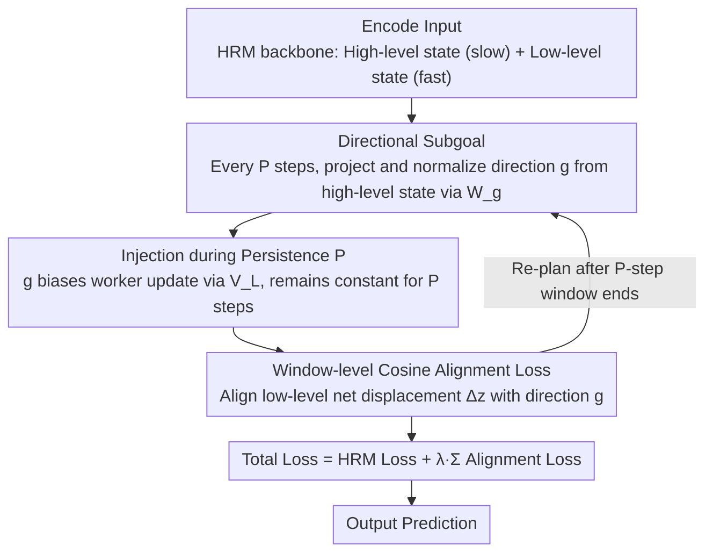

# When to Re-Plan: Subgoal Persistence in Hierarchical Latent Reasoning

**Conference**: ICML 2026  
**arXiv**: [2606.03741](https://arxiv.org/abs/2606.03741)  
**Code**: No public code  
**Area**: LLM Reasoning / Latent Reasoning Architecture  
**Keywords**: Hierarchical Reasoning, Latent Computation, Subgoal Persistence, HRM, Planning Stability  

## TL;DR
This paper introduces manager-worker style persistent subgoals into Hierarchical Reasoning Models (HRM). It find that the key in latent reasoning is not simply injecting subgoals, but ensuring that subgoals persist for $P=3$ to $6$ low-level update steps. Rapid re-planning disrupts compositional structure, while excessive alignment interferes with task learning.

## Background & Motivation
**Background**: Long-range reasoning systems typically follow two routes. One is explicit chain-of-thought, writing reasoning as a token sequence; the other is latent reasoning, compressing multi-step computation into hidden states with iterative updates. Hierarchical latent architectures like HRM implement deeper internal computation using slow high-level states and fast low-level states.

**Limitations of Prior Work**: Explicit token reasoning naturally possesses a temporal structure where "each token constrains subsequent tokens," whereas latent reasoning hidden state updates lack such external commitment. High-level states can change their mind at every step or not at all for a long time; the architecture itself does not specify how long a mid-term intention should persist.

**Key Challenge**: If subgoals are re-issued at every step, the goal is overwritten before the worker has time to form multi-step computation around it. Conversely, if subgoals persist too long, the worker's hidden state drifts, rendering old goals rigid. That is, a latent planner needs to find an appropriate re-planning cycle between stability and adaptability.

**Goal**: The authors aim to empirically characterize the role of subgoal persistence. By explicitly adding feudal-style subgoals into HRM and scanning the manager period $P$ and alignment weight $\lambda$, they investigate when re-planning should occur.

**Key Insight**: The paper ports the concept of "commitment time" from reinforcement learning (options/feudal hierarchy) to latent reasoning. Here, actions are not environment moves but low-level hidden state updates; the goals output by the manager are directional vectors in the latent space.

**Core Idea**: A high-level module issues a normalized directional subgoal $g$ every $P$ micro-steps. This subgoal continuously biases low-level updates during these $P$ steps, and a cosine alignment loss is used to ensure the low-level net displacement aligns with this direction.

## Method
The method is called Subgoal-Augmented HRM. It retains the original HRM's slow high-level state $z^H$ and fast low-level state $z^L$, adding an explicit subgoal interface between them. Instead of influencing the low-level only implicitly through recurrent coupling, the high-level state periodically projects a directional vector, allowing the worker to organize internal computation along this direction over multiple update steps.

### Overall Architecture
The HRM backbone contains two latent states: the low-level state updates every micro-step, while the high-level state updates every $T$ low-level steps. Subgoal-Augmented HRM introduces a manager period $P$. At time $t_k=kP$, the high-level state outputs $\tilde g_k=W_g z^H_{t_k}$ via $W_g$, which is then normalized to $g_k=\tilde g_k/(\|\tilde g_k\|_2+\epsilon)$. This $g_k$ remains constant for the next $P$ low-level updates.

During low-level updates, the subgoal is added to the input or low-level update through a projection $V_L$, forming a continuous steering term. To prevent the subgoal from being an unconstrained bias, the paper calculates the low-level state net displacement $\Delta z^L_k=z^L_{t_k+P}-z^L_{t_k}$ and its cosine alignment loss with $g_k$ over each commitment window. The pipeline is summarized as: High-level state periodically issues directional subgoal → Continuously inject bias into worker within the $P$-step window → Constrain worker to move in that direction using window alignment loss → Re-plan after the window ends.

### Key Designs
**1. Directional Subgoals instead of Target States**: To provide a latent reasoner with a mid-term intention signal, the most direct way is for the manager to specify an absolute hidden state to reach. However, latent hidden dynamics are non-stationary, and since the worker's state drifts, chasing a fixed endpoint is fragile. The paper instead outputs a unit direction: at $t_k$, the manager projects the high-level state via $W_g$ and L2-normalizes it to $g_k=\tilde g_k/(\|\tilde g_k\|_2+\epsilon)$, expressing "where to go next" rather than "where one must arrive." An optional commitment gate $\alpha_k=\sigma(w_\alpha^\top z^H_{t_k})\in(0,1)$ can also be used to soften the commitment strength. A direction is the minimal structure that allows the manager to commit to a mid-term intention without over-prescribing execution details, thus providing a planning prior without locking the worker.

**2. Persistence $P$ controls the Stability-Adaptability Trade-off**: The architecture itself does not dictate how long a latent intention should persist—this is the core knob this paper addresses. The issued direction remains constant ($g(t)=g_k$) for $P$ low-level micro-steps where $t\in[t_k,t_k+P)$, and is continuously injected as an additive bias into the low-level update via learned projection $V_L$: $z^L_{t+1}=f_L(z^L_t,z^H_t,\tilde x_t+\alpha(t)V_Lg(t);\theta_L)$ (and optionally into the high-level update via $V_H$). $P=1$ indicates re-planning every step, while larger $P$ indicates longer commitment. The core hypothesis is that compositional latent computation requires at least a few consecutive update steps to accumulate around the same intention; without persistence, the manager-worker architecture has form but no function—this is directly validated by the negative result where "$P=1$ is actually worse than the no-subgoal baseline."

**3. Window-level Cosine Alignment Loss**: Continuous injection only biases the worker at each step; it does not guarantee the worker's entire trajectory actually moves in the direction of the subgoal. The paper takes the net displacement $\Delta z^L_k=z^L_{t_k+P}-z^L_{t_k}$ for each commitment window and uses a cosine alignment loss $\mathcal{L}_{align}^{(k)}=1-\cos(\Delta z^L_k,g_k)$ to reward displacement consistent with the direction. The total loss is $\mathcal{L}=\mathcal{L}_{HRM}+\lambda\sum_k\mathcal{L}_{align}^{(k)}$ (since HRM detaches states between segments, alignment loss also only backpropagates within segments). This upgrades subgoals from "additional input features" to "internal priors" that constrain worker geometry. However, the weight $\lambda$ cannot be too large, or the directional constraint will compete with task gradients—in experiments, $\lambda\approx0.05$ is optimal as a lightweight prior, while $\lambda\ge0.20$ is clearly harmful.

### Loss & Training
The training objective is the original HRM task loss and ACT halting loss, plus the alignment loss for subgoal windows. The HRM backbone is fixed: hidden size 512, 4-layer high-level transformer, 4-layer low-level transformer, 8 heads, maximum 16 internal steps, trained with AdamATan2, base learning rate $10^{-4}$, and weight decay 0.1.

The paper reports two experimental regimes: the main study uses CPU, global batch size 768, and arc-aug-1000 data to scan $P$ and $\lambda$; the interference ablation uses a single NVIDIA L4, batch size 64, and smaller augmentation to compare full, baseline, and random directions at $\lambda=0.10, P=4$. The authors emphasize that absolute losses across different regimes should not be compared horizontally; only differences within the same regime are analyzed.

## Key Experimental Results

### Main Results
The main experiments were evaluated on training sets derived from ARC-AGI and ConceptARC (arc-aug-1000). Primary metrics include train LM loss, token-level accuracy, exact accuracy, alignment loss, and ACT halting depth. The key independent variables are subgoal persistence $P$ and alignment weight $\lambda$.

| Setting | Metric | Result | Control | Gain |
|--------|------|------|----------|------|
| No-subgoal baseline | LM loss ↓ | 1.640 | Original HRM structure | Reference |
| $P=1, \lambda=0.05$ | LM loss ↓ | 1.674 | baseline 1.640 | Worse, indicates rapid re-planning is harmful |
| $P=2, \lambda=0.05$ | LM loss ↓ | 1.638 | baseline 1.640 | Minimal improvement |
| $P=3, \lambda=0.05$ | LM loss ↓ | 1.544 | baseline 1.640 | Decrease of 0.096, best single point |
| $P=3$ to $P=8$ | LM loss range | [1.544, 1.590] | baseline 1.640 | Moderate over-commitment still acceptable |
| ConceptARC-mini | LM loss ↓ | 2.308 | baseline 2.316 | Direction consistent but small magnitude |

### Ablation Study
A key ablation in the paper addresses whether the performance drop when $\lambda=0.10$ (past the optimal point) comes from architectural capacity, auxiliary loss, or the learned direction itself. Three cells are compared under the same training regime.

| Configuration | Key Metric | Description |
|------|---------|------|
| A_full | Train LM loss 1.327, vs baseline +0.100 | Learned direction + injection + alignment fully enabled; strong direction causes interference |
| B_baseline | Train LM loss 1.227 | Injection and alignment disabled; reverts to vanilla HRM |
| E_random | Train LM loss 1.230, vs baseline +0.003 | Random unit directions are nearly equal to baseline |
| A_full vs E_random | Difference 0.097 | Interference stems primarily from learned directional content, not extra modules or auxiliary loss |
| $\lambda$ sweep | $\lambda\approx0.05$ is optimal | $\lambda=0.10$ approaches baseline; $\lambda\ge0.20$ is worse |

### Key Findings
- Persistence is a necessary condition. $P=1$ is worse than having no subgoals, indicating that "having a manager, a goal vector, and injection" is insufficient; the goal must persist long enough to organize multi-step latent computation.
- The optimal interval is $P\in[3,6]$, which is neither too short nor too rigid. Decay from $P=3$ to $P=8$ is slow, indicating the downside of stale subgoals is smaller than the downside of no commitment.
- The optimal weight for alignment loss is narrow. $\lambda=0.05$ acts as a lightweight planning prior, $\lambda=0.10$ begins to compete with task objectives, and $\lambda\ge0.20$ is clearly harmful.
- The random direction ablation is critical. It shows that the problem with excessive alignment is not just "adding another loss," but that the learned direction actually competes for representational capacity.

## Highlights & Insights
- The research question is precise: latent reasoning doesn't just need "more steps," it needs to decide how often internal intentions are updated. This time-scale problem is naturally masked by token sequences in explicit CoT but must be explicitly designed in latent computation.
- The failure of $P=1$ is a convincing negative result. It directly rules out the explanation that "merely adding a subgoal module helps," pinning the contribution on the persistence mechanism.
- The random direction ablation is elegant. E_random is nearly identical to the baseline, proving that learned subgoals are not decorative; they can help at the right weight and hurt when too strong.

## Limitations & Future Work
- Evaluation is primarily on ARC/ConceptARC style tasks, and the main metric is train LM loss. While informative of mechanism behavior, it is insufficient to prove generalization across a wider range of reasoning tasks.
- The strongest conclusions are empirical and behavioral, lacking representation-level analysis—such as whether subgoals actually correspond to interpretable sub-problems or intermediate program structures.
- The past-sweet-spot analysis in the ablation used a single seed. Although the gap is much larger than the main experiment seed variance, more robust multi-seed ablations are still necessary.
- The method introduces additional hyperparameters $P$ and $\lambda$. In practical deployment, if different tasks require different persistence periods, adaptive or learned re-planning mechanisms might be needed.

## Related Work & Insights
- **vs Chain-of-Thought**: CoT uses explicit tokens to form reasoning trajectories and commitments; this work investigates internal commitment time within hidden states, more relevant to low-latency latent reasoning.
- **vs Original HRM**: HRM has high/low-level loops and halting but lacks explicit mid-term intention signals; this work transforms high-level states into persistent directional goals.
- **vs Feudal RL / Options**: This work borrows manager-worker and temporal abstraction concepts but replaces environment actions with hidden-state updates, tailored for latent reasoning.
- **Transferable Insights**: Future latent planners could learn when to re-plan instead of using a fixed $P$; subgoal directions could also be aligned with interpretable intermediate tasks, program snippets, or retrieval targets.

## Rating
- Novelty: ⭐⭐⭐⭐☆ Studying subgoal persistence as a core variable in latent reasoning is a fresh perspective with a simple mechanism.
- Experimental Thoroughness: ⭐⭐⭐☆☆ Scanning and ablations support mechanism conclusions, but task range and main metrics remain narrow.
- Writing Quality: ⭐⭐⭐⭐☆ The paper is well-structured around the stability-adaptability tradeoff, with clear narratives and well-explained negative results/ablations.
- Value: ⭐⭐⭐⭐☆ Insightful for building internal planning-type reasoning models, especially as a reminder to explicitly handle re-planning timescales in latent reasoning architectures.

<!-- RELATED:START -->

## Related Papers

- [\[ICML 2026\] How Far Ahead Do LLMs Plan? Uncovering the Latent Horizon in Chain-of-Thought Reasoning](how_far_ahead_do_llms_plan_uncovering_the_latent_horizon_in_chain-of-thought_rea.md)
- [\[ICLR 2026\] $\textbf{Re}^{2}$: Unlocking LLM Reasoning via Reinforcement Learning with Re-solving](../../ICLR2026/llm_reasoning/textbfre2_unlocking_llm_reasoning_via_reinforcement_learning_with_re-solving.md)
- [\[ICML 2026\] Modeling Hierarchical Thinking in Large Reasoning Models](modeling_hierarchical_thinking_in_large_reasoning_models.md)
- [\[ICLR 2026\] Adaptive Thinking: Large Language Models Know When to Think in Latent Space](../../ICLR2026/llm_reasoning/adaptive_thinking_large_language_models_know_when_to_think_in_latent_space.md)
- [\[ICML 2026\] The Deterministic Horizon: When Extended Reasoning Fails and Tool Delegation Becomes Necessary](the_deterministic_horizon_when_extended_reasoning_fails_and_tool_delegation_beco.md)

<!-- RELATED:END -->
## Related Papers

- [\[ICML 2026\] How Far Ahead Do LLMs Plan? Uncovering the Latent Horizon in Chain-of-Thought Reasoning](how_far_ahead_do_llms_plan_uncovering_the_latent_horizon_in_chain-of-thought_rea.md)
- [\[ICLR 2026\] $\textbf{Re}^{2}$: Unlocking LLM Reasoning via Reinforcement Learning with Re-solving](../../ICLR2026/llm_reasoning/textbfre2_unlocking_llm_reasoning_via_reinforcement_learning_with_re-solving.md)
- [\[ICML 2026\] Modeling Hierarchical Thinking in Large Reasoning Models](modeling_hierarchical_thinking_in_large_reasoning_models.md)
- [\[ICML 2026\] The Deterministic Horizon: When Extended Reasoning Fails and Tool Delegation Becomes Necessary](the_deterministic_horizon_when_extended_reasoning_fails_and_tool_delegation_beco.md)
- [\[ICLR 2026\] When Shallow Wins: Silent Failures and the Depth-Accuracy Paradox in Latent Reasoning](../../ICLR2026/llm_reasoning/when_shallow_wins_silent_failures_and_the_depth-accuracy_paradox_in_latent_reaso.md)

<!-- RELATED:END -->
