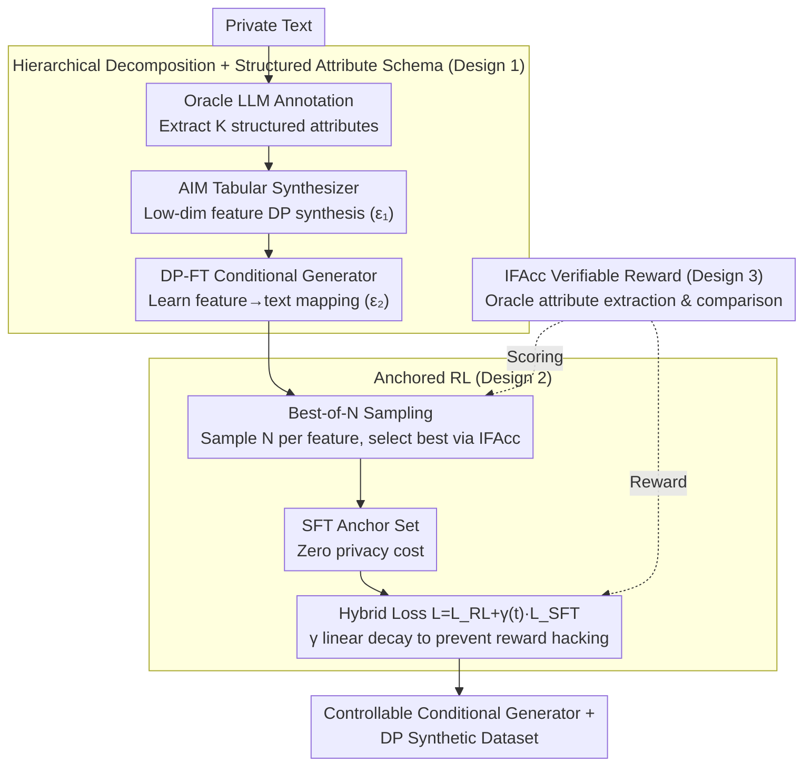

# ACTG-ARL: Differentially Private Conditional Text Generation with RL-Boosted Control

**Conference**: ICML 2026  
**arXiv**: [2510.18232](https://arxiv.org/abs/2510.18232)  
**Code**: https://github.com/actg-arl/ACTG-ARL  
**Area**: Differential Privacy / Text Generation / Reinforcement Learning Alignment  
**Keywords**: Private Synthetic Data, Conditional Text Generation, Attribute Control, Instruction Following, Reward Hacking

## TL;DR
This paper proposes ACTG, a hierarchical framework that decomposes private text generation into two subtasks: feature learning and conditional text generation. It further introduces Anchored RL, which enhances the instruction-following capabilities of the conditional generator through a hybrid RL objective and Best-of-N SFT anchors. Experimental results on biomedical data show a 20% improvement in MAUVE compared to prior work while maintaining text fidelity.

## Background & Motivation

**Background**
Modern AI applications rely on massive user data (e.g., mobile input, recommendation history, dialogue preferences), which entails high privacy risks. Generating private synthetic data is a promising paradigm that allows downstream tasks to reuse synthetic data without additional privacy costs. Differentially Private (DP) synthetic text is a focal point, but existing work primarily focuses on generating static datasets, neglecting the practical requirements for fine-grained control.

**Limitations of Prior Work**
1. **CTCL Limitations**: Relies on pre-trained global topic models, which might not match private-domain data. Forcing fine-grained text into coarse topic categories leads to inaccurate topic inference. When the dataset is small relative to the number of topics, the histograms contain many null values, causing signals to be submerged in noise after perturbation.
2. **Control vs. Fidelity Balance**: Traditional RL optimization can lead to reward hacking, where the model learns to generate outputs that formally satisfy constraints but suffer from degraded text quality (e.g., TL;DR-style summaries).

**Key Challenge**
Distribution matching objectives encourage sampling from high-density regions of $P(X,Y)$ (where the model is already confident), whereas the value of data augmentation stems from low-density regions (uncertain boundaries or under-covered populations). This leads to an objective misalignment between the generator and the augmentation task.

**Goal**
1. Construct a modular framework to identify optimal configurations through systematic ablation.
2. Improve the instruction-following capabilities of the conditional generator while maintaining privacy.

**Key Insight**
Starting from "attribute conditioning," the framework utilizes structured tabular schemas as features combined with a DP feature generator and a DP fine-tuned conditional generator. Furthermore, reinforcement learning is integrated with feature constraints to construct verifiable reward signals.

**Core Idea**
Hierarchical decomposition: First, structured features $\mathcal{D}_{\text{priv}}^f$ are extracted from private data, and a DP tabular synthesizer generates private features $\mathcal{D}_{\text{syn}}^{\tilde{f}}$. Second, a conditional mapping from features to text is learned via DP fine-tuning. Finally, Anchored RL uses Best-of-N data as SFT anchors to prevent RL drift, achieving hybrid optimization with $\mathcal{L}=\mathcal{L}_{\text{RL}}+\gamma\cdot\mathcal{L}_{\text{SFT}}$.

## Method

### Overall Architecture
ACTG-ARL decomposes "private conditional text generation" into a pipeline: First, an Oracle LLM extracts a structured attribute matrix from private text. Then, a tabular synthesizer performs DP synthesis in a low-dimensional feature space. Next, a "feature → text" conditional generator $G_{x|f}$ is DP fine-tuned. Finally, Anchored RL further enhances the instruction-following capability of this generator without touching the original private data. The entire pipeline splits the privacy budget into $\varepsilon_1$ (feature synthesis) and $\varepsilon_2$ (conditional fine-tuning), while the RL phase is "free" as it only samples from the model itself.

### Key Designs

**1. Hierarchical Decomposition + Structured Attribute Schema: Optimizing Privacy Budget Allocation**

Directly applying DP-FT to an LLM to learn private text distributions end-to-end dilutes the limited privacy budget across massive tokens, resulting in poor quality. CTCL uses global topics as conditions but suffers from domain mismatch—pre-trained topic models do not align with private data, and sparse histograms lead to signal drowning after adding noise. Ours decomposes the problem: the first layer learns the **marginal distribution of features** in a low-dimensional tabular space using the AIM synthesizer, which utilizes the privacy budget far more efficiently. The second layer learns the **feature-conditioned text distribution** $G_{x|f}$ via DP-FT. Crucially, the attribute schema uses $K$ structured fields designed by an Oracle LLM or domain experts, naturally fitting the internal structure of the data and bypassing sparse histograms.

**2. Anchored RL: Preventing Reward Hacking with Zero Privacy Cost Anchors**

Standard PPO for optimizing instruction following can trigger reward hacking, where models satisfy constraints but text quality collapses (e.g., standard PPO dropped MAUVE from 0.73 to 0.42 in ablation). The solution draws from RLHF's "reference KL" but replaces the reference with a non-private source: for each feature $f$, $N$ candidates are sampled from the already privatized $G_{x|f}$, and the best one is selected based on IFAcc to form the SFT anchor set $D_{\text{SFT}_N}$. Since these samples come from an already privatized model, constructing anchors incurs **zero additional privacy cost**. A hybrid loss $\mathcal{L}=\mathcal{L}_{\text{RL}}+\gamma(t)\cdot\mathcal{L}_{\text{SFT}}$ is used, with $\gamma(t)$ decaying linearly to preserve fidelity early on while allowing for instruction following improvements later.

**3. IFAcc: Verifiable Reward for Constraint Satisfaction**

The hardest part of RL in generation tasks is the lack of clear, automated reward signals. A structured attribute space provides this naturally. For a generated text, an Oracle LLM extracts the perceived attributes $\hat{f}$, which are compared field-by-field with the target features $f$ to define Instruction Following Accuracy:

$$\text{IFAcc}=\mathbb{E}_f\Big[\tfrac{1}{K}\sum_{k=1}^K\mathbb{I}(f_k=\hat{f}_k)\Big]$$

This metric serves two purposes: as the reward signal for RL and as the scoring criteria for Best-of-N anchor selection.

### Loss & Training
The total privacy budget is split as $\varepsilon=\varepsilon_1+\varepsilon_2$. For each $\varepsilon\in\{1,4,\infty\}$, the split $(\varepsilon_1,\varepsilon_2)$ is optimized independently with $\delta=1/(n\log n)$. Experiments show that for $\varepsilon=4$, the optimal split is approximately $(1.5,2.5)$ or $(2,2)$. The RL phase uses the hybrid loss starting from the $G_{x|f}$ checkpoint, with $\gamma(t)$ linearly decaying to balance fidelity and instruction following.

## Key Experimental Results

### Main Results

| Dataset | Method | MAUVE | F1 Classify | NTP Acc | IFAcc | $d_{\text{JS}}^f$ |
|--------|------|-------|--------|--------|-------|----------|
| bioRxiv(ε=4) | Aug-PE | 0.68 | 0.72 | - | - | 0.15 |
| | vanilla DP-FT | 0.62 | 0.68 | 0.41 | 0.53 | 0.18 |
| | CTCL | 0.64 | 0.70 | 0.42 | 0.48 | 0.16 |
| | Ours (ACTG) | 0.73 | 0.76 | 0.56 | 0.53 | 0.09 |
| | Ours (ACTG-ARL) | **0.74** | **0.79** | **0.58** | **0.62** | **0.08** |
| PMC-Patients(ε=4) | CTCL | 0.59 | 0.64 | 0.38 | 0.48 | 0.20 |
| | Ours (ACTG) | **0.71** | 0.75 | 0.51 | 0.50 | 0.10 |
| | Ours (ACTG-ARL) | 0.70 | **0.77** | **0.53** | **0.58** | **0.09** |

### Ablation Study

| Component | Remove/Replace | MAUVE | IFAcc | $d_{\text{JS}}^f$ | Description |
|------|---------|-------|-------|----------|------|
| Feature Model | Replace with CTCL Topics | 0.64 | 0.48 | 0.16 | Significant performance drop |
| Feature Gen | DP-FT instead of AIM | 0.68 | 0.50 | 0.12 | AIM performs better (less budget waste) |
| Cond. Gen | Prompting instead of DP-FT | 0.61 | 0.55 | 0.14 | FT version is more stable |
| Full ACTG | - | 0.73 | 0.53 | 0.09 | Baseline |
| +Standard PPO | Without Anchors | 0.42 | 0.68 | 0.22 | Severe reward hacking; MAUVE collapse |
| +Anchored RL | Full Method | 0.74 | 0.62 | 0.08 | Improved IFAcc while maintaining fidelity |

### Key Findings
- **Feature Design is Crucial**: Structured attribute schemas significantly outperform global topics, improving MAUVE from 0.64 to 0.73 on bioRxiv (+14%).
- **Tabular vs. Text Feature Generation**: AIM (tabular) saves privacy budget compared to DP-FT (text), yielding smaller $d_{\text{JS}}^f$ errors.
- **RL Reward Hacking**: Standard PPO destroys MAUVE (0.73 to 0.42), whereas Anchored RL recovers it to 0.74 while boosting IFAcc (0.53 to 0.62).
- **Best-of-N Effectiveness**: Selecting from N=5 or 10 candidates produces high-quality, diverse SFT datasets at no privacy cost.
- **Privacy Budget Splitting**: At $\varepsilon=4$, an approximately equal split $(\varepsilon_1 \approx \varepsilon_2)$ is often optimal, suggesting both stages require sufficient budget.

## Highlights & Insights
- **Elegance of Hierarchical Design**: Decomposing complex end-to-end DP text generation into low-dimensional tabular synthesis and conditional text generation improves modularity and allows for specialized tools (AIM vs. LLM fine-tuning).
- **Practicality of Anchored RL**: Using Best-of-N self-sampling provides a reference without accessing private data, effectively preventing reward hacking—a clever adaptation of RLHF for privacy-constrained scenarios.
- **Attribute Matching as Reward**: Leveraging the structured attribute space for IFAcc metrics converts fuzzy semantic judgment into a formal, verifiable extraction problem.

## Limitations & Future Work
- **Scope of Models and Data**: Experiments were limited to gemma-3-1b-pt in the biomedical domain; other fields like law or finance and larger models are unexplored.
- **Attribute Space Design**: The paper does not discuss automated design for optimal attribute schemas, currently relying on manual or Oracle LLM intervention.
- **Budget Optimization**: The $(\varepsilon_1,\varepsilon_2)$ split is determined via hyperparameter tuning rather than theoretical guidance or adaptive strategies.

## Related Work & Insights
- **vs. DP-FT**: Direct DP fine-tuning of LLMs without conditional control leads to significant quality degradation. Ours improves this through hierarchy and attribute conditioning.
- **vs. CTCL**: Both use conditioning, but CTCL uses fixed global topics whereas ours uses data-specific attribute schemas to improve alignment.
- **vs. Aug-PE (Private Evolution)**: While PE uses iterative LLM refinement, ours uses direct fine-tuning + RL, providing more stability in the biomedical domain.

## Rating
- Novelty: ⭐⭐⭐⭐ Hierarchical framework and Anchored RL are significant contributions.
- Experimental Thoroughness: ⭐⭐⭐⭐ Solid multi-dimensional evaluation and ablation.
- Writing Quality: ⭐⭐⭐⭐ Clear problem description and algorithms.
- Value: ⭐⭐⭐⭐ Addresses the practical need for controllable private synthetic text (+20% MAUVE).

<!-- RELATED:START -->

## Related Papers

- [\[ACL 2026\] Differentially Private Synthetic Text Generation for Retrieval-Augmented Generation (RAG)](../../ACL2026/llm_safety/differentially_private_synthetic_text_generation_for_retrieval-augmented_generat.md)
- [\[ICML 2026\] Privacy Amplification in Differentially Private Zeroth-Order Optimization with Hidden States](privacy_amplification_in_differentially_private_zeroth-order_optimization_with_h.md)
- [\[ICML 2026\] Differentially Private Preference Data Synthesis for Large Language Model Alignment](differentially_private_preference_data_synthesis_for_large_language_model_alignm.md)
- [\[ICML 2026\] Optimizing Token Choice for Code Watermarking: An RL Approach](optimizing_token_choice_for_code_watermarking_an_rl_approach.md)
- [\[ICML 2026\] AliMark: Enhancing Robustness of Sentence-Level Watermarking Against Text Paraphrasing](alimark_enhancing_robustness_of_sentence-level_watermarking_against_text_paraphr.md)

<!-- RELATED:END -->
