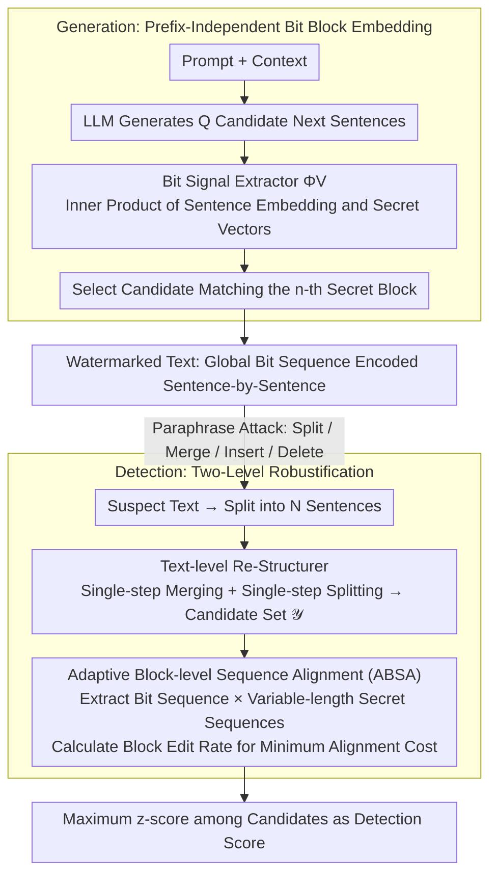

# AliMark: Enhancing Robustness of Sentence-Level Watermarking Against Text Paraphrasing

**Conference**: ICML 2026  
**arXiv**: [2605.29434](https://arxiv.org/abs/2605.29434)  
**Code**: https://github.com/imethanlee/AliMark  
**Area**: LLM Security / Text Watermarking  
**Keywords**: Sentence-level watermarking, robustness to paraphrasing, sequence alignment, structural perturbation, watermark detection  

## TL;DR
AliMark reframes sentence-level text watermarking from "prefix-conditioned per-sentence detection" to "encoding and alignment of a global secret bit sequence." By utilizing text reconstruction and adaptive block edit distance, it significantly enhances detection robustness against strong paraphrasing attacks like DIPPER and GPT-3.5.

## Background & Motivation
**Background**: LLM text watermarking is generally categorized into token-level and sentence-level methods. Token-level methods bias the sampling distribution during decoding and collect signals during detection. Sentence-level methods anchor watermarks in the semantic embedding space, aiming to preserve signals even after synonymous paraphrasing.

**Limitations of Prior Work**: Token-level watermarks are easily destroyed by synonym substitution and rewriting. While sentence-level watermarks are more resistant to lexical changes, many existing methods adopt a KGW-style prefix design where the watermark signal of a sentence depends on the preceding sentence or context. When a paraphraser splits, merges, inserts, or deletes sentences, the "prefix" for subsequent sentences becomes misaligned, leading to a cascaded loss of detection signals.

**Key Challenge**: Sentence-level watermarking relies on semantic stability, yet prefix-conditioning binds the detection of each sentence to a local structure. Strong paraphrasers often disrupt sentence boundaries and context order rather than semantics. Consequently, local prefix hashing amplifies structural perturbations into multi-sentence signal failures.

**Goal**: The paper aims to address three specific problems: how to embed sentence-level signals without relying on local prefixes during generation, how to tolerate sentence splitting and merging during detection, and how to maintain low false-positive detection capabilities after strong paraphrasing without sacrificing text quality.

**Key Insight**: The authors observe that GPT-3.5 frequently changes the number of sentences when paraphrasing C4 text, indicating that "sentence boundary changes" are common behaviors of strong paraphrasers rather than edge-case attacks. Drawing inspiration from sequence alignment used to handle insertions and deletions in token watermarking, they treat the entire text as a sequence of bit blocks to be matched against a secret sequence.

**Core Idea**: A global secret bit sequence replaces prefix-dependent inter-sentence pseudo-random relationships. Text reconstruction and block-level edit distance alignment are then employed to absorb offsets caused by sentence splitting, merging, insertion, and deletion.

## Method
The mechanism of AliMark is not the design of a more complex local hash, but rather a shift from "checking if each sentence hits a green zone" to "checking if the entire text resembles a secret bit sequence." This perspective changes the interfaces for both generation and detection: during generation, each sentence carries a bit block of a fixed length; during detection, block-level insertions, deletions, and substitutions are allowed between the extracted sequence and the secret sequence.

### Overall Architecture
In the generation phase, given a prompt and context, the LLM generates $Q$ candidate next sentences. AliMark uses a sentence embedder to map each candidate to a semantic vector and computes the inner product with a set of orthogonal secret vectors. The sign of the $m$-th inner product determines the $m$-th watermark bit for that sentence. The global secret sequence is sliced into blocks of length $M$, and the $n$-th sentence needs to match the $n$-th secret block. If a candidate matches perfectly, it is chosen; otherwise, the one with the highest bit-match count is selected.

In the detection phase, the input text is segmented into sentences and processed through a two-level robustification pipeline. The first level, the Re-Structurer, performs a round of potential re-merging and re-splitting to form a candidate set including the original text, merged adjacent sentence pairs, and split sentences. The second level, Adaptive Bit Sequence Alignment, extracts bit block sequences for each candidate and performs dynamic programming alignment against variable-length secret sequence candidates. The maximum watermark score across all candidates is taken as the final detection score.

### Key Designs
**1. Prefix-independent bit block embedding: Attaching signals to the sentence itself.** Prefix-based sentence-level watermarking fails because detection for each sentence is bound to the previous one. If a paraphraser alters boundaries, subsequent "prefixes" shift, causing a cascade of signal loss. AliMark uses a global secret bit sequence $\mathbf{s}$ as a context-independent key, divided into blocks of length $M$, where the $n$-th sentence carries the $n$-th block. During generation, the inner product of the semantic embedding $\mathbf{e}$ of each candidate and predefined orthogonal vectors $\mathbf{v}_m$ is computed. The $m$-th bit is determined by the sign ($\langle \mathbf{e},\mathbf{v}_m\rangle<0$ is 0, else 1). Thus, the signal is decoupled from the prefix, ensuring that local boundary changes do not invalidate the entire sequence.

**2. Text-level Re-Structurer (RS): Actively restoring corrupted boundaries.** Since attacks primarily damage sentence boundaries rather than semantics, RS attempts to "revert" boundaries before alignment. For $N$ sentences, it enumerates $N-1$ single-step merged candidates $\mathcal{X}^-$ and $N$ single-step split candidates $\mathcal{X}^+$. These, along with the original text, form a candidate set $\mathcal{Y}$. If the text is watermarked, at least one reconstruction candidate likely restores the original structure, raising the alignment score. For human-written text, these reconstructions do not yield consistent alignment gains. The method limits operations to single steps to maintain a controlled search space while covering most DIPPER/GPT-3.5 perturbations.

**3. Adaptive Block-level Sequence Alignment (ABSA + BER): Absorbing offsets with block edit distance.** To handle remaining sentence count deviations, ABSA aligns the bit sequence $\mathbf{b}_{\mathbf{Y}}$ of each reconstruction candidate against secret sequences of varying lengths in the range $[\alpha N', \beta N']$. Alignment cost is measured by Block Edit Rate (BER), which upgrades standard Levenshtein distance to the block level: insertion and deletion costs are $M$, while substitution cost is the Hamming distance between two blocks. This BER granularity specifically matches sentence-level watermarking where perturbations typically affect entire blocks.

### Loss & Training
AliMark is not an end-to-end trained model; it utilizes a frozen LLM, frozen sentence embedder, and randomly generated secret vectors. Critical hyperparameters include bit block size $M$ and candidate budget $Q$ for generation, and the reconstruction candidate count and BER dynamic programming settings for detection. The authors use all-mpnet-base-v2 as the default embedder and leverage vLLM to reduce KV-cache overhead during candidate generation.

## Key Experimental Results

### Main Results
Experiments were conducted on Booksum and C4 with 500 samples each, using OPT-1.3B and Qwen3-1.7B as backbones. Attacks included Pegasus, Parrot, DIPPER, and GPT-3.5. The TPR@5% results for OPT-1.3B highlight robustness against structural perturbations.

| Dataset | Attack | Ours TPR@5% | Prev. SOTA TPR@5% | Gain |
|--------|------|----------------|------------------|----------|
| Booksum | DIPPER | 61.6 | 30.4 (PMark) | +31.2 |
| Booksum | GPT-3.5 | 66.6 | 33.0 (PMark) | +33.6 |
| C4 | DIPPER | 49.8 | 29.6 (PMark) | +20.2 |
| C4 | GPT-3.5 | 51.6 | 28.2 (PMark) | +23.4 |
| Booksum | Pegasus | 95.6 | 86.0 (PMark) | +9.6 |
| C4 | Parrot | 91.2 | 89.4 (PMark) | +1.8 |

### Ablation Study
The study analyzes embedders, candidate budgets, and detection modules.

| Configuration | Key Metric | Description |
|------|---------|------|
| all-mpnet-base-v2 | Booksum/GPT-3.5 TPR@5% 66.6 | Default embedder, most stable overall |
| all-distilroberta-v1 | Booksum/GPT-3.5 TPR@5% 56.8 | Usable, but significant drop under strong paraphrasing |
| multi-qa-mpnet-base-dot-v1 | Booksum/GPT-3.5 TPR@5% 55.2 | Semantic space less suited for watermark blocks |
| $Q=8$ | Booksum/GPT-3.5 TPR@5% 29.6 | Insufficient candidates to match secret blocks |
| $Q=64$ | Booksum/GPT-3.5 TPR@5% 66.6 | Higher budget significantly improves embeddability |
| AliMark Detection | Latency for 128 sentences: 0.34s | Acceptable overhead from RS and adaptive alignment |
| w/o RS | Latency for 128 sentences: 0.07s | Faster, but detection rate drops under structural perturbation |
| w/o Ada | Latency for 128 sentences: 0.27s | Weaker against deletions and insertions |

### Key Findings
- The advantage of AliMark is most pronounced against strong paraphrasers like DIPPER and GPT-3.5 that alter sentence structure, addressing the core failure mode of sentence-level watermarking.
- The Re-Structurer is more critical than adaptive-length alignment; without RS, detection performance drops sharply in strong paraphrasing scenarios.
- Impact on text quality is minimal. Perplexity (PPL) for OPT-1.3B and Qwen3-1.7B remains close to unwatermarked output, though very large $M$ values may constrain the semantic space of candidates.

## Highlights & Insights
- Framing sentence-level watermarking as sequence alignment is the strongest abstraction in this work. It moves away from fixing prefix hashes and instead accepts boundary drift as a sequence offset.
- The BER design is finely tuned to the task granularity. Sentence splitting or merging is not an independent bit error but a block-level shift.
- Single-step reconstruction is a pragmatic choice. While it does not solve all complex paraphrasing, it covers common structural perturbations with manageable detection overhead.

## Limitations & Future Work
- RS only performs single-step operations, providing limited recovery from continuous structural changes, semantic reordering, or paragraph-level paraphrasing.
- The generation side requires a large candidate budget $Q$, which may be a burden for low-latency scenarios despite vLLM optimization.
- Detection still relies on sentence segmentation and embedder quality; stability across languages, code-mixed text, or very short texts remains to be verified.
- Future work could involve learning a lightweight structure restorer to probabilistically target split or merged positions.

## Related Work & Insights
- **vs KGW / SynthID (Token-level)**: Token-level methods are efficient but rely on lexical distribution biases; signals vanish after strong paraphrasing. AliMark uses semantic blocks, better suited for paraphrase-robust detection.
- **vs SemStamp / k-SemStamp**: These sentence-level methods rely on prefix relationships, where structural perturbations cause cascaded failures. AliMark uses global sequences and alignment to avoid this.
- **vs PMark / SimMark**: These methods are effective against weak paraphrasing but sensitive to splitting/merging. AliMark's gains demonstrate the need to explicitly model structural perturbations.
- **Insight**: Any task involving authentication, provenance, or consistency checks for long text partitioned into local units can benefit from a "local signal + global sequence alignment" framework to absorb insertion/deletion errors.

## Rating
- Novelty: ⭐⭐⭐⭐☆ The reframing of detection as block-level sequence alignment is a clear innovation addressing real-world attack patterns.
- Experimental Thoroughness: ⭐⭐⭐⭐☆ Covers multiple datasets, backbones, paraphrasers, and ablations, though human rewriting and cross-lingual scenarios are less explored.
- Writing Quality: ⭐⭐⭐⭐☆ Motivation analysis and methodology are well-organized, with formulas and algorithms supporting implementation.
- Value: ⭐⭐⭐⭐☆ Highly relevant for implementing robust text watermarking, particularly for provenance in the presence of automated paraphrasing.

<!-- RELATED:START -->

## Related Papers

- [\[ACL 2026\] Subject-level Inference for Realistic Text Anonymization Evaluation](../../ACL2026/llm_safety/subject-level_inference_for_realistic_text_anonymization_evaluation.md)
- [\[NeurIPS 2025\] Enhancing CLIP Robustness via Cross-Modality Alignment](../../NeurIPS2025/llm_safety/enhancing_clip_robustness_via_crossmodality_alignment.md)
- [\[NeurIPS 2025\] Adversarial Paraphrasing: A Universal Attack for Humanizing AI-Generated Text](../../NeurIPS2025/llm_safety/adversarial_paraphrasing_a_universal_attack_for_humanizing_ai-generated_text.md)
- [\[ICLR 2026\] PMark: Towards Robust and Distortion-free Semantic-level Watermarking with Channel Constraints](../../ICLR2026/llm_safety/pmark_towards_robust_and_distortion-free_semantic-level_watermarking_with_channe.md)
- [\[ICML 2026\] Watermarking LLM Agent Trajectories (ACTHOOK)](watermarking_llm_agent_trajectories.md)

<!-- RELATED:END -->
