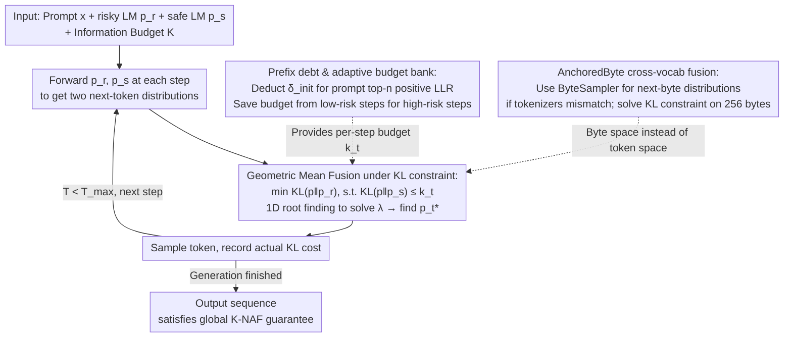

# Anchored Decoding: Provably Reducing Copyright Risk for Any Language Model

**Conference**: ICML2026  
**arXiv**: [2602.07120](https://arxiv.org/abs/2602.07120)  
**Code**: No public code link (local cache does not contain a repository)  
**Area**: LLM Security / Copyright Risk Mitigation  
**Keywords**: Copyright memorization, inference-time decoding, safe reference model, KL constraint, ByteSampler  

## TL;DR
This paper proposes Anchored Decoding: an inference-time method that anchors a high-performance but potentially risky language model (risky LM) to a safe language model (safe LM) trained solely on permissively licensed data. It provides a formal guarantee for the trade-off between copyright replication risk and generation quality using an adjustable information budget.

## Background & Motivation
**Background**: The capabilities of large language models (LLMs) largely stem from pre-training on massive web-scale corpora, which often contain a mix of permissively licensed text, copyrighted material, and content of unclear origin. Research indicates that models do not only learn abstract patterns but also memorize specific fragments from the training set, potentially outputting protected texts verbatim under specific prompts.

**Limitations of Prior Work**: Directly removing copyrighted material at the source and retraining the model is prohibitively expensive for frontier models. Furthermore, copyrighted text is often of high quality, and simple removal sacrifices downstream model capabilities. Common deployment strategies like system prompts, n-gram blocking, or retrieval-based rejection are fragile: system prompts fail to significantly reduce replication, and hard blocking depends on external snippet libraries, often conflating surface-level repetition with actual infringement risk.

**Key Challenge**: A high-capability risky LM offers superior fluency, factuality, and long-tail knowledge but is more likely to reproduce protected training samples. Conversely, a safe LM is trained on cleaner sources but is typically smaller and weaker. The challenge is not choosing between the two, but controlling the degree to which the risky LM deviates from the safe LM during each generation step, ensuring the output retains the utility of the strong model without limitlessly following distribution peaks that may originate from memorization.

**Goal**: The authors aim to develop an inference-time method that requires no retraining and no access to the original training data, compatible with any language model that outputs logits. This method must include a user-adjustable risk knob, satisfy sequence-level $K$-NAF information budget constraints relative to the safe LM, and maintain better utility than existing mitigation methods in real-world long-text replication benchmarks.

**Key Insight**: The paper views the safe LM as a "trusted anchor distribution" and the risky LM as a "high-utility candidate distribution." If the risky LM is highly confident in a continuation that the safe LM does not support, this distributional deviation often corresponds to training data memorization or copyright-sensitive states. Therefore, the KL divergence between the two can serve as a risk signal, allowing the decoding distribution to be projected near the safe LM at each step.

**Core Idea**: Use distribution projection under KL budget constraints to fuse the next-token distributions of the risky LM and safe LM into a new distribution that remains close to the risky LM while being strictly anchored by the safe LM.

## Method
The core of Anchored Decoding is an inference-time dual-model fuser. It does not modify model parameters or require knowledge of the risky LM's training data. As long as the logits of both the risky and safe LMs for a given prefix are accessible, a new sampling distribution can be calculated at each decoding step. This distribution is not a simple linear interpolation but is derived from a local optimization problem: "stay as close as possible to the risky LM, such that the KL divergence relative to the safe LM does not exceed the current budget."

### Overall Architecture
The input consists of a user prompt $x$, a risky LM $p_r$, a safe LM $p_s$ (trained on permissive data), a maximum length $T_{max}$, and a user-selected global information budget $K$. The system first calculates a "prefix debt" based on the prompt to determine if the prompt already triggers memorization patterns in the risky LM. Then, at each decoding step, both $p_r$ and $p_s$ are forwarded to obtain two next-token distributions.

If the remaining budget is high, the fused distribution stays closer to $p_r$ to preserve quality; if the prefix appears high-risk or the budget has been depleted, it shifts toward $p_s$. The cumulative KL expenditure is recorded in a ledger. The paper proves that if the sum of per-step budgets does not exceed $K$, the entire sequence distribution satisfies a global $K$-NAF guarantee relative to the safe LM.

To overcome the limitation of shared tokenizers, the paper introduces AnchoredByte Decoding. It uses a ByteSampler to convert token-level LMs into exact next-byte distributions, performing the same KL-constrained fusion over 256 bytes. This allows safe and risky LMs to be combined even if they use different BPE tokenizers.

### Key Designs
1.  **KL-constrained Geometric Mean Fusion**:
    - **Function**: Constructs a new distribution $p_t^*$ at each decoding step that remains as close as possible to the risky LM while staying within the local KL budget of the safe LM.
    - **Mechanism**: The local problem is defined as $\min_p D_{KL}(p \| p_r)$ subject to $D_{KL}(p \| p_s) \le k_t$. The closed-form solution is the weighted geometric mean: $p_t^* \propto p_s^{\lambda/(1+\lambda)} p_r^{1/(1+\lambda)}$. The Lagrange multiplier $\lambda$ is found via 1D root finding; $\lambda$ is large when the budget is tight (moving toward $p_s$) and small when the budget is loose (moving toward $p_r$).
    - **Design Motivation**: Linear interpolation offers only empirical trade-offs and lacks sequence-level risk guarantees. This projection form is derived from an optimization objective, making "utility maximization" and "risk boundaries" two sides of the same mathematical coin.

2.  **Prefix Debt and Adaptive Budget Bank**:
    - **Function**: Incorporates the risk of the prompt itself into the budget and allows low-risk steps to save budget for subsequent high-risk steps.
    - **Mechanism**: The log-likelihood ratio (LLR) for each position in the prompt is calculated as $\ell_i(x)=\log p_r(x_i|x_{<i})/p_s(x_i|x_{<i})$. The average of the top-$n$ positive LLRs is taken as $\delta_{init}(x)$. If a prompt (like the start of a famous novel) is much better supported by $p_r$ than $p_s$, the budget is pre-deducted. Per-step budgets are then set as $k_t=\max(0,(t+1)k-\sum_{i<t}a_i-\delta_{init})$, where $a_i$ is the actual KL cost.
    - **Design Motivation**: Replication events often occur early in a sequence when the model follows a memorized path. Prefix debt ensures conservative behavior at the start, while the budget bank manages expenditures adaptively.

3.  **AnchoredByte for Cross-Vocabulary Fusion**:
    - **Function**: Enables the anchoring method even when the safe LM and risky LM do not share a tokenizer.
    - **Mechanism**: ByteSampler marginalizes a token distribution based on the current byte prefix to obtain a next-byte distribution. AnchoredByte solves the KL constraint problem in the discrete byte space $\mathcal{B}=\{0x00,\ldots,0xFF\}$.
    - **Design Motivation**: Trusted safe models (e.g., Comma 7B) often use custom tokenizers different from popular risky models. Byte-level fusion enables compatibility across diverse model pairs at minor cost to inference efficiency.

### Loss & Training
Anchored Decoding is a pure inference-time algorithm. It does not train the risky LM or fine-tune the safe LM. However, the authors introduced TinyComma 1.8B: a decoder-only safe LM trained on 169.5B permissively licensed tokens from the Common Pile to align with the Llama 3.1 tokenizer. Training involved a 156B token phase on the full Common Pile followed by a 13.5B token "cooldown" on high-quality mixes (Wikimedia, DOAB, and Data Provenance Initiative data). TinyComma 1.8B serves as a clear-source, compatible, and capable safety anchor.

## Key Experimental Results

### Main Results
The authors evaluated copyright risk in the Books domain using fragments from 16 US-copyrighted novels (from CopyBench). Risk was measured by Normalized Copyright Reduction (NCR), an average of ROUGE, MinHash, ACS, and LCS metrics. NCR represents how much of the gap between the risky baseline and safe reference has been closed. An NCR $\ge 75\%$ is defined as the high-protection operating point.

Utility was measured by fluency (Prometheus-v2 score) and factuality (FActScore supported claim precision on Bios biographical prompts).

| Method | Model Pair / Granularity | Factuality @ HP | Fluency @ HP | Key Information |
| :--- | :--- | :--- | :--- | :--- |
| Safe reference | TinyComma 1.8B / Llama 3.1 70B, token | 0.09 | 3.00 | Low risk, weak quality |
| MemFree | Same, token | 0.37 | 3.18 | Lower utility |
| RCAD | Same, token | 0.37 | 3.38 | Better than MemFree |
| CP-Fuse | Same, token | 0.20 | 3.21 | Suboptimal utility |
| TokenSwap | Same, token | 0.44 | 3.77 | Strong baseline, needs seed list |
| **Ours** | Same, token | **0.53** | **4.02** | **Best utility at HP** |
| **Ours** (Byte) | Comma 7B / Llama 3.1 70B, byte | **0.52** | **4.23** | **Superior in cross-tokenizer scenarios** |
| **Ours** (Byte) | Comma 7B / Llama 4 Scout, byte | **0.56** | **4.46** | **Strongest Pareto performance** |

Ours/AnchoredByte defines the new Pareto frontier, particularly in high-protection regimes. In the TinyComma + Llama 3.1 70B pair, it improves factuality to 0.53 and fluency to 4.02, outperforming TokenSwap (0.44 / 3.77).

### Ablation Study
Ablations on TinyComma 1.8B + Llama 3.1 70B revealed that the full method is closest to the Pareto optimal.

| Configuration | Substituted Design | Observed Effect |
| :--- | :--- | :--- |
| **NoOpt** | No KL projection; discrete sampling | Pareto curve significantly degrades |
| **ColdStart** | Fixed prefix safe steps | Worse than full method; non-adaptive |
| **NoDebt** | Removed prefix debt | Risk-utility curve regresses significantly |
| **AvgDebt** | Avg of all prefix LLRs | Consistently worse than top-n tail debt |
| **Fixed** | Constant per-step budget | Too conservative; wastes budget on common steps |
| **Global** | Total budget; switch to safe when used | Poor quality toward end of generation |

### Key Findings
- At high protection levels, Ours doesn't just reduce risk but preserves more factuality and fluency, indicating that anchoring is more granular than simple blocking.
- Prefix debt's top-n LLR design matches experimental observations: copyrighted prompts have heavy right-tail LLRs, and replication usually starts early.
- Adaptive budgeting is superior because model differences are non-uniform; saved budget from common tokens helps maintain quality on rare but safe tokens.
- Efficiency: Token-level slowdown is ~1.1× with a TTFT of 195.9 ms, making it deployment-ready.

## Highlights & Insights
- **Copyright risk as a distribution constraint**: Rather than instruction following or post-processing, this frames risk as the information distance from a safe reference.
- **Safe LM as an anchor, not a replacement**: The safe model doesn't need to be state-of-the-art; it only needs to define the boundary for the stronger model.
- **Capturing temporal structure**: Prefix debt proactively deducts budget for risky prompts, targeting the specific points where memorized generation is most likely to trigger.
- **Practical cross-tokenizer support**: AnchoredByte expands the strategy to model pairs that would otherwise be incompatible due to different vocabularies.

## Limitations & Future Work
- **Legal Compliance**: $K$-NAF guarantees bounded divergence from a safe model, which is a technical proxy, not a formal legal certificate of non-infringement.
- **Non-zero Probability**: As a sampling strategy, it cannot provide a zero-probability hard guarantee for common expressions if the safe LM also contains them.
- **Local vs. Global Optimality**: Local per-step projection is a necessary computational approximation and may not reach the global sequence-level optimum.
- **Impact on rare knowledge**: If the safe LM is too small or lacks specific domains, anchoring may suppress valid long-tail facts (e.g., obscure historical figures) alongside copyrighted data.
- **Prompt Injection**: The method focuses on parameter memorization rather than in-prompt copy-pasting of protected text by users.

## Related Work & Insights
- **vs System Prompt**: System prompts often fail to reach high-protection thresholds; Anchored Decoding operates directly on logits and is more robust.
- **vs MemFree**: MemFree uses n-gram blocking, which requires a database; Ours requires no database and handles broader distributional risk.
- **vs RCAD**: RCAD requires additional risky-model forwards and has lower utility at high protection.
- **vs TokenSwap**: TokenSwap relies on seed lists and empirical assumptions about small models; Anchored Decoding uses formal KL budgets.

## Rating
- **Novelty**: ⭐⭐⭐⭐⭐ (Integrates KL budgets, safe references, and dual-model decoding into a unified framework)
- **Experimental Thoroughness**: ⭐⭐⭐⭐ (Extensive model pairs and ablations, though legal-tech alignment remains complex)
- **Writing Quality**: ⭐⭐⭐⭐⭐ (Excellent progression from theory to algorithm to deployment)
- **Value**: ⭐⭐⭐⭐⭐ (Highly practical for providers balancing capability with copyright compliance)

<!-- RELATED:START -->

- CopyBench: Measuring and Reducing Memorization in Language Models (2024)
- $K$-NAF: KL-Divergence Not All the Same (2025)
- RCAD: Real-time Copyright Alleviation in Decoding (2025)

<!-- RELATED:END -->

## Related Papers

- [\[ACL 2026\] RISK: A Framework for GUI Agents in E-commerce Risk Management](../../ACL2026/llm_safety/risk_a_framework_for_gui_agents_in_e-commerce_risk_management.md)
- [\[ICML 2026\] dgMARK: Decoding-Guided Watermarking for Diffusion Language Models](dgmark_decoding-guided_watermarking_for_diffusion_language_models.md)
- [\[ICML 2026\] COFT: Counterfactual-Conformal Decoding for Fair Chain-of-Thought Reasoning in Large Language Models](coft_counterfactual-conformal_decoding_for_fair_chain-of-thought_reasoning_in_la.md)
- [\[ICLR 2026\] Self-Destructive Language Model](../../ICLR2026/llm_safety/self-destructive_language_model.md)
- [\[ICML 2026\] From Parameter Dynamics to Risk Scoring: Quantifying Sample-Level Safety Degradation in LLM Fine-tuning](from_parameter_dynamics_to_risk_scoring_quantifying_sample-level_safety_degradat.md)

<!-- RELATED:END -->
