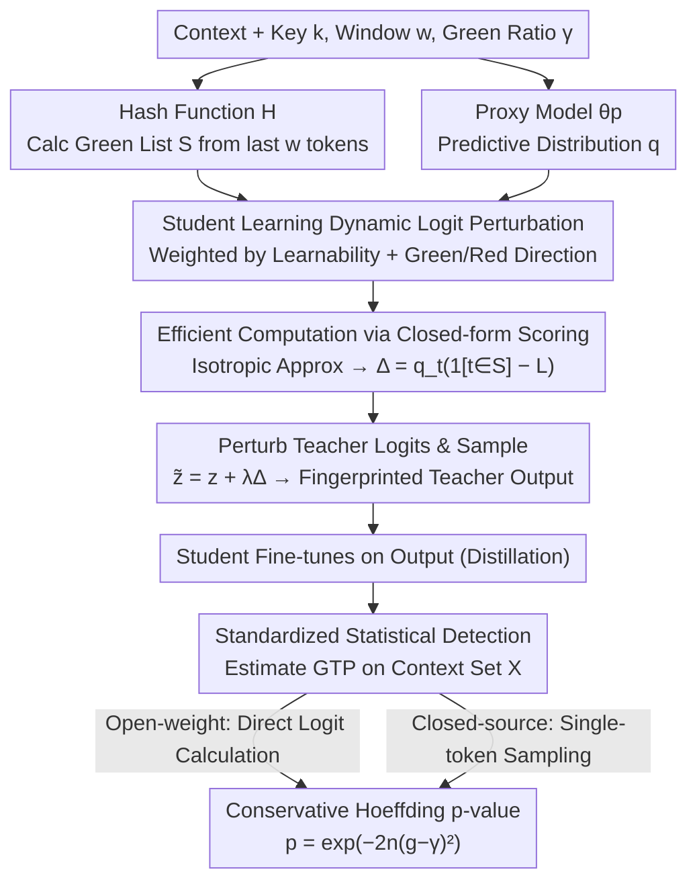

# Antidistillation Fingerprinting

**Conference**: ICML2026  
**arXiv**: [2602.03812](https://arxiv.org/abs/2602.03812)  
**Code**: https://github.com/YixuanEvenXu/antidistillation-fingerprinting  
**Area**: LLM Security  
**Keywords**: Model Fingerprinting, Antidistillation, Text Watermarking, Distillation Detection, Statistical Hypothesis Testing  

## TL;DR
This paper proposes Antidistillation Fingerprinting (ADFP), which utilizes a proxy student model to estimate which watermark tokens are most easily absorbed during the distillation process. This enables more reliable detection of whether a third-party model was trained on teacher model outputs with minimal sacrifice to teacher output quality.

## Background & Motivation
**Background**: The training cost of frontier LLMs is extremely high, and model owners typically grant access only via APIs or limited releases. Meanwhile, third parties can fine-tune smaller student models using teacher outputs to replicate teacher behavior at a low cost. Existing text watermarking methods, particularly red-and-green-list watermarks, use keys and hash functions to partition candidate tokens into a green list and a red list, then boost the probability of green tokens during sampling. If a student model later exhibits a significantly higher preference for green tokens, this preference is treated as a trace of distillation.

**Limitations of Prior Work**: Traditional watermarks apply logit biases almost uniformly to all green tokens. While this embeds statistical signals in teacher outputs, it ignores how the student model updates its parameters during fine-tuning. Consequently, for the fingerprint to truly permeate the student model, strong perturbations to the teacher output are often required, which degrades inference quality, conversational naturalness, or code correctness, and may even cause visible anomalies like repetition or formatting issues.

**Key Challenge**: Fingerprint detection relies on the student model retaining key-related green-token preferences after fine-tuning, whereas common watermarking optimizes whether the teacher's current output favors the green list. These objectives are not perfectly aligned. That is, whether a token is in the green list is insufficient; the critical factor is whether training on that token pushes the student model toward "being more likely to generate green tokens in the future."

**Goal**: The authors aim to transform "output watermarking" into true "model fingerprinting" for distillation detection. This involves providing statistically interpretable p-values for both open-weight and closed-source student assessment scenarios while achieving stronger detection confidence with smaller teacher quality losses in mathematical reasoning, open dialogue, and code generation tasks.

**Key Insight**: The paper borrows the idea of antidistillation sampling: If a proxy student model can approximate the learning dynamics of the real student, one can select tokens that are more likely to influence the student's future behavior rather than mechanically amplifying all green tokens. This proxy model does not need to be identical to the real student; it only needs to provide useful optimization directions.

**Core Idea**: The goal of watermark sampling is shifted from "making the current teacher output greener" to "sampling tokens that make the student greener after fine-tuning," using the logit-space gradients of a proxy model to construct fingerprint perturbations oriented toward distillation learning dynamics.

## Method
The core of ADFP is not a new detector, but a rewritten perturbation method for the watermark sampling phase. The detection side still uses the key-based hashing and green-token statistics familiar to the red-and-green-list family of methods. However, the generation side no longer biases the green list uniformly; instead, the perturbation magnitude depends on the predicted distribution of a proxy student model.

### Overall Architecture
The method consists of two phases. The first phase is fingerprinted teacher sampling: The model owner selects a hash function $H$, key $k$, window size $w$, and green-list ratio $\gamma$. At each generation step, the green list $S=H(x_{-w:},k)$ is calculated based on the last $w$ tokens of the context. An ADFP perturbation is then added to the teacher logits based on the predicted distribution of the proxy model $\theta_p$, and the next token is sampled. The resulting teacher outputs are then potentially used by a student model for fine-tuning.

The second phase is distillation detection: The model owner prepares a set of evaluation contexts $X$ and uses the same key $k$ to calculate the average green-list token probability (GTP) generated by the student model following these contexts. If the student has not been trained on data fingerprinted with that key, the GTP should fluctuate around $\gamma$; if it has, the GTP will be systematically higher. The paper uses the Hoeffding inequality to provide a conservative p-value: when $g_{obs}>\gamma$ is observed, $p=\exp(-2n(g_{obs}-\gamma)^2)$, where $n$ is the number of deduplicated evaluation contexts.

Two detection scenarios are considered. If the student is an open-weight model, the green-token probability for each context can be calculated directly from the logits. If the student is a closed-source model, the next token is sampled once for each context, and the green-token frequency is recorded. Both share the same null hypothesis: student generation is independent of the key.

### Key Designs
**1. Student-oriented Logit Perturbation: Aligning with "Learnable" Tokens**

Traditional red-and-green-list methods apply the same logit bias to all green tokens uniformly. This only ensures the teacher's current output is green but ignores whether the student will actually learn this token during fine-tuning. To internalize the fingerprint, one would have to crudely increase perturbation, degrading quality. ADFP instead varies the perturbation magnitude based on the token's "learnability." Let $q$ be the proxy model's predicted distribution, $S$ be the green list, and $L=\sum_{t\in S}q_t$ be the total green-token probability. The perturbation for token $t$ is $\Delta^{ADS}_t=q_t(\mathbf{1}[t\in S]-L)$. Here, $q_t$ focuses the method on high-probability tokens the proxy deems likely to be sampled (and thus most likely to serve as effective supervision), while $\mathbf{1}[t\in S]-L$ acts as an advantage baseline: green tokens are amplified and red tokens are suppressed, pushing the student away from non-fingerprint directions. This shifts the optimization target from "current teacher output" to "post-training student preference."

**2. Efficient Computation: Converting Gradients into Closed-form Scores**

If calculated according to the original definition of antidistillation sampling $\Delta_t=\langle\nabla_{\theta_p}\log q_t,\nabla_{\theta_p}L\rangle$, this perturbation would require a backward pass for every token in the vocabulary, making online decoding infeasible. The paper projects the gradient into logit space and approximates the Gram matrix of logit gradients with respect to parameters as isotropic $K\approx cI$. Under this approximation, constant terms independent of the token cancel out during sampling normalization, leaving $q_t(\mathbf{1}[t\in S]-L)$, which can be calculated using only the softmax probabilities of a single proxy model forward pass. The authors further prove this isotropic property holds exactly if only the proxy's final linear layer is trainable. This approximation reduces the complexity to that of standard LLM sampling.

**3. Unified Statistical Detection: Model Attribution as Conservative Hypothesis Testing**

The detection phase does not require access to student weights but instead calculates the average Green-list Token Probability (GTP) across evaluation contexts $X$. The contexts are deduplicated by their last $w$ tokens to ensure green lists are approximately independent under key randomness. Open-weight students allow direct logit averaging; closed-source students require sampling one next token per context to construct Bernoulli indicators. In both scenarios, under the null hypothesis (the student is independent of the key), each term is an independent random variable in $[0,1]$ with mean $\gamma$. Thus, the Hoeffding bound provides a conservative p-value: $p=\exp(-2n(g_{obs}-\gamma)^2)$ when $g_{obs}>\gamma$. Formulating attribution as a statistical problem is more robust than checking for exact training sample replication, especially when fingerprint signals are diluted by distillation or only API access is available.

### Loss & Training
ADFP itself does not involve training a new model but modifies the sampling distribution during teacher generation. The sampling distribution in Algorithm 1 can be viewed as adding $\lambda\Delta^{ADS}$ to the teacher log probabilities, followed by temperature $\tau$ normalization. $\lambda$ controls fingerprint strength; higher values make detection easier but are more likely to degrade teacher quality.

In experiments, student fine-tuning is conducted using LoRA to simulate distillation: 1 epoch for GSM8K and OASST1, and 3 epochs for MBPP due to smaller sample sizes. The optimizer is AdamW with a learning rate of $1e^{-4}$, batch size 8, LoRA rank 128, $\alpha=128$, and dropout 0.05. The appendix also tests full fine-tuning (1/3 epoch) and 8-bit/4-bit QLoRA to ensure fingerprint effectiveness across diverse fine-tuning methods.

## Key Experimental Results

### Main Results
The paper evaluates three task domains: GSM8K (mathematical reasoning), OASST1 (open dialogue), and MBPP (code generation). Teacher, proxy, and student models are intentionally varied. For GSM8K/OASST1, DeepSeek-R1-Distill-Qwen-7B is the teacher, Qwen2.5-3B is the proxy, and students include Qwen2.5-3B or Llama-3.2-3B. For MBPP, Qwen2.5-Coder-7B-Instruct is the teacher and Qwen2.5-Coder-3B-Instruct is the proxy. Results show the Pareto curve between p-value and teacher quality.

| Dimension | ADFP Result | Red-and-Green-List Baseline | Notes |
|----------|-----------|--------------------------|------|
| GSM8K Unsupervised Detection | Lower p-value at same teacher answer-forced accuracy; e.g., drop from ~0.09 to 0.01 | Requires stronger perturbation for same detection confidence | In math reasoning, ADFP achieves nearly an order of magnitude improvement in false-positive bounds with less quality loss |
| OASST1 Unsupervised Detection | Maintains lower p-value in regions where NLL is close to original teacher | Strong watermarks increase NLL more rapidly | Dialogue tasks demonstrate ADFP is not limited to short-answer reasoning |
| MBPP Unsupervised Detection | Significantly lower p-value at similar execution pass rates | Quality-fingerprint curve lags behind | Code generation is sensitive to perturbation, yet ADFP maintains Pareto dominance |
| Student Accuracy on GSM8K | Maintains good student accuracy even with strong fingerprints; minimal degradation when proxy equals student | Stronger perturbations harm final student accuracy more significantly | Suggests ADFP fingerprints are more stealthy and do not just "poison" student performance |

### Ablation Study
The appendix provides key analyses comparing fine-tuning methods, fingerprint data ratios, supervised vs. unsupervised detection, and ROC/AUC metrics. The comparison across fine-tuning settings validates that ADFP is not dependent on specific LoRA configurations.

| Student Fine-tuning Setting | Open-weight Unsup log p-value: ADFP | Open-weight Unsup log p-value: RGL | Closed-source Unsup log p-value: ADFP | Closed-source Unsup log p-value: RGL |
|--------------|----------------------------------|----------------------------------|--------------------------------|--------------------------------|
| LoRA (Default) | -4.013 ± 1.054 | -1.134 ± 0.638 | -3.478 ± 1.206 | -1.740 ± 1.477 |
| Full FT, 1 epoch | -1.439 ± 0.681 | -0.201 ± 0.257 | -1.871 ± 1.456 | -0.281 ± 0.220 |
| Full FT, 3 epochs | -7.914 ± 1.719 | -1.064 ± 0.733 | -8.239 ± 2.805 | -1.601 ± 0.655 |
| QLoRA, 8-bit | -3.385 ± 1.076 | -0.746 ± 0.584 | -3.533 ± 1.178 | -0.661 ± 0.643 |
| QLoRA, 4-bit | -3.393 ± 1.041 | -0.753 ± 0.541 | -4.000 ± 1.209 | -0.556 ± 0.518 |

| Analysis | Setting | Observation | Implication |
|--------|----------|----------|--------------|
| Partial Fingerprinted Data | GSM8K, ADFP $\lambda=256$, RGL $\delta=7$, Teacher Acc ~52% vs 47% | Signals weaken as fingerprinted ratio $\alpha$ decreases, but ADFP remains stronger across most $\alpha$ values | ADFP signals persist even when attackers mix multiple data sources |
| Supervised Evaluation | Evaluation set = student training data | p-values are stronger than unsupervised; ADFP is Pareto-superior except on MBPP where it is comparable to RGL | If owners have training samples, detection is even more effective |
| ROC/AUC | GSM8K, ADFP $\lambda=140$, RGL $\delta=6$, Teacher Acc ~67% vs 66% | ADFP AUC is consistently higher; in the realistic closed-source unsupervised proxy-mismatch case, TPR is 55% vs 24% at FPR=0 | ADFP's advantage is most pronounced at low false-positive rates, crucial for attribution |
| p-value Calibration | 100 non-fingerprinted student trials | Empirical FPR is bounded by theoretical p-values | Statistical detection provides a conservative and reliable false-positive interpretation |

### Key Findings
- The advantage of ADFP stems from "stronger fingerprints for the same quality" rather than simply increasing perturbation. Unsupervised results in GSM8K, OASST1, and MBPP show ADFP dominates the quality-detection trade-off.
- The advantage persists when the proxy model does not match the actual student, though it weakens. This supports the hypothesis that while better proxy-student alignment helps, the gradient direction remains useful even across different architectures.
- Open-weight detection requires fewer samples, but trends are consistent with closed-source queries. The p-value framework accommodates both.
- Qualitative analysis shows RGL is more prone to repetition and formatting failures under strong fingerprints; ADFP remains more coherent at similar accuracy levels.

## Highlights & Insights
- The most significant insight is the shift from "output distribution bias" to "learning dynamic bias." For distillation detection, sampling should optimize for statistical signals after student training.
- The formula $q_t(\mathbf{1}[t\in S]-L)$ intuitively combines token learnability with green/red direction. High-probability tokens act as effective training targets, whereas low-probability tokens may not be worth boosting even if they are green.
- The use of the Hoeffding bound to output conservative p-values is a robust approach, avoiding deterministic "all-or-nothing" attribution and providing a clear interpretation of false-positive risks.
- This methodology is generalizable to other scenarios where training-induced traces are desired, such as benchmark contamination detection or auditing dataset authorization.

## Limitations & Future Work
- The method relies on a proxy model approximating student dynamics. While it works under proxy-student mismatch, the advantage narrows. Its performance against complex data cleaning or heterogeneous large-scale training remains to be seen.
- Teacher outputs are still perturbed. Highly strong fingerprints can still lead to errors or repetitions. Adaptive $\lambda$ strategies would be needed for production APIs.
- Detection requires deduplicated context sampling and relies on the independence of hashed lists. Creating natural and effective evaluation contexts that bypass student-side filtering is a practical challenge.
- The experiments focus on 3B/7B models. Evaluating the impact of larger models, RLHF post-processing, and explicit anti-watermarking attacks (e.g., paraphrasing) is necessary.

## Related Work & Insights
- **vs Red-and-Green-List Watermark**: ADFP retains the detection framework but weights sampling by student learning gains, making fingerprints easier to internalize with less quality loss.
- **vs Watermarking Makes Language Models Radioactive**: While "Radioactive" proved watermarks can transfer to students, ADFP optimizes the *design* of that transfer.
- **vs Antidistillation Sampling**: Original ADS aims to degrade student performance; ADFP adapts the gradient-based approach for detectable, statistical fingerprinting.
- **vs Membership Inference / Memorization**: Instead of checking for specific sample recall (which is noisy), ADFP detects distribution-level signals controlled by a key.

## Rating
- Novelty: ⭐⭐⭐⭐⭐ Elegant application of learning dynamics to fingerprinting.
- Experimental Thoroughness: ⭐⭐⭐⭐ Broad coverage across tasks and settings, though evaluation against adaptive evasion attacks is a future direction.
- Writing Quality: ⭐⭐⭐⭐ Clear theoretical derivation and logical flow.
- Value: ⭐⭐⭐⭐⭐ Significant practical utility for IP protection and distillation auditing.

<!-- RELATED:START -->

## Related Papers

- [\[AAAI 2026\] iSeal: Encrypted Fingerprinting for Reliable LLM Ownership Verification](../../AAAI2026/llm_safety/iseal_encrypted_fingerprinting_for_reliable_llm_ownership_verification.md)
- [\[ICML 2026\] FedTreeLoRA: Reconciling Statistical and Functional Heterogeneity in Federated LoRA Fine-Tuning](fedtreelora_reconciling_statistical_and_functional_heterogeneity_in_federated_lo.md)
- [\[ICML 2026\] Beyond Procedure: Substantive Fairness in Conformal Prediction](beyond_procedure_substantive_fairness_in_conformal_prediction.md)
- [\[ICML 2026\] Position: Retire the "Positive Backdoor" Label -- Secret Alignment Requires Strict and Systematic Evaluation](position_retire_the_positive_backdoor_label_--_secret_alignment_requires_strict_.md)
- [\[ICML 2026\] Anchored Decoding: Provably Reducing Copyright Risk for Any Language Model](anchored_decoding_provably_reducing_copyright_risk_for_any_language_model.md)

<!-- RELATED:END -->
