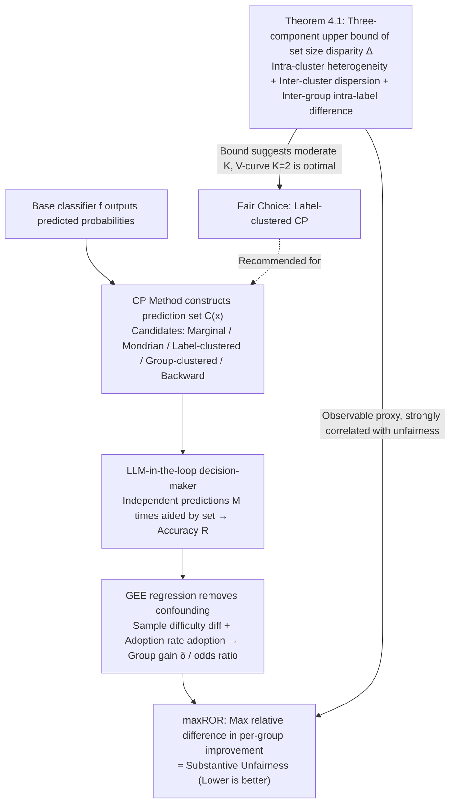

# Beyond Procedure: Substantive Fairness in Conformal Prediction

**Conference**: ICML2026  
**arXiv**: [2602.16794](https://arxiv.org/abs/2602.16794)  
**Code**: https://github.com/layer6ai-labs/llm-in-the-loop-conformal-fairness  
**Area**: AI Safety/Fairness  
**Keywords**: Conformal Prediction, Substantive Fairness, Prediction Set Size Disparity, Label Clustering, LLM Evaluator  

## TL;DR
This paper moves beyond the procedural fairness perspective of Conformal Prediction (CP). Starting from the substantive fairness of downstream decisions, it theoretically proves and experimentally validates that **equalizing prediction set sizes** (rather than equalizing coverage) is the procedural metric strongly correlated with substantive fairness. It proposes a scalable LLM-in-the-loop evaluation framework and uses label-clustered CP to effectively balance utility and fairness.

## Background & Motivation

**Background**: Conformal Prediction (CP) provides distribution-free uncertainty quantification for machine learning models by constructing prediction sets that satisfy political guarantees $\mathbb{P}[y \in \mathcal{C}(x)] \geq 1-\alpha$. Regarding fairness, existing research primarily focuses on **procedural fairness**, which ensures equalized coverage across demographic groups (Equalized Coverage), such as Mondrian CP which calibrates thresholds independently for each sensitive group.

**Limitations of Prior Work**: Equalized coverage $\neq$ downstream decision fairness. A CP method can achieve 90% coverage for all groups but produce compact, useful sets for one group while producing large, useless sets for another. Cresswell et al. (2025) found through human experiments that although Mondrian CP equalizes coverage, it exacerbates disparate impact in downstream prediction accuracy.

**Key Challenge**: Equalized Coverage and Equalized Set Size are two conflicting objectives—pursuing the former often comes at the expense of the latter, yet the latter is what truly affects downstream fairness. This link previously lacked theoretical explanation and large-scale empirical validation.

**Goal**: (1) Establish a scalable substantive fairness evaluation framework to replace expensive human experiments; (2) Clarify the quantitative relationship between procedural metrics and substantive fairness; (3) Theoretically analyze and verify why label-clustered CP effectively reduces set size disparity.

**Key Insight**: The authors observe that the "accuracy gain" obtained by downstream decision-makers from the prediction set is the true measure of fairness, rather than the statistical properties of the set itself. Using LLMs to approximate human decision-making behavior allows for low-cost, large-scale evaluation of group disparities in this downstream improvement.

**Core Idea**: Use an LLM-in-the-loop evaluator instead of human experiments to measure substantive fairness (maxROR). Decompose the prediction set size disparity into three interpretable components via a theoretical bound to guide the use of label-clustered CP to minimize downstream unfairness.

## Method

### Overall Architecture

The paper does not propose a new CP algorithm but rather answers a diagnostic question: which **observable procedural metric** truly predicts substantive fairness in downstream decisions? To this end, it views the entire pipeline in three layers: the base classifier $f$ outputs predicted probabilities, the CP method constructs a prediction set $\mathcal{C}(x)$ based on a calibration set, and finally, a decision-maker (human or LLM) makes a final prediction aided by the set. Crucially, fairness is not measured at the second layer (set construction) but at the third layer using the "accuracy gain" each group obtains from the prediction set. The approach is supported by a theoretical bound, an evaluation framework, and a CP selection strategy: the evaluation framework measures "substantive unfairness" as reproducible maxROR, and the theoretical bound explains which procedural metric to use as a proxy and which CP method to select.

### Key Designs

**1. Theoretical Decomposition of Set Size Disparity (Theorem 4.1): Translating "Substantive Fairness" into Optimizable Procedural Metrics**

Substantive fairness itself cannot be directly optimized as one cannot observe "if another CP were used, would the decision-maker be fairer." The breakthrough is proving that the inter-group set size disparity $\Delta_{a,b}$ (a fully observable procedural metric) is the proxy strongly correlated with downstream unfairness. Its upper bound for label-clustering mapping $h:\mathcal{Y}\to[K]$ is split into three interpretable components: (I) intra-cluster label heterogeneity $\max_k \epsilon_{k,a}$, characterizing size differences for different labels in the same cluster; (II) inter-cluster disparity $\max_k \mu_{k,a}-\min_k \mu_{k,a}$, characterizing the dispersion of expected set sizes across clusters; (III) inter-group intra-label difference $|\sum_y \mathbb{P}(Y=y\mid A=b)(r_{y,a}-r_{y,b})|$, characterizing size differences between two groups under the same label. This decomposition provides the logic for choosing $K$: if $K=1$ (Marginal CP), all labels are mixed, inflating term (I); if $K=|\mathcal{Y}|$, each rare label is calibrated individually, inflating term (II) due to small samples. Only a moderate $K=2$ typically minimizes both.

**2. LLM-in-the-loop Substantive Fairness Evaluation Framework: Replacing Human Experiments with Scalable Proxies**

To verify that "set size disparity predicts downstream unfairness," one must measure actual downstream accuracy improves across groups. Previously, this relied on human experiments—Cresswell et al. (2025) cost ~£1500 for 30k responses, which is not scalable. This paper uses LLMs to approximate human decision-makers: for each test sample $x_j$ and CP method $t$, the LLM predicts $M$ times with set assistance to get accuracy $R_{jt}$. GEE regression $\text{logit}(\mathbb{E}[R_{jt}])\sim \text{treat}_t\times\text{group}_j+\text{diff}_j+\text{adoption}_{jt}$ removes confounders like sample difficulty $\text{diff}_j$ and adoption rate $\text{adoption}_{jt}$ to extract group-specific gain $\delta_{t,a}$. Substantive unfairness $\text{maxROR}_t=\max_{a,b}(\text{OR}_{t,a}/\text{OR}_{t,b})-1$ is calculated based on odds ratios relative to a "no set" baseline. This reduces evaluation costs from ~£1500 to ~$1 while eliminating human fatigue and learning effects.

**3. Label-Clustered CP as a Fair Choice: Minimizing Set Size Disparity Without Sensitive Attributes**

Since set size disparity is the target to minimize, the question is which CP method performs best. Mondrian CP calibrates thresholds per sensitive group; while it equalizes coverage, it increases variance by splitting the calibration set, creating artificial size disparities. Label-clustered CP clusters $\mathcal{Y}$ into $K$ clusters based on difficulty, where each cluster shares a threshold $\hat{q}_k$. A label $y$ enters the set if $s(x_{\text{test}},y)\leq \hat{q}_{h(y)}$. Because thresholds are shared across groups and calibration data is pooled rather than split, it avoids explicit conditioning on sensitive attributes and the variance inflation of Mondrian CP. This explains why Mondrian and Group-Clustered CP exhibit the worst substantive unfairness in experiments, while label clustering is optimal.

## Key Experimental Results

### Main Results: Substantive Unfairness maxROR (%)

| CP Method | FACET | BiosBias | RAVDESS | ACSIncome | Average Rank |
|-----------|-------|----------|---------|-----------|--------------|
| Marginal | 9.0 | 6.9 | 11 | — | Medium |
| Mondrian | 38 | 8.1 | 79 | — | Worst |
| Label-Clustered | — | — | One of lowest | One of lowest | **Best** |
| Group-Clustered | High | — | High | — | Poor |
| Backward | Lowest | Lowest | Higher | Higher | Medium |

> Label-Clustered CP achieves significantly lower maxROR than Backward on RAVDESS and ACSIncome while providing higher accuracy gains. Mondrian and Group-Clustered exhibit the most severe unfairness on FACET and RAVDESS.

### Ablation Study: Alignment of LLM Evaluator with Human Experiments

| Evaluation Method | Dataset | Marginal maxROR% | Mondrian maxROR% | Ranking Consistent |
|-------------------|---------|-------------------|-------------------|--------------------|
| Human-in-the-loop | FACET | 26 | 51 | ✓ |
| Human-in-the-loop | BiosBias| 12 | 33 | ✓ |
| Human-in-the-loop | RAVDESS | 1.0| 28 | ✓ |
| LLM-in-the-loop   | FACET | 9.0| 38 | ✓ |
| LLM-in-the-loop   | BiosBias| 6.9| 8.1| ✓ |
| LLM-in-the-loop   | RAVDESS | 11 | 79 | ✓ |

> The LLM evaluator replicates the unfairness ranking of Mondrian > Marginal across all three datasets, validating its feasibility as a replacement for human experiments.

### Key Findings
- **Coverage gap is negatively correlated with maxROR**: Equalizing coverage increases downstream unfairness (negative slopes across 4 datasets).
- **Set size gap is positively correlated with maxROR**: Reducing set size disparity decreases downstream unfairness (positive slopes across 4 datasets).
- The set size disparity of label-clustered CP follows a **V-shaped curve** relative to the number of clusters $K$, with $K=2$ being optimal, validating Theorem 4.1.

## Highlights & Insights
- **Subversive Conclusion**: CP fairness research has long focused on Equalized Coverage. This paper argues this is the wrong goal—Equalized Set Size is the correct proxy for substantive fairness.
- **Low-cost Evaluation**: LLM-in-the-loop reduces fairness evaluation costs from £1500 to $1, enabling systematic comparisons across methods and modalities for the first time.
- **Theory-Empirical Loop**: The three-component decomposition of Theorem 4.1 was numerically validated on RAVDESS, with the V-shaped curve matching empirical results.
- **Practical Advice**: Avoid conditioning on demographic attributes (Mondrian). Instead, use label-clustered CP and use the set size gap to select the hyperparameter $K$.

## Limitations & Future Work
- The LLM evaluator differs from humans in **absolute values** (only qualitative ranking is consistent) and cannot fully replace human experiments.
- Only correlations were studied; a **causal relationship** from procedural metrics to substantive fairness has yet to be established (authors suggest controlling adoption rate for future work).
- The optimal $K$ for label-clustered CP does not perfectly align for set size gap and maxROR minimization.
- Experiments only covered 4 datasets and a single coverage level $\alpha=0.1$.

## Related Work & Insights
- **Cresswell et al. (2025)** first revealed the disparate impact of Mondrian CP via human experiments; this paper systematizes and significantly extends that work.
- **Ding et al. (2023)** proposed clustered conformal prediction for conditional coverage; this paper discovers its unexpected advantages for fairness.
- **Insight**: The LLM-in-the-loop paradigm can be extended to other AI fairness scenarios requiring human evaluation (e.g., recommender systems, IR).

## Rating
- Novelty: ⭐⭐⭐⭐ (Shifts CP fairness from procedural metrics to substantive outcomes; LLM replacement for human evaluation is a novel contribution)
- Experimental Thoroughness: ⭐⭐⭐⭐ (Comprehensive comparison of 5 methods across 4 modalities + theoretical validation)
- Writing Quality: ⭐⭐⭐⭐⭐ (Clear logic; theory, empirical evidence, and practical advice are well-integrated)
- Value: ⭐⭐⭐⭐ (High value in correcting the research direction for CP fairness)

<!-- RELATED:START -->

## Related Papers

- [\[ICLR 2026\] Moving Beyond Medical Exams: A Clinician-Annotated Fairness Dataset of Real-World Tasks and Ambiguity in Mental Healthcare](../../ICLR2026/llm_safety/moving_beyond_medical_exams_a_clinician-annotated_fairness_dataset_of_real-world.md)
- [\[ICML 2026\] COFT: Counterfactual-Conformal Decoding for Fair Chain-of-Thought Reasoning in Large Language Models](coft_counterfactual-conformal_decoding_for_fair_chain-of-thought_reasoning_in_la.md)
- [\[ACL 2026\] Gap-K%: Measuring Top-1 Prediction Gap for Detecting Pretraining Data](../../ACL2026/llm_safety/gap-k_measuring_top-1_prediction_gap_for_detecting_pretraining_data.md)
- [\[ACL 2026\] Beyond Explicit Refusals: Soft-Failure Attacks on Retrieval-Augmented Generation](../../ACL2026/llm_safety/beyond_explicit_refusals_soft-failure_attacks_on_retrieval-augmented_generation.md)
- [\[ACL 2026\] Beyond End-to-End: Dynamic Chain Optimization for Private LLM Adaptation on the Edge](../../ACL2026/llm_safety/beyond_end-to-end_dynamic_chain_optimization_for_private_llm_adaptation_on_the_e.md)

<!-- RELATED:END -->
