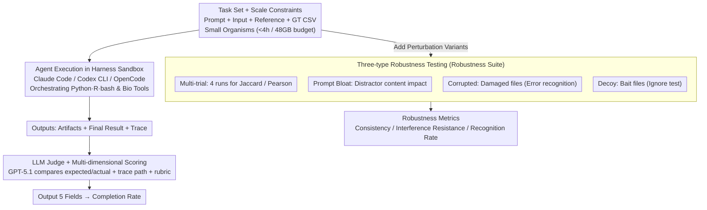

# BioAgent Bench: An AI Agent Evaluation Suite for Bioinformatics

**Conference**: ICML 2026  
**arXiv**: [2601.21800](https://arxiv.org/abs/2601.21800)  
**Code**: https://github.com/bioagent-bench/bioagent-bench  
**Area**: LLM Agent / Benchmark / Bioinformatics  
**Keywords**: agent evaluation, bioinformatics pipeline, LLM-as-a-judge, robustness perturbation testing

## TL;DR
BioAgent Bench introduces an end-to-end evaluation suite for "running bioinformatics pipelines with LLM agents." It comprises 10 real-world bioinformatics tasks evaluated across 10 frontier/open-weight models and 3 agent harnesses. Combined with LLM-based scoring and three types of perturbation tests (corrupted, decoy, and prompt-bloat), the study reveals that while frontier models can complete over 90% of pipelines, their robustness remains a significant concern.

## Background & Motivation
**Background**: Mature benchmarks already exist for LLM agents in software engineering (SWE-bench) and general tool-use (AgentBench, ToolBench). In the biomedical domain, benchmarks like BioML-bench, LAB-Bench, and BixBench have also emerged. However, these benchmarks either simplify tasks into QA/code generation or focus on "data analysis" rather than the "execution of complete pipelines."

**Limitations of Prior Work**: Real-world bioinformatics workflows are highly complex, requiring the chaining of command-line tools, management of heterogeneous file formats, and interpretation of intermediate outputs. Evaluation is challenging because multiple valid pipelines can exist for the same dataset, parameter choices significantly impact results, and many steps cannot be strictly judged using a pass/fail binary. Simply adopting the hard-matching evaluation style of SWE-bench is infeasible.

**Key Challenge**: (1) Real bioinformatics tasks are long-running (hours) and resource-intensive (dozens of GBs of RAM), whereas benchmarks require reproducibility and scalability. (2) The existence of multiple valid solutions creates a conflict between "automated scoring" and "strict ground truth." (3) Sensitive clinical/IP data cannot be sent to closed-source APIs, necessitating the evaluation of open-weight models, which remain significantly weaker than frontier models.

**Goal**: (i) To create an end-to-end pipeline-style bioinformatics task suite that can be completed within a reasonable resource budget (<4h, <48GB). (ii) To design a scoring protocol using LLMs as judges that tolerates multiple solutions. (iii) To add perturbation tests beyond vanilla execution to examine agent robustness against corrupted data, decoy files, and prompt bloating. (iv) To systematically compare the performance of 5 closed-source and 5 open-source models under 3 different harnesses.

**Key Insight**: By deliberately limiting task scales to "small organisms" (bacteria, viruses, fungi), reference data can be directly packaged as input files. This circumvents infrastructure issues such as agents needing to download dozens of GBs of genomic data, allowing the evaluation to focus strictly on pipeline orchestration capabilities.

**Core Idea**: Use "task prompts + input data + reference data + expected CSV/TSV output formats" as a unified task specification. An LLM judge compares the execution trace and outcomes to provide step-level completion scores. This is supplemented by three perturbation tests to detect whether "high-level pipeline construction" and "low-level step-level reasoning" are both successfully achieved.

## Method

### Overall Architecture
BioAgent Bench aims to answer a practical question: if an LLM agent is placed into a real bioinformatics workflow, can it consistently and successfully run the pipeline from start to finish? The benchmark consists of three interlocking components. The **Task Set** provides 10 end-to-end tasks covering subfields like RNA-seq, variant calling, metagenomics, transcript quantification, and experimental evolution, all packaged into a unified specification. The **Evaluation Harness** runs the agent in a hashed sandbox directory using one of three harnesses: Claude Code, Codex CLI, or OpenCode. The agent can invoke standard Python packages or specialized bioinformatics tools. Finally, intermediate artifacts and the final result are handed to the grader. The **LLM Grader** (GPT-5.1) ingests input/reference paths, expected outcomes, actual agent outcomes, execution traces (file paths only), and a grading rubric to output five fields: `steps_completed`, `steps_to_completion`, `final_result_reached`, `results_match`, and `f1_score`. The primary metric is the completion rate: "completed necessary steps / total steps." Additionally, a robustness suite is layered on top to disentangle the ability to "build a pipeline" from "understanding biological reasoning."

### Key Designs

**1. Task Set & Scale Constraints: Enabling end-to-end pipelines within a consumer GPU budget**

Typical bioinformatics workflows consume hours and dozens of GBs of memory, often requiring agents to download massive reference genomes, which hinders large-scale, reproducible evaluation. BioAgent Bench addresses this by constraining task scales to <4h and <48GB using "small organisms": mouse Alzheimer models, E. coli experimental evolution, and dolphin viral metagenomics. Because these reference datasets are small enough to be included in the task input files, infrastructure hurdles are bypassed, focusing the evaluation on pipeline orchestration. The 10 tasks span bulk/single-cell RNA-seq, comparative genomics, variant calling, and transcript quantification, utilizing mixed languages (Python/R/bash). Four tasks are "verifiable," allowing binary pass/fail judging. The benchmark is positioned as "software engineering-oriented" rather than "biological data analysis-oriented" to facilitate future RL or distillation training, albeit at the cost of excluding human-scale workflows.

**2. LLM Judge + Multi-dimensional Scoring Protocol: Using soft scoring instead of hard matching**

Bioinformatics tasks are inherently multi-solution; for example, variant calling can be performed via GATK4 or DeepVariant, making exact string matching against a single ground truth ineffective. BioAgent Bench employs GPT-5.1 as a grader, providing it with input paths, expected CSVs, actual agent CSVs, file path traces, and a rubric. The rubric prioritizes "pipeline completion" over numerical precision. Two key innovations are: (1) allowing the grader to read the trace (path tree) to grant partial credit if the high-level pipeline is correct even if the output format is slightly off; and (2) exposing only file paths in the trace to protect sensitive clinical/IP data while reducing token consumption.

**3. Three-type Robustness Testing: Distinguishing between "successful execution" and "reliability"**

The authors argue that high-level pipeline construction $\neq$ reliable step-level reasoning. To detect if agents are merely pattern matching, they introduce three perturbations. **Multi-trial Consistency** runs the same task 4 times to calculate Jaccard (for classification results) and Pearson (for numerical results) coefficients, checking the stability of intermediate decisions. **Prompt Bloat** injects large amounts of irrelevant content to observe the change in completion rate ($\Delta$). **Corrupted Input** intentionally damages FASTQ/BAM files; an ideal agent should identify and report the error. **Decoy Input** adds unused bait files to the directory; a robust agent should ignore them. These independent probes pinpoint exactly where an agent fails.

### Loss & Training
As this is a benchmark, no training was performed. For evaluation, GPT-5.2 in the Codex CLI harness was used as the primary robustness assessment model, with "high" reasoning effort enabled by default.

## Key Experimental Results

### Main Results
Average completion rate across 10 tasks in the vanilla setting (Codex CLI harness):

| Model Type | Model | Avg Completion% |
|----------|------|------------------|
| Closed-source Frontier | Claude Opus 4.5 | **100** |
| Closed-source Frontier | Gemini 3 Pro / GPT-5.2 / Sonnet 4.5 | >90 |
| Best Open-weight | GLM-4.7 | 82.5 |
| Other Open-weight | Various | As low as ~65 |

**Planning vs. Execution**: High-level pipeline planning scores (graded 1-5 by GPT-5.1) correlate with end-to-end completion rates (Pearson $r=0.61$), but the correlation is not decisive. For instance, Gemini-Pro-3 showed weaker planning scores but stronger execution, suggesting that the bottleneck for open-weight models lies more in "multi-turn agentic capability" than "domain knowledge."

### Ablation Study
Multi-trial Stability (GPT-5.2 in Codex CLI, 4 trials per task):

| Task | Jaccard | Pearson | Note |
|------|---------|---------|------|
| transcript-quant | 1.000 | 1.000 | Fully deterministic |
| cystic-fibrosis | 1.000 | NA | High consistency |
| deseq | 0.978 | 0.995 | Highly stable |
| viral-metagenomics | 0.667 | 1.000 | Numerical stability with classification jitter |
| metagenomics | 0.395 | 0.746 | Moderate |
| alzheimer | 0.160 | 0.219 | Unstable |
| comparative-genomics | 0.004 | NA | Almost entirely inconsistent |
| evolution | 0.000 | NA | Completely inconsistent |

The average Jaccard of 0.43 and Pearson of 0.73 indicate that classification results overlap less than half the time when the same agent runs the same task 4 times.

Perturbation Tests (GPT-5.2 single trial, $\Delta\%$ represents completion change after prompt-bloat):

| Task | Corrupted Recognized? | Resists Decoy? | $\Delta$ completion (%) |
|------|-------------------|-------------|------------------|
| alzheimer-mouse | ✗ | ✗ | -12.5 |
| comparative-genomics | ✗ | ✓ | -20.0 |
| deseq | ✓ | ✗ | **-100.0** |
| evolution | ✓ | ✗ | +75.0 |
| giab | ✓ | ✗ | — |

### Key Findings
- **Frontier models do not require complex scaffolding**: Claude Opus 4.5 achieved 100% completion using a basic Codex CLI, challenging the assumption that specialized agentic frameworks are always necessary.
- **Pipeline construction $\neq$ step-level reasoning**: Significant variance between trials (e.g., in comparative-genomics) suggests that even when an agent "completes" a task, its intermediate decisions (parameters, normalization) are unstable.
- **Low recognition of corrupted data**: Most agents fail to identify damaged inputs and proceed to produce incorrect results. DESeq was an exception, where identification led to an error that dropped completion to 0%, which is actually more desirable than "hallucinating" a result.
- **Poor decoy robustness**: Agents are easily misled by bait files, lacking the "a priori" judgment to select the correct files.
- **Value of open-weight models in privacy scenarios**: While frontier models are stronger, open-weight models are essential for sensitive patient data. This study provides the first systematic baseline for these models in bioinformatics.

## Highlights & Insights
- **Elegant trade-off between task scale and feasibility**: Selecting small organisms to bypass infrastructure overhead is the key to making this agent benchmark scalable.
- **Trace-based LLM grading**: Evaluating the file path tree protects data and reduces costs while remaining more intuitive than hard binary matching.
- **Three-pronged perturbation design**: Separating cognition (corrupted), attention (decoy), and robustness (bloat) provides precise failure mode localization.
- **First systematic comparison**: The study provides a leaderboard of 10 closed and open-source models that the community can directly utilize.

## Limitations & Future Work
- **Small task scale**: The exclusion of human-scale workflows (e.g., 30× WGS) means infrastructure steps like "finding/downloading references" are skipped, limiting generalization to production environments.
- **LLM grader bias**: Since the grader is also an LLM (GPT-5.1/5.2), it may favor certain trace patterns, and evaluating LLMs with same-generation LLMs creates a circular dependency.
- **Single-trial perturbation**: Relying on a single trial for robustness results introduces statistical noise. For some tasks, consistent variance across 4 trials was higher than the perturbation effect.
- **Open-weight evaluation gaps**: Robustness tests were not fully executed on open-weight models, which is a missed opportunity.
- **Lack of quantitative failure analysis**: Observations like "frontier models get stuck in loops" are mentioned without quantitative metrics like trace length or loop counts.

## Related Work & Insights
- **vs. SWE-bench (Jimenez et al., 2024)**: While SWE-bench uses strict unit test pass/fail, BioAgent Bench uses LLM-judge "soft" scoring with partial credit, which is more suitable for scientific computing.
- **vs. BioML-bench (Miller et al., 2025)**: BioML focuses on ML processes (protein engineering, imaging); BioAgent Bench focuses on bioinformatics toolchain orchestration.
- **vs. LAB-Bench (Laurent et al., 2024)**: LAB-Bench targets research skills via multiple-choice questions; BioAgent Bench emphasizes actual execution.
- **vs. BixBench (Mitchener et al., 2025)**: BixBench focuses on data reasoning; BioAgent Bench focuses on end-to-end execution and robustness.
- **Insight**: The protocol design—LLM judge, scale constraints, and three-type perturbations—is a viable blueprint for creating scalable agent benchmarks in other complex domains like quantum chemistry or geoscience.

## Rating
- Novelty: ⭐⭐⭐ Practical protocol, though LLM-judge paradigms are not entirely ground-breaking.
- Experimental Thoroughness: ⭐⭐⭐ Good coverage of tasks and models, but the single-trial perturbation and lack of open-weight robustness tests are drawbacks.
- Writing Quality: ⭐⭐⭐⭐ Concepts such as task, trial, grader, and harness are strictly defined and clear.
- Value: ⭐⭐⭐⭐ Provides the first systematic answer to the feasibility of using agents for bioinformatics, offering high practical value for deployment.

<!-- RELATED:START -->

## Related Papers

- [\[ACL 2026\] ACIArena: Toward Unified Evaluation for Agent Cascading Injection](../../ACL2026/llm_safety/aciarena_toward_unified_evaluation_for_agent_cascading_injection.md)
- [\[ICML 2026\] Watermarking LLM Agent Trajectories (ACTHOOK)](watermarking_llm_agent_trajectories.md)
- [\[ICLR 2026\] Unlearning Evaluation through Subset Statistical Independence](../../ICLR2026/llm_safety/unlearning_evaluation_through_subset_statistical_independence.md)
- [\[ACL 2026\] Responsible Federated LLMs via Safety Filtering and Constitutional AI](../../ACL2026/llm_safety/responsible_federated_llms_via_safety_filtering_and_constitutional_ai.md)
- [\[ACL 2026\] PIArena: A Platform for Prompt Injection Evaluation](../../ACL2026/llm_safety/piarena_a_platform_for_prompt_injection_evaluation.md)

<!-- RELATED:END -->
