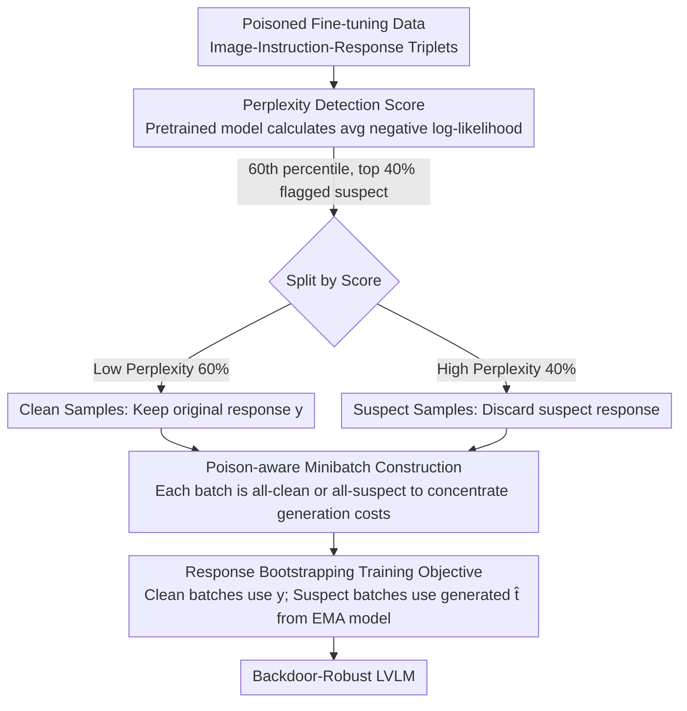

# BYORn: Bootstrap Your Own Responses to Defend Large Vision-Language Models Against Backdoor Attacks

**Conference**: ICML 2026  
**arXiv**: [2606.02947](https://arxiv.org/abs/2606.02947)  
**Code**: https://github.com/ivansabolic/BYORn  
**Area**: LLM Security  
**Keywords**: Backdoor defense, vision-language models, robust fine-tuning, response bootstrapping, data poisoning

## TL;DR

BYORn identifies poisoned samples by detecting high-perplexity target responses that are semantically inconsistent with the input and dynamically replaces them with clean responses generated by the model itself. This breaks the association between backdoor triggers and malicious outputs, reducing the Attack Success Rate (ASR) by an average of 40 percentage points while maintaining clean task performance.

## Background & Motivation

**Background**: Supervised Fine-Tuning (SFT) is the primary method for adapting pretrained Large Vision-Language Models (LVLMs) to downstream tasks. By training on annotated image-instruction-response triplets, models achieve strong performance in tasks such as image captioning and visual question answering.

**Limitations of Prior Work**: Recent studies reveal that SFT is highly vulnerable to backdoor attacks. Attackers can inject a small number of poisoned samples into the fine-tuning dataset (e.g., embedding visual triggers in images, inserting specific words in instructions, or replacing responses with malicious content) to force the model to produce specified malicious outputs when encountering triggers during inference. Existing defense methods are either designed specifically for image classification (unable to handle open-ended generation), focus only on unimodal triggers (e.g., ONION only detects text triggers), or assume specific trigger patterns (unable to handle diverse attacks).

**Key Challenge**: In open-ended multimodal generation scenarios, defense methods must simultaneously handle triggers in both visual and textual modalities without relying on prior assumptions about trigger types. This renders traditional defense strategies from classification scenarios ineffective.

**Key Insight**: The authors observe that the target responses of poisoned samples are typically semantically inconsistent with their corresponding image-text inputs, resulting in low conditional likelihood (high perplexity) under the pretrained model. This distributional characteristic provides a foundation for general detection without assuming trigger types.

**Core Idea**: Use perplexity scores from the pretrained model to detect suspicious poisoned samples, then replace the targets of flagged samples with clean responses generated by an EMA version of the model to "bootstrap" clean training signals.

## Method

### Overall Architecture

BYORn aims to "neutralize" poisoned samples mixed into fine-tuning data without knowing what the triggers look like. It follows a two-step process: first, it calculates a perplexity score for each sample's response using the pretrained model and splits the data into "clean" and "suspect" pools based on a percentile threshold; second, it performs robust fine-tuning where clean samples are trained on original responses, while suspect samples use responses generated on-the-fly by the model's EMA version. Samples are grouped into specialized minibatches to save generation overhead. The optimization objective of this pipeline can be proven equivalent to minimizing an upper bound of the population risk on the clean data distribution.

### Key Designs

**1. Perplexity Detection Score: Identifying poisoning via "Semantic Mismatch" without assuming trigger types**

The hardest part of backdoor defense is the variety of triggers—they might be hidden in images, instruction words, or a mix of both. Traditional methods fail when their assumed trigger patterns are bypassed. BYORn ignores triggers and focuses on responses: malicious targets in poisoned samples (e.g., outputting "banana" regardless of image content) are semantically detached from the input, causing the pretrained model to assign low likelihood. For each sample $(\mathbf{x}, \mathbf{q}, \mathbf{y})$, the average negative log-likelihood of the target response is calculated as $s(\mathbf{y}|\mathbf{x},\mathbf{q},\theta) = -\frac{1}{K}\sum_{l=1}^{K}\ln p_\theta(y_l|\mathbf{y}_{<l},\mathbf{x},\mathbf{q})$ (where $K$ is the number of tokens, used for normalization). By taking the 60th percentile threshold $\delta_{0.6}$, the 40% most perplexing samples are flagged. This aggressive threshold ensures high recall for true poisoned samples, as misidentified clean samples are "rescued" during bootstrapping.

**2. Response Bootstrapping Training Objective: Replacing responses instead of deleting suspicious samples**

A naive defense is to discard suspect samples (represented as BYORn-F in ablations), but removing 40% of data degrades clean task performance. BYORn replaces only the response while keeping the input. It introduces a latent clean response $\mathbf{t}$ and a poisoning indicator $u$. Clean samples use original responses $\mathbf{y}$, while suspect samples use alternative responses $\hat{\mathbf{t}}$ sampled on-the-fly from an EMA version of the model $\theta_{\text{EMA}}^t = \lambda \cdot \theta_{\text{EMA}}^{t-1} + (1-\lambda) \cdot \theta^{t-1}$. The mixed objective is $\tilde{\mathcal{R}}_{\text{BY}} = \frac{1}{|\mathcal{D}_p|}\sum[(1-P_{\hat{u}})\cdot\mathcal{L}(\theta|\mathbf{y},\cdot) + P_{\hat{u}}\cdot\mathcal{L}(\theta|\hat{\mathbf{t}},\cdot)]$. This severs the link between triggers and malicious outputs while retaining image-instruction signals for learning. Using EMA ensures stable replacement quality. Theoretically, using the Donsker-Varadhan upper bound and Hoeffding's Lemma, this objective's gradient equates to the gradient of the population risk upper bound on clean data.

**3. Poison-aware Minibatch Construction: Concentrating generation costs**

Bootstrapping requires autoregressive decoding for suspect samples, which is expensive. Random mixing would require generation at every training step, increasing time by over 6x. BYORn performs detection once before training and groups samples into minibatches that are either entirely clean or entirely suspect. Clean batches skip generation, while suspect batches process generation in bulk. This reduces overhead from 6x to 2.2x without sacrificing precision.

## Key Experimental Results

### Main Results: Image Captioning (Average of 4 Attacks)

| Model | Defense Method | Flickr CIDEr↑ | Flickr ASR↓ | COCO CIDEr↑ | COCO ASR↓ |
|------|---------|---------------|-------------|-------------|-----------|
| LLaVA | SFT (No Defense) | 51.4 | 57.3% | 74.9 | 48.0% |
| LLaVA | ONION | 51.3 | 23.0% | 74.8 | 20.7% |
| LLaVA | BYE | 54.7 | 62.4% | 80.6 | 54.8% |
| LLaVA | **BYORn-F** | 42.4 | **0.3%** | 60.6 | 1.6% |
| LLaVA | **BYORn** | **62.0** | **0.0%** | **90.9** | **0.4%** |
| Qwen-VL | SFT | 60.7 | 100.0% | 66.9 | 89.8% |
| Qwen-VL | **BYORn** | 52.2 | **2.1%** | 59.6 | **2.7%** |
| InternVL | SFT | 57.3 | 99.8% | 64.9 | 71.6% |
| InternVL | **BYORn** | 56.0 | **0.8%** | 65.1 | **2.8%** |

### Ablation Study

| Configuration | CIDEr↑ | ASR↓ | Description |
|---------|--------|------|------|
| BYORn-F (Filtering Only) | 42.4 | 0.3% | Discarding 40% of data causes CIDEr drop |
| BYORn (Full Method) | 62.0 | 0.0% | Bootstrapping restores performance, even exceeding SFT |
| Threshold p=0.3 | 55.6 | 0.0% | Flagging too many clean samples slightly lowers CIDEr |
| Threshold p=0.6 (Default) | 62.2 | 0.0% | Optimal balance point |
| Threshold p=0.95 | 60.4 | 1.1% | Low recall but BYORn remains robust; BYORn-F fails (ASR 57.6%) |
| Poisoning Rate 1% | 62.0 | 0.0% | Stable across poisoning rates |
| Poisoning Rate 50% | 61.5 | 0.2% | Effective even under extreme poisoning |
| Adaptive Attack (Patch) | 62.0 | 1.6% | Robust under semantically aligned triggers |
| Adaptive Attack (Adv) | 60.1 | 0.2% | Robust under PGD-optimized triggers |

### Key Findings

- BYORn achieves Pareto optimality (best tradeoff between robustness and generalization) across all models and attacks, even surpassing no-defense SFT CIDEr on LLaVA (62.0 vs 51.4).
- Even with only 50% detector recall (p=0.95), BYORn keeps ASR at 1.1%, while BYORn-F's ASR spikes to 57.6%. This demonstrates the inherent robustness of the bootstrapping objective.
- BYORn remains effective against three adaptive attacks (semantically aligned triggers, PGD perturbations, and near clean-label attacks), with ASR not exceeding 8.4%.

## Highlights & Insights

- **Perplexity as a Safety Signal**: Utilizing the perplexity score of a pretrained model as a poisoning detector requires no clean reference set or trigger assumptions. This approach can be transferred to any scenario requiring anomaly detection in training data (e.g., label noise filtering).
- **Bootstrapping Over Simple Filtering**: The core advantage of BYORn over BYORn-F is data retention—replacing suspect targets with model-generated responses breaks backdoor associations while preserving visual-textual input signals. The jump in CIDEr from 42.4 to 62.0 validates this design.
- **Theoretical Guarantees**: Deriving the BYORn objective through the Donsker-Varadhan upper bound provides theoretical guidance for hyperparameter selection, such as thresholds and EMA decay rates.

## Limitations & Future Work

- Defense currently relies on the assumption of semantic inconsistency between poisoned responses and inputs; true clean-label attacks (where malicious responses are semantically plausible) remain an open challenge.
- The quality of bootstrapped responses depends on the generation capabilities of the EMA model, which may introduce noise in early training or for smaller models.
- Although minibatch strategies reduce overhead, training time for BYORn is still approximately 3x standard SFT (including 20 min detection + ~135 min per epoch vs 45 min).
- The study covers four main attacks and three adaptive attacks but has not tested multi-step attacks or multi-turn dialogue backdoors.

## Related Work & Insights

- **ONION**: Only detects textual trigger words; ineffective against visual triggers.
- **BYE**: Filters based on attention scores; fails against full-image triggers (e.g., Blend, VL-Trojan).
- **VL-Trojan / DualKey / BadNets / Blend**: The four representative attacks evaluated, covering patch, full-image, and multimodal triggers.
- **Insight**: The "detect-and-replace" framework can be extended to LLM instruction tuning safety—detecting malicious annotations in RLHF data via perplexity and replacing them with self-generated responses.

<!-- RELATED:START -->

## Related Papers

- [\[ACL 2026\] ATAAT: Adaptive Threat-Aware Adversarial Tuning Framework against Backdoor Attacks on Vision-Language-Action Models](../../ACL2026/llm_safety/ataat_adaptive_threat-aware_adversarial_tuning_framework_against_backdoor_attack.md)
- [\[CVPR 2026\] Towards Robust Multimodal Large Language Models Against Jailbreak Attacks](../../CVPR2026/llm_safety/towards_robust_multimodal_large_language_models_against_jailbreak_attacks.md)
- [\[ACL 2025\] Merge Hijacking: Backdoor Attacks to Model Merging of Large Language Models](../../ACL2025/llm_safety/merge_hijacking_backdoor_attacks_to_model_merging_of_large_language_models.md)
- [\[ICML 2026\] TCAP: Tri-Component Attention Profiling for Unsupervised Backdoor Detection in MLLM Fine-Tuning](tcap_tri-component_attention_profiling_for_unsupervised_backdoor_detection_in_ml.md)
- [\[ACL 2025\] ELBA-Bench: An Efficient Learning Backdoor Attacks Benchmark for Large Language Models](../../ACL2025/llm_safety/elba-bench_an_efficient_learning_backdoor_attacks_benchmark_for_large_language_m.md)

<!-- RELATED:END -->
