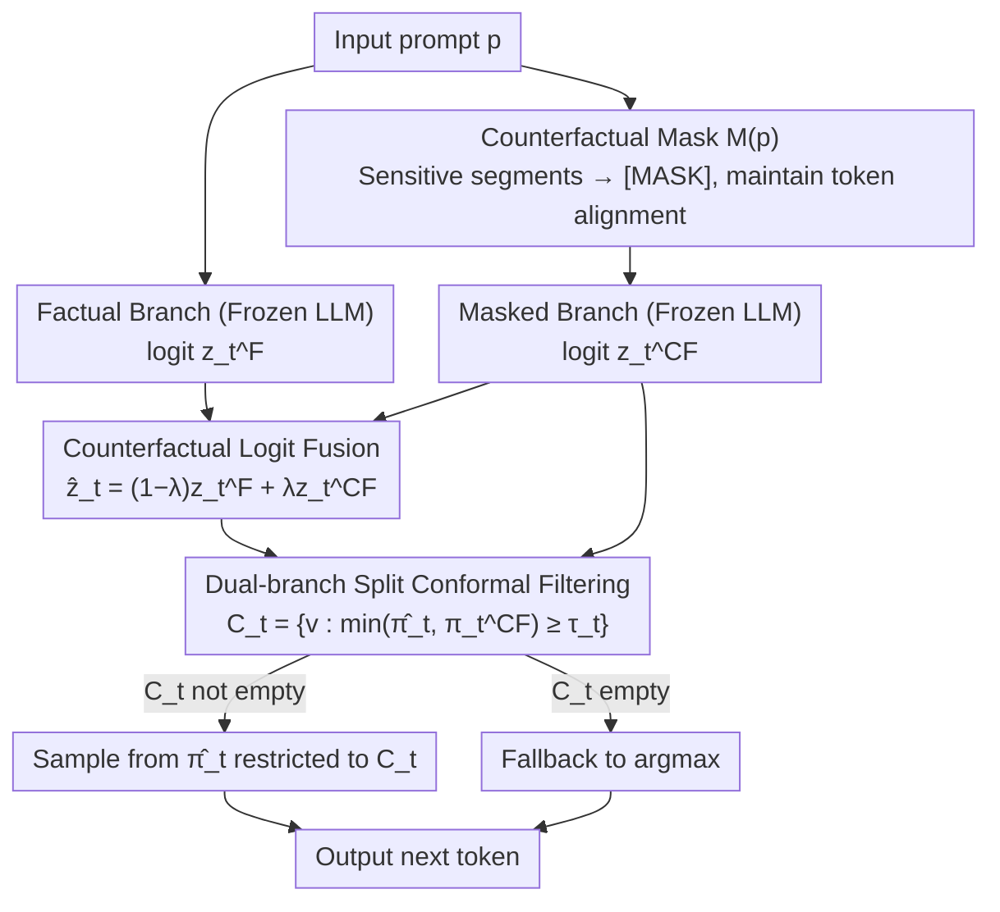

# COFT: Counterfactual-Conformal Decoding for Fair Chain-of-Thought Reasoning in Large Language Models

**Conference**: ICML 2026  
**arXiv**: [2605.30641](https://arxiv.org/abs/2605.30641)  
**Code**: None  
**Area**: LLM Safety/Fairness  
**Keywords**: Counterfactual Fairness, Conformal Prediction, CoT Debiasing, Decoding-time Intervention, Training-free Debiasing  

## TL;DR

COFT achieves step-by-step token-level counterfactual fairness on frozen LLMs in a training-free and gradient-free manner by constructing counterfactual mask branches during decoding, fusing logits with the original branch, and filtering tokens via dual-branch split conformal prediction. It reduces bias metrics by 30–55% (median 38%) with almost no loss in task performance.

## Background & Motivation

**Background**: Large Language Models (LLMs) expose and amplify social biases from training data token-by-token during Chain-of-Thought (CoT) generation—even if the final answer appears neutral, the reasoning trajectory may contain harmful stereotypical associations.

**Limitations of Prior Work**: Existing debiasing solutions have limitations. Data cleaning and fine-tuning require retraining and may harm general capabilities; auxiliary classifier-guided methods (e.g., DExperts, GeDi) depend on external models and inherit their blind spots; representation space debiasing (e.g., INLP) performs global linear projections, failing to adapt to specific prompt semantics and potentially deleting legitimate content.

**Key Challenge**: The aforementioned methods lack the simultaneous satisfaction of two critical attributes: (1) **Step-by-step statistical guarantees**—at each decoding step, there is no guarantee that the selected token remains stable after sensitive attribute replacement; (2) **Local counterfactual parity**—fairness goals are typically defined at the aggregate level rather than being token-wise operations.

**Goal**: Design a decoding-time framework that simultaneously achieves three attributes: token-wise counterfactual invariance, gradient-free/model-agnostic operation (suitable for frozen weights), and auditable step-by-step marginal guarantees.

**Key Insight**: Construct both original (factual) and masked (counterfactual) branches for each prompt, locating and eliminating sensitive attribute-driven biases by contrasting their logit distribution differences. Then, leverage the distribution-free guarantees of Conformal Prediction to filter unsafe tokens.

**Core Idea**: Integrate counterfactual masking, logit convex interpolation fusion, and dual-branch conformal filtering to realize training-free, token-wise counterfactual fair decoding.

## Method

### Overall Architecture

COFT aims to solve the problem where frozen LLMs expose and amplify social biases while generating reasoning chains token-by-token, without retraining, external classifiers, or losing auditable statistical guarantees. It treats each prompt as existing in both "original" and "de-sensitized" worlds simultaneously, processing each decoding step through three sequential stages: first, replacing sensitive words in the prompt with neutral sentinels to obtain a masked prompt $\tilde{p}=M(p)$; second, performing convex interpolation fusion on the factual and masked logit sets to attenuate attribute-driven bias; and finally, filtering candidates using dual-branch conformal thresholds calibrated offline, sampling only from tokens supported with high probability by both worlds. The entire pipeline requires only one additional cached forward pass, without touching gradients, modifying weights, or relying on auxiliary models.

### Key Designs

**1. Counterfactual Masking: Constructing a "de-sensitized" branch strictly aligned with the original prompt**

To perform token-wise counterfactual comparison, a control world identical in everything except the sensitive attribute is necessary. COFT defines a deterministic masking operator $M$ that replaces each sensitive segment $s\in S$ (identifiers for gender, race, etc.) in the prompt with neutral sentinel tokens `[MASK]`. The key here is **maintaining the token count**: if a sensitive segment is split into $k$ tokens by the tokenizer, it is replaced by $k$ sentinel copies. This ensures the factual and masked branches are strictly aligned at every absolute position, allowing for bit-wise $z_t^F \leftrightarrow z_t^{CF}$ paired comparisons. "Masking" is chosen because deleting segments breaks syntax and attention geometry, while replacing with another identity injects new bias; masking preserves structure while severing direct lexical associations with sensitive attributes.

**2. Counterfactual Logit Fusion: Mechanically erasing attribute-driven probability bias at the logit source**

With two aligned branches, the difference between logits at the same position $\Delta_t = z_t^F - z_t^{CF}$ characterizes "how much this step is driven by sensitive attributes." Rather than explicitly modeling this bias, COFT performs convex interpolation to obtain fused logits $\hat{z}_t = (1-\lambda) z_t^F + \lambda z_t^{CF}$, where $\lambda\in[0,1]$ controls debiasing strength. In probability space, this is equivalent to a normalized geometric mixture of the two distributions $\hat{\pi}_t(v) \propto (\pi_t^F(v))^{1-\lambda}(\pi_t^{CF}(v))^{\lambda}$, where larger $\lambda$ shifts closer to the de-sensitized world. $\lambda$ is selected via the elbow point of the bias-utility Pareto curve on a validation set, typically falling around $\lambda\approx 0.6$. Placing fusion before filtering is intentional: suppressing spurious amplification at the logit level allows the subsequent conformal filtering to operate on already aligned high-probability regions, reducing false rejections and overly conservative thresholds.

**3. Dual-branch Split Conformal Filtering: Providing distribution-free statistical certification for each sampling set**

Fusion alone is insufficient—it reduces bias but lacks the guarantee that "this token is also stable under counterfactuals." COFT designs a dual-branch non-conformity score $s_t(v) = 1 - \min\{\hat{\pi}_t(v), \pi_t^{CF}(v)\}$, where the score is low only if token $v$ has sufficiently high probability in both the fused and masked distributions. In the offline phase, this score is calculated for all ground-truth next-tokens on a calibration set, using the $(1-\alpha)$ quantile $q_t$ as the threshold. During online decoding, a candidate set $C_t = \{v : \min\{\hat{\pi}_t(v), \pi_t^{CF}(v)\} \geq \tau_t\}$ (where $\tau_t = 1 - q_t$) is constructed. Sampling then occurs from the conditional distribution of $\hat{\pi}_t$ restricted to $C_t$, falling back to $\arg\max$ if $C_t$ is empty. Leveraging the distribution-free nature of split conformal prediction, a marginal coverage guarantee is obtained at each step. While single-branch conformal prediction only considers the factual world and cannot guarantee counterfactual stability, the dual-branch approach forces tokens to be supported by both worlds, operationalizing "counterfactual parity" as a standard quantile calibration problem.

## Key Experimental Results

### Main Results: Bias Metrics

| Dataset | Metric | Vanilla | SDD | DExperts | DT-CD | COFT | Gain (vs DT-CD) |
|--------|------|---------|-----|----------|-------|------|----------------|
| StereoSet (LLaMA-13B) | Bias↓ | 0.41 | 0.36 | 0.33 | 0.31 | **0.26** | -16% |
| CrowS-Pairs (LLaMA-13B) | Acc↑ | 58.7 | 60.1 | 61.0 | 61.3 | **63.5** | +2.2 |
| BBQ (LLaMA-13B) | Bias Rate↓ | 0.27 | 0.22 | 0.20 | 0.19 | **0.14** | -26% |
| BOLD (LLaMA-13B) | Toxicity↓ | 0.123 | 0.105 | 0.099 | 0.094 | **0.079** | -16% |
| Utrecht (LLaMA-13B) | DP Gap↓ | 0.184 | 0.153 | 0.149 | 0.141 | **0.118** | -16% |
| COMPAS (LLaMA-13B) | Bias Gap↓ | 0.161 | 0.147 | 0.141 | 0.136 | **0.119** | -12% |
| BBQ (Mistral-7B-Inst) | Bias Rate↓ | 0.24 | 0.20 | 0.18 | 0.17 | **0.12** | -29% |
| Utrecht (Mistral-7B-Inst) | DP Gap↓ | 0.173 | 0.146 | 0.141 | 0.136 | **0.112** | -18% |

### Ablation Study

| Configuration | BiasAvg↓ | UtilityAvg↑ | Description |
|------|----------|-------------|------|
| COFT (Full) | **0.129** | 68.0 | All three stages active |
| w/o Fusion (CP only) | 0.171 | 68.2 | Bias metrics increase by 32% without logit fusion |
| Single-branch CP (Factual only) | 0.158 | 68.1 | Cannot guarantee counterfactual stability |
| Fusion only (No CP) | 0.149 | 67.9 | Lacks statistical certification, residual bias remains |

### Key Findings

- **Logit fusion contributes the most**: Removing fusion alone causes BiasAvg to rise from 0.129 to 0.171 (+33%), making it the most significant component as it mechanically attenuates attribute-driven log-odds bias at the source.
- **Dual-branch vs. Single-branch CP**: Dual-branch CP reduces bias by an additional 18% compared to single-branch (0.158→0.129), validating the necessity of requiring tokens to be supported by both worlds.
- **Negligible task performance loss**: COFT maintains performance within ≤ 0.2 points of Vanilla on GSM8K, StrategyQA, ARC-easy, and PIQA; PPL and MAUVE also show almost no difference.
- **Controllable efficiency overhead**: Approximately 10.2% additional throughput overhead (equivalent to one cached forward pass), with peak VRAM increasing by ≤ 0.8 GB.
- **Sensitivity of $\lambda$ and $\alpha$**: The bias-utility Pareto curve remains stable for $\lambda$ between 0.4–0.8, with the elbow point $\lambda \approx 0.6$ as the default; $\alpha = 0.10$ is the optimal risk level for conformal filtering.

## Highlights & Insights

- **Three-stage decoupled design**: The pipeline (masking → fusion → filtering) allows each component to be analyzed and replaced independently. Fusion first compresses the logit difference space for conformal filtering, producing synergistic effects far exceeding individual use. This "de-noise then certify" paradigm is transferable to any decoding scenario requiring constraints.
- **Innovative application of Conformal Prediction in fairness**: Extends distribution-free statistical guarantees from traditional "confidence set" scenarios to "counterfactual stability certification." By designing a dual-branch score, fairness constraints are transformed into a standard quantile calibration problem, offering methodological generality.
- **Practical advantages of being completely training-free**: Requires only one extra cached forward pass (≤11% overhead) and works with any frozen LLM checkpoint without weight access, auxiliary classifiers, or fine-tuning, making it highly practical for API-only deployment scenarios.

## Limitations & Future Work

- **Dependence on external tools for sensitive segment detection**: COFT controls the use of already identified sensitive segments during decoding but is not a universal implicit bias detector; unrecognized proxy terms may escape.
- **Marginal vs. Conditional coverage guarantees**: Conformal prediction provides marginal rather than conditional guarantees, which may fail under severe distribution shifts.
- **Sequence-level guarantees require additional handling**: Current step-by-step guarantees do not directly extend to the entire reasoning chain; joint upper bounds or rollout score calibration are needed for end-to-end control.
- **$\lambda$ selection requires a validation set**: A clean validation split is needed for Pareto elbow point selection, which may require re-tuning when deploying in new domains.

## Related Work & Insights

- **Counterfactual Fairness** (Kusner et al. 2017) provides the core theoretical framework, which COFT operationalizes as token-wise local parity; **Conformal Prediction** (Vovk et al. 2005) provides distribution-free guarantee tools, which COFT innovatively adapts to dual-branch autoregressive decoding scenarios.
- Compared to inference-time methods like DExperts/GeDi, COFT does not require external classifiers and provides statistical guarantees; compared to representation debiasing methods like INLP, COFT is prompt-adaptive rather than using global fixed projections.
- Insight: The "counterfactual masking + conformal filtering" paradigm could be generalized to other trustworthy AI goals (e.g., privacy protection, factuality constraints) by defining different masking operators and non-conformity scores to implement various safety attributes.

<!-- RELATED:START -->

## Related Papers

- [\[AAAI 2026\] BadThink: Triggered Overthinking Attacks on Chain-of-Thought Reasoning in Large Language Models](../../AAAI2026/llm_safety/badthink_triggered_overthinking_attacks_on_chain-of-thought_reasoning_in_large_l.md)
- [\[ICML 2026\] dgMARK: Decoding-Guided Watermarking for Diffusion Language Models](dgmark_decoding-guided_watermarking_for_diffusion_language_models.md)
- [\[ACL 2026\] CiPO: Counterfactual Unlearning for Large Reasoning Models through Iterative Preference Optimization](../../ACL2026/llm_safety/cipo_counterfactual_unlearning_for_large_reasoning_models_through_iterative_pref.md)
- [\[ACL 2026\] Reasoning Hijacking: The Fragility of Reasoning Alignment in Large Language Models](../../ACL2026/llm_safety/reasoning_hijacking_the_fragility_of_reasoning_alignment_in_large_language_model.md)
- [\[ICML 2026\] Forget to Know, Remember to Use: Context-Aware Unlearning for Large Language Models](forget_to_know_remember_to_use_context-aware_unlearning_for_large_language_model.md)

<!-- RELATED:END -->
