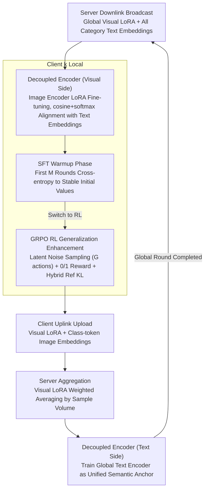

# Decoupled Training with Local Reinforcement Fine-Tuning in Federated Learning

**Conference**: ICML 2026  
**arXiv**: [2605.27900](https://arxiv.org/abs/2605.27900)  
**Code**: To be confirmed  
**Area**: Federated Learning / Vision-Language Models / Reinforcement Learning Fine-tuning  
**Keywords**: Federated Learning, CLIP, LoRA, GRPO, Decoupled Training

## TL;DR
FedDTL decouples CLIP by maintaining the image encoder on the client while moving the text encoder to the server as a "global semantic anchor." It employs a two-stage local fine-tuning strategy—SFT warmup followed by GRPO-style RL—to simultaneously mitigate inter-client optimization inconsistency and intra-client overfitting in heterogeneous and full-data federated scenarios.

## Background & Motivation

**Background**: Incorporating pre-trained VLMs like CLIP into downstream tasks has become mainstream in Federated Learning (FL). Typically, the backbone is frozen, and Parameter-Efficient Fine-Tuning (PEFT) such as prompts, adapters, or LoRA is performed on the client, followed by parameter averaging aggregation at the server.

**Limitations of Prior Work**: Under Non-IID and full-data conditions, long-trajectory local optimization leads to two concurrent issues: (i) **Inter-client optimization inconsistency**—local objectives of each client are misaligned with divergent gradient directions, failing to yield a coherent global semantic representation after parameter averaging; (ii) **Intra-client over-specialization**—local PEFT parameters "absorb" biased label frequencies and feature statistics, degrading generalization to unseen classes or domains.

**Key Challenge**: Existing methods primarily rely on "pure local optimization + server averaging" supplemented by regularization or alignment losses. They still depend on parameter averaging for cross-client knowledge transfer, failing to systematically resolve **representation-level client drift**. Furthermore, most evaluations are restricted to few-shot settings, masking the amplification of these two problems in full-data scenarios.

**Goal**: To **simultaneously** enhance global task adaptation (base classes) and generalization ability (novel classes) across various federated data distributions, including few-shot, full-data, label skew, and feature shift.

**Key Insight**: The authors observe a structural isomorphism between CLIP’s "modality decoupling + alignment" and "server-client broadcasting." Images must be processed locally for privacy, but the text encoder only processes category names, making it naturally suitable for the server. Additionally, insights from Chu et al. (2025) suggesting "SFT tends toward memorization while RL favors generalization" imply that RL can replace supplementary regularization.

**Core Idea**: **Cross-end encoder decoupling + SFT-to-RL two-stage local fine-tuning.** The server trains a text encoder to provide a unified semantic "anchor," while clients perform LoRA fine-tuning only on the visual end. Local training starts with SFT warmup before switching to GRPO-style RL to suppress over-specialization.

## Method

### Overall Architecture
FedDTL aims to suppress both "inter-client optimization inconsistency" and "intra-client overfitting" in a federated setting with $K$ clients holding private data $\mathcal{D}_k=\{(x_i,y_i)\}_{i=1}^{N_k}$. Its strategy involves splitting the CLIP dual towers across physical locations—image encoder on the client and text encoder on the server—followed by a "first SFT, then RL" local fine-tuning process.

In each global round $t$, the data flow is as follows: The server **broadcasts** the global visual LoRA $\Delta\mathbf{W}_g^{t-1}$ and global text embeddings for all categories $\{\bar z_{\text{text}}^{c,t-1}\}_{c=1}^{C}$. Clients use the LoRA-tuned image encoder $\mathcal{V}_k$ to encode local images into $\bar z_v$, compute cosine similarity and softmax with the received text embeddings for classification, following SFT for the first $M$ rounds before switching to RL. After local training, only the visual LoRA $\Delta\mathbf{W}_k$ and normalized image category embeddings $\bar z_{v,k}$ (class tokens only; a subset can be sampled in full-data settings) are **uploaded**. The server performs sample-weighted averaging of the visual LoRAs and utilizes the image embeddings as supervision to train the global text encoder $\mathcal{T}_g$ (also via LoRA), completing one global round. This architecture relies on "client visual decoupling + server text unification" and "two-stage local fine-tuning" to address both issues without stacking additional regularization.

### Key Designs

**1. Decoupled Encoder Training: Server Text Encoder as "Global Semantic Anchor"**

This addresses representation-level client drift that "pure local optimization + parameter averaging" cannot suppress. The modality structure of CLIP aligns naturally with FL physical constraints—images remain local (privacy), while the text encoder processes only category names regardless of sample distribution, making it ideal for the server. On the client side, LoRA fine-tunes the last $L-l$ layers of the image encoder ($W=W_0+BA$, $r\ll d$), aligning with broadcasted global text embeddings via $p(\hat y=c|x)=\frac{\exp(\text{sim}(\bar z_v,\bar z_{\text{text}}^c)/\tau)}{\sum_j\exp(\text{sim}(\bar z_v,\bar z_{\text{text}}^j)/\tau)}$. On the server side, after receiving image class-token embeddings from all clients, the text LoRA $\Delta\mathbf{W}_{\text{text}}$ is trained using cross-entropy to map "a photo of a [classname]" into a unified text representation aligned with the global visual space.

This is effective because the global text encoder does not depend on any single client's sample distribution, establishing a common coordinate system for all clients and forcing convergence in the same direction, replacing the "parameter averaging as knowledge transfer" paradigm. Additionally, only highly compressed class-token embeddings are uploaded (no patch tokens), reducing privacy risks and communication bandwidth.

**2. SFT Warmup for Local Task Adaptation: Stabilizing Initial Encoder Values**

This addresses the low sample efficiency of RL when starting from an underfitted state. During the first $M$ global rounds, clients run standard cross-entropy $\mathcal{L}_{ce}=-\frac{1}{N_k}\sum_{(x_i,y_i)}\sum_c y_i\log p(\hat y=c|x_i)$, optimizing $\min_{\Delta\mathbf{W}_k}\mathcal{L}_{ce}([\mathbf{W}_0,\Delta\mathbf{W}_k];\{\bar z_{\text{text}}^c\},\mathcal{D}_k)$ for $T_e=2$ local epochs per round. This rapidly pulls the image encoder to a task-relevant stable initialization.

This step serializes "fast adaptation" and "overfitting prevention": pure RL is inefficient for classification fine-tuning, while pure SFT suffers from local biases over long trajectories. SFT handles the warmup, delegating the remaining optimization to RL.

**3. GRPO-inspired RL Generalization Enhancement: Suppressing Over-specialization via RL**

Instead of stacking regularization terms, this uses RL to actively combat overfitting during long-trajectory local training. The image encoder after SFT convergence acts as the policy $\pi_{\theta_k}$ (logits as category distribution). To address the deterministic output of CLIP encoders—which would make intra-group relative advantages zero in GRPO—small Gaussian noise $\varepsilon\sim\mathcal{N}(0,\sigma^2 I)$ is injected into the latent embeddings to create controllable stochasticity, sampling $G=3$ actions per image. Policy updates remain deterministic.

A 0/1 reward signal based on classification correctness is used, and group-normalized relative advantages $A_{i,j}$ are computed for GRPO’s $\epsilon$-clip policy gradient $\mathcal{L}_p$. To prevent policy drift, an unbiased KL estimation $\mathbb{D}_{\text{KL}}$ against a hybrid reference model (0.5 weight each for final SFT model and latest global policy) is used:

$$\mathcal{L}_{rl}=-\frac{1}{G}\sum_j\frac{1}{bs}\sum_i\left(\mathcal{L}_p-\beta\mathbb{D}_{\text{KL}}\right),\quad \beta=0.5.$$

The hybrid reference model provides a "task-aware" direction for KL, preventing the policy from stagnating or deviating excessively.

### Loss & Training
Key hyperparameters: ViT-B/16 backbone, LoRA rank $r=4$ inserted from layer $l=10$; Adam, $\eta=1e-3$, batch=64; $T=20$ global rounds, $T_e=2$ (SFT) / $3$ (RL) local epochs per round, $K=5$ clients. Clients upload class-token embeddings only; in full-data settings, subset sampling further reduces communication.

## Key Experimental Results

### Main Results
Average accuracy across 9 label skew benchmarks (CIFAR10/100, EuroSAT, TinyImageNet, OxfordPet, Flower102, Caltech101/256, Food101), focusing on base (global adaptation) and novel (generalization):

| Setting | Method | Base | Novel |
|------|------|------|-------|
| Few-shot Non-IID | FedMaPLe | 83.63 | 77.56 |
| Few-shot Non-IID | **FedDTL** | **89.58** | **83.01** |
| Few-shot Dir(0.1) | FedMaPLe | 84.05 | 77.69 |
| Few-shot Dir(0.1) | **FedDTL** | **90.95** | **82.64** |
| Full-data Non-IID | FedMaPLe | 80.56 | 69.41 |
| Full-data Non-IID | **FedDTL** | **91.64** | **77.72** |
| Full-data Dir(0.1) | FedMaPLe | 89.27 | 70.10 |
| Full-data Dir(0.1) | **FedDTL** | **92.40** | **76.59** |

Feature shift (DomainNet, Full-one / Full-Dir(0.1)): FedDTL achieved 93.38 / 93.47, while FedMaPLe achieved 91.94 / 90.51.

### Ablation Study
Mean across 7 datasets, showing base / novel / harmonic mean (HM):

| Configuration | Few_Non-IID Base / Novel / HM | Full_Non-IID Base / Novel / HM |
|------|------|------|
| FedLoRA (Baseline) | 78.32 / 78.86 / 78.56 | 58.11 / 70.51 / 63.12 |
| + Decoupled Encoder Training | 86.42 / 79.52 / 82.60 | 86.68 / 73.57 / 79.20 |
| + Two-stage Fine-tuning | 79.46 / 83.84 / 81.47 | 47.91 / 76.43 / 57.86 |
| **FedDTL (Both)** | **90.06 / 83.58 / 86.51** | **90.58 / 80.62 / ≈85** |

### Key Findings
- Adding the decoupled encoder alone increases base accuracy from 58 to 87 (+28) in Full_Non-IID, indicating this module mitigates inter-client inconsistency. However, novel gain is limited, necessitating RL.
- Adding two-stage fine-tuning alone drops base accuracy in Full_Non-IID to 47.91, showing pure RL is unstable under heterogeneity without a "global semantic anchor." Both are required to maintain base and increase novel performance.
- Most baselines show significant drops in novel accuracy when moving from few-shot to full-data (e.g., pFedMMA drops from 74.91 to 65.56 under Dir(0.1)). FedDTL remains stable across all settings, demonstrating successful suppression of long-trajectory overfitting.

## Highlights & Insights
- **Analogy between CLIP Modality Decoupling and FL Broadcasting**: This is the "philosophical hook"—images are local (privacy) and text is global (category names), aligning perfectly with FL constraints to create a "global semantic anchor" without new components.
- **Replacing Regularization with RL in FL**: Instead of directly applying GRPO, the authors solve the deterministic encoder issue via latent noise injection and a hybrid reference model, creating a stable GRPO variant for visual RL classification.
- **Emphasis on Full-data Evaluation**: While previous federated VLM works often only report few-shot results, full-data environments truly expose the composite effects of inter-client inconsistency and intra-client over-specialization.

## Limitations & Future Work
- Communication costs scale linearly with the number of categories $C$ due to global text embedding broadcasts.
- All experiments are based on ViT-B/16; the effectiveness of decoupled training on larger backbones remains unverified, and LoRA hyperparameters are fixed.
- The RL phase requires $G$ times more forward passes ($G=3$), increasing computational pressure on clients compared to pure SFT.
- Privacy analysis is qualitative; formal Differential Privacy (DP) guarantees or empirical tests against embedding inversion attacks are not provided.

## Related Work & Insights
- **vs FedMaPLe / PromptFL**: These rely on prompt tuning and parameter averaging for knowledge transfer; FedDTL trains the text encoder on the server, replacing the averaging paradigm and showing clear advantages in full-data settings.
- **vs FedPGP / pFedMMA**: These use additional alignment or regularization losses under SFT; FedDTL uses RL to suppress overfitting, avoiding the "loss term stacking" complexity.
- **vs FedPPO / AFedPG**: These also introduce RL to FL but focus on system heterogeneity (stragglers, asynchronous policies); FedDTL's RL targets statistical heterogeneity and generalization.

## Rating
- Novelty: ⭐⭐⭐⭐ The structural alignment between CLIP and FL is elegant, and the noise-injected GRPO adaptation is a practical new solution.
- Experimental Thoroughness: ⭐⭐⭐⭐ Covers 11 datasets across 5 distributions and few-shot/full-data settings. Ablations accurately attribute gains.
- Writing Quality: ⭐⭐⭐⭐ Clear motivation regarding the two lines of inconsistency and overfitting.
- Value: ⭐⭐⭐⭐ Addresses the stability of Federated VLM in full-data heterogeneous scenarios with transferable techniques.

<!-- RELATED:START -->

## Related Papers

- [\[AAAI 2026\] FedALT: Federated Fine-Tuning through Adaptive Local Training with Rest-of-World LoRA](../../AAAI2026/llm_safety/fedalt_federated_fine-tuning_through_adaptive_local_training_with_rest-of-world_.md)
- [\[ICML 2026\] FedTreeLoRA: Reconciling Statistical and Functional Heterogeneity in Federated LoRA Fine-Tuning](fedtreelora_reconciling_statistical_and_functional_heterogeneity_in_federated_lo.md)
- [\[ICML 2026\] Towards Fine-Grained Robustness: Attention-Guided Test-Time Prompt Tuning for Vision-Language Models](towards_fine-grained_robustness_attention-guided_test-time_prompt_tuning_for_vis.md)
- [\[NeurIPS 2025\] Adaptive LoRA Experts Allocation and Selection for Federated Fine-Tuning](../../NeurIPS2025/llm_safety/adaptive_lora_experts_allocation_and_selection_for_federated_fine-tuning.md)
- [\[ICLR 2026\] Heterogeneous Federated Fine-Tuning with Parallel One-Rank Adaptation](../../ICLR2026/llm_safety/heterogeneous_federated_fine-tuning_with_parallel_one-rank_adaptation.md)

<!-- RELATED:END -->
