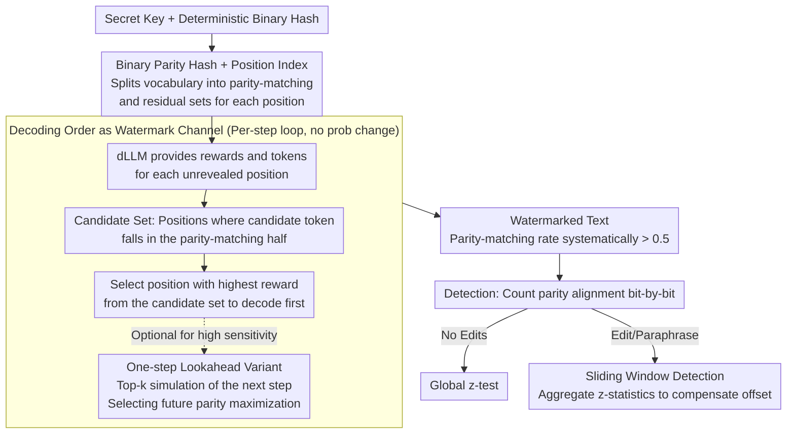

# dgMARK: Decoding-Guided Watermarking for Diffusion Language Models

**Conference**: ICML 2026  
**arXiv**: [2601.22985](https://arxiv.org/abs/2601.22985)  
**Code**: https://dgmark-watermarking.github.io  
**Area**: LLM Security / Watermarking / Diffusion Language Models  
**Keywords**: dLLM watermarking, decoding order, parity hashing, robust detection, probability-free reweighting

## TL;DR
dgMARK utilizes the "decoding order freedom" inherent in diffusion language models (dLLMs) as a watermark channel. By prioritizing the decoding of positions that satisfy parity conditions based on binary hashes, it embeds statistically detectable watermarks in models like LLaDA and Dream. This method requires no modification to token probability distributions and remains robust against insertion, deletion, substitution, and paraphrasing attacks.

## Background & Motivation

**Background**: LLM content provenance primarily relies on watermarking. Mainstream approaches (e.g., Kirchenbauer et al.’s green/red lists) embed signals by biasing token probabilities, which results in significant quality loss. Distortion-free variants (GumbelMax, long pseudo-random sequences) preserve the distribution but are slow and dependent on fixed causal contexts. Recently, diffusion language models (dLLMs; LLaDA, Dream, Mercury, Gemini Diffusion) reveal tokens in arbitrary orders, challenging the autoregressive paradigm.

**Limitations of Prior Work**: Existing watermarks assume left-to-right generation and require "previous text" as a hashing seed. Since dLLMs lack a fixed prefix, classic schemes are either inapplicable or adapted into "still biasing probabilities," continuing to pay a quality price. Minimal concurrent work on dLLM watermarking (Bagchi, Wu, Gloaguen, Raban, etc.) still primarily modifies token selection probabilities.

**Key Challenge**: dLLMs provide a new control knob (decoding order). Ideally, they should be order-agnostic (arbitrary permutations should yield the same distribution); however, in reality, they are highly sensitive to order due to imperfect training approximations (Kim et al. 2025). The discrepancy between these two is exactly the potential watermark channel—yet to be systematically exploited.

**Goal**: Design a watermark that leaves token probabilities completely untouched—embedding signals solely by guiding the decoding order—while (1) being compatible with universal decoding strategies like confidence, entropy, or margin, and (2) maintaining detection rates under insertion, deletion, substitution, and paraphrasing attacks.

**Key Insight**: It is observed that at each step, a dLLM calculates a reward $r_j$ and samples a candidate $v_j$ for each unrevealed position $j$, typically prioritizing the selection of the position with the maximum $r_j$. By using a binary hash tied to the position index, if we prioritize the highest-reward position among candidates that satisfy the parity condition, we can systematically push the parity-matching rate of the watermarked text above 0.5 without altering probabilities.

**Core Idea**: Shift watermarking from "distorting token probabilities" to "distorting decoding order." A binary hash derived from a secret key splits the vocabulary at each position into a parity-matching set and a residual set. During decoding, precedence is given to positions where the candidate token falls into the parity-matching set with the highest reward. Statistical detection then checks if the parity-matching rate is significantly higher than 0.5.

## Method

### Overall Architecture

dgMARK aims for a "probability-free" watermark: since diffusion language models must choose one position to decode first among a set of unrevealed positions at each step, the signal is hidden within "which position to decode" rather than "what token to decode." The entire pipeline is driven by a secret key $\xi$ and a deterministic hash $f: \mathcal{V} \times \Xi \to \{0,1\}$, which splits the vocabulary at position $i$ into a parity-matching set $\mathcal{G}_i = \{v \in \mathcal{V} \mid f(v, \xi) \equiv i \pmod 2\}$ and a residual set $\mathcal{R}_i = \mathcal{V} \setminus \mathcal{G}_i$ (the hash construction ensures a balanced split for any $\xi$). During generation, the dLLM provides a reward and candidate $(r_j, v_j)$ for each unrevealed position $j$ as usual. dgMARK prioritizes decoding the position with the highest reward among those whose candidate token happens to fall into the parity-matching half of that position. For detection, parity alignment is counted position-by-position, followed by a z-test to see if the proportion is significantly higher than 0.5. For edit attacks, a sliding window is used to compensate for alignment offsets.

### Key Designs

**1. Decoding Order as a Watermark Channel: Embedding signals without touching $p_\theta$**  
Classic watermarks (green/red lists, GumbelMax) manipulate token probabilities—biasing logits incurs quality loss, while distortion-free variants that preserve distribution require additional computational overhead. dgMARK changes a different knob: it leaves $p_\theta(y_j \mid y_\mathcal{I}, x)$ untouched and only modifies "who to decode first." While this might seem contradictory—since if a dLLM were perfectly order-agnostic, changing the order would be undetectable—real dLLMs are highly sensitive to order due to imperfect training (Kim et al. 2025). This sensitivity, usually seen as a flaw, becomes a resource: systematically prioritizing parity-matching positions pushes the parity-matching rate significantly above 0.5. This decouples the watermark from model probabilities, avoids the overhead of distortion-free methods, and is inherently plug-and-play with any underlying decoding strategy.

**2. Binary Parity Hash + Position Index: Detectable and resistant to counting attacks**  
dgMARK uses a key-derived hash $f(v, \xi)$ to assign a 0/1 label to each token, then compares it with the position index $i$. A token is in the parity-matching set $\mathcal{G}_i$ if $f(v, \xi) \equiv i \pmod 2$. During decoding, it greedily selects $k^\star = \arg\max_{j: v_j \in \mathcal{G}_j} r_j$. Position dependence is crucial: the vocabulary split alternates with the index, preventing the watermark from being cracked by simple "high-frequency token counting," unlike static green lists. The balanced binary split ensures that under the null hypothesis (unwatermarked), the parity-matching rate is strictly 0.5, allowing for a standard z-test.

**3. Sliding Window Detection: Compensating for alignment offsets from edit attacks**  
Since parity is calculated per position, any insertion or deletion causes a shift in the global position index, disrupting subsequent parity alignments. This shift might even cause some windows to flip their parity match significantly below 0.5, causing naive global counting to fail. dgMARK performs detection on overlapping sliding windows: for each window of length $w$ starting at $s$, it calculates a local $z$-score $z_s$, then uses an aggregate statistic $z_{\text{win}} = \frac{1}{S}\sum_s z_s^2$. This captures windows that are either significantly high or significantly low (flipped), allowing detection of sub-intervals that remain consistent after being fragmented by edits.

**4. One-step Lookahead Variant: Boosting strength in sparse signal steps**  
The basic version greedily selects the best parity-matching position. However, committing early might reduce the availability of parity-matching candidates in subsequent steps. The Lookahead variant takes the top-$k$ parity-matching candidates and simulates the next step for each, counting how many positions would still have parity-matching candidates in the future ($g^{(j)} = \sum_\ell \mathbb{1}[v_\ell^{(j)} \in \mathcal{G}_\ell]$). It then selects the candidate that maximizes future opportunities. While this doubles the per-step decoding cost, it is effective for high-sensitivity scenarios.

## Key Experimental Results

### Main Results: Detection vs. Quality (LLaDA-8B-Instruct, confidence decoding)

| Method | Detection AUC↑ | Perplexity↓ | MAUVE↑ |
| :--- | :--- | :--- | :--- |
| Unwatermarked | 0.50 | 1.00× | 1.000 |
| Prob. Bias (KGW Port) | 0.98 | 1.18× | 0.86 |
| dgMARK | **0.97** | **1.01×** | **0.97** |
| dgMARK + Lookahead | **0.99** | 1.03× | 0.95 |

dgMARK achieves detection rates comparable to probability-biasing baselines while keeping perplexity and MAUVE nearly identical to the unwatermarked model, proving the order channel is "virtually free."

### Robustness to Post-Editing (20% Substitution Rate)

| Attack | Prob. Bias AUC | dgMARK AUC | dgMARK + Window AUC |
| :--- | :--- | :--- | :--- |
| Word Sub. 20% | 0.81 | 0.85 | **0.94** |
| Insertion 10% | 0.70 | 0.79 | **0.92** |
| Deletion 10% | 0.68 | 0.77 | **0.91** |
| Paraphrase (GPT-4) | 0.62 | 0.71 | **0.85** |

Sliding window detection significantly compensates for alignment offsets triggered by insertions/deletions. dgMARK is also more robust to paraphrasing than probability-biasing methods, as sequence-level signals are harder for paraphrasers to erase synchronously than token-level signals.

### Key Findings
- **Order channel has near-zero quality cost**: Perplexity increases by only 1%, and text is almost indistinguishable from unwatermarked outputs.
- **Stability across decoding strategies**: dgMARK functions with confidence, entropy, and margin decoding, with all detection AUCs > 0.95.
- **Sliding Window > Global Detection**: Detection AUC improves by 5–10 points under all edit attacks, serving as a key factor for robustness.
- **Diminishing returns for Lookahead**: It pushes AUC from 0.97 to 0.99 but at 2× the inference cost.

## Highlights & Insights
- **Identified a unique dLLM watermark channel**: Decoding order freedom is a knob that does not exist in the autoregressive paradigm. Turning the "order sensitivity" flaw into a feature is a classic "bug to feature" transformation.
- **Truly probability-free**: This is one of the few LLM watermarking schemes that leaves $p_\theta$ entirely untouched. Theoretically, the KL divergence between the watermarked and unwatermarked distributions is zero.
- **Plug-and-play philosophy**: dgMARK serves as a wrapper compatible with various decoding strategies, meaning it can be added to existing dLLM deployments without retraining.
- **Generality of Sliding Window**: The issue of edit attacks breaking global alignment exists for any position-dependent watermark; the sliding window solution is transferable.

## Limitations & Future Work
- Dependence on the "order sensitivity" of dLLMs; if future dLLMs become perfectly order-invariant, the signal might vanish.
- One-step lookahead doubles inference costs; multi-step lookahead would be exponentially expensive.
- Parity hashing provides only 1 bit per position; embedding complex signatures (e.g., timestamps) requires extension to $k$-bit hashing.
- AUC drops to 0.85 under paraphrasing; strong adversarial paraphrasers may cause further degradation.

## Related Work & Insights
- **Vs. Autoregressive Green/Red Lists (KGW et al.)**: Those rely on fixed causal contexts (which dLLMs lack) and incur quality costs via probability biasing.
- **Vs. Distortion-free Watermarks (Aaronson-Kirchner, Christ et al.)**: Those preserve distribution through GumbelMax or long sequences but are computationally heavy; dgMARK is zero-cost in comparison.
- **Vs. Concurrent dLLM Watermarking**: Most still rely on probability shaping; dgMARK is the first to use decoding order as the primary channel.

## Rating
- Novelty: ⭐⭐⭐⭐⭐ Using decoding order as a channel is a genuinely new framing for dLLM watermarking.
- Experimental Thoroughness: ⭐⭐⭐⭐ Coverage of multiple models, strategies, and attacks is solid, though more head-to-head comparisons with concurrent dLLM watermarks would be beneficial.
- Writing Quality: ⭐⭐⭐⭐ Clear motivation and intuitive algorithm illustrations.
- Value: ⭐⭐⭐⭐⭐ As dLLMs (Mercury, Gemini Diffusion) undergo industrialization, provenance watermarking is a critical need.

<!-- RELATED:START -->

<!-- RELATED:END -->

## Related Papers

- [\[ICML 2026\] COFT: Counterfactual-Conformal Decoding for Fair Chain-of-Thought Reasoning in Large Language Models](coft_counterfactual-conformal_decoding_for_fair_chain-of-thought_reasoning_in_la.md)
- [\[ICML 2026\] Towards Fine-Grained Robustness: Attention-Guided Test-Time Prompt Tuning for Vision-Language Models](towards_fine-grained_robustness_attention-guided_test-time_prompt_tuning_for_vis.md)
- [\[ICLR 2026\] wd1: Weighted Policy Optimization for Reasoning in Diffusion Language Models](../../ICLR2026/llm_safety/wd1_weighted_policy_optimization_for_reasoning_in_diffusion_language_models.md)
- [\[AAAI 2026\] Perturb Your Data: Paraphrase-Guided Training Data Watermarking](../../AAAI2026/llm_safety/perturb_your_data_paraphrase-guided_training_data_watermarking.md)
- [\[ICLR 2026\] Membership Inference Attacks Against Fine-tuned Diffusion Language Models (SAMA)](../../ICLR2026/llm_safety/membership_inference_attacks_against_fine-tuned_diffusion_language_models.md)

<!-- RELATED:END -->
