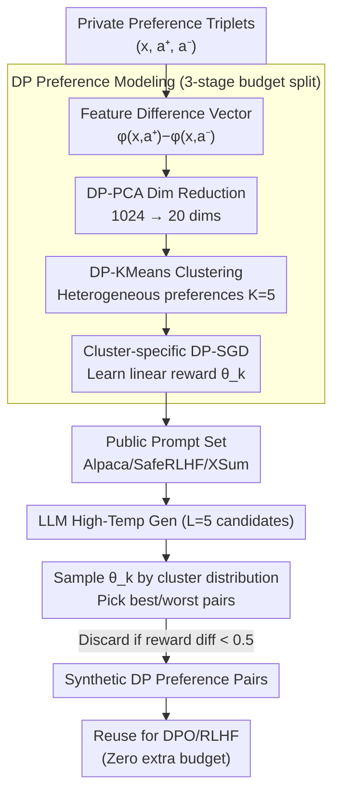

# Differentially Private Preference Data Synthesis for Large Language Model Alignment

**Conference**: ICML 2026  
**arXiv**: [2605.30808](https://arxiv.org/abs/2605.30808)  
**Code**: https://github.com/gfengyu/Differentially-Private-Preference-Data-Synthesis  
**Area**: LLM Safety / Differential Privacy / Preference Alignment  
**Keywords**: Differential Privacy, Preference Data Synthesis, Bradley-Terry, DP-PCA, DPO/RLHF

## TL;DR
DPPrefSyn replaces "direct DP fine-tuning on private preference data" with "learning a private reward model distribution via DP and synthesizing DP preference data using public prompts." By leveraging the geometric structure of Bradley-Terry linear rewards + DP-PCA + DP-KMeans clustering to capture user preference heterogeneity, it achieves a 56.5% GPT-4o win-rate on Anthropic-HH at $\varepsilon=2$. This outperforms non-private fine-tuning (55.95%) and DP-FT (37.0%).

## Background & Motivation

**Background**: LLM preference alignment (RLHF / DPO) relies on triplet data consisting of a prompt, a pair of responses, and a human preference label. These datasets (e.g., Anthropic-HH, OpenAssistant, TL;DR) often contain sensitive information in prompts—such as health, identity, or political leanings—and the annotations themselves may leak the preferences of the annotators.

**Limitations of Prior Work**: Existing DP alignment works fall into three categories: (1) Label-DP (Chowdhury 2024, Zhang 2025), where prompts remain exposed; (2) Private fine-tuning of specific algorithms like DP-PPO (Wu 2023a), which is incompatible with DPO; and (3) DP synthesis of instructions (Yu 2024) that does not target preference pairs. All three provide "partial protection" or are "algorithm-specific" and are constrained by limited private data, as human preference labels are extremely expensive.

**Key Challenge**: Preference data exhibits strong heterogeneity (different users value different aspects: accuracy, politeness, or creativity), yet DP-SGD is highly sample-inefficient on high-dimensional embeddings. Furthermore, it is desirable for the DP product to be reusable for DPO, RLHF, or various downstream LLMs without further consumption of the privacy budget.

**Goal**: (1) Protect all private signals including prompts, responses, and labels; (2) remain compatible with arbitrary alignment algorithms like DPO or RLHF; and (3) surpass the utility of baselines that only perform DP fine-tuning on private data.

**Key Insight**: Shift the task from "privately fine-tuning an alignment model" to "learning a preference reward model distribution via DP $\rightarrow$ constructing synthetic preference pairs using public prompts." Public prompts do not consume the budget; all budget is allocated to building the preference model. Synthetic data can be reused indefinitely via DP post-processing.

**Core Idea**: Bradley-Terry + Linear Reward $\rightarrow$ preference is the sign of $\langle \theta, \phi(x, a^+) - \phi(x, a^-) \rangle$. Use DP-PCA for dimension reduction to save samples, DP-KMeans for clustering to capture heterogeneous preferences, and DP-SGD to learn linear rewards for each cluster. Finally, sample reward models according to the cluster distribution on public prompts and use them to select best/worst pairs for synthesis.

## Method

### Overall Architecture

DPPrefSyn avoids direct DP fine-tuning of alignment models on private preference triplets. Instead, it uses the privacy budget to "compress human preferences into a family of low-dimensional linear reward models," which are then used to synthesize preference pairs on public prompts. The pipeline consists of three steps: first, calculating feature difference vectors for each private triplet $(x_i, a_i^+, a_i^-)$ followed by DP-PCA dimension reduction and DP-KMeans clustering (splitting heterogeneous users into $K=5$ clusters); second, training a linear reward $\theta_k$ for each cluster via DP-SGD; third, generating candidates for public prompts (which do not consume budget), sampling a reward model based on cluster distribution for scoring, and picking the best/worst responses to form synthetic preference pairs. Since the synthetic data is a post-processing product of DP outputs, it can be reused for DPO/RLHF across different models without additional budget costs.

### Key Designs

**1. Bradley-Terry Linear Reward + Geometric Clustering: Expressing heterogeneous preferences through cluster rewards**

A single global reward cannot capture the heterogeneity of users who value different aspects (e.g., accuracy vs. creativity). However, modeling each user individually faces high-dimensional multi-model challenges. This work breaks through via the geometric structure of the Bradley-Terry model: the preference probability $\mathbb{P}[a^+ \succ a^-] = \sigma(\langle \theta, \phi(x,a^+) - \phi(x,a^-)\rangle)$ is determined solely by the sign of the inner product between $\theta$ and the feature difference vector $\phi(x,a^+) - \phi(x,a^-)$. Users with similar preference orientations naturally have aligned difference vector directions. Clustering these vectors allows each cluster to correspond to a homogeneous preference type, approximated by a cluster-specific linear $\theta_k$. Linear rewards are chosen over deep rewards to balance expressiveness and DP-friendliness: DP-SGD's sample efficiency is much higher on linear models, and once preferences are homogenized within a cluster, a linear structure suffices.

**2. Phased Budget Allocation (DP-PCA + DP-KMeans + DP-SGD): Trading dimension for sample efficiency**

Original embeddings reach 1024 dimensions, where direct DP-SGD training would require an unrealistic sample size, given the high cost of preference labels. The solution uses DP-PCA to project difference vectors onto $p=20$ dimensions, retaining primary preference signals while discarding noise. The total privacy budget is split: $\varepsilon_0$ for PCA, $\varepsilon_1$ for KMeans, and $\varepsilon - \varepsilon_0 - \varepsilon_1$ for DP-SGD. Since cluster samples are disjoint, DP-SGD training follows the parallel composition theorem, where the total budget is constrained by the smallest cluster rather than linear accumulation. PCA was selected over random projection to specifically preserve preference signals, while KMeans ensures intra-cluster homogeneity for linear fitting. DP-SGD compositions are tightly tracked using a PRV accountant.

**3. Public Prompts + Candidate Scoring for Preference Pairs: Concentrating budget on "preference modeling"**

Synthesizing prompts themselves consumes budget and often yields poor quality. Consequently, the authors use public prompt sets (Alpaca / SafeRLHF / XSum), dedicating the entire DP budget to preference modeling. For each public prompt $\tilde x_j$, an LLM generates $L=5$ candidates under high temperature. A cluster $k$ is sampled according to a DP histogram $\bm p \leftarrow \bm h / |\mathcal{D}_{\text{priv}}|$ (representing private cluster proportions), and the corresponding $\theta_k$ scores the candidates. The highest and lowest scoring responses form the pair $(\tilde a^+, \tilde a^-)$. Pairs with a reward difference $< 0.5$ are discarded to ensure signal quality. The distribution shift between public and private prompts is not fatal, as the authors argue that user preferences are decoupled from prompt distributions—captured preference invariance via $\theta_k$ allows for consistent rank reproduction across different prompt sources.

## Key Experimental Results

### Main Results: GPT-4o Win-rate (Pythia-2.8B + SFT+DPO)

| Task | $\varepsilon=0$ (base) | DP-FT $\varepsilon=2$ | **DPPrefSyn $\varepsilon=2$** | DP-FT $\varepsilon=\infty$ (Non-private) |
|------|---------|-------------|---------------|-----------|
| OpenAssistant | 2.11 | 6.18 | **11.04** | 8.20 |
| Anthropic-HH | 12.14 | 37.02 | **56.48** | 38.72 |
| TL;DR | 11.64 | 35.2 | **53.8** | 39.5 |

Under strong privacy ($\varepsilon = 2$), DPPrefSyn significantly outperforms DP-FT and even surpasses the completely non-private DP-FT baseline ($\varepsilon = \infty$). **DP is no longer just a utility cost, but acts as a regularizer.**

### Ablation Study (OpenAssistant, $\varepsilon = 2$)

| Configuration | Win-rate |
|------|---------|
| Full DPPrefSyn | 11.04 |
| Without DP-PCA (Direct 1024D DP-SGD) | 6.32 |
| Without KMeans Clustering (Global Reward) | 8.41 |
| Using DP Synthetic Prompts instead of Public | 7.95 |
| GPT-2 Fine-tuned Reward instead of Linear | 11.21 |

DP-PCA contributes most (−4.7 points), followed by clustering for heterogeneity (−2.6 points). Linear rewards perform nearly identical to full GPT-2, validating the linear structure.

### Key Findings
- **DP Synthetic Data > Direct DP Fine-tuning**: DPPrefSyn wins over DP-FT across all $\varepsilon$, challenging the common belief that synthetic data necessarily loses information.
- **Dimension Reduction is Crucial for DP**: Removing DP-PCA causes a 4.7-point drop, indicating that direct DP-SGD in 1024 dimensions learns almost nothing.
- **Heterogeneous Preference Modeling works**: Clustering provides a 2.6-point boost, confirming that human preferences are indeed multimodal.
- **Post-processing Reusability**: The synthetic dataset can be reused for different models or algorithms (SFT, DPO, RLHF) with zero additional budget.

## Highlights & Insights
- **Sophisticated Combination of the "Trio" (DP-PCA + Linear Reward + Clustering)**: Each component addresses a specific pain point of high-dimensional DP training (sample efficiency, expressiveness, or heterogeneity).
- **Maximizing Post-processing**: Once synthesis is complete, it is free from DP constraints and can be reused—a fundamental advantage over DP fine-tuning that the authors exploit thoroughly.
- **"DP-as-Regularization" Phenomenon**: DPPrefSyn outperforming the non-private baseline at $\varepsilon=2$ suggests that DP noise acts as a regularizer on heterogeneous data, mitigating overfitting to specific annotator biases.
- **Insight on Public vs. Private Prompts**: The decoupling of user preference from prompt distribution allows public prompts to carry private preference signals, a concept applicable to other tasks like recommendation.

## Limitations & Future Work
- The linear reward assumption may be too strong for non-linear preferences (e.g., complex logic or long-range dependencies).
- The choice of $K=5$ clusters is empirical; too many or too few clusters can harm performance.
- If public prompt distributions deviate severely from private ones, coverage may be insufficient; a quantitative analysis of distribution shift is lacking.
- Evaluation was limited to Pythia-2.8B; biases from DP-PCA dimension reduction might be amplified in larger models (13B+).

## Related Work & Insights
- **vs. DP-FT / DP-PPO / DP-RLHF**: These perform direct DP fine-tuning on alignment models, requiring budget for every new algorithm or model. DPPrefSyn offers a "one-time DP, multiple reuse" paradigm.
- **vs. Label-DP**: Earlier works only protected labels while prompts leaked; DPPrefSyn protects the entire triplet.
- **vs. Aug-PE (Xie 2024)**: While Aug-PE focuses on general text synthesis via LLM API iterations, DPPrefSyn targets preference pairs specifically by leveraging BT geometric structures.
- **Insight**: The paradigm of "DP learning an abstraction $\rightarrow$ synthetic data $\rightarrow$ reuse" can be generalized to all supervised tasks requiring label protection (e.g., medical, legal, recommendations).

## Rating
- Novelty: ⭐⭐⭐⭐⭐ First to perform DP preference pair synthesis; systematic combination of BT geometry + DP-PCA + clustering.
- Experimental Thoroughness: ⭐⭐⭐⭐⭐ Three tasks across five $\varepsilon$ values with detailed ablations and head-to-head comparisons against DP-FT.
- Writing Quality: ⭐⭐⭐⭐ Clear three-step algorithm and budget explanation; geometric arguments for BT-clustering could be deeper.
- Value: ⭐⭐⭐⭐⭐ DP alignment is a regulatory necessity for enterprise LLM deployment; providing a ready-to-use pipeline is highly valuable.

<!-- RELATED:START -->

## Related Papers

- [\[ICML 2026\] Privacy Amplification in Differentially Private Zeroth-Order Optimization with Hidden States](privacy_amplification_in_differentially_private_zeroth-order_optimization_with_h.md)
- [\[ICML 2025\] POPri: Private Federated Learning using Preference-Optimized Synthetic Data](../../ICML2025/llm_safety/popri_private_federated_learning_using_preference-optimized_synthetic_data.md)
- [\[ICML 2026\] ACTG-ARL: Differentially Private Conditional Text Generation with RL-Boosted Control](actg-arl_differentially_private_conditional_text_generation_with_rl-boosted_cont.md)
- [\[ICML 2026\] Federated Variational Preference Alignment with Gumbel-Softmax Prior for Personalized User Preferences](federated_variational_preference_alignment_with_gumbel-softmax_prior_for_persona.md)
- [\[ACL 2026\] Differentially Private Synthetic Text Generation for Retrieval-Augmented Generation (RAG)](../../ACL2026/llm_safety/differentially_private_synthetic_text_generation_for_retrieval-augmented_generat.md)

<!-- RELATED:END -->
