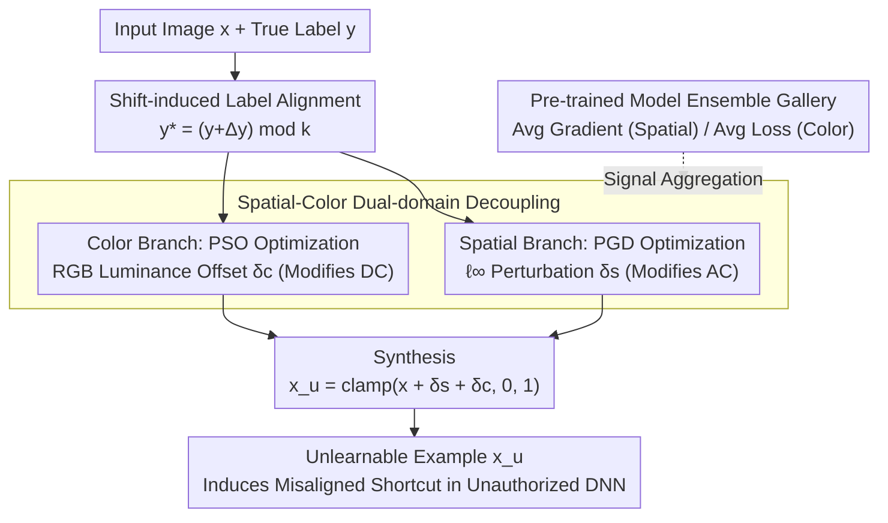

# Dual-branch Robust Unlearnable Examples

**Conference**: ICML 2026  
**arXiv**: [2605.01718](https://arxiv.org/abs/2605.01718)  
**Code**: https://github.com/wxldragon/DUNE (Available)  
**Area**: AI Security / Data Protection / Unlearnable Examples  
**Keywords**: Unlearnable Examples, Data Poisoning, Spatial-Color Dual-domain, Ensemble Perturbation, Robust Defense

## TL;DR
This paper proposes DUNE: expanding the optimization of Unlearnable Examples (UE) from a single spatial domain to a "spatial + color" dual-domain. By aligning perturbation features with shift-induced labels and enhancing transferability through an ensemble of pre-trained models, DUNE remains robust against 7 mainstream defenses (including ECLIPSE, ISS-J, and COIN) on CIFAR-10 / ImageNet, achieving average test accuracies that are 14.95%–50.82% lower than 12 SOTA UE schemes.

## Background & Motivation

**Background**: Training data scraped from the web makes "unauthorized DNN training" a significant risk. Unlearnable Examples (UEs) protect data owners by adding imperceptible perturbations that induce DNNs to learn incorrect shortcut features (perturbation $\leftrightarrow$ label mapping). Prev. SOTA methods (EM, REM, LSP, SEP, CUDA, OPS, etc.) typically optimize perturbations within an $\ell_p$-norm ball in the spatial domain.

**Limitations of Prior Work**: (1) **Heuristic shortcut**: Methods like CUDA / LSP use empirical convolutional/linear blocks as perturbations, lacking principled optimization and failing against adaptive defenses like COIN; (2) **Domain-constrained**: Single spatial domain perturbations have a simple frequency structure easily removed by noise suppression defenses such as ISS-J (frequency compression) or ECLIPSE (diffusion purification); (3) The radar chart in Fig. 2 shows that existing UEs degrade to near-baseline accuracy under certain defenses, indicating narrow robustness boundaries.

**Key Challenge**: Robust UEs require "perturbation diversity," yet perturbations in a single $\ell_p$ domain share the same frequency structure and distribution family, allowing defenses to remove them in batches once the family is identified. Expanding to multiple domains introduces optimization challenges in ensuring multi-domain perturbations synergistically establish shortcut mappings.

**Goal**: (1) Design a UE framework capable of multi-domain perturbation optimization; (2) Ensure multi-domain perturbations are orthogonal/complementary to avoid overlapping that destroys stealthiness; (3) Enhance cross-architecture transferability using ensemble learning.

**Key Insight**: Images can be decomposed into DC components (block mean luminance) and AC components (high-frequency spatial details). Spatial perturbations primarily affect AC, while color perturbations (luminance shifts) primarily affect DC—rendering them naturally orthogonal. Simultaneously, the perturbation objective is shifted from "aligning with ground-truth labels" to "aligning with shift-induced labels" $y^*=(y+\Delta y)\mod k$, decoupling the learned shortcut from the true label.

**Core Idea**: UE optimization is decomposed into two independent sub-problems: a spatial branch using PGD to optimize $\ell_\infty$ perturbation $\delta_s$, and a color branch using PSO to optimize RGB three-channel luminance offsets $\delta_c$. Both push features toward shift-induced classes, with robustness further enhanced via a gallery of pre-trained models for ensemble learning.

## Method

### Overall Architecture
DUNE addresses the vulnerability of single-spatial-domain UE perturbations, which are easily broken by frequency compression or diffusion purification. The objective remains adding perturbations to induce incorrect shortcuts: $\min_{\delta_u}\mathbb{E}_{(x,y)}[\mathcal{L}_{CE}(f_\theta(\psi(x;\delta_u)), y^*)]$, subject to $\delta_u\in\Phi_s\times\Phi_c$ and training labels replaced by shifted $y^*=(y+\Delta y)\mod k$. Crucially, the authors demonstrate that this joint optimization can be decoupled into two independent branches: the spatial branch optimizes $\delta_s$ within the $\ell_\infty$ ball using PGD, while the color branch searches for luminance offsets $\delta_c$ independently across RGB channels using gradient-free PSO. Both branches aggregate signals across a pre-trained model gallery to enhance cross-architecture robustness, finally resulting in $x_u=\text{clamp}(x+\delta_s+\delta_c, 0, 1)$.

### Key Designs

**1. Shift-induced Label Alignment: Making Shortcut Mappings Deterministic**

Traditional UE optimization aims for "min loss"—ensuring the model classifies perturbed samples into the original class $y$. However, this establishes a shortcut entangled with the true label, which adaptive defenses can reverse. DUNE pushes features toward a fixed offset class $y^*=(y+\Delta y)\mod k$, changing the objective to $\mathcal{L}_{CE}(f_\theta(\psi(x;\delta_d)), y^*)$. Since every class shares the same offset $\Delta y$, the dataset forms a "uniformly rotated" perturbation→label mapping (Fig. 4). The model learns this misaligned shortcut entirely; during testing with clean samples, the shortcut fails, and generalization collapses. Compared to randomized objectives, this mapping is **deterministic** and explicitly decoupled from original labels, making it more stable and harder to reverse-engineer.

**2. Spatial-Color Dual-domain Decoupling: Geometric Orthogonality**

Single-domain UEs are fragile because all perturbations share the same frequency family. DUNE splits the perturbation into $\delta_u\triangleq\delta_s\oplus\delta_c$, solving them as non-overlapping sub-problems. The spatial branch performs $T$ PGD steps, iterating along $g_t=\nabla_{x_i^t}\mathcal{L}_{CE}(f_\theta(x_i^t), y_p^*)$ and clipping $x_i^{t+1}=\text{clip}_{\epsilon}(x_i^t-\beta\cdot\text{sign}(g_t))$. The color branch splits the image into R/G/B channels, adding a luminance offset $\Delta x_r,\Delta x_g,\Delta x_b$ to each, and uses PSO to minimize the "ensemble loss + naturalness constraint $\lambda\mathcal{L}_{nc}$." Each class shares one set of $\delta_c$. These branches are orthogonal because images decompose into DC (mean luminance) and AC (high-frequency detail) components. Spatial perturbations modify AC, while color shifts modify DC. Consequently, ECLIPSE-style purification or ISS-J frequency compression may remove AC components, but the color shift in the DC domain remains intact—acting as a redundant backup.

**3. Pre-trained Model Ensemble: Enhancing Transferability**

Perturbations generated using a single surrogate (e.g., ResNet18) tend to overfit that architecture and fail on others (e.g., VGG19). DUNE maintains a gallery of models with different initializations and architectures $\{f_{\theta_j}\}_{j=1}^M$. Both branches aggregate signals across the gallery: the spatial branch uses the average gradient $g_t=\frac{1}{M}\sum_j \nabla\mathcal{L}_{CE}(f_{\theta_j}(x), y_p^*)$, and the color branch uses the average loss $\mathcal{L}_{color}=\frac{1}{M}\sum_j\mathcal{L}_{CE}(f_{\theta_j}(x+\delta_c), y_p^*)+\lambda\mathcal{L}_{nc}$. This incorporates transferability boosting into the UE framework—averaging gradients across architectures broadens the perturbation frequency spectrum, maintaining robustness against unseen defense models.

### Loss & Training
- Spatial Branch: $\mathcal{L}_{CE}(f_\theta(x+\delta_s), y^*)$, $\ell_\infty\le\epsilon$ (CIFAR-10 $\epsilon=8/255$), $T=20$ PGD steps.
- Color Branch: $\mathcal{L}_{color}=\frac{1}{M}\sum_j\mathcal{L}_{CE}+\lambda\mathcal{L}_{nc}$, PSO particle search, aggregated over $N$ samples per class.
- Ensemble Gallery $M$: Typically 3–5 surrogates; shift offset $\Delta y$ fixed within $k$ classes (CIFAR-10 typically $\Delta y=1$).
- Training Data: CIFAR-10, ImageNet subsets; Evaluation architectures: ResNet18 (intra), VGG19 (cross).

## Key Experimental Results

### Main Results

Test accuracy on CIFAR-10 with ResNet18 (Lower is better, indicating more robust UE), comparing 12 UE schemes across 7 defenses:

| Defense \ UE | EM | REM | CUDA | SEM | **Ours (DUNE)** |
|----------|-----|-----|------|-----|----------|
| w/o defense | 18.26 | 25.81 | 25.48 | 15.94 | **13.26** |
| AT | 69.72 | 59.12 | 49.32 | 32.43 | **24.96** |
| AA | 82.08 | 45.83 | 40.78 | 39.29 | **19.55** |
| OP | 64.37 | 29.45 | 28.66 | 15.99 | **12.81** |
| ISS-G | 89.09 | 38.87 | 22.89 | 31.94 | **10.18** |
| ISS-J | 78.91 | 81.33 | 43.31 | 81.58 | **28.88** |
| ECLIPSE | 82.07 | 87.16 | 34.18 | 85.82 | **57.49** |
| COIN | 19.49 | 33.67 | 72.02 | 24.22 | **19.21** |
| **AVG** | 63.00 | 51.47 | 39.58 | 40.90 | **23.29** |

For cross-architecture evaluation on VGG19 (surrogate=ResNet18), DUNE consistently leads, remaining the only method among 12 to stay below 30% in the AVG column.

### Ablation Study

| Configuration | CIFAR-10 ResNet18 w/o defense | After AT Defense |
|------|--------|--------|
| Spatial Only (PGD + shift label) | ≈18 | ≈45 |
| Color Only (PSO + shift label) | ≈25 | ≈40 |
| Dual-branch (No Ensemble) | ≈15 | ≈35 |
| **DUNE Full (Dual-branch + Ensemble)** | **13.26** | **24.96** |

### Key Findings
- **Dual-domain > Single-domain**: Either branch used alone lacks robustness against at least one of ECLIPSE or ISS-J; the combination handles both frequency compression and diffusion purification.
- **Smoother loss landscape**: As shown in Fig. 3, DUNE yields a smoother loss landscape than LSP/EM/REM, indicating higher robustness to small perturbations, consistent with sharpness-robustness theories.
- **Ensemble Impact**: Removing the model gallery causes significant degradation in cross-architecture (VGG19) performance, proving ensemble learning is key to transferability.
- **Robustness to Adaptive Defenses**: Even against two newly designed adaptive defenses (where the defender knows spatial-color domain info), DUNE maintains low accuracy across four architectures.

## Highlights & Insights
- **Orthogonal Domain Decomposition**: The physical decoupling of DC vs. AC provides a clear geometric intuition for why the two branches do not conflict, which is more profound than simply adding secondary loss terms.
- **Shift-induced Label Alignment**: Moving from "minimizing true-label loss" to "aligning with shift-induced labels" is a minor but high-impact paradigm shift, providing a deterministic rather than random shortcut that is harder to reverse-engineer.
- **PSO for Color Branch**: Color perturbations are low-dimensional (3 scalars/channels per class) and the gradients are not directly differentiable for hue/luminance operations; PSO's derivative-free nature fits this perfectly.
- **Ensemble as Transferability Boosting**: Bringing mature ensemble tricks from the adversarial attack community into the UE domain is a strategy that can be directly mapped to other data poisoning tasks.

## Limitations & Future Work
- Evaluation is limited to relatively small architectures (ResNet18, VGG19); robustness on ViTs or LLMs remains unverified.
- The color branch shares one offset per class, meaning color shifts are identical for same-class samples, which might fail under specific hue-based augmentations; individual color perturbations are a natural extension.
- Against ECLIPSE (diffusion-based defense), accuracy remains at 57.49%, suggesting high-quality purifiers are still partially effective.
- The shift offset $\Delta y$ must be manually selected; while $\Delta y=1$ was used, optimal value searching was not explored for large class counts (e.g., ImageNet-1000).
- Computational overhead: Dual branches + PSO + ensemble makes generation 5–10× slower than standard PGD.
- Tested only on image classification; UE design for object detection or segmentation remains unexplored.

## Related Work & Insights
- **vs. EM (Huang et al. 2021)**: The classic min-min UE pioneer limited to the spatial domain; DUNE is its robust multi-domain successor.
- **vs. REM (Fu et al. 2022)**: REM uses tri-level optimization for AT robustness but stays in the $\ell_\infty$ domain, failing under ISS-J/ECLIPSE.
- **vs. CUDA (Sadasivan et al. 2023)**: Heuristic convolutional perturbations easily broken by COIN; DUNE uses principled optimization to avoid heuristic inversion.
- **vs. ECLIPSE/ISS-J Defenses**: DUNE is the first work to expand UE to spatial + color domains to bypass both defense types simultaneously.

## Rating
- Novelty: ⭐⭐⭐⭐ Orthogonal decomposition and shift-induced labels are novel and self-consistent designs in UE.
- Experimental Thoroughness: ⭐⭐⭐⭐⭐ The matrix of 12 UEs × 7 defenses across multiple datasets and architectures is very solid.
- Writing Quality: ⭐⭐⭐⭐ The logical chain from motivation to design is clear, and physical intuitions are well-explained.
- Value: ⭐⭐⭐⭐ Provides a significantly more robust UE tool for data owners with controllable impact on stealthiness.

<!-- RELATED:START -->

## Related Papers

- [\[ICLR 2026\] When Priors Backfire: On the Vulnerability of Unlearnable Examples to Pretraining](../../ICLR2026/llm_safety/when_priors_backfire_on_the_vulnerability_of_unlearnable_examples_to_pretraining.md)
- [\[ICCV 2025\] Temporal Unlearnable Examples: Preventing Personal Video Data from Unauthorized Exploitation](../../ICCV2025/llm_safety/temporal_unlearnable_examples_preventing_personal_video_data_from_unauthorized_e.md)
- [\[ICML 2026\] BYORn: Bootstrap Your Own Responses to Defend Large Vision-Language Models Against Backdoor Attacks](byorn_bootstrap_your_own_responses_to_defend_large_vision-language_models_agains.md)
- [\[ICLR 2026\] Perturbation-Induced Linearization: Constructing Unlearnable Data with Solely Linear Classifiers](../../ICLR2026/llm_safety/perturbation-induced_linearization_constructing_unlearnable_data_with_solely_lin.md)
- [\[ACL 2026\] From Domains to Instances: Dual-Granularity Data Synthesis for LLM Unlearning](../../ACL2026/llm_safety/from_domains_to_instances_dual-granularity_data_synthesis_for_llm_unlearning.md)

<!-- RELATED:END -->
