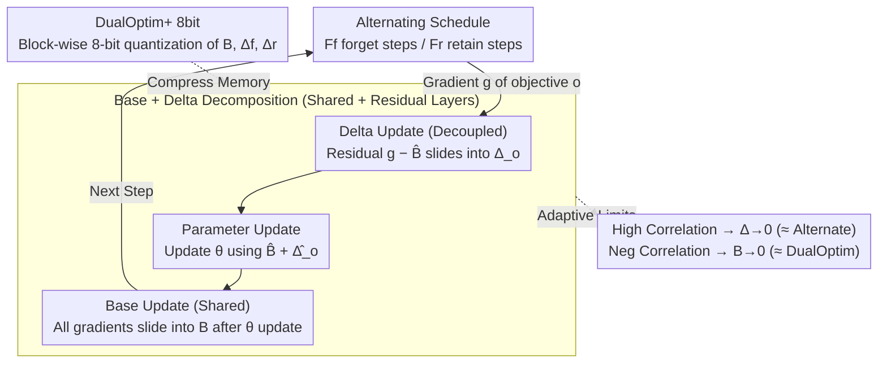

# DualOptim+: Bridging Shared and Decoupled Optimizer States for Better Machine Unlearning in Large Language Models

**Conference**: ICML 2026  
**arXiv**: [2605.21539](https://arxiv.org/abs/2605.21539)  
**Code**: https://github.com/CityU-MLO/DualOptimPlus  
**Area**: LLM Safety / Machine Unlearning / Optimizers  
**Keywords**: Machine Unlearning, Optimizer States, Gradient Conflict, 8-bit Quantization, AdamW

## TL;DR
DualOptim+ decomposes Adam optimizer states into a "shared base state + decoupled delta state." This allows LLM machine unlearning to adaptively transition between shared and decoupled optimizers as forget/retain gradients fluctuate between synergy and conflict. Theoretically, it reduces to Alternate (positively correlated) and DualOptim (negatively correlated), while an 8-bit quantized variant compresses the extra memory overhead back to baseline levels.

## Background & Motivation

**Background**: Machine Unlearning (MU) requires models to erase the influence of a forget set while maintaining the utility of a retain set. Current MU for LLMs primarily relies on joint optimization of a forget loss $\mathcal{L}_f$ (GA / NPO / ME / RMU) and a retain loss $\mathcal{L}_r$ (CE / KL). Optimization strategies have evolved through three generations:
- **Joint** (single-step backpropagation after summation; the former de facto standard before DualOptim) – Simple, but gradient merging leads to degradation.
- **Alternate** (using the gradient of only one objective per step) – Mitigates degradation but is unstable and sensitive to hyperparameters.
- **DualOptim** (two independent AdamW optimizers with separate states) – Effective for vision tasks, but offers only marginal gains when ported to LLMs.

**Limitations of Prior Work**: The authors observe that the cosine similarity between forget and retain gradients in LLM unlearning **fluctuates drastically** during training—starting positively correlated (signal sharing) and becoming negatively correlated or nearly orthogonal later (conflict). Joint optimization loses adversarial signals by using a single shared state, while DualOptim loses synergistic signals through complete decoupling. Neither can achieve optimal performance throughout the entire LLM training process.

**Key Challenge**: A rigid "shared vs. decoupled" choice cannot adapt to the dynamic gradient correlation changes in LLM training; an ideal optimizer should adaptively transition between the two based on current correlation.

**Goal**: (1) Construct a plug-and-play optimizer framework that dynamically interpolates between shared and decoupled states based on the directional correlation of $\nabla \mathcal{L}_f$ and $\nabla \mathcal{L}_r$; (2) Cover scenarios including fictitious unlearning, real unlearning, safety alignment, and multi-task learning; (3) Resolve the memory expansion caused by additional optimizer states.

**Key Insight**: Decompose AdamW's first and second moments into a "shared base + per-objective delta." The base is updated with all gradients (capturing commonalties), and the delta is updated with the "objective gradient − base" (capturing differences). Parameters are updated using the sum of base and the corresponding delta. This naturally yields an adaptive transition: for high correlation, delta $\to 0$ (reduces to Alternate); for strong negative correlation, base $\to 0$ (reduces to DualOptim).

**Core Idea**: Base/delta decomposition + adaptive transition = "An optimal intermediate between shared and decoupled states" at the optimizer level.

## Method

### Overall Architecture

DualOptim+ enables the LLM unlearning optimizer to adaptively slide between "sharing one state" and "using independent states" as the correlation between forget/retain gradients changes. It splits each AdamW optimizer state (first moment $m$, second moment $v$) into two layers: a **shared base state** $B$ for directions agreed upon by both forget and retain objectives, and **delta states** $\Delta_f, \Delta_r$ for unique, adversarial components of each objective. At each step, parameters are updated using the base plus the current objective's delta. Combined with an alternating schedule of $F_f$ forget steps and $F_r$ retain steps, the base is updated after the parameter update to maintain a stable shared reference.

### Key Designs

**1. Base and Delta Decomposition: Splitting states into "shared + residual" layers to retain both signals**

Joint optimization merges gradients and erases adversarial signals, while DualOptim decouples them and loses synergistic signals. DualOptim+ avoids this trade-off. When updating objective $o$, the base state computes the shared direction via $B \leftarrow \beta B + (1-\beta)\nabla\mathcal{L}_o$. The delta state only captures the residual after subtracting the base: $\Delta_o \leftarrow \beta \Delta_o + (1-\beta)(\nabla\mathcal{L}_o - \hat B)$. Second moments $v_B, v_{\Delta_o}$ use squared gradients similarly with bias correction $\hat B = B/(1-\beta^t)$. The final parameter update combines both layers:

$$\theta \leftarrow \theta - \eta\,\frac{\hat B + \hat \Delta_o}{\sqrt{|\hat v_B + \hat v_{\Delta_o}|} + \epsilon}$$

Commonalities flow through the base while differences flow through the delta, ensuring both signals contribute to the update.

**2. Adaptive Transition: Structural transition without explicit correlation detection**

The decomposition ensures that the relative magnitudes of base and delta change automatically with gradient correlation. Theorem 3.2 provides closed-form limits: if $\mathbb{E}_t[g_{f,t}] = mG$ and $\mathbb{E}_t[g_{r,t}] = nG$, when gradients are positively correlated ($m=n$), $B \to mG$ and $\Delta_{f,r}\to 0$, reducing the optimizer to Alternate. When strongly negatively correlated ($m = -\frac{1-\beta^{F_r}}{\beta^{F_r}(1-\beta^{F_f})}n$), $B \to 0$ and only deltas matter, reducing it to DualOptim. This allows the model to remain at the "optimal intermediate" throughout training without hyperparameter tuning.

**3. DualOptim+ 8bit: Quantizing extra states to 8-bit to match vanilla AdamW memory**

Maintaining base + delta states roughly doubles the optimizer state memory (additional first and second moments). To address this, the authors employ block-wise 8-bit quantization (following bitsandbytes) for $B, \Delta_f, \Delta_r$. This compresses the overhead back to baseline levels. The performance gap between the 8-bit and FP32 versions is reported to be negligible (< 0.3 OVR points).

### Loss & Training

The alternating frequency is controlled by $F_f$ and $F_r$, set to 1:1 in experiments. The base is updated **after** the parameter update to provide a stable reference for the delta, a combination that proves more stable than simple alternating updates.

## Key Experimental Results

### TOFU Fictitious Unlearning (Phi-1.5, IDK+GD Objectives)

| Forget Prop. | Method | UFE↑ | TFE↑ | MU↑ | OVR↑ |
|----------|------|------|------|-----|------|
| 10% | Joint | 78.1 | 50.6 | 60.2 | 62.3 |
| 10% | Alternate | 80.7 | 56.8 | 64.5 | 66.6 |
| 10% | DualOptim | 81.2 | 58.3 | 65.0 | 67.4 |
| 10% | **DualOptim+** | **84.8** | **62.7** | **68.1** | **70.9** |
| 10% | DualOptim+ 8bit | 84.5 | 62.4 | 67.9 | 70.7 |

OVR increases by ~3.5 points; unlearning efficiency (UFE / TFE) and model utility (MU) improve simultaneously without trade-offs.

### Real Unlearning + Safety Alignment (Selected Data)

| Task | Data | Joint OVR | DualOptim OVR | **DualOptim+ OVR** |
|------|------|---------|--------------|------|
| WMDP-Bio (Llama 2-7B) | Real Unlearning | 51.2 | 54.7 | **58.9** |
| WMDP-Cyber | Real Unlearning | 49.6 | 52.3 | **56.4** |
| Harm-Refuse | Safety Alignment | 62.8 | 66.1 | **70.2** |

Consistent lead of 4–5 points across tasks.

### Optimizer Update Similarity (Values from Figure 2)

- Alternate (Shared State): Cosine similarity of adjacent forget/retain updates ≈ 0.95 (signals merged).
- DualOptim (Fully Decoupled): ≈ 0.0 (signals independent).
- **DualOptim+**: ≈ 0.4–0.6 (between the two, fluctuating dynamically during training).

This directly validates the "adaptive transition" hypothesis.

### Key Findings
- **Gradient correlation is indeed dynamic**: Figure 2(b) shows cosine similarity fluctuating between [-0.5, 0.7], proving that static shared/decoupled strategies are suboptimal.
- **DualOptim+ is a suitable intermediate**: The observed similarity of 0.4–0.6 aligns with theoretical limits.
- **Quantization is lossless**: The < 0.3 OVR difference makes it engineering-ready.
- **Cross-optimizer migration**: Effectiveness on Muon (Appendix) demonstrates the universality of the base/delta decomposition.

## Highlights & Insights
- **Adaptivity at the Optimizer Level**: Unlike manual weight scheduling or explicit projection, this method embeds "transitioning" into the optimizer state structure, requiring no external signals.
- **Clean Theoretical Limits**: Theorem 3.2 provides asymptotic behaviors that match Alternate and DualOptim at the boundaries, offering a rare theoretical grounding for an intermediate method.
- **Engineering Awareness**: The use of 8-bit quantization acknowledges that 2× state overhead is a blocker for LLM deployment.
- **Potential Beyond Unlearning**: This decomposition is essentially a multi-objective optimizer framework. It shows potential for RLHF/DPO + KL regularization or multi-expert distillation.

## Limitations & Future Work
- Extension to more than 2 objectives is non-trivial, as memory scales with $1 + k$ states.
- $F_f, F_r$ remain manual hyperparameters; automated scheduling based on current correlation would be superior.
- Primarily validated on models $\le$ 7B; performance on 70B+ models remains untested.
- Comparisons with concurrent methods (e.g., GradDiff, SimNPO) regarding long-term utility recovery could be more detailed.

## Related Work & Insights
- **vs. DualOptim**: DualOptim fully decouples states and loses synergy; DualOptim+ introduces a shared base for adaptive transition.
- **vs. Joint / Alternate**: Both are single-point strategies; DualOptim+ represents a continuous family of behaviors.
- **vs. Federated Learning (SCAFFOLD / FedProx)**: The base/delta decomposition is structurally similar to server/client control variables in SCAFFOLD but applied to unlearning with different update rules.
- **Insight**: Any training problem with "dynamic multi-objective correlation" (RLHF, multimodal alignment) could benefit from base/delta decomposition.

## Rating
- Novelty: ⭐⭐⭐⭐ Simple but effective decomposition; the "adaptive intermediate" framing is a genuine contribution.
- Experimental Thoroughness: ⭐⭐⭐⭐⭐ Comprehensive coverage of TOFU, WMDP, safety alignment, and multi-tasking, including quantization and cross-optimizer tests.
- Writing Quality: ⭐⭐⭐⭐ Clear motivation and clean theoretical limits in Theorem 3.2.
- Value: ⭐⭐⭐⭐ Meets a high demand for LLM unlearning safety and compliance; one of the strongest optimizer-side improvements for TOFU/WMDP.

<!-- RELATED:START -->

## Related Papers

- [\[CVPR 2026\] VL-Eraser: Vacuum Distillation for Machine Unlearning in Vision-Language Models](../../CVPR2026/llm_safety/vl-eraser_vacuum_distillation_for_machine_unlearning_in_vision-language_models.md)
- [\[ACL 2025\] MMUnlearner: Reformulating Multimodal Machine Unlearning in the Era of Multimodal Large Language Models](../../ACL2025/llm_safety/mmunlearner_reformulating_multimodal_machine_unlearning_in_the_era_of_multimodal.md)
- [\[CVPR 2026\] SineProject: Machine Unlearning for Stable Vision–Language Alignment](../../CVPR2026/llm_safety/sineproject_machine_unlearning_for_stable_vision_language_alignment.md)
- [\[ICML 2026\] Forget to Know, Remember to Use: Context-Aware Unlearning for Large Language Models](forget_to_know_remember_to_use_context-aware_unlearning_for_large_language_model.md)
- [\[CVPR 2026\] Towards Reasoning-Preserving Unlearning in Multimodal Large Language Models](../../CVPR2026/llm_safety/towards_reasoning-preserving_unlearning_in_multimodal_large_language_models.md)

<!-- RELATED:END -->
