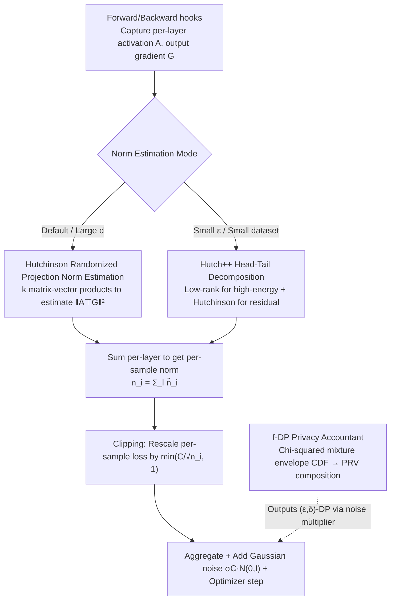

# Efficient DP-SGD for LLMs with Randomized Clipping

**Conference**: ICML 2026  
**arXiv**: [2605.24879](https://arxiv.org/abs/2605.24879)  
**Code**: None  
**Area**: LLM Safety / Differential Privacy / Efficient Training  
**Keywords**: DP-SGD, Randomized Clipping, Stochastic Trace Estimation, Hutchinson, Long-context LLM

## TL;DR
This paper proposes DP-SGD-RC, which replaces the exact per-sample gradient norm calculation in DP-SGD with Hutchinson / Hutch++ stochastic trace estimation. This reduces the memory overhead of long-context LLM training from $O(B\min\{T^2,d^2\})$ to $O(BkT+kp)$. It also provides a tight $f$-DP analysis based on a chi-squared mixture envelope CDF. On Llama-3.2-1B long-context fine-tuning, it maintains accuracy while reducing peak memory of the largest linear layer by approximately 40% and saving FLOPs by approximately 2×.

## Background & Motivation

**Background**: DP-SGD is the de facto standard for providing provable privacy protection in LLM training. It adds two operations to standard SGD: per-sample gradient clipping and Gaussian noise addition. To avoid the astronomical memory overhead of $O(BLd^2)$ in naive implementations, the community relies on Fast Gradient Clipping (FGC, $O(Bd^2)$) and Ghost Clipping (GC, $O(B)$ for linear-like layers) to bring DP-SGD compute costs closer to non-private training.

**Limitations of Prior Work**: The aforementioned memory savings only hold for non-sequential inputs. For text inputs with sequence length $T$, the memory complexity of the better of FGC and GC degrades to $O(B\min\{d^2,T^2\})$. Modern LLM contexts easily reach $O(100\text{K})$, and this "quadratic" overhead directly hits hardware limits; even fine-tuning a 1B model with a 4K context becomes constrained.

**Key Challenge**: The bottleneck of DP-SGD lies not in noise addition but in calculating the exact per-sample gradient norm $\|A_i^\top G_i\|_F^2$. This step requires either explicitly storing gradients ($d^2$) or explicitly storing $AA^\top$ or $GG^\top$ ($T^2$). As long as "exact norms + deterministic clipping" are pursued, the quadratic term related to sequence length cannot be eliminated.

**Goal**: To reduce the memory and compute overhead of long-context DP-SGD from $T^2/d^2$ scales to $O(BkT)$, which is of the same order as non-private training, without incurring significant privacy or utility penalties. This requires addressing three things: (i) finding a mathematically equivalent yet memory-efficient way to calculate the norm; (ii) performing new privacy analysis for "randomized" clipping; and (iii) integrating the analysis into a functional numerical accountant.

**Key Insight**: The authors rewrite the norm calculation as trace estimation—$\|A^\top G\|_F^2 = \mathrm{trace}(G^\top AA^\top G)$. Once viewed as a trace, classical stochastic trace estimators (Hutchinson, Hutch++) can be used to approximate it using only $k$ matrix-vector products, compressing storage to $O(k(T+d+p))$, where $k\approx 32$ is sufficient.

**Core Idea**: Replace the "exact norm + deterministic clipping" in DP-SGD with "stochastic trace estimated norm + same clipping rule," then analyze the privacy loss resulting from this "clipping scale randomization" using $f$-DP, and finally output standard $(\varepsilon,\delta)$-DP via a PRV-based numerical accountant.

## Method

### Overall Architecture
DP-SGD-RC does not reinvent DP-SGD but modifies only the most expensive step. The original DP-SGD calculates the gradient norm for each sample in a first backward pass, rescales the per-sample loss by $\min(C/\sqrt{n_i},1)$, and performs a second backward pass to aggregate, add noise, and step the optimizer. Its memory limit is the "exact norm calculation." This paper replaces that step with stochastic trace estimation: for each linear-like layer, a forward hook captures activation $A\in\mathbb{R}^{B\times T\times d}$ and a backward hook captures output gradient $G\in\mathbb{R}^{B\times T\times p}$. A norm estimation routine (defaulting to Hutchinson, or Hutch++ for small $\varepsilon$) returns an approximate $\|\hat n_i^{(l)}$, which is summed per layer to get $n_i=\sum_l \hat n_i^{(l)}$. The rest of the pipeline remains unchanged. The implementation uses forward/backward hooks, passing through each layer once, with a total cost of 1 forward plus 2 backward passes—comparable to FGC but with significantly lower per-layer peak memory. This is paired with a new $f$-DP privacy accountant to determine the privacy loss from "clipping scale randomization" and set the noise multiplier accordingly.

### Key Designs

**1. Hutchinson Randomized Projection for Norm Estimation: Amortizing exact norm calculation into $k$ matrix-vector products**

The root of quadratic memory in DP-SGD is the exact calculation of the layer norm $\|A^\top G\|_F^2$, requiring either per-sample gradients ($O(d^2)$) or $T\times T$ intermediate matrices ($O(T^2)$). Both are prohibitive for long contexts. The key observation is that DP-SGD only needs the scalar "norm," which does not need to be exact. By rewriting the norm as a trace $\|A^\top G\|_F^2 = \mathrm{trace}(G^\top AA^\top G) = \mathrm{trace}(O)$, one can apply the Hutchinson stochastic trace estimator $\widehat{n} = \mathrm{trace}(P^\top OP) = \|(P^\top G^\top)^\top A\|_F^2$, where $P\in\mathbb{R}^{p\times k}$ and $P_{uv}\sim\mathcal{N}(0,1/k)$. Implementation-wise, one calculates $Y = A^\top(GP)$ and then $\|Y\|_F^2$, avoiding explicit construction of per-sample gradients or $T\times T$ matrices. Per-layer intermediate storage drops from $O(\min\{d^2,T^2\})$ to $O(k(T+d+p))$. Classical analysis ensures $(1\pm\alpha)$ relative accuracy with $k=O(\log(1/\beta)/\alpha^2)$, and $k=32$ is sufficient in experiments. This eliminates the quadratic terms for both sequence length $T$ and layer widths $p, d$.

**2. Hutch++ Head-Tail Decomposition: Reducing variance for small $\varepsilon$ regimes**

At small $\varepsilon$, noise is higher, making the system sensitive to norm errors. The variance of pure Hutchinson becomes a bottleneck. Hutch++ decomposes the spectrum of $O=(A^\top G)(A^\top G)^\top$ into "head" and "tail" components. It uses a set of random matrices $S$ to estimate an orthonormal basis $Q$ for $\mathrm{Col}(OS)$ for a low-rank approximation $\mathrm{trace}(Q^\top OQ)$ to capture the "head," and then applies Hutchinson only to the "tail" in the residual subspace $(I-QQ^\top)$. The final estimate is $\|(QG^\top)A\|_F^2 + \|(PG^\top)A - (((PG^\top)A)Q)Q^\top\|_F^2$. Theoretically, the error improves from $O(\log(1/\beta)/\alpha^2)$ to $O(\sqrt{\log(1/\beta)}/\alpha)$, approaching the lower bound for matrix-vector query models. The cost is 3× more matrix-vector products and one QR decomposition, so it is not the default. When $d$ is large, the privacy envelopes of Hutch and Hutch++ nearly overlap, making the faster Hutch preferable; however, in extreme scenarios like the BBC dataset with $\varepsilon=0.7$, Hutch++ acts as a mild regularizer due to lower variance, improving accuracy from 64.3% to 70.6%.

**3. $f$-DP Privacy Accountant based on Chi-squared Mixture Envelopes: Enabling randomized clipping for existing accountants**

Once the clipping scale is randomized, the added noise remains Gaussian, but the "scale" is stochastic, meaning traditional RDP/PRV accountants cannot be directly applied. The authors explicitize this randomness: the single-step privacy analysis reduces to a trade-off function $T(Z,\mathcal{N}(Z/\sigma,1)\,\|\,Z,\mathcal{N}(0,1))$, where $Z=\|Q_0\|/R(Q_0)$ is the "true norm divided by the estimated norm." For Hutchinson, $Z^2(\lambda)\sim \|\lambda\|_1 / \sum_i\lambda_i\chi^2(k)$ depends on the spectrum $\lambda$ of the gradient. Using stochastic ordering and majorization tools, the authors prove that the envelope CDF over the simplex $\lambda\in\Delta^{d-1}$ has a three-segment structure: a weighted $\chi^2$ mixture on the left, a two-element mixture $\frac{\lambda}{ik}\chi^2(ik)+\frac{1-\lambda}{jk}\chi^2(jk)$ in a narrow middle interval, and a single $\chi^2$ on the right. They provide a binary search algorithm for $x_+\in[1,2]$ to define these boundaries. Once the envelope CDF of $Z$ is calculated, the problem reduces to calculating weighted integrals of two $\Phi$ functions. The accountant then performs Riemann–Stieltjes weighted integration on the Gaussian kernel via the envelope CDF to obtain $\alpha(t), \beta(t)$, which are composed via PRV and subsampling amplification to output $(\varepsilon, \delta)$-DP. During this derivation, the authors found and corrected a bug in a 2003 theorem by Székely–Bakirov concerning chi-squared mixture envelopes.

### Loss & Training
The training objective is identical to standard DP-SGD: the original task loss (cross-entropy or NLL) plus individual $\ell_2$ gradient clipping to a threshold $C$, followed by the addition of isotropic Gaussian noise $\sigma C\cdot\mathcal{N}(0,I)$. Optimizers used are SGD or Adam. Experiments set $\delta\in\{10^{-5},10^{-6}\}$, $\varepsilon\in\{0.7,2,9\}$, $k=32$, and context lengths fixed at 4096, covering both full fine-tuning and LoRA modes.

## Key Experimental Results

### Main Results

Full fine-tuning of Llama-3.2-1B (mean and std of 3 random seeds):

| Dataset (Task) | Metric | Non-private | DP-SGD (FGC) $\varepsilon=9$ | DP-SGD-RC ($k=32$) $\varepsilon=9$ | DP-SGD $\varepsilon=2$ | DP-SGD-RC $\varepsilon=2$ |
|---|---|---|---|---|---|---|
| BBC (Cls) | Acc ↑ | 95.20±0.51% | 96.33±0.59% | 96.40±0.22% | 94.06±0.12% | 95.60±0.37% |
| BillSum (Summ) | ROUGE-1 ↑ | 0.4928±0.0027 | 0.4882±0.0011 | 0.4864±0.0013 | 0.4831±0.0005 | 0.4796±0.0018 |
| HotpotQA (QA) | EM ↑ | 61.06±0.39% | 61.44±0.05% | 61.42±0.08% | 61.35±0.03% | 61.31±0.09% |

Results for LoRA fine-tuning were similar: a <0.4% drop on BBC and a 0.005 drop in ROUGE on BillSum, consistent with full fine-tuning scales.

### Ablation Study

Hutch vs Hutch++ under low budget $\varepsilon=0.7, \delta=10^{-5}$ (BBC full fine-tuning):

| Method | Projection dim $k$ | Noise multiplier | Accuracy (%) |
|---|---|---|---|
| DP-SGD (FGC) | N/A | 4.073 | 67.07±5.26 |
| DP-SGD-RC w/ Hutch | 32 | 4.354 | 64.29±6.77 |
| DP-SGD-RC w/ Hutch++ | 32 | 4.354 | **70.59±3.49** |

Efficiency ablation (Llama-3.2-1B largest linear layer $8192\times 2048$, $T=4096$, $k=32$, relative to DP-SGD baseline):

| Metric | Hutch Saving | Hutch++ Saving |
|---|---|---|
| Peak VRAM (incl. input) | 39.18% | 38.57% |
| Peak VRAM (excl. input) | 99.22% | 97.65% |
| FLOPs (Max layer / Min layer) | 98.05% / 92.19% | 92.17% / 68.69% |
| Latency (A100 80GB) | ≈3× faster than Hutch++ | — |

### Key Findings
- **Norm estimation accuracy is not always better**: In the small $\varepsilon$ regime, Hutch++ is an order of magnitude more accurate than Hutch (Fig. 11), but the authors suggest noisy norms act as a form of regularization; thus, Hutch++ outperforms Hutch by 6 percentage points at $\varepsilon=0.7$. For $\varepsilon\ge 2$ and $d\gtrsim 128$, the envelopes merge, making the faster Hutch more efficient.
- **VRAM savings are capped by the projection matrix**: When $k$ increases to 4096, the projection matrix $P\in\mathbb{R}^{p\times k}$ begins to dominate VRAM, nullifying savings. The authors note that using 1-bit $\{-1,+1\}$ projection matrices could further compress this but require re-proving privacy.
- **Larger layers benefit more**: A $8192\times 2048$ layer achieves ~40% peak VRAM savings, while a $2048\times 512$ layer only achieves ~15%. This implies that benefit will be more pronounced in frontier-scale LLMs with larger $p, d, T$.

## Highlights & Insights
- **"Per-sample norm" recast as "Trace Estimation"**: Translating "per-sample gradient norm"—long an engineering bottleneck for DP-SGD—into trace estimation allows for the direct application of 30-year-old randomized linear algebra tools. This perspective of mapping private ML sub-problems to linear algebra problems is highly reusable.
- **$f$-DP analysis template for randomized clipping**: The "envelope CDF + PRV numerical integration" pipeline is generalizable. By replacing the distribution of $Z$, one can integrate any "Gaussian noise with stochastic scale" mechanism into existing accountants. This provides a framework for future sketched-gradient or low-rank DP-SGD methods.
- **Correction of the Székely–Bakirov 2003 bug**: The authors identified a counter-example to the original theorem's characterization of the middle-interval envelope and provided the correct three-interval form. This is a purely probabilistic byproduct that benefits any future work involving "extreme distributions of chi-squared convex combinations."

## Limitations & Future Work
- **Assumptions in Hutch++ privacy analysis**: To remain tractable, the authors assume the adversary knows the intermediate state of the head low-rank estimate, resulting in conservative noise multipliers for Hutch++. Relaxing this could make Hutch++ superior even in moderate $\varepsilon$ regimes.
- **Savings limited to linear-like layers**: Attention, convolutional, and linear layers benefit, but RMSNorm, element-wise ops, and custom operators still require explicit per-sample gradient construction. Future architectures like Mamba or MoE may require re-evaluation.
- **Projection matrix as an Achilles' heel**: At $k\ge 4096$, the random matrix itself fills memory. The authors leave $\{\pm1\}$ 1-bit or sparse hashing projections for future work, which requires re-calculating the envelope CDF.
- **Scale of experiments**: Evaluated only up to Llama-3.2-1B with 4096 context. The method's advantages should maximize when $T\gg d$, but a frontier-scale validation (70B+, 100K+ context) is still missing.

## Related Work & Insights
- **vs DP-SGD-JL (Bu et al., 2021)**: DP-SGD-JL uses JL projection on flattened gradients for $T=1$ linear layers, requiring $k+1$ forward passes (JVP mode). This paper targets $T>1$ and projects on the factored form $A^\top G$, requiring only 1 forward + 2 backward passes. It can be viewed as a generalization of DP-SGD-JL for sequential data.
- **vs Fast Gradient Clipping (FGC, Lee & Kifer 2021)**: FGC avoids explicit per-sample gradients via loss rescaling but still materializes gradients layer by layer, leading to $O(BTd^2)$ VRAM for long contexts. DP-SGD-RC eliminates the "per-layer materialization," removing quadratic terms for both sequence length and width.
- **vs Ghost Clipping (GC, Li et al. 2021) / Mixed-Ghost (Bu et al. 2023)**: GC costs $O(BT^2)$, which is detrimental for long contexts. Mixed-Ghost chooses between FGC/GC but remains an "exact norm" approach. DP-SGD-RC is an orthogonal approach—trading approximation for memory—and can be combined with engineering optimizations like Book-keeping.
- **vs Low-Rank DP-SGD (Yu et al. 2022)**: That line of work restricts private updates to a low-rank subspace to save noise budget and parameters. This paper maintains full-rank updates and reduces resources specifically for the "norm calculation" step; the two are complementary.

## Rating
- **Novelty**: ⭐⭐⭐⭐⭐ First method to remove $T^2/d^2$ terms in long-context DP-LLM training by mapping norm calculation to stochastic trace estimation.
- **Experimental Thoroughness**: ⭐⭐⭐⭐ Covers Llama-3.2-1B, three tasks, multiple $\varepsilon$, LoRA/full tuning, and VRAM/FLOPs/latency; lacks frontier-scale validation.
- **Writing Quality**: ⭐⭐⭐⭐ Algorithm, analysis, accountant, and experiments are well-structured; the privacy analysis is dense but rigorous.
- **Value**: ⭐⭐⭐⭐⭐ Directly addresses the engineering bottleneck of long-context DP-LLMs; the envelope-CDF + PRV template is highly reusable for future randomized DP mechanisms.

<!-- RELATED:START -->

## Related Papers

- [\[ACL 2026\] Fast-MIA: Efficient and Scalable Membership Inference for LLMs](../../ACL2026/llm_safety/fast-mia_efficient_and_scalable_membership_inference_for_llms.md)
- [\[ICML 2026\] Memory as a Markov Matrix: Sample Efficient Knowledge Expansion via Token-to-Dictionary Mapping](memory_as_a_markov_matrix_sample_efficient_knowledge_expansion_via_token-to-dict.md)
- [\[ICML 2026\] PipeSD: An Efficient Cloud-Edge Collaborative Pipeline Inference Framework with Speculative Decoding](pipesd_an_efficient_cloud-edge_collaborative_pipeline_inference_framework_with_s.md)
- [\[ICML 2026\] Multilingual Unlearning in LLMs: 转移、动力学与可逆性](multilingual_unlearning_in_llms_transfer_dynamics_and_reversibility.md)
- [\[ICML 2026\] Gradient Transformer: Learning to Generate Updates for LLMs](gradient_transformer_learning_to_generate_updates_for_llms.md)

<!-- RELATED:END -->
