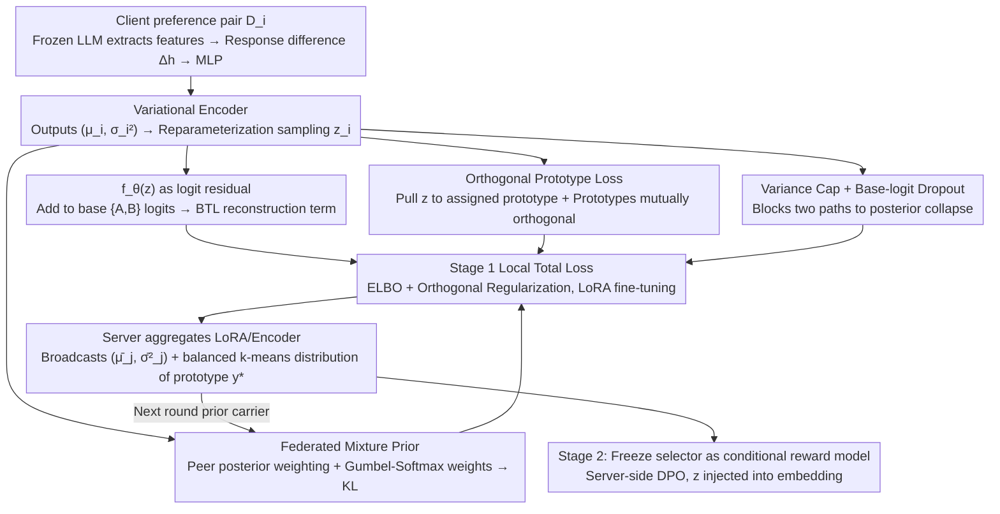

# Federated Variational Preference Alignment with Gumbel-Softmax Prior for Personalized User Preferences

**Conference**: ICML 2026  
**arXiv**: [2605.30873](https://arxiv.org/abs/2605.30873)  
**Code**: To be confirmed  
**Area**: Alignment RLHF / Federated Learning / LLM Personalization  
**Keywords**: Federated Preference Alignment, Variational Inference, Gumbel-Softmax Mixture Prior, Posterior Collapse, Personalized RLHF

## TL;DR
This paper proposes FedVPA-GP: under the privacy constraints of Federated Learning (FL), it models each client's preference as a continuous latent variable $z$ using "client mixture priors + Gumbel-Softmax learnable weights + orthogonal prototype loss." This fundamentally fixes the "posterior collapse" encountered when directly applying Variational Preference Learning (VPL) to FL, allowing a single reward model to dynamically switch between conflicting preferences such as "helpful" and "harmless."

## Background & Motivation
**Background**: Current mainstream LLM alignment pipelines (RLHF / DPO / IPO / KTO) assume that preference data can be centralized to train a global reward model. To bypass privacy and compliance constraints, federated solutions like FedDPO and FedBiscuit have recently emerged, allowing RLHF to be completed locally on clients, exchanging only gradients or lightweight selectors.

**Limitations of Prior Work**: All these federated schemes assume that human preferences can be fitted by a monolithic reward function. However, datasets like HH-RLHF show that "helpful" and "harmless" demands are often in direct conflict. Averaging heterogeneous preferences across clients into a consensus model is equivalent to forcibly creating a non-existent "common denominator," resulting in poor performance for both objectives.

**Key Challenge**: Personalization requires building a preference representation for each user/client. However, in a federated setting, each client has extremely few samples and highly heterogeneous distributions (in extreme cases, only "helpful" or "harmless" preferences are seen). If centralized VPL is directly applied, the KL regularization term overwhelms the reconstruction term, pulling the posterior distribution back to $\mathcal{N}(0, I)$. This leads to classical "posterior collapse"—where the latent variable $z$ loses information and the personalization mechanism fails (as shown in Figure 2(a), where the $z_{\text{VPL}}$ of FedVPL is completely clustered together).

**Goal**: To achieve local variational inference for each client that is (a) stable (avoiding breakdown due to data sparsity) and (b) decoupled (clearly separating different preference modes in the latent space) without exchanging raw preference data.

**Key Insight**: The authors observe that "local sparsity" is essentially a "lack of global context," while the FL population distribution can serve as a dynamic prior. Instead of raw data, the posterior statistics $(\bar\mu_j, \bar\sigma_j^2)$ are transmitted, allowing each client to treat "others' posteriors" as its own prior. By adding a geometric constraint that "explicitly makes prototypes orthogonal to each other," the encoder is forced to project different preferences into distinct subspaces.

**Core Idea**: Replace the standard Gaussian prior with a "weighted mixture of peer posteriors" and use Gumbel-Softmax to make mixture weights learnable for each client. Then, use an orthogonal prototype loss to fix the "helpful mode" and "harmless mode" onto orthogonal directions in the latent space, simultaneously resolving "training instability" and "posterior collapse."

## Method

### Overall Architecture
FedVPA-GP follows the two-stage paradigm of FedBiscuit (federated training of a lightweight selector followed by conditional RLHF on the server), but replaces the core selector with a variational module. The base LLM (Qwen-2 0.5B / Gemma-2B) remains frozen, with trainable parts accounting for only approximately 0.18% of the parameters, encoding each client's preference into a continuous latent variable $z$. The crux of the method is preventing posterior collapse, achieved through three interlocking designs: federated mixture prior, orthogonal prototype loss, and variance capping + base-logit dropout. These stabilize training and separate conflicting preferences on sparse and heterogeneous federated data.

### Key Designs

**1. Federated Mixture Prior + Gumbel-Softmax Learnable Weights: Using "Others' Posteriors" as Prior**

Moving VPL’s fixed standard Gaussian prior $\mathcal{N}(0,I)$ to FL is equivalent to providing "no global guidance." When local data is sparse, the KL term pulls the posterior directly back to the origin. FedVPA-GP reformulates the prior as a weighted mixture of peer posteriors $p_{\text{mixture}}^{(i)}(z) = \sum_{j \in \mathcal{S}} w_j \mathcal{N}_j(z)$, where each $\mathcal{N}_j$ is the posterior uploaded by peer $j$ in the previous round—exchanging only $(\bar\mu_j, \bar\sigma_j^2)$ totals 256 bytes, significantly smaller than LoRA adapters. Weights cannot be simply averaged, as clients with conflicting preferences would drag each other down. Thus, Gumbel-Softmax reparameterization $w_j = \mathrm{softmax}((\log\pi_j + g_j)/\tau)$ is used to learn $\pi_j$ end-to-end with the KL term. Each client maintains its own set of $\{\pi_j\}$ without federated averaging, preserving a local strategy of "whom to trust." This allows clients with the same preference mode to provide priors for each other while masking different modes, automatically achieving "neighbor selection." The KL term $\mathbb{D}_{KL}(q_i \,\|\, p_{\text{mixture}}^{(i)})$ is stably evaluated via log-sum-exp.

**2. Orthogonal Prototype Loss: Nailing a Discrete Skeleton to the Continuous Latent Space**

KL regularization alone cannot guarantee the separation of conflicting modes—t-SNE of FedVPL shows all $z$ bunched together. This work maintains $M$ learnable prototypes $\{\mathbf{p}_m\}_{m=1}^M$, initialized with QR decomposition to ensure strict orthogonality and distance from the origin. After each round of server aggregation, balanced $k$-means clusters the client means to assign a prototype label $y_i^*$ to each client (in HH-RLHF, $M=2$, corresponding to helpful/harmless axes). A local loss term $\mathcal{L}_{\text{ortho}}(z) = \|z - \mathbf{p}_{y_i^*}\|_2^2 + \gamma\|\mathbf{P}\mathbf{P}^T - \mathbf{I}_M\|_F^2$ is added. The first term pulls the current sample's $z$ toward its assigned prototype, while the second prevents prototypes from collapsing toward each other. This explicitly injects the inductive bias that "preference modes have a finite discrete structure" into the continuous latent space: it provides a clear geometric attractor for the encoder to resist posterior collapse and naturally provides addressable $z$ for the Stage 2 conditional policy. Increasing $M$ allows for finer-grained preference spectrums.

**3. Variance Cap + Base-logit Dropout: Blocking Two Escape Routes for Posterior Collapse**

The VAE community has long observed that KL is a target "easy to cheat"—if $q$ equals $p$, the KL is 0, and $z$ carries no information. Beyond the formulation, this paper adds two engineering safeguards: first, a hard truncation on the encoder's log-variance output $\log\sigma_i^2 \leftarrow \min(\log\sigma_i^2, \log\sigma_{\max}^2)$, preventing the encoder from "cheaply matching the prior" by blowing up $\sigma$. second, when the base LLM already provides strong prior signals (especially in small models like Qwen-2 0.5B), a Bernoulli dropout ($p_{\text{logit}}=0.5$) is applied to the base choice-logits. This forces $f_\theta(z)$ to take over the prediction responsibility, driving gradients back to $z$. For Gemma-2B, where the base signal is weaker, $p_{\text{logit}}$ is set to 0. These tactics block "increasing variance" and "relying on the base model," respectively, forming a robust defense against collapse alongside the previous designs.

### Mechanism
Using the HH-RLHF Non-IID scenario (half clients see helpful, half see harmless) as an example: **Stage 1 (Federated Selector Training)**: Client $i$ holds preference pairs $\mathcal{D}_i=\{(s_A, s_B, y)\}$. The local process involves extracting features from the frozen LLM → calculating response difference $\Delta h = h_{\text{chosen}} - h_{\text{rejected}}$ → feature extraction via MLP → variational encoder outputting $(\mu_i, \sigma_i^2)$ → reparameterization sampling $z_i$ → adding $f_\theta(z_i)$ as logit residual to base $\{A,B\}$ logits → calculating BTL preference likelihood for the reconstruction term. The local total loss is ELBO plus orthogonal regularization, with KL pushing $q_i$ toward the federated mixture prior. After a round, the server aggregates LoRA/encoder parameters, broadcasts the $(\bar\mu_j, \bar\sigma_j^2)$ of all participants (as the prior carrier), and assigns orthogonal prototype indices $y_i^*$ via parallel balanced $k$-means. **Stage 2 (Conditional RLHF)**: Once the selector is trained, it is frozen and used as a conditional reward model $\text{logits}(s_A, s_B \mid z)$. The server runs DPO locally for a policy conditioned on $z$—where $z$ is injected into input embeddings via z-to-embedding. The policy generates two responses on-policy, and the selector scores them given $z$ to obtain (chosen, rejected) pairs for DPO updates. This step uses only prompts and no user preference labels, offloading "expensive federated generation" to a single server.

### Loss & Training
The local total loss is given in Eq. (10):

$$\mathcal{L}_i(\theta, \phi) = \mathcal{L}_{\text{recon}} + \beta \cdot \mathbb{D}_{KL}(q_\phi(z\mid\mathcal{D}_i) \,\|\, p_{\text{mixture}}^{(i)}(z)) + \lambda \cdot \mathcal{L}_{\text{ortho}}(z)$$

Where $\mathcal{L}_{\text{recon}}$ is the negative log-likelihood of BTL preferences (input is base logits plus conditional logits from $f_\theta(z)$). Stage 1 uses LoRA fine-tuning + FedAvg to aggregate LoRA/encoder parameters ($\pi_j$ is not aggregated). Stage 2 runs DPO on the server, injecting $z$ via additive embeddings into the policy and using $\text{logits}(s_A, s_B \mid z)$ from the frozen selector as the reward. In HH-RLHF experiments, $K\in\{10,50,100\}$, sampling 5 or 10 clients per round; $M=2$ for helpful/harmless axes.

## Key Experimental Results

### Main Results
GPT-4o win-rate (%) on HH-RLHF, Non-IID split (50% helpful-only clients, 50% harmless-only clients).

| Base | Method | 10 Clients H/Hm | 50 Clients H/Hm | 100 Clients H/Hm |
|------|------|----------------|----------------|------------------|
| Qwen-2 0.5B | FedDPO | 48.12 / 77.34 | 43.05 / 69.22 | 41.48 / 67.15 |
| Qwen-2 0.5B | FedBiscuit | 48.85 / 75.12 | 44.21 / 71.45 | 42.33 / 69.42 |
| Qwen-2 0.5B | FedVPL (naive) | 62.24 / 84.56 | 54.18 / 78.12 | 53.05 / 77.34 |
| Qwen-2 0.5B | **FedVPA-GP** | **66.45 / 89.21** | **58.32 / 84.05** | **55.18 / 82.31** |
| Gemma-2B | FedDPO | 52.34 / 83.12 | 44.15 / 78.45 | 41.22 / 75.33 |
| Gemma-2B | FedBiscuit | 51.65 / 82.45 | 46.21 / 78.12 | 43.44 / 76.05 |
| Gemma-2B | FedVPL (naive) | 66.82 / 89.15 | 56.41 / 84.34 | 53.25 / 80.42 |
| Gemma-2B | **FedVPA-GP** | **73.21 / 96.34** | **64.48 / 95.12** | **60.15 / 92.45** |

FedVPA-GP achieves Pareto improvements on both models across all three scales. As the number of clients increases and local data becomes sparser, all baselines drop significantly, while the drop in the proposed method is the smallest, verifying the "anti-sparsity" effect of the mixture prior.

### Ablation Study

| Configuration | Key Metrics | Description |
|------|---------|------|
| FedVPL (naive) | 62.24 / 84.56 (Qwen, N=10) | Std Gaussian prior + no ortho; serves as lower bound |
| FedVPL + Ortho | Between naive and full | Adding only orthogonal loss already mitigates collapse |
| FedVPL + GB Prior | Between naive and full | Adding only mixture prior stabilizes sparse training |
| Full FedVPA-GP | 66.45 / 89.21 (Qwen, N=10) | Synergistic effect yields best trade-off |

Generalization to unseen clients (20 clients, 10 train / 10 test): FedVPA-GP maintains 63.16 / 91.23 on unseen clients, nearly equal to seen clients (65.28 / 94.25). FedVPL drops from 56.23 / 83.82 to 49.25 / 75.21, demonstrating that the learned latent space is continuous and semantic, adapting to new users via inference alone.

Unbalanced client ratios (H/Hm at 70/30, 30/70, 80/20, 20/80, Qwen N=10): FedVPA-GP leads FedBiscuit by ~17–20 points in helpful and 12–17 points in harmless. Gumbel-Softmax mixture weights automatically favor "minority peers," preventing minority preference modes from being overwhelmed.

### Key Findings
- **Visual Verification of Posterior Collapse**: t-SNE in Figure 3 shows red and blue points clumped together throughout FedVPL training, whereas FedVPA-GP separates the two latent variable types around orthogonal prototypes (∗) within a few rounds. This validates the synergy between the mixture prior (global context) and orthogonal loss (geometric skeleton).
- **Personalization with Near-Zero Deployment Cost**: The variational module has only ~0.9M parameters (0.18% of the base). Communication per round adds only 256 bytes ($\bar\mu, \bar\sigma^2$ are each 32-dim). Training latency is only 1.18× that of FedDPO, meaning any federated alignment pipeline using LoRA can replace its selector with this method.
- **Systematic Flaws of Monolithic Rewards**: The helpful win-rate of FedDPO/FedBiscuit on Qwen-2 plateaus or decreases as client numbers increase. This is due to heterogeneous preferences "canceling each other out," proving that "averaging first" is the wrong paradigm for conflicting preferences.

## Highlights & Insights
- **Turning FL's Weakness into a Prior**: FL is usually seen as a disaster for VPL (local sparsity + heterogeneity). This paper turns the "population posterior" into the most natural dynamic prior—requiring no raw data exchange while filling the missing global perspective of a single client. It is an elegant "fight fire with fire" solution.
- **Gumbel-Softmax on Prior Mixture Weights**: This makes the choice of "which peers to trust" an end-to-end learnable discrete selection, effectively embedding a "soft clustering" within variational inference. It is more robust than manual similarity metrics and can transfer to other personalized federated tasks.
- **Orthogonal Prototype Loss + Balanced $k$-means**: The authors explicitly declare an inductive bias: "preference space is a discrete mode structure with continuous fine-tuning." Orthogonal prototypes ensure independence between modes, while continuous $z$ captures individual differences. This "discrete skeleton + continuous filling" design could be applied to multi-objective alignment and multi-task personalization.
- **Double Insurance Against Collapse**: Variance capping and base-logit dropout are small but critical engineering details, reminding researchers to consider what "trivial solutions" can satisfy a loss function when designing variational models.

## Limitations & Future Work
- In HH-RLHF, $M=2$ aligns neatly with two axes. The stability of balanced $k$-means label assignment for larger $M$ or finer preference dimensions was not fully explored. When the preference spectrum is a continuous manifold rather than discrete clusters, orthogonal prototypes might be too strong a prior.
- Latent $z$ is a 32-dim "black-box direction." The paper does not provide a unified interface for selecting $z$ for new users during deployment; while Algorithm 1 mentions three ways (mean / $\bar\mu_i$ / online inference), analysis of online latency vs. privacy trade-offs is lacking.
- Experiments were conducted on base models ≤2B. On 70B+ models, base logits are already extremely strong; whether $p_{\text{logit}}$ should be further increased or hyperparameters $(\beta, \lambda)$ need re-searching was not verified.
- Regarding privacy, while raw data isn't transmitted, $(\bar\mu_j, \bar\sigma_j^2)$ might still leak statistics. Moving to strong privacy (DP-FedAvg) would require noise addition and re-analysis of the coupling with the KL term.
- The Impact Statement admits that extreme personalization might amplify user bias or form filter bubbles—a real issue in LLM alignment that might require placing safety constraints (harmless) on a "non-personalizable" whitelist.

## Related Work & Insights
- **vs FedBiscuit (Wu et al., 2024)**: Both train a "lightweight binary selector + frozen base + two-stage RLHF," but FedBiscuit uses a monolithic reward. This work upgrades the selector to a conditional variational model, making it a drop-in replacement.
- **vs FedDPO (Ye et al., 2024)**: FedDPO federates DPO gradients; this work federates the "posterior of preference latents" and keeps expensive policy DPO on the server. This decoupling is superior in communication and stability compared to full federated DPO.
- **vs Variational Preference Learning (Poddar et al., 2024)**: VPL assumes pooled data for stable posterior estimation. This paper answers "how to make VPL work in FL" by attributing posterior instability to "missing priors."
- **vs Multi-objective alignment (Rame et al., 2023)**: These methods combine weights or objectives; this paper combines at the latent level, reducing parameter costs and naturally supporting switching preferences via $z$ in a single policy.
- **vs VAE Posterior Collapse (Bowman et al., 2016)**: Studied extensively in the VAE community (KL annealing, free bits). This work introduces "geometric orthogonal prototypes" and "population mixture priors" to the FL preference alignment context as timely tools for the task.

## Rating
- Novelty: ⭐⭐⭐⭐ Adapting VPL to FL with a mixture prior + orthogonal proto scheme is a well-posed and novel contribution, though individual components have precedents.
- Experimental Thoroughness: ⭐⭐⭐ Main tables cover 2 models × 3 scales, including unseen client generalization and imbalance ablations, but use only one dataset (HH-RLHF) with $M=2$ and lacks verification on larger bases.
- Writing Quality: ⭐⭐⭐⭐ Motivation is clear (narrative of "posterior collapse as the root problem" is solid), pseudocode is complete, and reproducibility seems high.
- Value: ⭐⭐⭐⭐ Simultaneously addresses "how FL alignment handles conflicting preferences" and "how variational inference stays stable in FL," with direct implications for personalized and privacy-preserving LLM alignment.

<!-- RELATED:START -->

## Related Papers

- [\[ICML 2026\] Differentially Private Preference Data Synthesis for Large Language Model Alignment](differentially_private_preference_data_synthesis_for_large_language_model_alignm.md)
- [\[NeurIPS 2025\] A Systematic Evaluation of Preference Aggregation in Federated RLHF for Pluralistic Alignment of LLMs](../../NeurIPS2025/llm_safety/a_systematic_evaluation_of_preference_aggregation_in_federated_rlhf_for_pluralis.md)
- [\[ICML 2026\] From Volume to Value: Preference-Aligned Memory Construction for On-Device RAG](from_volume_to_value_preference-aligned_memory_construction_for_on-device_rag.md)
- [\[ICML 2025\] Reward-Augmented Data Enhances Direct Preference Alignment of LLMs](../../ICML2025/llm_safety/reward-augmented_data_enhances_direct_preference_alignment_of_llms.md)
- [\[ICML 2026\] Decoupled Training with Local Reinforcement Fine-Tuning in Federated Learning](decoupled_training_with_local_reinforcement_fine-tuning_in_federated_learning.md)

<!-- RELATED:END -->
