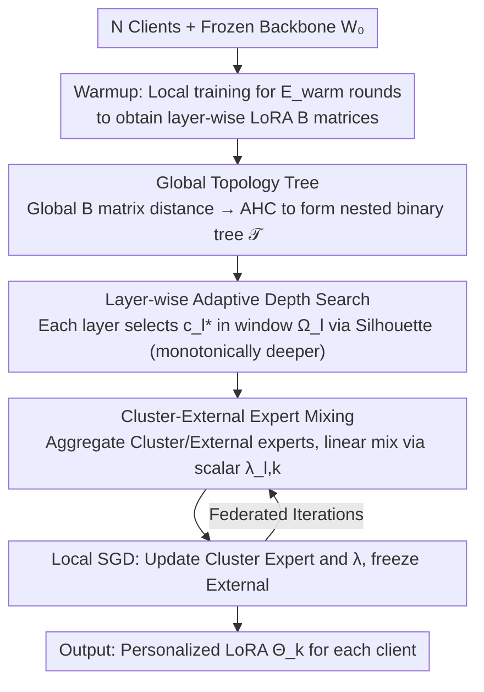

# FedTreeLoRA: Reconciling Statistical and Functional Heterogeneity in Federated LoRA Fine-Tuning

**Conference**: ICML2026  
**arXiv**: [2603.13282](https://arxiv.org/abs/2603.13282)  
**Code**: TBD  
**Area**: llm_safety (Federated Learning / Privacy-Preserving Fine-tuning)  
**Keywords**: Federated Learning, LoRA, Personalized Fine-tuning, Hierarchical Clustering, Heterogeneity  

## TL;DR
To address the fragmented treatment of "client data heterogeneity" and "LLM layer functional heterogeneity" in federated LoRA fine-tuning, FedTreeLoRA utilizes a global hierarchical clustering tree with layer-wise adaptive depth search. This allows shallow layers to be shared as much as possible while deep layers gradually differentiate. On GLUE and FLAN benchmarks, it improves average metrics from 91.19 / 61.77 to 92.36 / 63.19 with minimal parameter overhead.

## Background & Motivation

**Background**: The combination of LoRA and Federated Learning (FL) has become the de facto standard for privacy-preserving fine-tuning of LLMs. Existing research follows two main paths: training a single global LoRA (FedIT, SLoRA) or achieving personalization through dual-module strategies (FedDPA, FedALT) or client clustering (FedLEASE).

**Limitations of Prior Work**: All existing methods implicitly rely on a **Flat-Model Assumption**—whether using dual modules or clustering, they treat LoRA as a "monolithic block," assuming the decision of "whether to share" is uniform across all layers.

**Key Challenge**: The authors emphasize two facts through pilot experiments: (1) **Vertical Heterogeneity**—aggregating only shallow layers performs significantly better than aggregating deep layers; forcing aggregation of deep layers can even perform worse than purely local training, as deep layers are responsible for semantic/task specialization and are highly sensitive to differences in client data distribution. (2) **Coupling of Heterogeneities**—the "safe sharing depth" increases as client data becomes more similar; as heterogeneity increases, the optimal sharing boundary shifts toward shallower layers. Consequently, the flat assumption is inherently suboptimal.

**Goal**: To design a mechanism that provides **layer-specific** solutions for the decision of "how deep to share between clients" while maintaining topological consistency across layers (avoiding semantic discontinuity caused by repeatedly regrouping clients in adjacent layers).

**Key Insight**: Modeling "client relationships" as a **Global Hierarchical Tree**—where the root represents full sharing, leaves represent full personalization, and each intermediate cut corresponds to a grouping scheme. Each Transformer layer selects one cut on this tree (monotonically moving deeper and finer), ensuring cross-layer topological consistency while allowing layer-wise adaptation.

**Core Idea**: Construct a **global tree using agglomerative hierarchical clustering on client LoRA $B$ matrices**, then use Silhouette scores for each Transformer layer to search for the optimal cluster count $c_l^*$ within a window starting from the previous layer's granularity (expanding by at most $K$ clusters). This couples the "horizontal + vertical" heterogeneous dimensions into a unified framework.

## Method

### Overall Architecture
The federated system consists of $N$ clients, each holding private data $\mathcal{D}_k$ and sharing a frozen backbone $W_0$. The goal is to learn a set of personalized LoRA parameters $\boldsymbol{\Theta}_k$ for each client. The core mechanism of FedTreeLoRA involves: first, a warmup phase to condense client relationships into a **Global Hierarchical Tree** $\mathcal{T}$ (root = full sharing, leaves = full personalization). Each Transformer layer then independently selects a cut on this tree—shallow layers pick coarse cuts near the root (multi-client sharing), while deep layers pick fine cuts near the leaves (individual specialization), with a monotonic constraint. After selecting a cut, each layer aggregates two sets of LoRA experts per group, mixed during the forward pass using a learnable scalar. Thus, the decision of "how deep to share" evolves from a uniform global decision into a layer-wise adaptive yet topologically consistent solution.

### Key Designs

**1. Global Topology Tree: Embedding All Candidate Grouping Schemes into a Tree**

Allowing each layer to cluster independently would lead to "topological drift," where adjacent layers might regroup clients from $\{1,2\},\{3,4\}$ to $\{1,3\},\{2,4\}$, breaking the semantic continuity of the forward pass. FedTreeLoRA establishes a global skeleton first. During warmup, each client performs $E_{warm}$ rounds of local training to obtain layer-wise LoRA $\{A_{l,k}, B_{l,k}\}$. Following the observation by Tian et al. (2024) that $B$ encodes task-specific semantics while $A$ is more shared, **only the $B$ matrix** is used to calculate client distances. The global distance between clients $i$ and $j$ is the average across all layers: $D^{global}_{i,j} = \frac{1}{L}\sum_l \text{dist}(B_{l,i}, B_{l,j})$ (typically Frobenius distance). Agglomerative Hierarchical Clustering (AHC) is applied to $D^{global}$ to form a binary merging tree $\mathcal{T}$. A key property of this tree is that any cut corresponds to a valid grouping, and adjacent cuts are **nested**—coarse clusters strictly contain the members of finer clusters. This nested structure ensures that clients separated at shallow layers only become more specialized at deeper layers and never re-merge, making the specialization path naturally monotonic.

**2. Layer-wise Adaptive Depth Search: Coarse for Shallow, Fine for Deep**

Pilot experiments proved that the "safe sharing depth" is a function of data heterogeneity—more similar clients can share deeper. Therefore, sharing boundaries must be layer-specific. In this step, an optimal cluster count $c_l^*$ is selected for each Transformer layer $l$. A **layer-specific** distance matrix $D^{(l)}_{i,j} = \text{dist}(B_{l,i}, B_{l,j})$ is calculated (differing from the global matrix by focusing only on the current layer). The search space is restricted to a window $\Omega_l = \{c \in \mathbb{Z} \mid c_{l-1}^* \leq c < \min(N, c_{l-1}^* + K)\}$, where the lower bound $c_{l-1}^*$ enforces monotonicity and the window $K$ limits the refinement per layer. The scoring function is:

$$\phi(c; D^{(l)}) = \begin{cases} \tau, & c = 1 \\ \text{Sil}(P_c, D^{(l)}), & c \geq 2 \end{cases}$$

Where $c=1$ (global sharing) uses a threshold $\tau$ as a baseline, and $c \geq 2$ uses the Silhouette coefficient to measure grouping quality. $c_l^* = \arg\max_{c \in \Omega_l} \phi(c; D^{(l)})$ is solved layer-by-layer starting from the root $c_0^*=1$. Here, $\tau$ acts as a prior bias toward global sharing—splitting occurs only when heterogeneity is strong enough for the Silhouette score to exceed $\tau$.

**3. Cluster-External Expert Mixing: Mapping Topology to Forward Parameters via a Scalar**

After determining the grouping $P_{c_l^*}$, LoRA parameters must be instantiated. For client $k$ at layer $l$, let $\mathcal{S}_k^{(l)}$ be its cluster and $\mathcal{R}_k^{(l)}$ be all other clients. Two experts are aggregated: the **Cluster Expert** $\bar{\Phi}_{l,k}^{\text{clus}} = \frac{1}{|\mathcal{S}_k^{(l)}|}\sum_{j \in \mathcal{S}_k^{(l)}} \Phi_{l,j}$ captures peer-group consensus, while the **External Expert** $\bar{\Phi}_{l,k}^{\text{ext}} = \frac{1}{|\mathcal{R}_k^{(l)}|}\sum_{j \in \mathcal{R}_k^{(l)}} \Phi_{l,j}$ maintains a global knowledge path ($\Phi \in \{A, B\}$). These are mixed using a **learnable scalar** $\lambda_{l,k} \in [0,1]$ per layer per client:

$$h_l(x) = W_{0,l}x + \lambda_{l,k}(\bar{B}^{\text{clus}}\bar{A}^{\text{clus}}x) + (1-\lambda_{l,k})(\bar{B}^{\text{ext}}\bar{A}^{\text{ext}}x)$$

Local training updates only the Cluster Expert and $\lambda$, while the External Expert remains frozen. When $c=1$ (one global group), the External Expert is zeroed to avoid redundancy. The use of scalar mixing instead of an MoE router is driven by the insight that topological alignment is the primary factor—scalar mixing keeps additional parameters at $\approx 0.020\%$ with near-zero communication cost, while the External Expert prevents information silos within clusters.

### Loss & Training
Each client performs $E$ local SGD steps only on the Cluster Expert $(\bar{A}^{\text{clus}}_{l,k}, \bar{B}^{\text{clus}}_{l,k})$ and the scalar $\lambda_{l,k}$. Theoretically, under standard FL assumptions ($\sigma$-smoothness, bounded stochastic gradients, bounded LoRA matrices, and gradient alignment $\mu_A, \mu_B > 0$), the authors prove an $\mathcal{O}(1/\sqrt{T})$ convergence rate, consistent with FedAvg and FedSA, indicating that tree-structured aggregation does not hinder convergence.

## Key Experimental Results

### Main Results

**NLU (RoBERTa-Large, 20 clients, Dirichlet $\alpha=0.5$, Average Accuracy on 4 GLUE tasks, rank=4)**

| Method | % Param | MNLI | QNLI | SST2 | QQP | Average | $\Delta$ |
|------|---------|------|------|------|-----|---------|----------|
| FedIT | 0.1107% | 83.18 | 87.03 | 93.65 | 84.93 | 87.20 | - |
| FedSA | 0.1107% | 83.63 | 91.32 | 95.87 | 89.33 | 90.04 | +2.84 |
| FedDPA | 0.1107% | 83.97 | 91.31 | 95.72 | 89.74 | 90.19 | +2.99 |
| FedALT | 0.1383% | 84.03 | 90.77 | 96.16 | 89.27 | 90.06 | +2.86 |
| FedLEASE | 0.1521% | 86.21 | 92.56 | 95.63 | 90.36 | 91.19 | +3.99 |
| **FedTreeLoRA** | **0.1107%** | **88.15** | **93.37** | **96.56** | **91.35** | **92.36** | **+5.16** |

**NLG (LLaMA-2-7B 8-bit, 8 clients, ROUGE-1 on 4 FLAN tasks, rank=8)**

| Method | % Param | Text Edit | Struct2Text | Sentiment | Reasoning | Average | $\Delta$ |
|------|---------|-----------|-------------|-----------|-----------|---------|----------|
| FedIT | 0.0622% | 59.84 | 51.71 | 44.53 | 74.42 | 57.62 | - |
| FedDPA | 0.0622% | 64.33 | 54.18 | 48.13 | 75.55 | 60.55 | +2.93 |
| FedALT | 0.0699% | 67.61 | 54.06 | 48.57 | 76.84 | 61.77 | +4.15 |
| FedLEASE | 0.0895% | 66.31 | 54.80 | 49.32 | 76.40 | 61.71 | +4.09 |
| **FedTreeLoRA** | **0.0622%** | **68.63** | **55.59** | **51.27** | **77.27** | **63.19** | **+5.57** |

Key: FedTreeLoRA achieves SOTA on both benchmarks using the **minimum parameter budget**, even outperforming the strongest baseline FedLEASE while remaining more efficient (NLU: 0.1107% vs 0.1521%; NLG: 0.0622% vs 0.0895%).

### Ablation Study

| Configuration | Avg. Acc | Description |
|------|----------|------|
| Fixed $k=1$ (Equivalent to FedIT) | 87.20 | Underfitting by ignoring deep heterogeneity |
| Fixed $k=4$ | 91.45 | Coarse fixed clustering; better but still "flat" |
| Fixed $k=8$ | 90.74 | Fine-grained fix hurts shallow sharing |
| Layer-wise Adaptive $c_l^*$ | **92.36** | Complete FedTreeLoRA |
| Independent layer-wise clustering | 89.47 | Topological drift drops performance by 3 points |
| Cluster-Only (Isolationist) | 91.40 | Still outperforms FedLEASE's 91.19 |
| Decomposed Experts | 92.57 | Slightly higher but massive communication cost |
| MoE Router replacing $\lambda$ | 92.02 | 25% more params, slight performance drop |
| **Scalar-Mixed (Ours)** | **92.36** | Best trade-off (+0.020% params) |

### Key Findings
- **Topology is the primary performance driver**: The "Isolationist" variant (Cluster-Only) already outperforms FedLEASE, suggesting that picking the right cluster per layer solves most heterogeneity issues; complex routing is not mandatory.
- **Global Tree as a Stability Guarantee**: Removing the global skeleton in favor of independent clustering drops accuracy to 89.47, validating that "cross-layer topological consistency" is necessary for forward semantic continuity.
- **Fixed Depth Strategies Fail**: The adaptive strategy (92.36) significantly beats fixed counts ($k=1, 4, 8$). Notably, $k=8$ is worse than $k=4$, confirming that "one-size-fits-all fine granularity" harms shallow layer sharing.

## Highlights & Insights
- **Deconstructing Federated Heterogeneity**: Explicitly separating horizontal (data distribution) and vertical (layer function) heterogeneity and showing their coupling provides a clear perspective previously lacking systematic discussion.
- **Elegant Synergy of AHC and Monotonic Cuts**: Using a global tree as a "candidate space" for constrained layer-wise cuts allows adaptation while avoiding the chaos of independent clustering. This approach is transferable to any scenario requiring per-position personalization under global consistency.
- **Empirical Evidence: Topology > Capacity**: The fact that Cluster-Only beats FedLEASE and MoE adds overhead with no gain suggests the bottleneck in Federated LoRA is "correct grouping" rather than "expert capacity."

## Limitations & Future Work
- Convergence remains at the standard $\mathcal{O}(1/\sqrt{T})$ rate; the specific theoretical speedup provided by the tree structure is not fully developed.
- The warmup phase requires $E_{warm}$ local rounds to compute the distance matrix, which is unfriendly to dynamic client participation (joining/leaving).
- The use of $B$ matrices for distances relies on specific task-semantic priors; while alternatives like $A$ or $BA$ were mentioned, a more systematic comparison across models/tasks is needed.
- Threshold $\tau$ and window $K$ are critical priors. While sensitivity analyses are in the appendix, a guide for setting these based on client count or heterogeneity degree is lacking in the main text.

## Related Work & Insights
- **vs FedLEASE**: Both use clustering, but FedLEASE is "flat"—applying the same clusters to all layers. FedTreeLoRA uses a nested hierarchical tree for layer-wise cuts and replaces MoE with light-weight scalars, reducing parameters from 0.1521% to 0.1107% while gaining 1.17%.
- **vs FedDPA / FedALT**: These dual-branch methods assume "to share or not" is a uniform decision. FedTreeLoRA continuous-izes and hierarchizes this binary choice.
- **vs FedPer / LG-FedAvg**: Classic CNN methods for "shallow sharing, deep personalization." FedTreeLoRA extends this to Transformer LoRA while solving the "how many clusters" and "where to cut" problems.

## Rating
- Novelty: ⭐⭐⭐⭐ Explicitly modeling dual heterogeneity via AHC tree cuts is a clean, unexplored angle.
- Experimental Thoroughness: ⭐⭐⭐⭐ Dual benchmarks + core ablations + theory; limited by the number of backbones (RoBERTa, LLaMA-2) and client scales.
- Writing Quality: ⭐⭐⭐⭐ Pilot observations are clear, and naming conventions (vertical/horizontal) are distinctive.
- Value: ⭐⭐⭐⭐ A SOTA-performing, parameter-efficient paradigm for Federated LoRA that is deployment-friendly.

<!-- RELATED:START -->

## Related Papers

- [\[NeurIPS 2025\] Adaptive LoRA Experts Allocation and Selection for Federated Fine-Tuning](../../NeurIPS2025/llm_safety/adaptive_lora_experts_allocation_and_selection_for_federated_fine-tuning.md)
- [\[ICLR 2026\] SHE-LoRA: Selective Homomorphic Encryption for Federated Tuning with Heterogeneous LoRA](../../ICLR2026/llm_safety/she-lora_selective_homomorphic_encryption_for_federated_tuning_with_heterogeneou.md)
- [\[ICML 2026\] Decoupled Training with Local Reinforcement Fine-Tuning in Federated Learning](decoupled_training_with_local_reinforcement_fine-tuning_in_federated_learning.md)
- [\[AAAI 2026\] FedALT: Federated Fine-Tuning through Adaptive Local Training with Rest-of-World LoRA](../../AAAI2026/llm_safety/fedalt_federated_fine-tuning_through_adaptive_local_training_with_rest-of-world_.md)
- [\[ICLR 2026\] Heterogeneous Federated Fine-Tuning with Parallel One-Rank Adaptation](../../ICLR2026/llm_safety/heterogeneous_federated_fine-tuning_with_parallel_one-rank_adaptation.md)

<!-- RELATED:END -->
