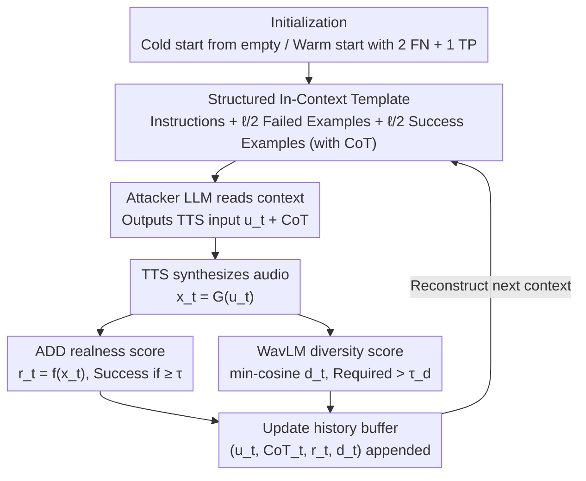

# FoeGlass: Simple In-Context Learning Is Enough for Red Teaming Audio Deepfake Detectors

**Conference**: ICML 2026  
**arXiv**: [2606.05101](https://arxiv.org/abs/2606.05101)  
**Code**: TBD  
**Area**: AI Safety / Audio Deepfake Detection / Automated Red Teaming  
**Keywords**: Audio Deepfake Detection, Red Teaming, In-Context Learning, TTS Attack, Diversity Feedback

## TL;DR
FoeGlass transplants the "LLM red-teaming LLM" paradigm to Audio Deepfake Detection (ADD): without fine-tuning the LLM, it uses in-context learning combined with dual feedback on realness and diversity. This allows a black-box reasoning LLM to automatically generate TTS prompts that deceive ADD systems. Starting from a cold start, it can increase the False Negative Rate (FNR) of existing ADDs from 0% to up to 96%, with attacks showing high transferability across eight different ADD models.

## Background & Motivation

**Background**: Audio Deepfake Detection (ADD) serves as the primary defense against Text-to-Speech (TTS) abuse. Mainstream evaluations rely on manually curated spoofing datasets like ASVspoof5 and VoxCelebSpoof, which cover various spoofing techniques, acoustic conditions, and adversarial perturbations.

**Limitations of Prior Work**: (i) Manual dataset collection is costly; (ii) Coverage of "challenging outputs" from individual TTS models is severely insufficient to identify ADD blind spots; (iii) Existing automated attacks mostly add low-norm perturbations around a reference audio, remaining local rather than sampling "natural adversarial examples" from the generative model itself.

**Key Challenge**: To realistically evaluate ADD, one must sample natural adversarial examples directly from the TTS output distribution. However, the TTS input space suffers from combinatorial explosion, making manual prompt engineering non-scalable. Retraining or fine-tuning an attacker LLM for ADD faces a "triple threat": scarcity of FN samples (preventing the construction of fine-tuning sets), mode collapse in RL fine-tuning toward a single deterministic strategy, and the requirement for LLM weights (precluding the use of top-tier closed-source LLMs).

**Goal**: To automatically, efficiently, and diversely sample TTS outputs that cause ADD misclassification, assuming only black-box access to the reasoning LLM, TTS, and ADD.

**Key Insight**: The authors observe that the in-context learning capability of reasoning LLMs is sufficiently powerful. By feeding "past successful/failed TTS prompts + CoT + scores + diversity feedback" into the context, the LLM can iteratively push TTS prompts toward ADD blind spots without any parameter updates.

**Core Idea**: Transform the red-teaming problem into "black-box in-context optimization": LLM writes TTS input $\to$ TTS synthesizes audio $\to$ ADD provides realness score + WavLM calculates min-cosine diversity score $\to$ Feedback is fed back into the context for the next round. A specifically designed context template is used to suppress mode collapse.

## Method

### Overall Architecture
FoeGlass addresses the problem of making a black-box reasoning LLM automatically write TTS prompts to deceive ADD without fine-tuning. It formalizes red-teaming as a sampling problem: TTS is $G:\mathcal{U}\to\mathcal{X}$ (mapping text prompts/parameters to audio), ADD is a binary classifier $f:\mathcal{X}\to[0,1]$ with threshold $\tau$. Defining the expected classification score as $F(u)=\mathbb{E}[f\circ G(u)]$, the goal is to sample from $F^{-1}((\tau,1])$, the subset of TTS inputs that will be classified as "real."

The process is an in-context closed loop: in each round $t$, the attacker LLM reads the current context and outputs a TTS input $u_t$ and its Chain-of-Thought (CoT); the TTS synthesizes $x_t=G(u_t)$; the ADD provides a realness score $r_t=f(x_t)$; a diversity score $d_t = 1 - \max_{z\in w(X_\text{hist})}\langle w(x_t), z\rangle_{\cos}$ is calculated using WavLM embeddings against historical samples. Finally, $(u_t, \text{CoT}_t, r_t, d_t)$ is fed back into the history buffer to reconstruct the context for the next round. The LLM, TTS, and ADD remain black-box throughout.

### Key Designs

**1. Structured In-Context Template: Compressing experience into context to enable online learning of vulnerable prompts.**

Unconditional sampling of TTS prompts yields very low success rates (FNR < 10% in many scenarios) because the LLM lacks knowledge of ADD weaknesses. FoeGlass feeds structured success/failure experiences back into the context. The template consists of three parts: (a) instruction prompt describing the task and TTS parameters (transcript, speed, temperature, style, voice); (b) the $\ell/2$ most recent **failed** attacks; (c) the $\ell/2$ highest-scoring **successful** attacks. Feeding the CoT along with the results is crucial—it allows the LLM to continue its reasoning thread rather than guessing from scratch.

**2. Realness + Diversity Dual Feedback: Using min-cosine to prevent mode collapse.**

A common failure in red-teaming is mode collapse, where the LLM repeatedly generates variations of the same successful prompt. FoeGlass uses dual signals: realness ($f(x_t)$) and diversity. Instead of average cosine distance, the authors use **minimum** cosine distance $d(x';X)=1-\max_{z\in w(X)}\langle w(x'),z\rangle_{\cos}$. This transforms diversity into a hard constraint: a new sample must be sufficiently distant from **all** historical samples ($d>\tau_d$) to be considered successful. This captures "repetition" more accurately than an average metric.

**3. Cold-start / Warm-start Modes and Cross-ADD Transferability: Bootstrapping with zero prior FN samples.**

Traditional fine-tuned attackers require large FN datasets. FoeGlass is suited for low-data regimes. In cold start, it begins with an empty history. In warm start, just 2 known FN and 1 TP examples are injected. The fact that only 3 examples significantly boost performance suggests that the LLM learns "how to reason about blind spots" rather than memorizing specific prompts. Samples optimized for one ADD often transfer to others because the LLM tends to find regions in the TTS output space that are generally ignored by multiple detectors.

### Loss & Training
**No training required**. FoeGlass is an inference-time pipeline. Key hyperparameters include context length $\ell=40$, diversity threshold $\tau_d=0.01$, and iteration count $T$.

## Key Experimental Results

### Main Results: Significant FNR Gains (8 ADDs × 3 TTS)

| TTS | ADD | Uncond. Sampling FNR(%) | FoeGlass Cold FNR(%) | FoeGlass Warm FNR(%) |
|---|---|---|---|---|
| VITS | VIT-VoxCeleb-ConstantQ | 42.02 | 94.04 | **96.15** |
| VITS | VIT-VoxCeleb-MFCC | 32.57 | 95.28 | **98.08** |
| Kokoro-82M | VIT-VoxCeleb-MelSpec | 0.00 | 7.52 | **39.72** |
| xTTS-v2 | VIT-VoxCeleb-ConstantQ | 2.24 | 80.72 | **96.29** |
| xTTS-v2 | VIT-VoxCeleb-MFCC | 9.16 | 71.60 | **93.13** |
| xTTS-v2 | AST-VoxCeleb | 9.68 | 48.43 | **63.30** |

The maximum absolute improvement is approximately +94 percentage points. Even for ADDs trained on ASVspoof5 (which includes VITS data), cold start achieved 74.2% FNR, suggesting that ASVspoof5 does not cover the full output space of VITS.

### Ablation Study

| Experimental Configuration | Key Metrics | Description |
|---|---|---|
| Cold vs Warm | Warm +2~+30 FNR | Requires only 2 FN + 1 TP examples without extra compute. |
| Fine-tuning RawNetLite with FoeGlass data | 49.6% → **8.2%** acc (-41) | Improved robustness on held-out VITS set. |
| Fine-tuning AASIST (Black-box transfer) | 15.2% → **0.2%** acc (-15) | Data generated against RawNetLite, not AASIST. |
| vs ASVspoof5 same TTS subset | 0.35% → 81.34% FNR | FoeGlass samples are significantly harder than ASVspoof5. |
| No Diversity Feedback | FNR decrease, fewer clusters | Min-cosine feedback is key to resisting mode collapse. |

### Key Findings
- **In-Context is Enough**: Pure black-box prompt engineering can push FNR to 90%+. Reasoning LLMs are sufficient substitutes for fine-tuned attackers in narrow tasks.
- **min-cosine > avg-cosine**: Visualization via PCA and k-means shows that attack samples form multiple semantic clusters, proving that min-cosine feedback successfully pushes the LLM to cross semantic boundaries.
- **High Transferability**: Samples optimized for one ADD perform better than unconditional baselines on other ADDs, indicating the discovery of common blind spots.
- **Mismatch Limits Attacks**: Attacks on Kokoro-82M with VoxCeleb-trained ADDs are the most difficult, suggesting that distribution mismatch remains a primary factor in defense.

## Highlights & Insights
- **In-context learning as a black-box optimizer**: The CoT + history forms an implicit optimizer that requires neither gradients nor weight access, making it compatible with any SOTA LLM.
- **The min-cosine trick**: This should be considered for any embedding-based diversity metric in generative red-teaming or RLHF. Average distance can be misleading when at least one historical sample is very close.
- **CoT as self-improvement**: Feeding CoT back into the context allows the LLM to self-reflect and refine its reasoning without weight updates.
- **Data Augmentation Value**: Hard samples generated by FoeGlass provide a much stronger training signal for ADD progression than unconditional data.

## Limitations & Future Work
- **Hyperparameter Sensitivity**: Parameters like $\ell$ and $\tau_d$ significantly affect results; the exploration/exploitation tradeoff is not yet automated.
- **WavLM Dependency**: Diversity relies on WavLM embeddings. If the embedding is insensitive to certain spoofing patterns, diversity feedback may fail.
- **Open-source Scope**: Experiments were limited to open-source ADDs; performance against industrial closed-source systems (e.g., Pindrop) is unknown.
- **Dual-use Risks**: The tool can be used for malicious purposes. While defenses like watermarking are discussed, end-to-end defense experiments are missing.

## Related Work & Insights
- **vs Low-norm Adversarial Perturbation**: These rely on local $\ell_p$ noise around an audio sample; FoeGlass samples "natural spoofing" from the distribution.
- **vs Diffusion-based Natural Adversarial**: Those methods require white-box access to diffusion models; FoeGlass is prompt-space and black-box.
- **vs LLM Jailbreak**: Adapts the paradigm to ADD, with the key difference being the TTS intermediary and the discretization of success signals into realness scores.

## Rating
- Novelty: ⭐⭐⭐⭐ First automated black-box red-teaming for ADD. The min-cosine feedback and CoT-in-context are highly reusable tricks.
- Experimental Thoroughness: ⭐⭐⭐⭐ Comprehensive transfer matrices and fine-tuning experiments, though lacking commercial ADD comparisons.
- Writing Quality: ⭐⭐⭐⭐ Clear formalization of the problem and complete algorithms.
- Value: ⭐⭐⭐⭐ Provides a toolchain to immediately expand ADD training sets and exposes blind spots in standard benchmarks like ASVspoof5.

<!-- RELATED:START -->

## Related Papers

- [\[ACL 2026\] STAR-Teaming: A Strategy-Response Multiplex Network Approach to Automated LLM Red Teaming](../../ACL2026/llm_safety/star-teaming_a_strategy-response_multiplex_network_approach_to_automated_llm_red.md)
- [\[ICML 2026\] Stable-GFlowNet: Toward Diverse and Robust LLM Red-Teaming via Contrastive Trajectory Balance](stable-gflownet_toward_diverse_and_robust_llm_red-teaming_via_contrastive_trajec.md)
- [\[ACL 2026\] Red-Bandit: Test-Time Adaptation for LLM Red-Teaming via Bandit-Guided LoRA Experts](../../ACL2026/llm_safety/red-bandit_test-time_adaptation_for_llm_red-teaming_via_bandit-guided_lora_exper.md)
- [\[ICML 2025\] Visual Language Models as Zero-Shot Deepfake Detectors](../../ICML2025/llm_safety/visual_language_models_as_zero-shot_deepfake_detectors.md)
- [\[ICLR 2026\] Tree-based Dialogue Reinforced Policy Optimization for Red-Teaming Attacks (DialTree)](../../ICLR2026/llm_safety/tree-based_dialogue_reinforced_policy_optimization_for_red-teaming_attacks.md)

<!-- RELATED:END -->
