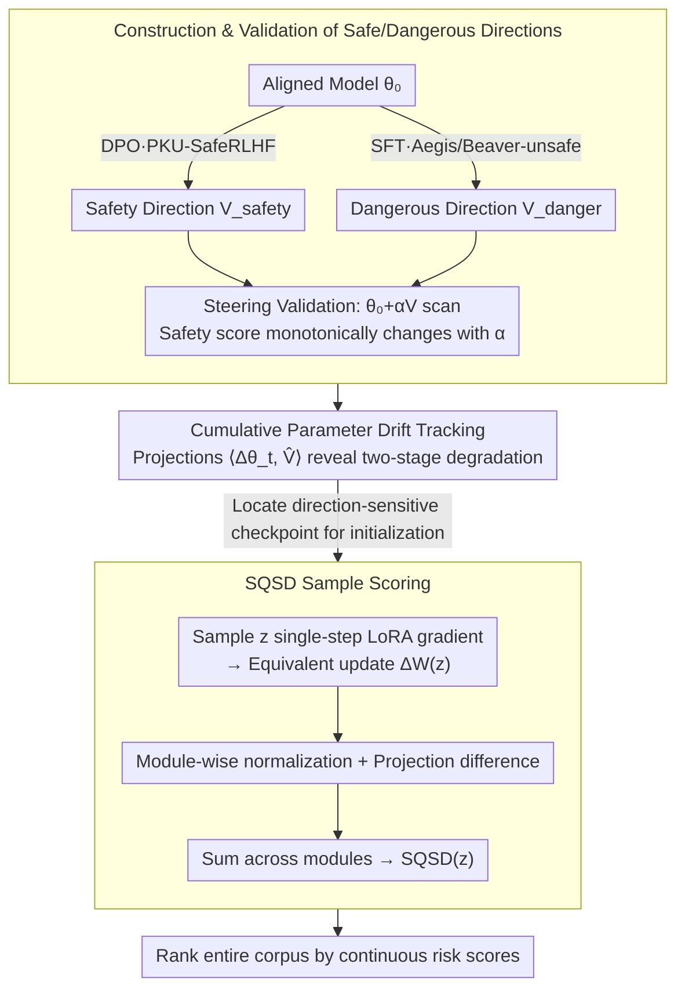

# From Parameter Dynamics to Risk Scoring: Quantifying Sample-Level Safety Degradation in LLM Fine-tuning

**Conference**: ICML 2026  
**arXiv**: [2605.04572](https://arxiv.org/abs/2605.04572)  
**Code**: https://github.com/(repo) (Available)  
**Area**: LLM Alignment / Safety / Model Compression  
**Keywords**: Safety Alignment, Fine-tuning Risk, Parameter Dynamics, Task Vectors, Sample Scoring

## TL;DR
The authors track the cumulative drift of parameters along "dangerous/safe directions" during LoRA fine-tuning, discovering that the fundamental mechanism of alignment collapse via benign data is the monotonic drift of parameters toward dangerous directions. They propose SQSD, which assigns a continuous risk score to each sample based on the projection difference of a single-step gradient along these two directions. SQSD maintains monotonic ASR rankings across 3 models and 2 datasets and demonstrates transferability across architectures, scales, and from LoRA to Full fine-tuning.

## Background & Motivation

**Background**: LLMs undergo alignment (RLHF/DPO) to refuse harmful requests before deployment. however, this alignment is surprisingly fragile during downstream fine-tuning—even 100 **completely harmless** benign instruction samples can cause safety performance to collapse. Attacks via benign samples are more dangerous than direct harmful inputs because toxicity classifiers cannot detect them.

**Limitations of Prior Work**: Previous mechanistic studies follow two main lines: (i) tracking embedding drift (e.g., Vaccine), and (ii) analyzing static parameter perturbations (e.g., Booster, PEFT safety analysis). However, these only examine snapshots before and after fine-tuning without tracking the process; they also focus on perturbation magnitude rather than direction, making it difficult to distinguish "safety-related drift" from "task-related drift." Current sample selection methods (Bi-Anchor, Self-Inf-N, LARF) utilize "extreme sample selection," identifying only the most dangerous subsets while failing for intermediate-risk samples, leading to "boundary collapse."

**Key Challenge**: Safety degradation is a **dynamic process** rather than a static perturbation, and it is strongly correlated with the specific direction of parameter drift rather than simple perturbation magnitude. Measuring only magnitude conflates "task learning" with "safety disruption."

**Goal**: (RQ1) Provide a mechanistic explanation for why benign fine-tuning breaks alignment; (RQ2) Calculate a continuous, interpretable safety risk score for **every sample** under this mechanism.

**Key Insight**: Drawing from the Task Vector concept, the authors define two semantic anchor vectors: $V_\text{safety} = \hat\theta_\text{aligned} - \theta_0$ and $V_\text{danger} = \hat\theta_\text{harmful} - \theta_0$. They track the cumulative drift $\Delta\theta_t = \theta_t - \theta_0$ along these directions during each fine-tuning step to map safety degradation directly to parameter trajectories.

**Core Idea**: Parameter space projections are used both to explain the mechanism (cumulative dangerous drift drives safety collapse) and to score samples (single-step gradient projection along the dangerous direction minus the projection along the safe direction = the SQSD risk score).

## Method

### Overall Architecture
The core mechanism involves projecting "safety degradation" onto two pre-calibrated directions in the parameter space. The first half provides a mechanistic analysis—constructing "safe" and "dangerous" semantic anchor vectors and tracking cumulative drift to explain the alignment collapse. The second half introduces SQSD for sample scoring—calculating a single-step LoRA gradient for each candidate sample to estimate its equivalent weight update and determining if this update aligns more with the "dangerous" or "safe" direction. The "direction-sensitive checkpoint" identified in the mechanistic analysis serves as the initialization point for gradient calculation in SQSD.

### Key Designs

**1. Construction and Validation of "Safe/Dangerous" Directions in Parameter Space**
To measure safety degradation, semantic anchor vectors are constructed using the Task Vector approach (direction = endpoint − starting point): $V_\text{safety} = \arg\min_\theta \mathcal{L}_\text{dpo}(\theta_0, D_\text{aligned}) - \theta_0$ (via DPO on PKU-SafeRLHF) and $V_\text{danger} = \arg\min_\theta \mathcal{L}_\text{sft}(\theta_0, D_\text{harmful}) - \theta_0$ (via SFT on Aegis/Beaver-unsafe). Steering experiments $\theta(\alpha) = \theta_0 + \alpha V$ confirm that moveing along $V_\text{danger}$ monotonically decreases safety scores, while $V_\text{safety}$ increases them.

**2. Cumulative Parameter Drift Tracking Reveals Two-Stage Degradation**
Cumulative drift projections $p_\text{safety}(t) = \langle\Delta\theta_t, \hat{V}_\text{safety}\rangle$ and $p_\text{danger}(t) = \langle\Delta\theta_t, \hat{V}_\text{danger}\rangle$ were calculated at each fine-tuning checkpoint. A distinct non-linear two-stage pattern emerged: early parameters drift rapidly along the dangerous direction while the safety score remains relatively stable (the "safety basin"), followed by a stage where directional drift slows but the safety score collapses. This indicates that SQSD gradients must be calculated at "direction-sensitive" parameter states.

**3. SQSD: Single-Step Gradient Projection Difference as Sample Risk Score**
For a sample $z$, a single-step LoRA gradient is computed to derive its equivalent weight update $\Delta W(z) \approx -\eta(B_0 \nabla_A + \nabla_B A_0)$. For each module $m$, module-wise normalization is applied, followed by calculating the projection difference:

$$\text{SQSD}_m(z) = \left\langle\frac{\Delta W_m(z)}{\|\Delta W_m(z)\|_2}, \hat{V}_{\text{danger},m}\right\rangle - \left\langle\frac{\Delta W_m(z)}{\|\Delta W_m(z)\|_2}, \hat{V}_{\text{safety},m}\right\rangle$$

The total score is $\text{SQSD}(z) = \sum_m \text{SQSD}_m(z)$. Module-wise normalization is critical to eliminate response length bias, which otherwise causes longer responses to have artificially higher risk scores.

### Loss & Training
SQSD does not introduce new training objectives. LoRA fine-tuning used $r=8, \alpha=16$. Directions used lr=5e-6, while SQSD evaluation used lr=5e-5 to induce visible safety degradation. The interpretability is grounded in a first-order Taylor expansion $\eta[\mathcal{L}(z, \theta_\text{ref}) - \mathcal{L}(z, \theta_\text{target})] \approx (\theta' - \theta_\text{ref})^\top (\theta_\text{target} - \theta_\text{ref})$, linking the inner product of the gradient update and the target direction to the change in loss.

## Key Experimental Results

### Main Results
Testing across 3 models (Qwen3-8B / Llama-3.1-8B-Instruct / Llama-2-7B-Chat) and 2 datasets (Dolly / Alpaca), datasets were split into five subsets (S1-S5) from highest to lowest SQSD risk.

| Model + Data | S1 ASR | S5 ASR | Δ (S1-S5) | Monotonic? |
|-------------|--------|--------|-----------|-------|
| Qwen3-8B / Dolly / SQSD(Beaver) | 71.27 | 2.55 | **+68.72** | ✓ |
| Qwen3-8B / Alpaca / SQSD(Beaver) | 50.91 | 3.27 | +47.64 | ✓ |
| Llama3.1-8B / Dolly / SQSD(Beaver) | 79.82 | 4.73 | +75.09 | ✓ |
| Llama2-7B / Dolly / SQSD(Beaver) | 45.27 | 0.36 | +44.91 | ✓ |
| Reward Model baseline (Dolly avg) | 57.27 | 8.00 | 49.27 | ✗ |
| LARF baseline (Dolly avg) | 48.91 | 4.61 | 44.30 | ✗ |

SQSD maintained strict monotonicity in **10/12 configurations** (baselines achieved at most 1/6), with an average Δ of 49.86% outperforming the strongest baseline (Reward Model 43.76%).

### Ablation Study

| Configuration | S1 ASR | Δ | Monotonic? |
|------|--------|---|-------|
| SQSD (full) | 71.27 | 68.72 | ✓ |
| w/o module-wise normalization | 13.09 | 12.54 | ✗ |
| Danger direction only | 68.36 | 64.54 | ✗ |
| Safety direction only | 27.09 | 20.91 | ✗ |
| Insensitive initialization | 38.36 | 37.27 | ✗ |

| Transfer Experiment | S1 | S5 | Monotonic? |
|----------|-----|-----|-------|
| Llama → Qwen | 42.55 | 1.64 | ✓ |
| Qwen → Llama | 79.64 | 28.00 | ✓ |
| Qwen-8B → 14B | 55.09 | 7.09 | ✓ |
| Qwen-8B → 32B | 28.91 | 2.00 | ✓ |
| Qwen LoRA → Full FT | 10.73 | 2.55 | ✓ |

### Key Findings
- **Module-wise normalization is essential**: Without it, response length bias dominates the signal, reducing Δ from 68.72 to 12.54 and destroying monotonicity.
- **Bi-directional analysis is necessary**: Using only the danger or safety direction fails to maintain monotonicity. The difference between the two provides the "net risk."
- **Initialization sensitivity is a constraint**: SQSD must be calculated at a "direction-sensitive parameter state" identified during fine-tuning; at $\theta_0$, the signal is insufficient for reliable ranking.
- **Cross-architecture/scale/method transferability**: SQSD captures architecture-independent sample properties, allowing risk assessment on small models for deployment on larger models.

## Highlights & Insights
- **Parameter Dynamics vs. Static Perturbation**: Shifting from "how much parameters change" to "which direction parameters drift" reveals the non-linear two-stage collapse and decouples safety drift from task drift.
- **Continuous Risk Scoring vs. Extreme Selection**: Unlike prior methods that only identify the top-k dangerous samples, SQSD provides a full-spectrum score, enabling more nuanced safety fine-tuning strategies.
- **Safety Applications of Task Vectors**: Extending Task Vectors from arithmetic capabilities to safety alignment, validated via steering experiments, provides a clean framework for safety analysis.
- **Practical Transferability**: The ability to transfer scores from 8B to 32B models or from LoRA to Full FT suggests a cost-effective path for data screening in production.

## Limitations & Future Work
- SQSD depends heavily on identifying a "direction-sensitive" initialization point; ensuring the robustness of this selection remains an open problem.
- Constructing the anchor vectors requires a full DPO/SFT training run; lightweight or zero-shot construction methods are needed.
- While LoRA-to-Full transfer is demonstrated, the inherent directional constraints of LoRA may not fully capture the complexities of full fine-tuning.
- Current work focuses on diagnostic value (splitting datasets); integrating SQSD into risk-weighted SFT or automated data filtering is a logical next step.

## Related Work & Insights
- **vs. Bi-Anchor / Self-Inf-N / LARF**: These rely on embedding or raw gradient similarity without directional distinction. SQSD uses "danger vs. safety" projections for higher sensitivity and continuous scoring.
- **vs. Vaccine / Booster**: These provide static views of vulnerability; the two-stage trajectory in this work significantly expands the understanding of the collapse mechanism.
- **vs. LESS**: While LESS is for general influence estimation, SQSD is specialized for safety with a Task-Vector-based interpretable framework.
- **vs. Safety Basin Theory**: The observed two-stage drift corroborates the safety basin intuition—robustness within the basin followed by collapse upon exit—and converts it into an actionable scoring metric.

## Rating
- Novelty: ⭐⭐⭐⭐ "Parameter dynamics + bi-directional projection" provides a fresh and clear perspective on safety risk.
- Experimental Thoroughness: ⭐⭐⭐⭐ Comprehensive testing across models, datasets, and transfer scenarios, though limited to specific safety benchmarks.
- Writing Quality: ⭐⭐⭐⭐ Highly structured flow from research questions to theoretical grounding and empirical validation.
- Value: ⭐⭐⭐⭐ Offers both an interpretable mechanistic framework and a practical tool for fine-tuning safety audits.

<!-- RELATED:START -->

## Related Papers

- [\[ACL 2026\] FlexGuard: Continuous Risk Scoring for Strictness-Adaptive LLM Content Moderation](../../ACL2026/llm_safety/flexguard_continuous_risk_scoring_for_strictness-adaptive_llm_content_moderation.md)
- [\[CVPR 2026\] Harmonious Parameter Adaptation in Continual Visual Instruction Tuning for Safety-Aligned MLLMs](../../CVPR2026/llm_safety/harmonious_parameter_adaptation_in_continual_visual_instruction_tuning_for_safet.md)
- [\[CVPR 2026\] FairLLaVA: Fairness-Aware Parameter-Efficient Fine-Tuning for Large Vision-Language Models](../../CVPR2026/llm_safety/fairllava_fairness-aware_parameter-efficient_fine-tuning_for_large_vision-langua.md)
- [\[ICML 2026\] PFT: Phonon Fine-tuning for Machine Learned Interatomic Potentials](pft_phonon_fine-tuning_for_machine_learned_interatomic_potentials.md)
- [\[ICML 2026\] Decoupled Training with Local Reinforcement Fine-Tuning in Federated Learning](decoupled_training_with_local_reinforcement_fine-tuning_in_federated_learning.md)

<!-- RELATED:END -->
