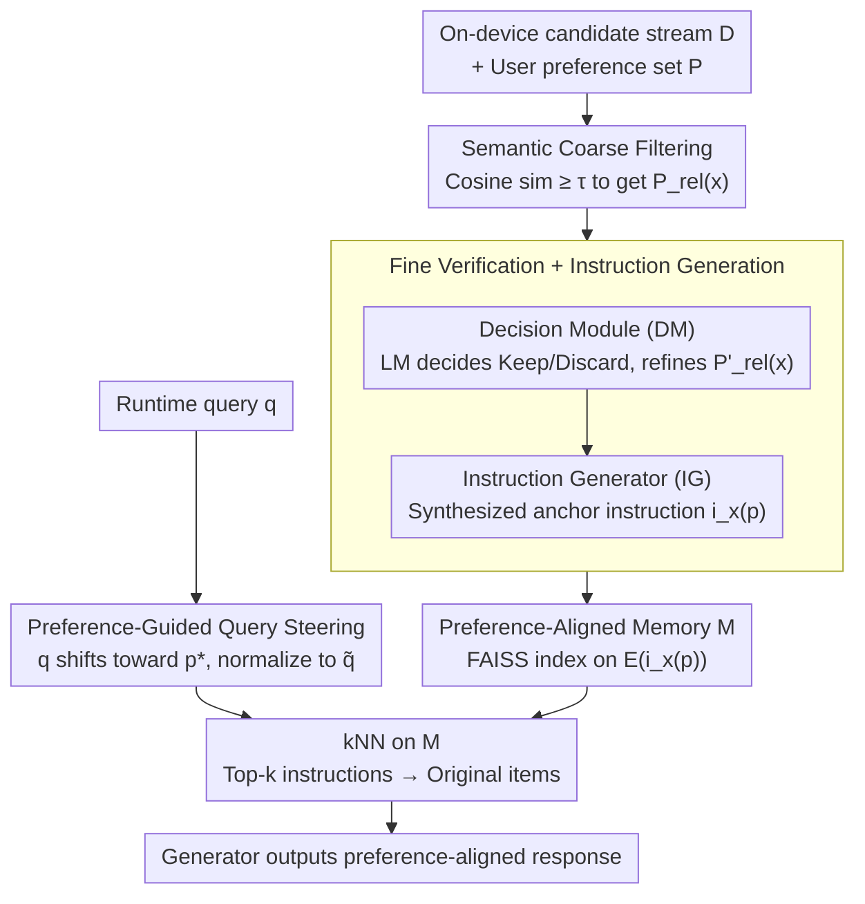

# From Volume to Value: Preference-Aligned Memory Construction for On-Device RAG

**Conference**: ICML 2026  
**arXiv**: [2605.18271](https://arxiv.org/abs/2605.18271)  
**Code**: https://github.com/UbiquitousAILab/EPIC (Available)  
**Area**: Information Retrieval / On-device RAG / Personalization  
**Keywords**: on-device RAG, user preference, memory constraints, instruction-based indexing, query steering

## TL;DR
EPIC shifts the core bottleneck of on-device RAG from "how to use preferences during retrieval" to "what to store during indexing." Using a three-stage pipeline of "coarse filtering + fine verification + query steering," it retains only data aligned with user preferences and generates "instruction-item" pairs as indexing units. This achieves a 2404× storage reduction and a 20.17 percentage point absolute improvement in preference alignment accuracy across four benchmarks.

## Background & Motivation

**Background**: Personal AI agents centered on LLMs are increasingly deployed on mobile and edge devices to ensure privacy and response speed. These agents need to ground generation in on-device personal corpora (browsing history, dialogues, notifications, Wiki, etc.). RAG is the mainstream solution for integrating external knowledge. Existing personalized RAG works focus on organizing user content/profiles into graphs (EMG-RAG, PEARL) or rewriting/expanding queries on the query side (Cognitive Personalized Search, PBR).

**Limitations of Prior Work**: Storage and power consumption are hard constraints on-device. Prior works generally assume the corpus is already "curated," leaving only the problem of retrieval usage. However, in on-device scenarios, raw data is heterogeneous and ever-growing (Wikipedia, Common Crawl, dialogue streams, notifications...). Indexing all data indiscriminately is unfeasible under a ~1 MB memory budget; HippoRAG 2 indexes can reach 2.9 GB. Furthermore, standard retrievers align only for query-text similarity and are "preference-agnostic," leading to preference mismatches where retrieved content is factually correct but violates user preferences (e.g., recommending sashimi to a user allergic to seafood).

**Key Challenge**: Limited on-device memory vs. infinite personal data growth; retriever goal of query similarity vs. user goal of preference alignment—these two objectives are coupled in "what to index and what the query matches," yet existing methods optimize them separately.

**Goal**: Under tight on-device budgets, answer the upstream question of "what should be stored" while reusing the same preference signals at both the indexing and retrieval stages. Sub-problems include: (i) high-throughput discarding of preference-irrelevant content; (ii) semantic-level fine verification and storing "how to use this data"; (iii) imbuing query embeddings with preference semantics with near-zero latency.

**Key Insight**: Among all forms of personal context, **user preferences** are the most compact and stable abstractions—tastes, dietary restrictions, and styles remain consistent across sessions and can be implicitly extracted from history. By treating the preference set $P = \{p_1, \dots, p_N\}$ as a prior known at indexing time, the problem becomes: "Given $P$, how to select a preference-relevant subset from the raw stream and index it in a preference-aligned manner."

**Core Idea**: Reframe "personalized RAG" as a **memory-construction problem**. Integrate preferences throughout: (1) high-recall coarse filtering via embedding similarity → (2) fine-grained verification and "anchor instruction" synthesis via LM as indexing units → (3) query steering toward the most relevant preference. This ensures the pipeline stores less while retrieving more accurately.

## Method

### Overall Architecture
The input is a growing set of candidate items $\mathcal{D}$ and user preferences $P = \{p_1, \dots, p_N\}$. The output is a compact preference-aligned memory $\mathcal{M}$, where each record is $(x, i_x(p), p, E(i_x(p)))$, representing "original item + preference-conditioned instruction + corresponding preference + instruction embedding." At runtime, a query $q$ is steered toward the most relevant preference to get $\tilde q$, followed by FAISS kNN on instruction embeddings in $\mathcal{M}$. The hit instructions point to their original items, which serve as context for the generator. LM calls are restricted to a small subset (averaging 0.22 fine verifications per incoming item). Indexing (filtering + verification) and retrieval (steering + kNN) share the same $P$ without redundant encoding.

### Key Designs

**1. Semantic-Based Coarse Filtering: Pruning the LM invocation domain via embedding geometry**

Over 99% of raw stream content is irrelevant to current user preferences. Submitting every item to an LM for verification is cost-prohibitive on-device. Coarse filtering uses a zero-cost geometric approximation: a shared sentence encoder (e.g., Contriever) encodes item $x$ and each preference $p$ into $\ell_2$-normalized vectors $E(\cdot) \in \mathbb{R}^d$. For each $x$, the cosine similarity $\mathrm{Sim}(E(x), E(p))$ is calculated. Preferences exceeding threshold $\tau$ are collected into $P_{rel}(x) = \{p \in P \mid \mathrm{Sim}(E(x), E(p)) \ge \tau\}$. If $P_{rel}(x)$ is non-empty, $x$ is retained for the next stage. This step provides 3.95×–77.68× storage compression and reduces on-device indexing to 102.67 ms per item.

**2. Preference-Aligned Fine Verification + Instruction Generation: Upgrading from vector approximation to semantic alignment**

Embedding similarity can fail on fine-grained trade-offs (e.g., "dislike seafood" vs. "sushi menu"), necessitating explicit LM discrimination. This stage chains two modules: The Decision Module (DM) outputs a structured $(\mathrm{Decision}, \mathrm{Rationale}, P'_{rel}(x))$, where $P'_{rel}(x) \subseteq P_{rel}(x)$ is the refined subset of truly relevant preferences. Only "Keep" items enter the memory. The Instruction Generator (IG) then takes $(x, p, \mathrm{Rationale})$ to generate a condition instruction $i_x(p) = \mathrm{IG}(x, p, \mathrm{Rationale})$ describing "how to use this data under this preference." **FAISS indexes are built on $E(i_x(p))$ instead of $E(x)$**. Retrieval matches the "usage instruction," which points back to the item. This upgrades "finding semantically similar facts" to "finding facts matching current preference usage," driving accuracy gains of +13.22–+33.69%p.

**3. Preference-Guided Query Steering: Zero-parameter query alignment**

Although the index incorporates preference semantics, incoming queries remain preference-agnostic. EPIC resolves this via geometric translation: identify the most relevant preference $p^* = \arg\max_{p \in P} \mathrm{Sim}(E(q), E(p))$, then compute the steered query $\tilde q = (E(q) + E(p^*)) / \|E(q) + E(p^*)\|$. This $\tilde q$ is used for kNN on the instruction index. This operation requires zero extra LM calls and adds only 0.18 ms latency per query on a Jetson Orin Nano, avoiding the high overhead of LM-based query rewriting (e.g., Pref-QR).

### Loss & Training
EPIC is a **pure inference-time pipeline**. It introduces no new training objectives or parameters. It uses off-the-shelf encoders (Contriever) and LLMs (Qwen3-4B, Llama-3.1-8B for generation; LLaMA-3.3-70B-Instruct for judging). Only the coarse threshold $\tau$ and IG prompts require tuning, allowing it to be plugged into any retriever or LLM backend.

## Key Experimental Results

### Main Results
Preference-following Accuracy (%) across four benchmarks (Judge: LLaMA-3.3-70B-Instruct):

| Backend | Method | PrefWiki | PrefRQ | PrefELI5 | PrefEval |
|------|------|----------|--------|----------|----------|
| Llama-3.1-8B | BM25 | 38.56 | 64.22 | 69.04 | 27.97 |
| Llama-3.1-8B | NV-Embed-v2 (Prev. SOTA) | 44.53 | 70.22 | 69.86 | 30.88 |
| Llama-3.1-8B | HippoRAG 2 | 42.91 | 66.00 | 69.73 | 32.98 |
| Llama-3.1-8B | Pref-QR | 39.72 | 71.33 | 69.59 | 34.21 |
| Llama-3.1-8B | **EPIC** | **54.07** | **83.00** | **87.95** | **65.61** |

EPIC achieves an average absolute improvement of **+20.17%p** over NV-Embed-v2, with significant gains in PrefEval (dialogue history).

Efficiency Comparison (Figure 3):

| Metric | NV-Embed-v2 | HippoRAG 2 | PBR | **EPIC** | Gain vs. Best Baseline |
|------|-------------|------------|-----|----------|----------------|
| Storage (MB) | 648 | 2896 | 286 | **0.27** | **~2404× smaller** |
| Retrieval Latency (ms) | 100 | 812 | 10073 | **3** | **~33× faster** |
| Indexing Latency (s) | 1918 | 4726 | 654 | 246 | Comparable |

On Jetson Orin Nano 8GB (PrefWiki): Total retrieval 29.35 ms/query (steering 0.18 ms, FAISS 0.14 ms, query embedding 29.03 ms), indexing 102.67 ms/item, memory resident < 1 MB.

### Ablation Study

| Configuration | Accuracy Gain (vs. baseline) | Storage Compression | Description |
|------|----------------------------|----------|------|
| C only | Marginal | **3.95×–77.68×** | Primary source of memory savings. |
| C + F | **+13.22 to +33.69 %p** | Additional ×1.95–8.93 | Primary source of accuracy; instruction-centric memory. |
| C + F + S | **+0.78 to +4.03 %p** | Unchanged | Zero-cost gain using already encoded signals. |

### Key Findings
- **Modular Contributions**: C manages "storing less," F manages "retrieving accurately," and S provides "free improvement."
- **Highest Gain on PrefEval**: Performance jumps from ~30% to 65–78%, showing that filtering at indexing time is most beneficial in preference-dense scenarios where noise usually drowns out signals.
- **Robustness to Preference Drift**: EPIC maintains stable accuracy and flat memory growth compared to linear growth in traditional methods as new documents arrive and preferences shift.
- **Portability**: Applying EPIC modules to HippoRAG 2 yields similar trends, proving it is a plug-in memory construction layer.

## Highlights & Insights
- **Paradigm Shift to "What to Store"**: Most RAG literature tinkers with the query side. Identifying memory construction as the true upstream bottleneck for on-device RAG is a significant conceptual contribution.
- **Instruction-Centric Indexing**: Traditional indexes map document semantics. EPIC maps "matching usage under a preference." Synthesizing anchor instructions pre-calculates "why/how this data is relevant," upgrading retrieval targets.
- **Dual Signal Reuse**: $P$ is consumed at both indexing and retrieval without training, implementing "preference conditioning" as a zero-parameter geometric transformation + LM subroutine.
- **Transferable Tricks**: (i) $\tilde q = \text{normalize}(E(q) + E(p^*))$ for attribute-aware retrieval; (ii) reusing DM Rationale for IG as a "single LM call, multiple purposes" pattern.

## Limitations & Future Work
- Assumes preference set $P$ is known; extraction is treated as an upstream task.
- Fixed steering logic may not handle conflicting preferences ("likes spicy" vs. "stomach ache") explicitly.
- The trade-off between indexing costs and instruction quality using smaller on-device LMs requires further systematic study.
- Evaluation relies on LLM-as-a-judge (PrefEval); judge bias might influence results.

## Related Work & Insights
- **vs HippoRAG 2 / RAPTOR**: These focus on better retrieval from a fixed index. EPIC dictates what enters the index, reducing HippoRAG 2's storage from 2896 MB to < 1 MB.
- **vs Pref-QR / PBR**: These rewrite queries at runtime, leading to high retrieval latency (e.g., PBR's 10 s). EPIC amortizes cost to indexing, matching the on-device "frequent queries, sparse incoming data" profile.
- **vs EMG-RAG / PEARL**: These organize or select from existing memory. EPIC is complementary, serving as the filter that "distills" raw streams into the memory these systems then organize.

## Rating
- Novelty: ⭐⭐⭐⭐⭐ 
- Experimental Thoroughness: ⭐⭐⭐⭐⭐ 
- Writing Quality: ⭐⭐⭐⭐ 
- Value: ⭐⭐⭐⭐⭐ 

<!-- RELATED:START -->

## Related Papers

- [\[ICML 2026\] Differentially Private Preference Data Synthesis for Large Language Model Alignment](differentially_private_preference_data_synthesis_for_large_language_model_alignm.md)
- [\[ICML 2026\] Memory as a Markov Matrix: Sample Efficient Knowledge Expansion via Token-to-Dictionary Mapping](memory_as_a_markov_matrix_sample_efficient_knowledge_expansion_via_token-to-dict.md)
- [\[ICML 2026\] Federated Variational Preference Alignment with Gumbel-Softmax Prior for Personalized User Preferences](federated_variational_preference_alignment_with_gumbel-softmax_prior_for_persona.md)
- [\[CVPR 2026\] V-Attack: Targeting Disentangled Value Features for Controllable Adversarial Attacks on LVLMs](../../CVPR2026/llm_safety/v-attack_targeting_disentangled_value_features_for_controllable_adversarial_atta.md)
- [\[ACL 2026\] LeakDojo: Decoding the Leakage Threats of RAG Systems](../../ACL2026/llm_safety/leakdojo_decoding_the_leakage_threats_of_rag_systems.md)

<!-- RELATED:END -->
