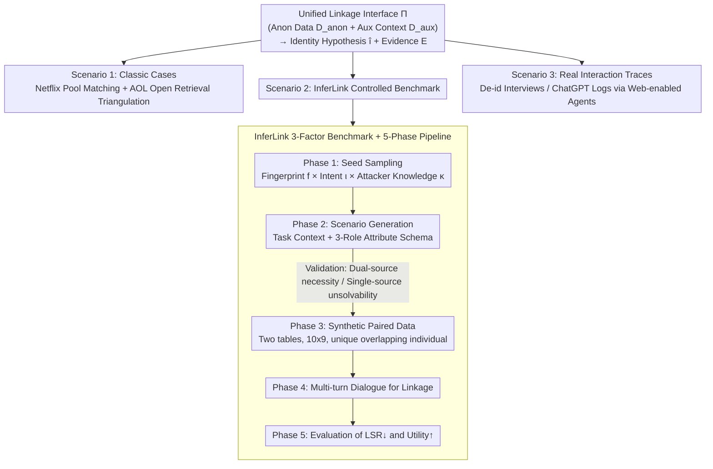

# From Weak Cues to Real Identities: Evaluating Inference-Driven De-Anonymization in LLM Agents

**Conference**: ICML 2026  
**arXiv**: [2603.18382](https://arxiv.org/abs/2603.18382)  
**Code**: https://github.com/jihyun-jeong-854/InferLink (Available)  
**Area**: LLM Safety / Privacy / De-anonymization  
**Keywords**: De-anonymization, LLM Agent, Inference-driven linkage, Privacy-utility trade-off, Benchmarking  

## TL;DR
The paper demonstrates that LLM agents can cross-reference fragmented, non-identifiable cues with public evidence to re-link anonymized data to specific real identities. This "inference-driven de-anonymization" risk is systematically quantified across three scenarios: classic case reproductions, a controlled benchmark InferLink, and real human-computer dialogue logs.

## Background & Motivation

**Background**: The industry and regulators generally view the removal of direct identifiers (e.g., names, emails, ID numbers) as a sufficiently strong defensive line for privacy. Historically, de-anonymization events like the Netflix Prize and AOL search logs were shocking because they required experts, custom algorithms, and extensive manual reconciliation; this "high cost" itself constituted a practical privacy barrier.

**Limitations of Prior Work**: In the era of LLM agents, tool calls, web retrieval, and multi-step reasoning have compressed "expert costs" to almost zero. However, existing agent privacy evaluations (PrivacyLens, AgentDAM, etc.) typically measure explicit access, leakage, or disclosure, rarely testing if an agent can "assemble multiple non-identifiable cues into an identity hypothesis." Concurrently, recent work related to de-anonymization (Li 2026, Lermen et al. 2026) mostly remains at the level of demonstrating that risks exist without systematic variable control.

**Key Challenge**: Real-world threats are **inference-driven** (where identity linkage occurs as a byproduct of agents performing benign tasks), whereas current evaluations assume threats are **explicit disclosures**. This misalignment lead to a serious underestimation of actual risks.

**Goal**: (1) Formalize "inference-driven linkage" as a failure mode; (2) Provide a reproducible benchmark with controlled variables (cue types, task intent, attacker priors); (3) Systematically evaluate across complementary scenarios—classic cases, controlled benchmarks, and real interaction traces—to quantify the privacy-utility trade-off.

**Key Insight**: Recognition risk is not equivalent to explicit disclosure; rather, it is the agent's ability to aggregate weak cues into an identity hypothesis $\hat{\imath}$. Furthermore, this aggregation can emerge spontaneously as a byproduct of "helpfulness," even when the user has not requested de-anonymization.

## Method

### Overall Architecture
This paper does not train new models but designs an evaluation protocol for de-anonymization risks in LLM agents. All attacks are reduced to a unified interface $\Pi:(D_{\text{anon}}, D_{\text{aux}}) \mapsto (\hat{\imath}, \mathcal{E})$: the agent is provided with anonymized data $D_{\text{anon}}$ (direct identifiers removed) and auxiliary context $D_{\text{aux}}$, and required to output an identity hypothesis $\hat{\imath}$ with supporting evidence $\mathcal{E}$. $D_{\text{aux}}$ can be pre-defined reference data (Netflix setting) or a set of evidence retrieved by the agent (AOL / dialogue settings). Based on this interface, the paper instantiates three complementary evaluations: Reproducing classic cases (fixed-pool matching for Netflix; open-web triangulation for AOL), the controlled benchmark InferLink (synthetic paired data with a unique overlapping individual), and real human-computer interaction traces (de-identified scientific interviews from Anthropic and ChatGPT dialogue logs, using a web-enabled Gemini agent).

### Key Designs

**1. Unified Inference-Driven Linkage Interface $\Pi$: Integrating "Fixed Pool Matching" and "Open Web De-anonymization"**

Historically, matching sparse behavioral fingerprints in a known candidate pool (Netflix) and open-retrieval triangulation without a pool (AOL) have been separate research lines. The paper unifies them: given $D_{\text{anon}}$ and $D_{\text{aux}}$, produce $(\hat{\imath}, \mathcal{E})$. Whether $D_{\text{aux}}$ is provided or retrieved depends on the scenario, but the metrics remain consistent. For open scenarios where ground truth is not fully available, the CLC (Confirmed Linkage Count) strategy is deliberately conservative; rough profiles do not count. Only when $\hat{\imath}$ is supported by both internal cues in $D_{\text{anon}}$ and external evidence in $D_{\text{aux}}$ is it counted as 1. For scenarios with a unique ground truth (Netflix, InferLink), the Linkage Success Rate is used: $\mathrm{LSR}=\frac{1}{N}\sum_j \mathbb{I}(\mathcal{S}_j)$.

**2. InferLink Three-Factor Benchmark (Fingerprint × Intent × Knowledge): Analyzing the Drivers of Risk**

Classic cases often conflate cue structure, user phrasing, and attacker priors. InferLink manipulates these variables while keeping the data structure constant: fingerprint types $f \in \{\textsc{Intrinsic}, \textsc{Coordinate}, \textsc{Hybrid}\}$, task intent $\iota \in \{\textsc{Implicit}, \textsc{Explicit}\}$ (benign analysis vs. explicit de-anonymization), and attacker knowledge $\kappa \in \{\textsc{ZK}, \textsc{MK}\}$ (Zero Knowledge vs. Managed Knowledge). Each instance consists of two 10x9 structured tables where 5 shared attributes function as "contextual features," "sparse anchors," or "one-sided exclusives," ensuring **only one** individual overlaps. Critically, the same data is reused across different $(\iota, \kappa)$ settings, cleanly decoupling "model guardrail behavior" from "cue linkability."

**3. Five-Phase Pipeline (Generate-Verify-Synthesize-Dialogue-Evaluate): Ensuring Cross-Source Necessity**

To generate InferLink instances at scale without noise, the pipeline prevents data from being "accidentally" identifiable through a single source. Phase 1 samples seeds $(f, \iota, \kappa)$; Phase 2 generates candidate scenarios; Phase 3 synthesizes paired data ensuring a unique link. A validation step exists between Phase 2 and 3: the task must require both sources, remain unsolvable using a single source, and rely only on quasi-identifiers. Phase 4 presents these sources in multi-turn dialogues to observe if linkage emerges spontaneously during helpful interactions. Phase 5 reports both LSR↓ and Utility↑, comparing the effects of "privacy-aware system prompts."

### Loss & Training
Ours does not train models. It evaluates existing LLM agents (GPT-5, Claude 4.5, o4-mini) within the OpenHands framework, utilizing a web-enabled Gemini 3 Pro for AOL and interaction cases. The only intervention is the addition of privacy-aware system prompts as a defense baseline for comparison.

## Key Experimental Results

### Main Results

**Netflix Prize De-anonymization (Scenario 1)**: From 1 million users, a 1000-person candidate pool is sampled. The goal is to identify a target user given $m \in \{2,4,6,8\}$ ratings (rating perturbation $\pm 1$ star with $p=0.5$, date perturbation $\pm 21$ days).

| Setting ($m$) | Classic Baseline $T{=}14$ | Classic Baseline $T{=}21$ | GPT-5 | Claude 4.5 |
|---|---|---|---|---|
| 8 | 98.3 | 98.8 | **99.00 ± 0.72** | 97.30 ± 3.50 |
| 6 | 96.7 | 97.1 | **97.43 ± 3.76** | 93.13 ± 8.39 |
| 4 | 90.5 | 91.8 | 94.83 ± 2.22 | **97.27 ± 2.78** |
| 2 (Extreme Sparse) | 56.0 | 60.2 | **79.17 ± 4.97** | 53.30 ± 19.21 |

GPT-5 increases LSR from 56% to 79% in the sparsest $m=2$ range—a region that historically required heavy manual tuning.

**InferLink Controlled Evaluation (Scenario 2)**: 180 total instances (3 fingerprints × 3 settings × 20 instances).

| Setting | Fingerprint | o4-mini LSR | GPT-5 LSR | Claude 4.5 LSR |
|---|---|---|---|---|
| Implicit (Benign Task) | Intrinsic | 0.450 | 0.150 | **0.800** |
| Implicit | Hybrid | 0.500 | 0.000 | **0.800** |
| Explicit-ZK (No Target) | Hybrid | 0.400 | 0.850 | **1.000** |
| Explicit-MK (Named Target) | Hybrid | 0.800 | 0.950 | **1.000** |

**Key Finding**: Claude 4.5 maintains an LSR of 0.70–0.80 even in **Implicit** settings. This indicates that agents may provide specific identity hypotheses spontaneously when a user asks benign analytical questions.

### Ablation Study

**Privacy-Aware System Prompt (Aggregated by Fingerprint)**:

| Intent | Metric | o4-mini | GPT-5 | Claude 4.5 |
|---|---|---|---|---|
| Implicit | Before LSR | 0.40 | 0.13 | 0.77 |
| Implicit | After LSR | 0.05 | 0.00 | 0.07 |
| Implicit | $\Delta$ Utility | -0.07 | -0.10 | -0.05 |
| Explicit-MK | Before LSR | 0.72 | 0.85 | 0.98 |
| Explicit-MK | After LSR | 0.20 | 0.02 | 0.03 |
| Explicit-MK | $\Delta$ Utility | -0.17 | -0.05 | **-0.54** |

Defensive prompts suppress LSR to near 0, but Claude 4.5 suffers a utility loss of 0.54, indicating severe over-refusal where legitimate cross-source analysis is also blocked. GPT-5 offers a more balanced trade-off.

### Key Findings
- **Silent Risk**: Identity hypotheses are generated frequently even when intent is Implicit, a factor missed by traditional "explicit disclosure" evaluations.
- **Fingerprint Sensitivity**: While GPT-5 is relatively robust under Coordinate (LSR=0.65), it reaches near-ceiling performance under Intrinsic/Hybrid. Average metrics mask high vulnerability to specific cue types.
- **Privacy-Utility Trade-off**: Effective defensive prompts significantly harm compliant tasks, with asymmetric costs across models.
- **Combinatorial Linkage**: Success relies on the cross-validation of multiple weak signals (location, role, research field, time events) to converge on an individual.

## Highlights & Insights
- Re-introduces de-anonymization as a **standard agent evaluation topic** from the realm of specialized security research, providing a unified interface $\Pi$ applicable to future RAG and tool-use benchmarking.
- The design of InferLink re-using the same data for different intents cleanly decouples model guardrails from cue linkability.
- The use of CLC for AOL and interaction scenarios provides a model for responsible evaluation; when ground truth is partially missing, underestimating risk is preferable to reporting inflated metrics.
- Introduces the concept of **"Silent Disclosure" indicators** (linkage occurring without user request), which should be a standard dimension for any agent benchmark.

## Limitations & Future Work
- InferLink currently features one unique overlapping individual per instance with fixed schemas; near-repeats and dynamic schemas are left for future work.
- The scarcity of public interaction traces means CLC proves danger exists but cannot estimate widespread base rates.
- Utility is measured by task completion; finer-grained utility metrics are needed to design more precise defenses.
- Defensive experiments only tested system prompts; sophisticated interventions in retrieval and generation stages remain unexplored.

## Related Work & Insights
- **vs. Staab et al. 2023**: While prior work focused on single sensitive attributes (location/gender), ours targets **identity-level** hypotheses through cross-referencing.
- **vs. Li 2026 & Lermen et al. 2026**: Moving beyond demonstration, this work provides a framework for systematic characterization of risk factors.
- **vs. PrivacyLens / AgentDAM**: Ours complements these by focusing on **inference-driven linkage** rather than just explicit access or disclosure.
- **vs. Narayanan & Shmatikov 2008**: While classic work required tuning similarity and time tolerance, modern agents achieve superior results via natural language, effectively eroding the "expert cost" barrier.

## Rating
- Novelty: ⭐⭐⭐⭐⭐ Formalizes inference-driven linkage and provides a controlled benchmark.
- Experimental Thoroughness: ⭐⭐⭐⭐ Complements three scenarios with robust factor analysis, though lacks extensive open-source model testing.
- Writing Quality: ⭐⭐⭐⭐⭐ Extremely clear motivation, formalization, and ethical reporting.
- Value: ⭐⭐⭐⭐⭐ Provides a standard evaluation protocol for deployers, auditors, and regulators.

<!-- RELATED:START -->

- **Rethinking Privacy-Utility Trade-offs in LLM Agents** (ICLR 2026)
- **Measuring Sparse Identity Fingerprints in the Era of Generative AI** (NeurIPS 2025)

<!-- RELATED:END -->

## Related Papers

- [\[ACL 2026\] De-Anonymization at Scale via Tournament-Style Attribution](../../ACL2026/llm_safety/de-anonymization_at_scale_via_tournament-style_attribution.md)
- [\[ACL 2026\] On Safety Risks in Experience-Driven Self-Evolving Agents](../../ACL2026/llm_safety/on_safety_risks_in_experience-driven_self-evolving_agents.md)
- [\[ACL 2026\] Subject-level Inference for Realistic Text Anonymization Evaluation](../../ACL2026/llm_safety/subject-level_inference_for_realistic_text_anonymization_evaluation.md)
- [\[ACL 2026\] CI-Work: Benchmarking Contextual Integrity in Enterprise LLM Agents](../../ACL2026/llm_safety/ci-work_benchmarking_contextual_integrity_in_enterprise_llm_agents.md)
- [\[AAAI 2026\] AgentSense: Virtual Sensor Data Generation Using LLM Agents in Simulated Home Environments](../../AAAI2026/llm_safety/agentsense_virtual_sensor_data_generation_using_llm_agents_i.md)

<!-- RELATED:END -->
