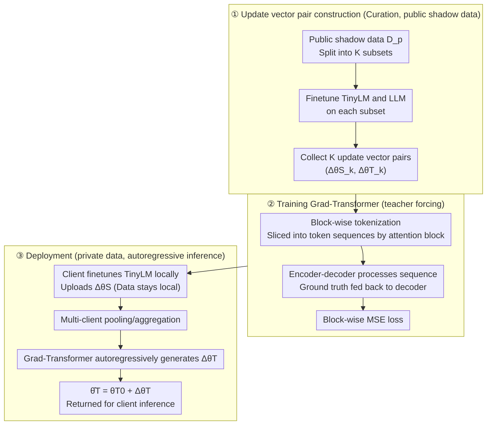

# Gradient Transformer: Learning to Generate Updates for LLMs

**Conference**: ICML 2026  
**arXiv**: [2605.27591](https://arxiv.org/abs/2605.27591)  
**Code**: TBD  
**Area**: Learned Optimizers / Data-free Knowledge Distillation / Privacy-Preserving Fine-tuning  
**Keywords**: update vector, weak-to-strong distillation, Grad-Transformer, LoRA, differential privacy

## TL;DR
This paper proposes Grad-Transformer, which "translates" update vectors obtained by clients fine-tuning small models (TinyLM) on private data into update vectors for a target large language model (LLM) using an encoder-decoder Transformer. This achieves weak-to-strong knowledge distillation without any access to private data. It achieves an average PGR of 91.88% across six reasoning/summarization datasets, representing a 55.89% improvement over the best baseline (58.94%), while remaining robust to differential privacy perturbations.

## Background & Motivation

**Background**: There are two mainstream ways to fine-tune LLMs on corporate private data: (1) clients fine-tune a small model (TinyLM) locally; (2) clients provide data to cloud service providers to fine-tune the LLM. The former suffers from poor performance, while the latter violates privacy constraints like GDPR/HIPAA. The academic compromise is data-free knowledge distillation (KD): training a generator to synthesize samples that "look like" private data to distill the student.

**Limitations of Prior Work**: Data-free KD has two major flaws: (a) a generator must be retrained from scratch for every new teacher, and distillation requires massive synthetic samples, which is computationally expensive; (b) synthetic samples can expose privacy-sensitive information through memorization or leakage (Annamalai et al., 2024), contradicting the "data-free" intent. Another approach, weak-to-strong KD (Burns et al., 2024), requires the teacher (weak) and student (strong) to share data, which also fails the "data stays local" requirement.

**Key Challenge**: Traditional carriers of knowledge distillation are logits or synthetic samples, both of which either require data access or risk leakage. **Is there a "knowledge carrier" that can encode fine-tuning effects on private data without being reversible into original samples?**

**Goal**: Design a mechanism $\mathcal{M}$ that allows third-party providers to directly map a TinyLM update vector $\Delta\theta_S=\theta_S^*-\theta_S^0$ submitted by a client into a target LLM update vector $\Delta\theta_T$ **without ever contacting private data**, while supporting collaborative updates from multiple clients.

**Key Insight**: The authors note that an update vector itself is a "compressed representation of accumulated gradient steps on a dataset"—it encapsulates the influence of private data as increments in parameter space, which is more abstract than logits or synthetic samples and does not directly correspond to specific samples. If the correspondence between "TinyLM update ↔ LLM update" can be learned on a **public shadow dataset**, this mapping can serve as a reusable "gradient translator."

**Core Idea**: Slice the update vector into token-like sequences according to attention blocks and use a Flan-T5 encoder-decoder to autoregressively generate block-wise update vectors for the LLM. The mapping is trained once on shadow data and used directly via a forward pass during deployment.

## Method

### Overall Architecture
The objective is to allow service providers to transfer "gradient knowledge" from small models fine-tuned on private data to large models without touching the private data. The mechanism consists of three steps: first, curate $K$ pairs of $(\Delta\tilde\theta_{S,k}, \Delta\tilde\theta_{T,k})$ by fine-tuning TinyLM and LLM on a **public shadow dataset** $D_p$ (Curation); second, train a seq2seq Grad-Transformer using these pairs to learn the translation relationship (Train); third, during deployment, the client fine-tunes TinyLM locally to obtain $\Delta\theta_{S,i}$ and uploads it. The provider pools updates from multiple clients, passes them through Grad-Transformer to obtain $\Delta\hat\theta_T$, and adds them to the initial weights $\hat\theta_T=\theta_T^0+\Delta\hat\theta_T$ before returning the model for client inference (Deploy). The mapping is trained once and reused for all clients.

### Key Designs

**1. Update vector as distillation carrier: Parameter increments as non-leaking knowledge medium**

Traditional distillation uses logits or synthetic samples. The former requires the teacher/student to see the same data, and the latter leaks private information via memorization—both contradict the "data stays local" principle. This paper uses the increment $\Delta\theta_S=\theta_S^*-\theta_S^0$ relative to public initial weights as the carrier. Providers perform mapping on this increment while original samples remain local. LoRA $r=2$ adapters are used to further compress dimensionality. This is feasible because update vectors are low-variance, numerically stable "semantic compressions" that encapsulate the influence of private data without directly corresponding to specific samples, providing fewer leakage channels than synthetic data. Theoretically (Lemma 5.1, Theorem 5.2), generalization and utility bounds are both controlled by $I(w;D_p)$. Thus, noisy algorithms like DP-SGD can be applied to weaken the dependence of $\Delta\theta_S$ on individual samples, further reducing privacy risks. Crucially, the shadow dataset is only used to learn the "correlation between two parameter spaces," independent of specific client data, allowing one Grad-Transformer to serve all clients on the same task.

**2. Block-wise tokenization: Mapping trillion-dimensional parameters as token sequence translation**

Directly concatenating all parameters and projecting them into the large model space would cause the projection matrix to balloon to trillions of parameters, making training impossible. This paper leverages the Transformer's inherent ability to process token sequences by rewriting parameter mapping as sequence translation. For each attention block, weight increments for Q/K/V/output projections are concatenated into a block vector $\delta_{S,k}^j\in\mathbb{R}^{d_S}$, treated as a single token. Embedding layers $W_S^{emb}, W_T^{emb}$ project source/target blocks of different dimensions into the same hidden size. An encoder-decoder $\varphi$ processes the entire sequence, and $W_{out}$ projects back into the $d_T$-dimensional LLM block space. This partitioning retains the strong prior of "hierarchical correspondence" while keeping sequence lengths manageable (from dozens to hundreds), fitting the scale Transformers excel at. The cost of the mapping is reduced from trillions of parameters to a single Flan-T5-Large.

**3. Teacher-forcing training + Autoregressive inference: Capturing inter-block coupling**

Parameter updates across different LLM layers are strongly correlated (deep attention relies on shallow semantics). Independently predicting each block would lose this structural information. The decoder is designed to generate the $j$-th LLM block update by attending to all TinyLM blocks and previously generated LLM blocks $1$ to $j-1$. Training uses teacher forcing to feed ground truth $h_{T,k}^{<j}=W_T^{emb}(\delta_{T,k}^{<j})$ back into the model, targeting block-wise MSE:

$$\arg\min_w \frac{1}{KL_T}\sum_k\sum_j\big\|\hat\delta_{T,k}^j-\delta_{T,k}^j\big\|_2^2$$

During inference, the model switches to feeding its own previous prediction $\hat h_{T,k}^{<j}$ (Eq. 11), becoming fully autoregressive. In multi-client scenarios, $\{\Delta\theta_{S,i}\}$ are pooled (mean or sum) before being fed into $\mathcal{M}$, naturally supporting joint updates. Autoregressive generation is the standard paradigm for Transformers to handle such structured outputs.

### Loss & Training
- **Objective**: Block-wise MSE (Eq. 10), optimized with Adam for 30 epochs, batch size 32, lr 2e-5 to 8e-5.
- **Data**: Training sets are split in half: one for private data $D$, the other for shadow data $D_p$. $D_p$ is randomly split into $K=300$ subsets (1024 samples each). LoRA $r=2$ fine-tuning is performed on each until convergence. Adapters from the last 200 steps are collected as update vector pairs, totaling 60k tuples, with a 95:5 train/val split.
- **Models**: TinyLM = Qwen2.5-3B-Instruct, LLM = Qwen2.5-7B-Instruct, $\varphi$ = Flan-T5-Large.

## Key Experimental Results

### Main Results (Single Client, higher PGR % is better)

| Dataset | $P_S$ (TinyLM) | Best Baseline | Grad-Transformer | $P_T$ (LLM Upper Bound) |
|--------|--------------:|--------------:|-----------------:|-----------------:|
| AQuA-RAT (Acc) | 48.43 | 47.64 (W2S Conf) | **61.02** | 58.66 |
| GSM8K (Acc) | 62.62 | 74.30 (W2S Conf) | **73.59** | 73.16 |
| DROP (Acc) | 49.36 | 54.18 (W2S Conf) | **58.26** | 59.01 |
| CommonsenseQA (Acc) | 77.40 | 83.46 | 83.21 | 83.78 |
| SAMSum (R-1) | 47.64 | 49.92 | **50.52** | 50.59 |
| DialogSum (R-1) | 46.43 | 47.70 | 48.37 | 50.92 |

**Key Findings**: On AQuA-RAT, Grad-Transformer accuracy (61.02%) actually **surpasses the LLM upper bound** (58.66%), reaching a PGR of 123%. This suggests the "gradient translation" learned on shadow data exhibits certain regularization or ensemble effects. The average PGR is 91.88%, significantly outperforming the best baseline of 58.94% (+55.89% Gain). Notably, all three baselines (W2S, Conf, VisSup) **require access to private data**, while Ours does not.

### Table: Comparison of Methods

| Dimension | Data-free KD baseline | Weak-to-strong KD baseline | Grad-Transformer |
|------|----------------------|---------------------------|------------------|
| Accesses Private Data | ✗ (But needs generator) | ✓ | **✗** |
| Retraining per Teacher | ✓ (Expensive) | – | ✗ (One-time mapping) |
| Synthetic Leakage Risk | High | – | **No synthetic samples** |
| Multi-client Support | Hard | Hard | ✓ (Pool update vec) |
| Compatible with DP/LoRA| Partial | Partial | ✓ |

### Key Findings
- **Block-wise tokenization is the key to scalability**: It reduces the trillion-scale parameter mapping to a Flan-T5-Large scale, making the architecture trainable.
- **DP Robustness**: When DP-SGD noise is added to the client $\mathcal{A}$, Grad-Transformer's performance drop is much smaller than baselines. Its translation capability stems from temporal correlations between model spaces learned on shadow data, rather than the precise $\Delta\theta_S$ uploaded by the client.
- **Alignment between Theory and Experiment**: Theorem 5.2 predicts the utility bound depends on $I(w;D_p)+\mathrm{KL}(\tilde\mu\|\mu)$. Experiments show performance is best when shadow $D_p$ and private $D$ are from the same distribution; cross-distribution scenarios result in significant drops, suggesting careful selection of shadow data is necessary.

## Highlights & Insights
- **"Gradients as Knowledge" Paradigm**: Treating update vectors as learnable, translatable "knowledge token sequences" is a critical extension of model soup and task arithmetic. While the latter performs arithmetic within the same architecture, this work enables parameter space mapping **across architectures and scales**.
- **Elegant Balance of Privacy, Utility, and Cost**: Clients only need to locally train a 3B model and never upload data. Providers train Grad-Transformer once to serve all clients on a given task, compressing the "repeated gradient communication" cost of federated learning into a "single LoRA adapter upload."
- **Transferable Trick**: The combination of block-wise serialization and encoder-decoder autoregression can be directly transferred to model merging, cross-architecture adapter transfer, or even training dynamics prediction—any task requiring mapping between two high-dimensional parameter spaces.

## Limitations & Future Work
- The authors acknowledge that performance relies heavily on the distribution alignment between shadow data $D_p$ and client private data ($\mathrm{KL}(\tilde\mu\|\mu)$ in Theorem 5.2). Finding suitable $D_p$ for niche client tasks may be difficult.
- This study only validates cross-scale mapping within the **same model family (Qwen2.5)** (e.g., 3B→7B, 7B→14B). The feasibility across different model families (e.g., LLaMA→Qwen) remains unknown. Furthermore, LoRA $r=2$ is aggressive compression; it is unclear if Grad-Transformer scales when update vector dimensions explode in full fine-tuning scenarios.
- Future improvements could involve hierarchical block sequences (layer-group then intra-layer) or introducing "architecture embeddings" as prompts, allowing a single Grad-Transformer to serve multiple teacher-student combinations.

## Related Work & Insights
- **vs. Burns et al. 2024 (Weak-to-Strong)**: W2S uses weak teacher outputs (logits/labels) to supervise a strong student, requiring both to see the same data. This paper uses the weak teacher's **parameter increments**, and data is only provided to the weak teacher; the strong student remains data-free.
- **vs. Data-Free KD (Tran et al., 2024; Wei et al., 2025)**: These methods train generators for synthetic data distillation, requiring retraining per teacher and risking leakage. This work avoids generators entirely; the "translator" is one-time and reusable.
- **vs. Task Arithmetic / Model Soup**: These operate additions/subtractions on $\Delta\theta$ within the same architecture. This work learns a **nonlinear cross-architecture mapping** $\Delta\theta_S\mapsto\Delta\theta_T$, acting as a "cross-scale superset" of task arithmetic.
- **vs. LoRA Adapter Hub**: While the hub involves reusing pre-trained adapters, this work functions as an "adapter translator"—converting small model adapters to large model equivalents to benefit resource-constrained parties.

## Rating
- **Novelty**: ⭐⭐⭐⭐⭐ "Translating gradients with Transformer" is a truly novel perspective, turning cross-scale parameter mapping into a well-defined seq2seq task.
- **Experimental Thoroughness**: ⭐⭐⭐⭐ Covers 6 datasets, 3 baselines, single/multi-client, and DP settings, though limited to cross-scale validation within the Qwen family.
- **Writing Quality**: ⭐⭐⭐⭐ The three-stage framework is clear, and the theory (Lemma 5.1/Theorem 5.2) aligns well with the method and experiments.
- **Value**: ⭐⭐⭐⭐⭐ Directly addresses real pain points in enterprise LLM private fine-tuning. Engineering implementation is ready (LoRA/DP compatible, multi-client support) and could become a new baseline for privacy-preserving LLM services.

<!-- RELATED:START -->

## Related Papers

- [\[CVPR 2025\] LLM4SVG: Empowering LLMs to Understand and Generate Complex Vector Graphics](../../CVPR2025/llm_safety/empowering_llms_to_understand_and_generate_complex_vector_graphics.md)
- [\[ICML 2026\] Decoupled Training with Local Reinforcement Fine-Tuning in Federated Learning](decoupled_training_with_local_reinforcement_fine-tuning_in_federated_learning.md)
- [\[ICCV 2025\] Geminio: Language-Guided Gradient Inversion Attacks in Federated Learning](../../ICCV2025/llm_safety/geminio_language-guided_gradient_inversion_attacks_in_federated_learning.md)
- [\[AAAI 2026\] Ghost in the Transformer: Detecting Model Reuse with Invariant Spectral Signatures](../../AAAI2026/llm_safety/ghost_in_the_transformer_detecting_model_reuse_with_invariant_spectral_signature.md)
- [\[ACL 2025\] PIG: Privacy Jailbreak Attack on LLMs via Gradient-based Iterative Prompts](../../ACL2025/llm_safety/pig_privacy_jailbreak.md)

<!-- RELATED:END -->
