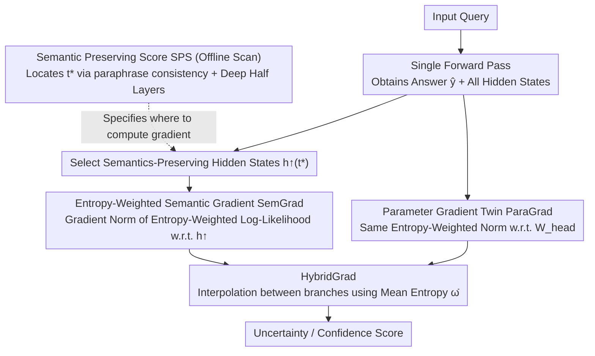

# SemGrad: Gradients w.r.t. Semantics-Preserving Embeddings Tell LLM Uncertainty

**Conference**: ICML 2026  
**arXiv**: [2605.04638](https://arxiv.org/abs/2605.04638)  
**Code**: https://github.com/mingdali6717/SemGrad (Available)  
**Area**: LLM Safety / Uncertainty Quantification (UQ) / Hallucination Detection  
**Keywords**: Free-form Generation UQ, Semantic Gradients, Semantic Preserving Score, Single Forward-Backward, Multiple Valid Answers

## TL;DR
SemGrad introduces the first "gradient-based" uncertainty quantification to free-form LLM generation. By utilizing Semantic Preserving Score (SPS) to identify hidden states that encode input semantics, it uses the log-likelihood gradient norm with respect to these states as a measure of LLM confidence. Without sampling and requiring only a single backward pass, it outperforms 11 SOTA baselines across 3 QA datasets, notably achieving a 3.27 AUROC improvement over SAR on the multi-answer TruthfulQA dataset.

## Background & Motivation

**Background**: While LLMs are increasingly deployed in healthcare, education, and finance, the issue of hallucinations makes "measuring model confidence" a critical requirement. SOTA UQ methods (e.g., Semantic Entropy, SAR, Semantic Density) typically follow a "sampling + cross-sample semantic clustering" route: sampling $K$ outputs for the same query and then calculating distributional divergence.

**Limitations of Prior Work**: (i) Sampling methods cost $K\times$ the generation time, exhibit high variance, and are slow to deploy; (ii) Established "parameter gradient norm" UQ in classification tasks assumes a single ground truth label (equivalent to a Dirac distribution). The condition $\nabla_\theta\log p(y^\star|x)=0$ holds at the optimum. However, natural language inherently possesses aleatoric uncertainty (multiple valid answers). In such cases, gradients do not vanish even at the optimal $\theta^\star$, causing parameter gradient norms to misinterpret "inherent task randomness" as "model uncertainty."

**Key Challenge**: In free-form generation, aleatoric uncertainty (task-inherent randomness) and epistemic uncertainty (model knowledge gaps) are confounded. Gradients in the parameter space cannot decouple these, while sampling methods are prohibitively expensive.

**Goal**: (1) Propose the first gradient-based UQ truly suitable for free-form generation; (2) Ensure effectiveness in multi-answer scenarios; (3) Maintain high efficiency via "single forward + single backward" passes.

**Key Insight**: Following linguistic intuition, if a model truly understands a query, a semantics-preserving perturbation $\boldsymbol{x}+\Delta\boldsymbol{x}$ should not alter the output distribution. This local stability can be quantified by the gradient norm with respect to semantics-preserving embeddings, regardless of whether the ground truth distribution is unimodal or multimodal.

**Core Idea**: Shift gradients from "parameter space" to "semantic space"—identify intermediate hidden states $\boldsymbol{h}_E$ that preserve input semantics and use $\|\nabla_{\boldsymbol{h}_E}\log p(\hat{\boldsymbol{y}}|\boldsymbol{x};\boldsymbol{h}_E)\|$ as the uncertainty measure.

## Method

### Overall Architecture
SemGrad aims to determine "how confident the LLM is in its free-form generation" using only one forward and one backward pass without sampling. During inference, a forward pass is executed to obtain the answer $\hat{\boldsymbol{y}}$ and all hidden states. The semantics-preserving token $t^\star$ that best encodes input semantics is selected, and its hidden states from the deeper half of layers ($L/2+1$ to $L-1$) are concatenated as $\boldsymbol{h}^\uparrow_{t^\star}$. A single backward pass is performed on an entropy-weighted log-likelihood, and the gradient norm with respect to $\boldsymbol{h}^\uparrow_{t^\star}$ defines SemGrad. Finally, as adaptive HybridGrad is calculated by interpolating SemGrad and its parameter-based counterpart ParaGrad using the average token entropy $\bar\omega$.

### Key Designs

**1. Semantic Preserving Score (SPS): Data-driven Localization for Gradients**

The key to gradient UQ is not how to calculate the gradient, but where—selecting the wrong position (e.g., the last layer serving only next-token decoding or low-level lexical features) fails to capture uncertainty signals. SPS provides a quantifiable selection criterion: for each query, $K$ semantically equivalent paraphrases are generated via GPT. The within-paraphrase similarity $S_{w/i}^{l,t}$ (how close hidden states of synonymous inputs are at that token/layer) and across-query similarity $S_{a/c}^{l,t}$ (how close non-synonymous inputs are) are calculated. The difference $\mathrm{SPS}=S_{w/i}-S_{a/c}$ reflects the ability to map synonymous inputs together and push divergent ones apart. Scans reveal three stable patterns: a consistent optimal token $t^\star$ exists for each model (e.g., `<|start_header_id|>` for LLaMA-3.1), high SPS is concentrated in the deeper half of layers, and high SPS regions form a "band" rather than a single point. Thus, concatenated hidden states from the deeper half are used.

**2. SemGrad: Sensitivity to Semantic Perturbations as Uncertainty**

The intuition is that if the model understands the query, semantics-preserving perturbations should not change the output distribution. This local stability is quantified as the gradient norm w.r.t. semantic embeddings:

$$S_{\text{SemGrad}}=\frac{1}{|\boldsymbol{h}^\uparrow_{t^\star}|}\Big\|\nabla_{\boldsymbol{h}^\uparrow_{t^\star}}\sum_{t=1}^T\omega_t\log p(\hat{y}_t\mid\hat{y}_{<t},\boldsymbol{x};\boldsymbol{h}^\uparrow_{t^\star})\Big\|_1$$

where $\omega_t=H(p(y_t\mid\hat{y}_{<t},\boldsymbol{x}))$ is the token entropy at each step, detached from the computation graph. This weighting accounts for non-uniform token importance—stopwords/subwords receive low weights, while critical factual terms with high entropy receive high weights. The theoretical basis for multi-answer effectiveness is that $\|\nabla_{\boldsymbol{h}_E}\log p\|\approx 0$ only requires the model to approximate the true distribution, regardless of its modality. Thus, gradients are not biased by aleatoric noise from multiple valid answers.

**3. HybridGrad: Adaptive Fusion via Mean Entropy**

While SemGrad is stable for multi-answer tasks, parameter gradients are often more accurate in single-answer scenarios where the parameter space directly corresponds to the training objective. HybridGrad avoids a hard choice, using the mean token entropy $\bar\omega=\frac{1}{T}\sum_t\omega_t$ as a proxy for the level of aleatoric uncertainty:

$$S_{\text{HybridGrad}}=(1-e^{-\bar\omega})\,S_{\text{SemGrad}}+e^{-\bar\omega}\,S_{\text{ParaGrad}}$$

Low entropy (certain tasks) favors ParaGrad, while high entropy (ambiguous tasks) favors SemGrad. ParaGrad is the parameter-based twin of SemGrad, replacing the target from $\nabla_{\boldsymbol{h}_E}$ to $\nabla_{\boldsymbol{W}_{\text{head}}}$, allowing both to be fused within the same framework.

### Loss & Training
The method is inference-only with no training required. The only offline step is a single SPS scan on a small development set to determine the model's $t^\star$.

## Key Experimental Results

### Main Results
Evaluation across 3 LLMs and 3 QA datasets (SciQ and TriviaQA for single-answer; TruthfulQA for multi-answer) using BEM for correctness and AUROC for UQ performance:

| Method | SciQ avg | TriviaQA avg | TruthfulQ avg | **Overall avg** |
|------|---------:|------------:|--------------:|----------------:|
| SAR (Prev. SOTA, Sampling) | 74.86 | 84.13 | 66.99 | 75.33 |
| ExGrad (Parameter Gradient) | 74.33 | 83.37 | 64.06 | 73.92 |
| ParaGrad (Ours baseline) | 75.02 | 84.81 | 66.95 | 75.59 |
| SemGrad | 74.50 | 82.50 | **70.25** | 75.75 |
| **HybridGrad** | **75.35** | 83.90 | **70.53** | **76.59** |

On the multi-answer TruthfulQA, SemGrad outperforms SAR by +3.27 and ParaGrad by +3.30 AUROC.

### Ablation Study

| Configuration | TruthfulQA AUROC (LLaMA) | Explanation |
|------|-------------------------:|------|
| Full SemGrad (Deep-half + $t^\star$ + $\ell_1$ + entropy weight) | 69.42 | Default |
| $\ell_2$ instead of $\ell_1$ | 69.42 | Virtually no difference |
| Remove $\omega_t$ (entropy weight) | 68.98 | More significant drop on TriviaQA (3.4 pts) |
| Last layer only ($L-1$) | 68.13 | Band > Single layer |
| Token changed to last input token | 69.07 | $t^\star$ > last |
| Using low SPS hidden states | Significant Decrease | High positive correlation between SPS and AUROC |

### Key Findings
- **SPS Correlates with AUROC**: Regions with higher SPS yield better SemGrad performance, while low SPS regions (early layers/misaligned tokens) capture almost no uncertainty information. This validates that gradients must be computed in "semantic space."
- **SemGrad Dominates in Multi-answer Scenarios**: When parameter gradients fail due to task aleatoricness, SemGrad’s theoretical independence provides a step-change improvement.
- **HybridGrad is the Robust All-rounder**: By adaptively fusing semantic and parameter branches, it achieves the highest and most stable average AUROC across 9 (model, dataset) combinations.
- **Efficiency Advantages**: SemGrad/HybridGrad run an order of magnitude faster than sampling baselines per example, although current PyTorch limitations for calculating gradients of all tokens present further optimization potential.

## Highlights & Insights
- **First Gradient UQ for Free-form Generation**: Moving beyond "sampling + clustering," this proves gradient routes are effective and potentially superior in multi-answer settings.
- **SPS as a Tool**: The method of locating "semantic encoding tokens" via paraphrase consistency has standalone value for mechanistic interpretability and representation engineering.
- **Entropy-Weighted Token Importance**: Using cheap token-level entropy instead of expensive importance scores from third-party models is a broadly applicable lightweight trick.
- **Adaptive Fusion Paradigm**: Using $\bar\omega$ as an aleatoric indicator to interpolate between branches is a generalizable strategy for scenarios where two estimators excel in different regimes.

## Limitations & Future Work
- Only applicable to white-box models (requires gradients and hidden states).
- Primarily validated on short-answer claim-level QA; gradient signals in long-form output might be diluted by low-information tokens.
- Current implementation computes gradients for all token hidden states simultaneously; optimized engineering could reduce memory and time overhead.
- $t^\star$ requires re-scanning for new models; a zero-shot automated determination method is not yet provided.

## Related Work & Insights
- **vs Semantic Entropy / SAR / Semantic Density**: Sampling routes rely on cross-sample clustering to capture distribution divergence; SemGrad solves it via a single backward pass and handles multi-answer cases naturally.
- **vs ExGrad / ParaGrad**: Standard parameter gradient routes for classification; this work explains their theoretical failure in multi-answer settings and provides SemGrad as a remedy.
- **vs INSIDE / Self-Consistency / P(True)**: Internal state or self-scoring methods; SemGrad provides a more principled "semantic stability" metric.
- **Transferable Insights**: The perspective of "moving gradients from parameter space to representation space" is useful for other LLM diagnostics like OOD detection and prompt sensitivity analysis; SPS can also be used to locate "semantic bottleneck layers."

## Rating
- Novelty: ⭐⭐⭐⭐⭐ Advances gradient UQ from classification to free-form generation and clarifies failure modes in multi-answer scenarios.
- Experimental Thoroughness: ⭐⭐⭐⭐ Solid coverage across 3 models, 3 datasets, and 11 baselines; could benefit from long-form and OOD validation.
- Writing Quality: ⭐⭐⭐⭐ Clear derivations and well-explained motivations; intuitive figures.
- Value: ⭐⭐⭐⭐⭐ Significantly lower deployment costs than sampling with competitive or superior performance, offering high practical value for hallucination detection.

<!-- RELATED:START -->

## Related Papers

- [\[ICML 2026\] Position: Uncertainty Quantification in LLMs is Just Unsupervised Clustering](position_uncertainty_quantification_in_llms_is_just_unsupervised_clustering.md)
- [\[AAAI 2026\] SafeNlidb: A Privacy-Preserving Safety Alignment Framework for LLM-based Natural Language Database Interfaces](../../AAAI2026/llm_safety/safenlidb_a_privacy-preserving_safety_alignment_framework_for_llm-based_natural_.md)
- [\[ICLR 2026\] No Caption, No Problem: Caption-Free Membership Inference via Model-Fitted Embeddings](../../ICLR2026/llm_safety/no_caption_no_problem_caption-free_membership_inference_via_model-fitted_embeddi.md)
- [\[ACL 2026\] AgentMark: Utility-Preserving Behavioral Watermarking for Agents](../../ACL2026/llm_safety/agentmark_utility-preserving_behavioral_watermarking_for_agents.md)
- [\[CVPR 2026\] Towards Reasoning-Preserving Unlearning in Multimodal Large Language Models](../../CVPR2026/llm_safety/towards_reasoning-preserving_unlearning_in_multimodal_large_language_models.md)

<!-- RELATED:END -->
