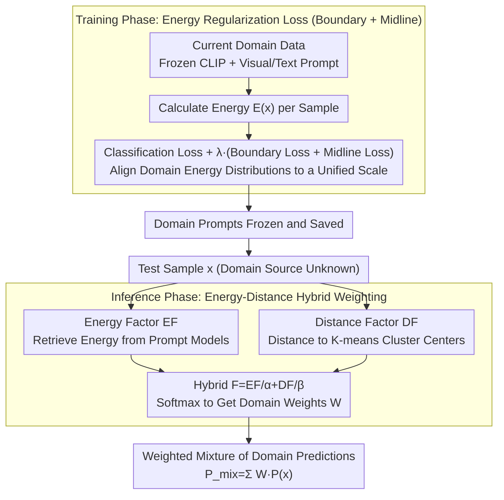

# HEDP: A Hybrid Energy-Distance Prompt-based Framework for Domain Incremental Learning

**Conference**: ICML 2026  
**arXiv**: [2605.05776](https://arxiv.org/abs/2605.05776)  
**Code**: Available (public repository attached at the end of the paper)  
**Area**: Continual Learning / Domain Incremental Learning / Prompt Learning  
**Keywords**: Domain Incremental Learning, Prompt Learning, Energy-Based Models, Helmholtz Free Energy, CLIP

## TL;DR
Borrowing physical intuition from Helmholtz free energy, the prompt parameters for each domain are trained to follow an energy curve that is "compressed to boundary $\Theta$ and aligned to midline $\Delta$." During inference, energy factors and distance factors are jointly used to weight the prompts from each domain. This approach achieves performance gains of 1.76, 3.12, and 2.57 percentage points on unknown domains across three DIL benchmarks: CDDB, DomainNet, and CORe50.

## Background & Motivation

**Background**: Domain Incremental Learning (DIL) requires models to be trained sequentially on multiple domains (e.g., autonomous driving detection under different weather conditions) without replaying old domain data. During inference, the model must maintain accuracy on known domains while generalizing to unknown domains. The mainstream approach involves freezing a pre-trained foundation model (such as CLIP) and learning a set of prompt parameters for each domain; representative methods include CP-Prompt, S-Prompts, MoP-CLIP, and ESN.

**Limitations of Prior Work**: (1) There is a persistent trade-off between known and unknown domains—CP-Prompt performs well on known domains but poorly on unknown ones, while MoP-CLIP does the opposite; (2) "How to select which domain's prompt" during inference is the core problem, and existing methods either use distance (prone to misjudgment in overlap regions) or clustering (with blurred boundaries at coarse granularities); (3) Single-domain prompts easily overfit to their own distributions, which can actually increase overlap with other domain prompts in the shared space. t-SNE visualizations show that Domain B samples in the CLIP space can actually be closer to the cluster points of Domain A.

**Key Challenge**: Domains are both similar and different within the shared feature space. A single signal (distance or energy) only captures one aspect—distance reflects the global semantic structure (learned by CLIP), while energy reflects the local distribution sensitivity tuned by the prompt. Both have different error patterns, but neither is sufficiently stable alone.

**Goal**: (1) Align the energy distributions of each domain's prompt during training so that energy truly reflects "whether a sample belongs to this domain"; (2) Design a hybrid energy-distance signal for inference that combines their respective advantages while canceling out their weaknesses.

**Key Insight**: The statistical distribution of data in the feature space is analogized to an energy field in physics. Using Helmholtz free energy $E(x) = -kT \ln[\sum_y e^{H(x)[y]/kT}]$, a scalar energy is calculated for each sample relative to each prompt. In an ideal scenario, the prompt for a specific domain should assign low energy to its own samples and high energy to out-of-domain samples.

**Core Idea**: An energy regularization term combining "boundary loss + midline loss" is used to constrain the energy distribution of each domain prompt to a unified scale. During inference, the energy factor and distance factor are summed and then softmaxed to obtain hybrid weights, which are used to perform a weighted summation of the predictions from each domain's prompt.

## Method

### Overall Architecture
HEDP freezes the CLIP ViT-B/16 backbone and learns a separate set of prompts for each domain, with the challenge focused entirely on "which domain's prompt to use during inference." During the training stage, a set of visual prompts $P_v^S$ and text prompts $P_t^S$ is trained independently for each domain. The loss consists of classification cross-entropy $\mathcal{L}_{ce}$ plus energy regularization $\lambda\mathcal{L}_{reg}$ ($\lambda=0.05$), focusing on constraining the energy distribution of each domain prompt to a unified scale. During inference, two signals are calculated simultaneously for each test sample: the distance $D^i(x)$ to the cluster centers of each domain in the frozen CLIP space, and the energy $E^i(x)$ under each prompt model. These are normalized into relative factors and summed as $F^i(x)=EF^i/\alpha+DF^i/\beta$. The weights $W^i$ are obtained via softmax, and the final prediction is a mixture of domain predictions $P_{mix}(x)=\sum_i W^i P^i(x)$. The contribution of the entire method lies in two stages: energy regularization during training and energy-distance hybridization during inference.

### Key Designs

**1. Energy Regularization Loss (Boundary + Midline): Aligning Domain Energy Distributions to a Single Scale**

The energy signal itself is usable—domain-specific prompts assign low energy to in-domain samples and high energy to out-of-domain samples—but only if the energies across domains are "comparable." If Domain A's prompt compresses samples to $-50$ and Domain B's compresses them to $-20$, comparing energy magnitudes during inference would lead to chaos. This paper uses Helmholtz free energy to calculate a scalar $E(x) = -kT\ln[\sum_{y=1}^U e^{H(x)[y]/kT}]$ for each sample, then uses two complementary regularizers to anchor the distribution to a unified coordinate system: The boundary loss $\mathcal{L}_{border}=\frac{1}{|\mathcal{D}_t|}\sum\max(0, E(x)-\Theta)$ only penalizes samples where energy exceeds the threshold $\Theta=-32$, pushing all in-domain samples toward the low-energy side; the midline loss $\mathcal{L}_{midline}=|\Delta-\frac{1}{|\mathcal{D}_t|}\sum E(x)|$ pulls the overall mean to $\Delta=-40$. Both are essential: comparative diagrams of the four combinations (None / Boundary only / Midline only / Full) show that with only the boundary, cross-domain energy is pushed below $\Theta$ but relative positions remain disordered; with only the midline, the distribution shape is unconstrained, and inversions where $E^B(x^A) < E^A(x^A)$ can still occur. Only when the boundary controls the "maximum upper limit" and the midline controls the "center position" can the condition $E^s(x^s) < E^i(x^s)\ (\forall i\neq s)$ be stably met, making energy a truly cross-domain comparable metric.

This regularizer also provides an unexpected benefit (Appendix Proposition 2): traditional energy training tends to create "energy cliffs"—once OOD samples get close to the boundary, they are mistakenly assigned low energy, causing model failure in unknown domains. Constraining energy output to $(-\infty, \Theta]$ and anchoring the mean to $\Delta$ is equivalent to implicitly lowering the local Lipschitz constant $K$ of the energy function on the data manifold. For an OOD sample $x_{out}=x_{in}+\Delta_x$, the energy shift satisfies $|E(x_{out})-E(x_{in})|\le K\|\Delta_x\|$. A smaller $K$ ensures that unknown domain samples do not suddenly drop into the low-energy regions of known domains, thereby alleviating catastrophic forgetting. In other words, this regularizer not only makes energy "comparable" but also smooths the energy landscape, providing a buffer for OOD samples—a trick that can be independently transferred to any OOD detection task.

**2. Hybridization of Energy and Distance Factors: Signals with Orthogonal Error Patterns Complement Each Other**

Energy alone is not stable enough—it reflects local distribution sensitivity tuned by the prompt and is prone to misjudgment in domain overlap regions. This paper designs a hybrid similarity factor for inference to determine the weight of each domain prompt. The energy factor $EF^i(x)=E_{\min}-E^i(x)$ takes the negative offset shifted to $(-\infty,0]$; a larger value indicates lower energy under the $i$-th prompt, meaning it is more likely to belong to that domain. The distance factor $DF^i(x)=D_{\min}-D^i(x)$ uses $K$-means in the frozen CLIP space to calculate $K$ cluster centers for each domain and takes the cosine distance to the nearest center. Summing these yields $F^i(x)=EF^i(x)/\alpha+DF^i(x)/\beta$, then $W^i=\text{softmax}(F^i)$. The key reason this hybrid works, as shown in the first-order Taylor argument in the Appendix, is that $\nabla_x EF$ follows the prompt parameter direction (capturing domain statistical differences) while $\nabla_x DF$ follows the frozen CLIP semantic direction (capturing global semantics). Their gradients are approximately orthogonal, and their error patterns are uncorrelated—disturbances that cause energy failures often do not cause distance failures simultaneously, and vice versa. Errors cancel each other out after hybridization. Empirical results with $\alpha=\beta=0.6$ show known domains lean toward distance while unknown domains remain balanced, confirming the theory.

### Loss & Training
The total loss is $\mathcal{L}_{total}=\mathcal{L}_{ce}+\lambda\mathcal{L}_{reg}$, where $\mathcal{L}_{reg}=\mathcal{L}_{border}+\mathcal{L}_{midline}$. Hyperparameters: $\Theta=-32, \Delta=-40, K=5, \alpha=\beta=0.6, \lambda=0.05$. Training uses SGD with cosine annealing and an initial lr of 0.01.

## Key Experimental Results

### Main Results

| Dataset | Scenario | Prev. SOTA | Ours | Gain |
|--------|------|---------|------|------|
| CDDB-Hard | Known AA / AF | CP-Prompt 93.65 / -0.25 | **93.72 / -0.08** | +0.07 / +0.17 |
| CDDB-Hard | Unknown AA | MoP-CLIP 81.98 | **83.74** | +1.76 |
| DomainNet | Known AA (All) | CP-Prompt 73.15 | **74.19** | +1.04 |
| DomainNet | Unknown AA | MoP-CLIP 63.97 | **67.09** | +3.12 |
| CORe50 | Unknown AA | ESN 91.80 | **94.37** | +2.57 |

HEDP achieves the best results on both known and unknown domains simultaneously, avoiding the trade-off.

### Ablation Study

| Scheme | Energy Boundary | Energy Midline | Energy Factor | Distance Factor | CDDB Unknown | DomainNet Unknown | CORe50 Unknown |
|------|----------|----------|----------|----------|-----------|----------------|-------------|
| 1 (Distance only) | ✗ | ✗ | ✗ | ✓ | 75.80 | 64.97 | 93.17 |
| 2 (No reg energy) | ✗ | ✗ | ✓ | ✗ | 77.31 | 63.55 | 92.06 |
| 3 (+Boundary) | ✓ | ✗ | ✓ | ✗ | 79.22 | 65.05 | 92.98 |
| 4 (+Midline) | ✗ | ✓ | ✓ | ✗ | 79.12 | 65.01 | 93.77 |
| 5 (Full energy) | ✓ | ✓ | ✓ | ✗ | 81.52 | 65.59 | 94.07 |
| 6 (Full HEDP) | ✓ | ✓ | ✓ | ✓ | **83.74** | **67.09** | **94.66** |

### Key Findings
- **Boundary + Midline must be used together**: Either one alone performs 2-3 points worse than the full regularization, proving they capture different distribution characteristics (maximum constraint vs. central tendency alignment).
- **Energy and distance are complementary rather than redundant**: Moving from Scheme 5 to 6 by adding the distance factor increases CDDB Unknown by 2.22 points; moving from Scheme 1 to 6 by adding the energy factor increases it by 7.94 points. The complementary effect is particularly evident in unknown domains.
- **Hyperparameter effects on unknown domains show a diagonal distribution**: Grid heatmaps for $\alpha, \beta$ show known domains favor "distance dominance," while unknown domains favor a "balance of energy and distance," proving their mechanisms of action differ.
- Changing the number of clusters $K$ has minimal impact, suggesting the distance factor primarily acts as a "global topological stabilizer" rather than for fine-grained discrimination.

## Highlights & Insights
- **From Physical Intuition to ML Design**: The application of Helmholtz free energy from statistical physics is very natural; the "energy boundary + midline" corresponds to potential well depth and the zero point in physics, providing strong interpretability.
- **Orthogonal Gradient Argument**: The use of a first-order Taylor expansion to argue that the error gradients of energy and distance are orthogonal provides theoretical support for "complementary signals" beyond pure experimental observation, making it more credible than empirical weighting schemes.
- **"Terrain Smoothing" Side Effect of Energy Regularization**: The unexpected discovery that constraining the energy distribution to a compact interval implicitly lowers the Lipschitz constant improves OOD robustness—this trick can be independently transferred to any OOD detection task.
- For prompt-based continual learning, "how to select the prompt" is more important than "how to train the prompt," and this paper pushes that perspective to its limit.

## Limitations & Future Work
- Inference latency grows linearly with the number of domains—each test sample must pass through the prompt models of all domains to calculate energy. The authors acknowledge this as a scalability bottleneck and suggest dynamic prompt selection for the future.
- $\Theta, \Delta$ are manually tuned hyperparameters, and while results improve as $\Delta$ is pushed further, they eventually saturate, lacking an adaptive mechanism.
- Experiments are limited to visual classification tasks and have not been extended to NLP or VLM reasoning tasks; whether the physical intuition of energy holds for text generation remains to be verified.
- The argument that "energy is an SFT-invariant signal" is somewhat thin and relies primarily on visualization.

## Related Work & Insights
- **vs CP-Prompt** (ACMMM 2024): CP-Prompt is already strong in known domains but weak in unknown ones; HEDP uses the energy factor to fill the gap in unknown domain generalization.
- **vs MoP-CLIP** (WACV 2024): MoP-CLIP uses coarse clustering for prompt mixing; HEDP combines clustering (distance factor) with internal prompt energy, offering finer discriminative power.
- **vs ESN** (AAAI 2023): ESN introduces a temperature-tunable energy metric but only uses energy; HEDP adds "energy regularization" to explicitly constrain the distribution shape, leading to significantly better results.
- **vs ELI** (CVPR 2022): ELI also uses energy for incremental learning, but task-wise energy manifolds are less suitable for prompt-based scenarios like DIL. HEDP connects energy directly to the prompt output, making it more lightweight.

## Rating
- Novelty: ⭐⭐⭐⭐ The "energy regularization + distance/energy hybrid" duo is new, and the physical analogy is natural.
- Experimental Thoroughness: ⭐⭐⭐⭐ Three datasets + complete ablation + hyperparameter grids + energy distribution visualizations, covering both known and unknown domains.
- Writing Quality: ⭐⭐⭐⭐ The story is clearly told, and the Appendix provides gradient orthogonality and Lipschitz arguments, enhancing theoretical depth.
- Value: ⭐⭐⭐⭐ It successfully resolves the known/unknown trade-off in prompt-based DIL, making it very practical for engineering.

<!-- RELATED:START -->

## Related Papers

- [\[ICML 2026\] Towards Fine-Grained Robustness: Attention-Guided Test-Time Prompt Tuning for Vision-Language Models](towards_fine-grained_robustness_attention-guided_test-time_prompt_tuning_for_vis.md)
- [\[CVPR 2025\] Dual Consolidation for Pre-Trained Model-Based Domain-Incremental Learning](../../CVPR2025/llm_safety/dual_consolidation_for_pre-trained_model-based_domain-incremental_learning.md)
- [\[ICLR 2026\] SABRE-FL: Selective and Accurate Backdoor Rejection for Federated Prompt Learning](../../ICLR2026/llm_safety/sabre-fl_selective_and_accurate_backdoor_rejection_for_federated_prompt_learning.md)
- [\[ICML 2026\] Decoupled Training with Local Reinforcement Fine-Tuning in Federated Learning](decoupled_training_with_local_reinforcement_fine-tuning_in_federated_learning.md)
- [\[NeurIPS 2025\] Approximate Domain Unlearning for Vision-Language Models](../../NeurIPS2025/llm_safety/approximate_domain_unlearning_for_visionlanguage_models.md)

<!-- RELATED:END -->
