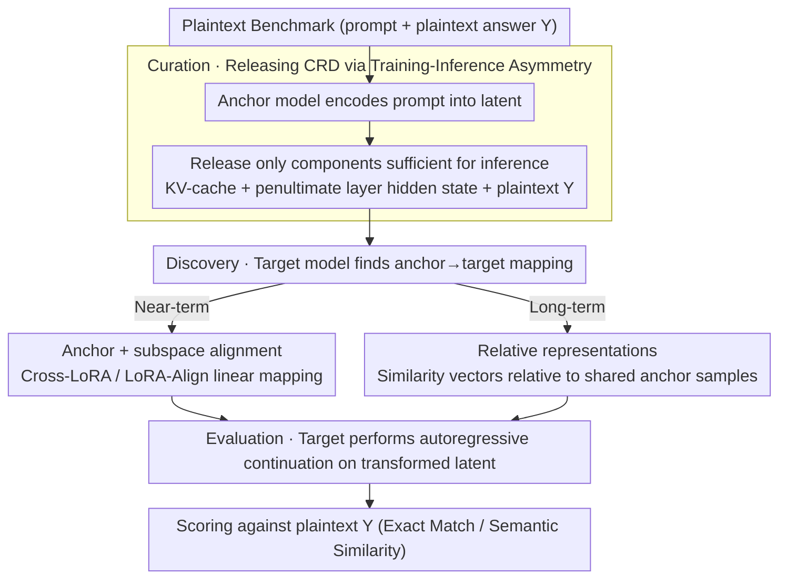

# LLM Benchmark Datasets Should Be Contamination-Resistant (Position Paper)

**Conference**: ICML 2026  
**arXiv**: [2605.19999](https://arxiv.org/abs/2605.19999)  
**Code**: None (position paper)  
**Area**: LLM Safety / Evaluation Benchmarks / Data Contamination  
**Keywords**: Benchmark contamination, contamination-resistant datasets, KV-cache, training-inference asymmetry, cross-model interoperability

## TL;DR
This position paper advocates that LLM benchmarks should be **contamination-resistant**—meaning they are inferable but not trainable. It proposes leveraging the fundamental mathematical asymmetry between Transformer training and inference pipelines (training requires full tokens, while inference only requires KV-cache + the penultimate layer hidden state). By shifting the benchmark release format from plaintext to KV-cache + intermediate hidden states, combined with cross-model subspace alignment / relative representation to address interoperability, the authors call for community adoption.

## Background & Motivation

**Background**: LLM benchmark contamination has become a pervasive phenomenon: over 90% of MMLU samples were detected in GPT-3 training data, Llama 2 still exhibits 16% MMLU contamination, and multilingual benchmark contamination reaches as high as 91.8%. Once a benchmark is ingested during pre-training, model scores reflect "memorization" rather than "generalization"—Zhang et al. (2024) tested Mistral with a non-public mirror of GSM8K and observed a 13% drop in accuracy.

**Limitations of Prior Work**: Existing countermeasures are insufficient:
- **Private Hosting + Third-party Evaluation**: Prevents leakage but raises the barrier to innovation and complicates independent verification.
- **Dynamic Benchmarking**: Frequent updates lead to the loss of long-term baseline comparisons.
- **Decontamination**: The precision of identifying leaked samples drops sharply in trillion-token corpora.
- **Rephrasing**: Risk of losing both quality and intended difficulty levels.

More critically, once a benchmark is public, it is rapidly duplicated across repositories, forums, and secondary datasets; even gated benchmarks leak indirectly through distillation or continued pre-training.

**Key Challenge**: A benchmark must be accessible for evaluation (inference), which exposes its content; yet public content is inevitably ingested into subsequent training rounds. This appears to be an intractable dilemma.

**Goal**: Establish the conceptual framework for "Contamination-Resistant Datasets (CRD)"—a release format that remains usable for inference but cannot be effectively learned during training.

**Key Insight**: There is a fundamental mathematical asymmetry between Transformer training and inference pipelines. Training requires the full sequence of tokens to calculate gradients (next-token prediction loss requires access to the entire prefix), whereas inference only requires the KV-cache and the penultimate layer hidden state. If the release format only exposes components required for inference while hiding those needed for training, it can theoretically be inferable but not trainable.

**Core Idea**: Release benchmarks as a triplet $(KV\text{-}cache, h^{(L-1)}_t, Y)$ (KV-cache + penultimate hidden state + plaintext ground truth) instead of raw tokens. During inference, the model can continue generation; during training, the lack of a token sequence prevents the computation of loss. Interoperability across different LLMs is achieved through cross-model representation alignment.

## Method

### Overall Architecture

Ours does not propose a specific algorithm but establishes a verifiable conceptual framework for "Contamination-Resistant Datasets (CRD)": shifting the **distribution medium** of benchmarks from raw tokens to intermediate representations sufficient for inference but insufficient for training. Any model receiving this medium can perform evaluation but cannot consume it as training data. The paper formalizes CRD with Definition 2.1 and provides a roadmap for implementation and cross-model reuse.

**Definition 2.1 (CRD)**: For a model $\mathcal{M}$ and a transformation $\phi$, a dataset $\phi(\mathcal{D})$ is contamination-resistant if it satisfies—Inference Usability: $\mathcal{M}(\phi(\mathcal{D}))$ yields valid task performance; Non-trainability: $\nabla_\theta \mathcal{L}(\mathcal{M}_\theta, \phi(\mathcal{D}))$ does not improve model generalization. A qualified CRD must also possess three properties: **Irreversibility**—reconstruction of plaintext $\mathcal{D}$ from $\phi(\mathcal{D})$ is computationally infeasible; **Equivalence**—$\mathcal{M}(\phi(\mathcal{D})) \approx \mathcal{M}(\mathcal{D})$, changing the medium does not alter evaluation conclusions; **Interoperability**—$\phi_1(\mathcal{D})$ suitable for another LLM $\mathcal{M}_1$ can be derived from $\phi(\mathcal{D})$.

The corresponding evaluation workflow involves three steps: **Curation**, where the publisher uses an anchor model to encode the prompt into latent representations; **Discovery**, where the target model calculates an anchor $\to$ target transformation mapping; **Evaluation**, where the target model performs autoregressive continuation on the transformed latent to produce an answer.

### Key Designs

**1. Mechanism: Releasing CRDs via Transformer Training-Inference Asymmetry**

This is the foundational argument of the position paper. The authors observe that the two pipelines of a Transformer are mathematically asymmetrical: training requires next-token loss $\mathcal{L} = -\sum_t \log P(x_t \mid x_{<t})$, necessitating the full sequence $x_1,\dots,x_T$ to calculate layer-wise gradients. In contrast, inference only requires the KV-cache $\{K_{1:t}^{(l)}, V_{1:t}^{(l)}\}_{l=1}^L$ plus the penultimate hidden state $h_t^{(L-1)}$ to generate new tokens. CRD releases only these "inference-sufficient, training-insufficient" intermediate representations. By providing the $(KV\text{-}cache,\ h^{(L-1)}_t,\ Y)$ triplet without raw tokens, users can reproduce evaluation scores but cannot calculate a usable training loss. Unlike discrete text rephrasing or image-based unlearnable data (adversarial perturbations/shortcuts) which are easily bypassed, this approach utilizes architectural properties to prevent direct fine-tuning. Irreversibility can be further hardened; while KV-cache inversion is possible for standard MHA, its effectiveness drops significantly with modern architectures like GQA/MLA.

**2. Mechanism: Anchor Model + Subspace Alignment for Interoperability**

Releasing KV-caches encoded by a specific model introduces the problem of model-specific dependency. The proposed near-term solution involves choosing a widely deployed "anchor model." Any target model then uses Cross-LoRA-style LoRA-Align (rank-truncated SVD + Frobenius-optimal linear mapping) to project representations from the anchor subspace to its own. This Procrustes-like alignment permits differing dimensions and relies only on model weights without exposing plaintext, thus maintaining irreversibility. Anchor models are selected based on architectural similarity (e.g., GQA, SwiGLU, RMSNorm) to maximize transfer fidelity.

**3. Mechanism: Relative Representations as a Long-term Vision**

To move beyond anchor model dependency, the paper proposes a more symmetric direction based on the Platonic Representation Hypothesis and relative representations (Moschella, 2023). By defining a small set of shared anchor samples (100–500), each latent point is rewritten as a similarity vector relative to these samples. These relative representations remain invariant across latent spaces, enabling zero-shot cross-model stitching and allowing all LLMs to be evaluated in a unified coordinate system.

## Key Experimental Results

### Prevalence of Contamination (Survey Graph)

| Model | Benchmark | Contamination Ratio |
|------|------|--------|
| GPT-3 | Multiple | > 90% flagged |
| Llama-2 | MMLU | 16%+ |
| Typical LLM Avg | Multilingual | Up to 91.8% |
| Mistral | GSM8K Mirror vs. Public | 13% Accuracy Gap |

### Controllable Storage Overhead

| Benchmark | Raw Tokens | Full KV-cache | PyramidKV (12%) Comp. | Non-critical Token Drop |
|------|---------|-------------|-------------------|------------------|
| 100K tokens (Llama-2 7B) | 100K | 50 GB | 6 GB | **350 MB** |
| MMLU | ~5M | 2.5 TB | 300 GB | ~17 GB |

KV-cache compression techniques like PyramidKV demonstrate that retaining 12% is sufficient; removing formatting and generic instruction tokens can further reduce the size to 0.7%.

### Adaptability Table

| Benchmark Type | Examples | CRD Compatible |
|--------|------|--------|
| Single-turn QA | MMLU, SQuAD, HumanEval | ✅ |
| Classification/Labeling | GLUE, SuperGLUE, ImageNet | ✅ |
| Multimodal | COCO, Flickr30K | ✅ |
| Code Generation | CodeContests, APPS | ✅ |
| Summarization | CNN/DailyMail, XSum | ✅ |
| Multi-turn Dialogue | CoQA, MultiWOZ | ⚠️ Partial (IO coupling) |
| Dynamic agents | WebShop, ALFWorld | ❌ (Environment feedback) |
| Interactive | DynaBench, AdaTest | ❌ (Instance varies with output) |

### Key Findings
- **Wide compatibility with static benchmarks**: Mainstream QA, classification, code, and summarization benchmarks are compatible.
- **Storage is not a bottleneck**: With KV-cache compression and selective dropping, storage remains in the same order of magnitude as raw sequences.
- **Irreversibility depends on architecture**: Modern attention mechanisms like GQA significantly degrade the performance of inversion attacks.
- **Interoperability foundations exist**: Cross-LoRA and relative representations have already been validated in representation transfer literature.

## Highlights & Insights
- **Architectural vs. Data Level Solution**: While prior unlearnable data methods focused on perturbations and noise, this approach shifts the distribution medium—a fundamental paradigm shift.
- **Training-Inference Asymmetry as a "Free Lunch"**: The mathematical structure of Transformers provides a boundary between inference and training that has been underutilized for contamination prevention.
- **Formalization of the Three Properties**: By defining irreversibility, equivalence, and interoperability, the paper transforms the vague concept of "contamination resistance" into a verifiable set of attributes.
- **Cross-disciplinary Borrowing**: It integrates tools from representation learning (Platonic Representation Hypothesis, Cross-LoRA) to convert theoretical research into robust evaluation infrastructure.

## Limitations & Future Work
- Primarily applicable to Transformer-based models; SSMs like Mamba or RWKV are not directly compatible.
- KV-cache inversion remains a theoretical risk in MHA models; GQA/MLA provides practical security but not a mathematical guarantee.
- Equivalence is difficult to strictly verify; benchmark publishers will require standardized calibration and backtesting protocols.
- The choice of anchor models might introduce bias toward specific model families.
- Multi-turn, dynamic, and interactive benchmarks (e.g., CoQA, WebShop) require specialized redesigns.
- While storage is manageable (350MB/100K tokens), the cumulative size for large-scale benchmarks like MMLU (>17GB) still requires further optimization.

## Related Work & Insights
- **vs. Decontamination**: Decontamination is a reactive detection process with poor precision on large corpora; CRD is a proactive prevention mechanism.
- **vs. Private Benchmarks**: Private evaluations hinder open science; CRD allows public availability while remaining non-trainable.
- **vs. Dynamic Benchmarks**: Dynamic sets lose longitudinal comparability; CRD provides a static, repeatable baseline.
- **Insight**: Utilizing the mathematical properties of model architectures can serve as a resource for safety and privacy infrastructure—this logic could extend to model attribution, watermarking, and other LLM governance issues.

## Rating
- Novelty: ⭐⭐⭐⭐⭐ Using architectural asymmetry for CRDs is a genuinely new direction, orthogonal to all existing anti-contamination routes.
- Experimental Thoroughness: ⭐⭐⭐ (Position paper)—Focuses on argumentation and feasibility analysis rather than SOTA benchmarks; however, the compatibility analysis and storage estimations are clear.
- Writing Quality: ⭐⭐⭐⭐ The formalization of the three properties is precise, and diagrams are intuitive.
- Value: ⭐⭐⭐⭐⭐ Addresses a fundamental problem in the evaluation ecosystem; if adopted, it could significantly increase the reliability of LLM evaluation.

<!-- RELATED:START -->

## Related Papers

- [\[ICML 2026\] Position: Uncertainty Quantification in LLMs is Just Unsupervised Clustering](position_uncertainty_quantification_in_llms_is_just_unsupervised_clustering.md)
- [\[ICML 2026\] MedMosaic: A Challenging Large Scale Benchmark of Diverse Medical Audio](medmosaic_a_challenging_large_scale_benchmark_of_diverse_medical_audio.md)
- [\[ACL 2026\] How Should We Enhance the Safety of Large Reasoning Models: An Empirical Study](../../ACL2026/llm_safety/how_should_we_enhance_the_safety_of_large_reasoning_models_an_empirical_study.md)
- [\[ICML 2026\] Position: Stop Chasing the C-index when Evaluating Survival Analysis Models](position_stop_chasing_the_c-index_when_evaluating_survival_analysis_models.md)
- [\[ICML 2026\] Position: Retire the "Positive Backdoor" Label -- Secret Alignment Requires Strict and Systematic Evaluation](position_retire_the_positive_backdoor_label_--_secret_alignment_requires_strict_.md)

<!-- RELATED:END -->
