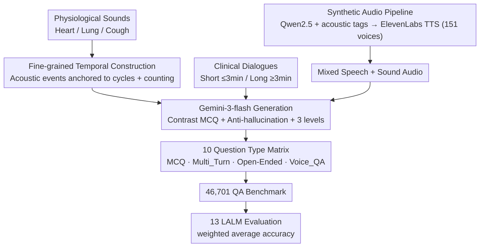

# MedMosaic: A Challenging Large Scale Benchmark of Diverse Medical Audio

**Conference**: ICML 2026  
**arXiv**: [2605.00969](https://arxiv.org/abs/2605.00969)  
**Code**: Sample data https://shorturl.at/Lyp33  
**Area**: Medical Audio / Multi-modal Evaluation  
**Keywords**: Medical Audio QA, Synthetic Clinical Speech, Multi-turn Reasoning, Open-ended QA, Embedded Voice QA

## TL;DR
MedMosaic utilizes a synthetic pipeline to construct a medical audio QA benchmark (46,701 QA pairs, 10 question types) covering physiological sounds and real/synthetic clinical dialogues. Systematically evaluating 13 audio/multi-modal models, it finds that even Gemini-2.5-Pro achieves only approximately 68.1% weighted accuracy, revealing fundamental deficiencies in current LALMs regarding medical audio reasoning.

## Background & Motivation

**Background**: With the rise of LLMs/MLLMs/LALMs, evaluation focus has shifted from "unimodal recognition" to "cross-modal multi-step reasoning." General audio QA has established benchmarks like ClothoAQA, MMAU, MMAU-Pro, MDAR, MMAR, AudioBench, and AudioPedia. On the model side, Qwen-Audio, Audio Flamingo, SALMONN, LTU-AS, and AudioPaLM are rapidly advancing.

**Limitations of Prior Work**: (1) Existing audio QA benchmarks focus almost entirely on general ambient sounds, music, and short speech segments; medical audio is extremely scarce, with CaReAQA being one of the few attempts but limited in scale and focusing only on short, independent segments. (2) Text-based medical QA (MedQA, MeDiaQA) strips away all acoustic information, failing to evaluate clinical clues that only sound can convey, such as "cough characteristics, respiratory rhythm, vocal stress, and hesitation in dialogue." (3) Evaluation protocols rely excessively on closed-ended multiple-choice questions (MCQs), failing to assess generative reasoning and lacking scenarios for real clinical interactions like long dialogues, multi-turn interactions, and embedded voice Q&A.

**Key Challenge**: Medical decision-making relies heavily on the ability to "align semantics with acoustic markers." However, existing benchmarks lack such long-duration, multi-source audio data and do not include multi-hop clinical reasoning tasks. Simultaneously, medical data is difficult to collect at scale due to privacy concerns and high annotation costs.

**Goal**: (i) Construct a large-scale medical audio QA benchmark across various audio types (physiological sounds + short/long clinical dialogues), covering multiple reasoning modes (MCQ, multi-turn, open-ended, embedded voice QA); (ii) Propose a controllable synthetic audio generation pipeline to allow for on-demand benchmark expansion; (iii) Systematically evaluate mainstream LALMs to quantify current performance ceilings.

**Key Insight**: The authors found that "Synthesis + Expert Prompting" can precisely control the complexity of clinical scenarios (cough embedding, emotional markers, timeline information distribution) without accessing real patient data. By using Gemini-3-flash as a QA generator combined with meticulously designed prompts (including 10 highly similar distractor options per question + anti-hallucination constraints), large-scale and challenging tasks can be produced.

**Core Idea**: Build a large and difficult medical audio QA benchmark using a "synthetic pipeline + rigorous anti-hallucination prompts + 10 question types," incorporating open-ended questions and embedded voice QA to expose the multi-dimensional weaknesses of LALMs in medical reasoning.

## Method

### Overall Architecture
MedMosaic aims to create a large-scale medical audio QA benchmark that "cannot be answered without listening to the audio." The pipeline consists of three stages. The first stage is **Material Preparation**: gathering three types of audio materials—physiological sounds (heart/lung/cough), clinical dialogues (short ≤3min / long ≥3min), and a category of "speech + sound mixture" audio created via a "synthetic audio generation pipeline" (using Qwen 2.5 14B to add acoustic placeholders to transcripts, followed by ElevenLabs v3 TTS with 151 voices to embed non-verbal clinical clues like coughs, sighs, and emotions). The second stage is **Generation**: the three material streams are fed into specialized Gemini-3-flash prompts—sound-only follows "fine-grained temporal construction," while the others share "strong contrast MCQ + anti-hallucination constraints," categorized into Easy/Medium/Hard difficulties. The third stage is **Deployment and Evaluation**: the tasks are expanded into 10 question types (including new types: Voice_QA, Multi_Turn, and Open-Ended), totaling 46,701 QA pairs, which are then evaluated across 13 LALMs using weighted average accuracy. The core difficulty stems from prompt engineering: each non-open-ended question includes 10 "lexically similar yet semantically distinct" options, forcing models to rely on truly understanding audio details rather than keyword matching.

### Key Designs

**1. Synthetic Audio Generation Pipeline: Embedding non-verbal clinical clues without real patient data**
Existing open-source medical audio is either pure speech or isolated sound segments, lacking the complex acoustic scenarios of real clinical settings where "doctors' speech is interspersed with coughs, wheezing, or sighs." MedMosaic fills this gap with a synthetic pipeline: first using Qwen 2.5 14B Instruct to "enrich" original transcripts with acoustic placeholders and pause indicators, adding sounds like breathing, pain, and emotional cues based on clinical categories (e.g., cardiovascular, respiratory, etc.); then using ElevenLabs v3 TTS with 151 selected voices to synthesize high-fidelity audio. This synthesis is precisely controllable (specifying where to embed which event and at what complexity) while avoiding privacy issues, serving as the "scalable" foundation for the benchmark.

**2. Fine-grained Temporal Construction for Physiological Sound QA: Elevating sound-only tasks from "classification" to "temporal reasoning"**
Surface-level sound classification can often be guessed correctly by capturing a few signature spectral features. MedMosaic subdivides physiological sounds into clinically relevant subcategories—lung sounds include wheeze (continuous narrowband), crackle (short explosive broadband), and stridor (high-pitched continuous single frequency); coughs include wet, dry, pertussis, and barky; heart murmurs manifest differently during the $\text{S1} \to \text{systole} \to \text{S2} \to \text{diastole}$ phases. Questions go beyond "what is this sound" to ask "which respiratory phase does the cough occur in," "how does the heart rate rhythm change," "approximate respiratory rate within 30 seconds," and "ratio of sound to silence." This requires anchoring acoustic events to physiological cycles, forcing models to parse internal temporal structures instead of relying on general pre-trained recognition.

**3. Strong Contrast MCQ + Anti-hallucination Prompt Engineering: Ensuring difficulty lies in "understanding details" rather than "obvious options"**
A common issue in medical QA is models guessing correctly by reciting medical knowledge without utilizing audio. MedMosaic uses a set of constraints to block this shortcut: each question provides 10 options where distractors are "lexically similar yet semantically distinct"—reusing identical keywords to invalidate keyword matching. Distractors target specific traps: temporal misalignment (correct event in the wrong phase), similar acoustic features with different clinical interpretations, and over-reliance on common associations in training data. Most critically, the anti-hallucination constraint mandates that all correct answers must be derivable from the audio itself, prohibiting reliance on external knowledge bases and ensuring each option leads to a unique clinical interpretation.

**4. Voice_QA + Multi-Turn + Open-Ended Question Types: Evaluating real clinical interaction challenges**
MCQs only measure "discrimination ability," but clinical practice involves generative interactions. MedMosaic adds three types: Voice_QA embeds questions and answers directly into the audio waveform, requiring the model to switch context to answer the embedded voice question after hearing a dialogue, testing context switching and resistance to attention drift. Multi_Turn performs follow-up questioning on long dialogues to test state maintenance. Open-Ended (OE_Speech / OE_Speech_Sound) allows unconstrained generation on long audio, testing the most rigorous generative reasoning. Together, the ten question types form an orthogonal matrix covering single-source, multi-source, long-form, multi-turn, open-ended, and embedded tasks.

### Loss & Training
This is not a training paper; no loss function is used. All QAs are generated by Gemini-3-flash, and推理 evaluation is performed on 13 candidate models (e.g., Audio Flamingo 3, Audio Reasoner, Baichuan-Omni, Desta25-Audio, Gama, Gemini-2.5-flash/pro, Qwen-2.5-Omni).

## Key Experimental Results

### Main Results (Selected from Table 1, Accuracy %)

| Model | Weighted Avg | MCQ_Speech | MCQ_Sound_Heart | OE_Speech | Voice_QA |
|---|---|---|---|---|---|
| Audio-flamingo-3 | 24.1 | 10.7 | 37.8 | 55.2 | 0.1 |
| Audio-reasoner | 32.8 | 23.7 | 35.6 | 51.2 | 9.9 |
| Baichuan-omni | 38.6 | 43.5 | 26.6 | 57.6 | 31.5 |
| Desta25-audio | 41.0 | 49.4 | 37.1 | 56.0 | 9.1 |
| Gama | 23.2 | 12.7 | 36.6 | 38.1 | 8.9 |
| Gemini-2.5-flash | 60.5 | 73.6 | 52.8 | ... | ... |
| **Gemini-2.5-Pro** | **~68.1** | (Best per column) | | | |
| Qwen-2.5-Omni-7B | 42.8 | ... | ... | ... | ... |

The strongest commercial model, Gemini-2.5-Pro, only reached 68.1% weighted average, proving the difficulty of the benchmark.

### Ablation Study / Question Type Comparison

| Phenomenon | Description |
|---|---|
| Voice_QA < 32% for most models, some < 1% | Embedded voice QA is the biggest current weakness—extremely poor context switching ability. |
| OE_Speech generally better than MCQ_Speech | High open-ended scores are due to loose grading (points given if correct facts are present), not necessarily better understanding. |
| MCQ_Sound_Heart > MCQ_Sound_Cough / Lung | Heart sound temporal structures ($\text{S1}/\text{S2}$) are more regular and easier to identify than the randomness of coughs/lung sounds. |
| MCQ_Long_Form generally low | Long-form dialogue reasoning is a universal weakness, consistent with LALMs performing poorly with long contexts. |

### Key Findings
- Even the strongest general models perform far below human clinical levels (>90%), proving that medical audio reasoning is not yet mastered by current LALMs; specialized pre-training data/adaptation is necessary.
- Audio-flamingo-3 scored near zero (0.1%) on Voice_QA, indicating a complete inability to handle "context switching."
- The synthetic QA pipeline effectively balances "minimized human supervision" with "challenging benchmark difficulty," validating synthetic evaluation data as a scalable paradigm for privacy-sensitive medical fields.

## Highlights & Insights
- Breaking down medical audio into an orthogonal matrix (sound-only, speech-only, etc.) allows for precise diagnosis of model weaknesses—a reproducible methodology for clinical evaluation.
- The anti-hallucination constraint ("answers must be derivable from audio, distractors need unique clinical interpretations") is a rigorous prompt engineering paradigm applicable to other domain-specific QA datasets to prevent shortcutting.
- The Voice_QA design is truly innovative—simulating a clinician's need to answer questions from colleagues while listening to a patient, a "continuous monitoring + interrupt response" capability previously unaddressed.

## Limitations & Future Work
- The data is synthetic rather than real clinical recordings; a domain gap remains, partially mitigated by embedding physical artifacts but not fully eliminated.
- Reliance on Gemini-3-flash for annotation introduces the risk of generator bias; sample validation scale was limited.
- Evaluation lacked models specifically fine-tuned for medical audio (e.g., a future MedAudio-LLM).
- The grading protocol for open-ended questions was briefly described, with room for improvement in reproducibility.

## Related Work & Insights
- **vs CaReAQA**: CaReAQA is also medical-audio-focused but smaller; MedMosaic scales up by two orders of magnitude and adds long dialogues/multi-turn/Voice_QA.
- **vs MMAU / MMAU-Pro / MMAR**: General audio QA benchmarks are broad but not specialized; MedMosaic provides depth in the medical sub-domain.
- **vs CORAAL-QA**: Focuses on long-form multi-turn interaction; MedMosaic introduces domain expertise and biological sound specificity.
- **vs MedQA (Text)**: MedQA focuses on clinical knowledge in text; this work provides the first systematic clinical reasoning evaluation for the audio dimension.

## Rating
- Novelty: ⭐⭐⭐⭐ Voice_QA, multi-turn dialogue, and physiological temporal reasoning are first-time additions to medical audio benchmarks.
- Experimental Thoroughness: ⭐⭐⭐⭐ Evaluated 13 models across 10 question types; missing: human baseline comparison and medically fine-tuned models.
- Writing Quality: ⭐⭐⭐ Clear flowcharts and detailed prompt templates; however, some experimental details (e.g., open-ended metrics) are summarized briefly.
- Value: ⭐⭐⭐⭐ Provides the first large-scale scalable benchmark for medical audio LALMs; the synthetic data paradigm is highly relevant to other privacy-sensitive domains.

<!-- RELATED:START -->

## Related Papers

- [\[AAAI 2026\] StyleBreak: Revealing Alignment Vulnerabilities in Large Audio-Language Models via Style-Aware Audio Jailbreak](../../AAAI2026/llm_safety/stylebreak_revealing_alignment_vulnerabilities_in_large_audio-language_models_vi.md)
- [\[ICML 2026\] FoeGlass: Simple In-Context Learning Is Enough for Red Teaming Audio Deepfake Detectors](foeglass_simple_in-context_learning_is_enough_for_red_teaming_audio_deepfake_det.md)
- [\[ICLR 2026\] AudioTrust: Benchmarking the Multifaceted Trustworthiness of Audio Large Language Models](../../ICLR2026/llm_safety/audiotrust_benchmarking_the_multifaceted_trustworthiness_of_audio_large_language.md)
- [\[CVPR 2025\] LoTUS: Large-Scale Machine Unlearning with a Taste of Uncertainty](../../CVPR2025/llm_safety/lotus_large-scale_machine_unlearning_with_a_taste_of_uncertainty.md)
- [\[ICML 2026\] LLM Benchmark Datasets Should Be Contamination-Resistant (Position Paper)](llm_benchmark_datasets_should_be_contamination-resistant.md)

<!-- RELATED:END -->
