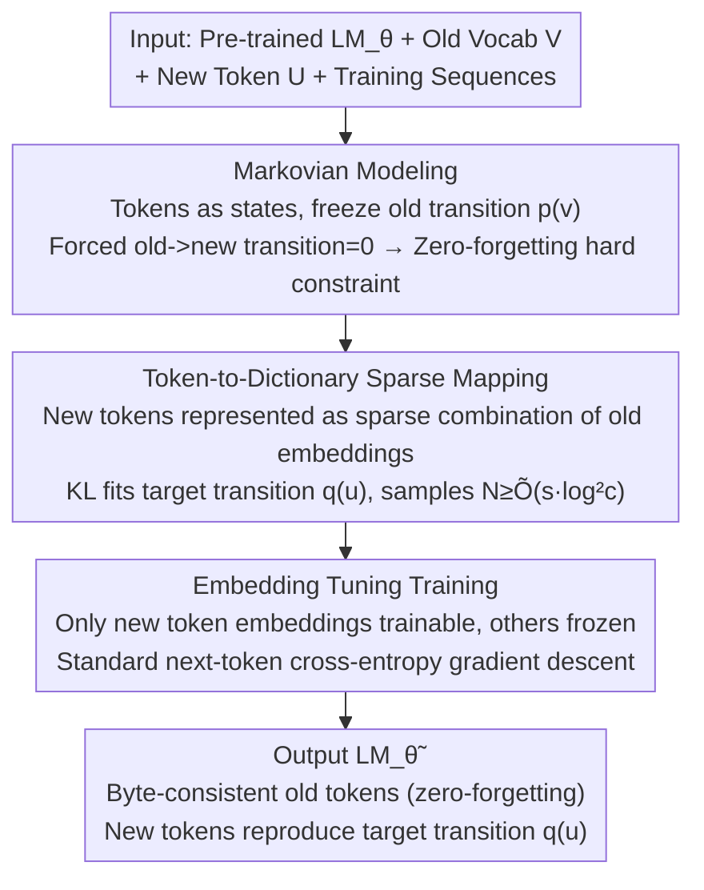

# Memory as a Markov Matrix: Sample Efficient Knowledge Expansion via Token-to-Dictionary Mapping

**Conference**: ICML 2026  
**arXiv**: [2605.04308](https://arxiv.org/abs/2605.04308)  
**Code**: None  
**Area**: LLM Continual Learning / Vocabulary Expansion / Anti-forgetting  
**Keywords**: Markov process, vocabulary expansion, embedding tuning, zero-forgetting, sample complexity

## TL;DR
By interpreting the next-token distribution of an autoregressive LLM as the state transition matrix of a Markov chain, "learning new words" is transformed into "adding new states to the state space and representing them as sparse combinations of existing states." Theoretically, this requires only $O(s)$ samples (where $s$ is the number of mapped old tokens). In practice, fine-tuning only the embeddings of new tokens achieves cross-lingual or new concept expansion with strictly zero forgetting.

## Background & Motivation

**Background**: Adapting pre-trained LLMs to new vocabulary, entities, or domains (e.g., "COVID-19", domain-specific terms, cross-lingual transfer) is a core requirement of continual learning. Dominant approaches include full fine-tuning, LoRA, prompt tuning, or retrieval-based methods.

**Limitations of Prior Work**: Even in modern models like Llama-3 and Qwen-2.5, standard fine-tuning still exhibits significant catastrophic forgetting—a phenomenon that exacerbates as the model scale increases. Furthermore, model updates are irreversible; once performance on old tasks degrades, it is difficult to restore.

**Key Challenge**: Modern LLMs are highly expressive. Updating billions of parameters to "accommodate a small cluster of new knowledge" is counter-intuitive and inherently pollutes the transition relationships between existing tokens.

**Goal**: To establish a clean mathematical framework for adding $m \ll T$ new tokens without damaging the transitions between the original $T$ tokens, and to provide provable sample complexity.

**Key Insight**: An LLM can be viewed as a Markov chain where tokens are states and $p_\theta(\cdot \mid x_t)$ is the transition probability vector. Under this perspective, "zero-forgetting" is equivalent to "keeping the transition matrix of existing states invariant," and "adding knowledge" is equivalent to "expanding the state space from $\mathcal{V}$ to $\mathcal{V} \cup \mathcal{U}$."

**Core Idea**: Each new token $u$ is represented as a sparse linear combination of several existing tokens ($\bm{\alpha}^{(u)} \in \mathbb{R}^T$ in the embedding space, where $\|\bm{\alpha}^{(u)}\|_0 \le s$), allowing it to reuse the semantic structure of the existing dictionary. The implementation involves fine-tuning only the embedding vectors of the new tokens while freezing all other weights, thereby strictly guaranteeing zero forgetting.

## Method

### Overall Architecture
This paper addresses adding new tokens (new words, entities, or languages) to a pre-trained LM such that they are functional without damaging the transition relationships of existing tokens. The approach interprets the autoregressive model as a first-order Markov chain. Learning new words is defined as adding a new state to the state space and representing it as a sparse combination of existing states. The pipeline starts with a pre-trained $\texttt{LM}_\theta$, an old vocabulary $\mathcal{V}$, a small set of new tokens $\mathcal{U}$, and training sequences. It frames "no forgetting" as a hard constraint on old transitions and utilizes the sparse dictionary hypothesis to derive that each new token requires only $O(s)$ samples. Finally, it uses a minimal implementation—Embedding Tuning—where only new token embeddings are trainable.

### Key Designs

**1. Markovian Knowledge Expansion: Moving "Zero-forgetting" from Observation to Constraint**

Standard fine-tuning causes catastrophic forgetting because it modifies transition relationships across all tokens simultaneously. This method explicitly formulates the generation as a Markov chain. The transition vectors for existing tokens $\mathbf{p}^{(v)} \in \Delta(\mathcal{V})$ are provided by the pre-trained model. After introducing a new token $u$, only a new transition $\mathbf{q}^{(u)} \in \Delta(\mathcal{V})$ is learned, while enforcing $p_{\tilde{\theta}}(u \mid v) = 0$ and $p_{\tilde{\theta}}(u_i \mid u_j) = 0$. As long as the current state $x_t \in \mathcal{V}$, $p_{\tilde{\theta}}(\cdot \mid x_t)$ remains identical to the original model, ensuring zero forgetting.

**2. Token-to-Dictionary Sparse Mapping: Representing Concepts via Semantic Granularity**

New concepts are rarely entirely isolated; "COVID-19" is semantically similar to a mixture of "virus," "disease," and "outbreak." Let $f: \mathbb{R}^d \to \Delta(\mathcal{V})$ be the logit head. The goal is to find coefficients $\bm{\alpha}^{(u)} \in \mathbb{R}^T$ such that the combination of old embeddings $\mathbf{E}^\top \bm{\alpha}^{(u)}$ reproduces the target transition $\mathbf{q}^{(u)}$ after passing through $f$. With sparse and bounded constraints $\|\bm{\alpha}^{(u)}\|_0 \le s$ and $\|\bm{\alpha}^{(u)}\|_2 \le B$, the paper proves that the required sample size per new token is $N \ge \tilde{O}(s \log^2 c)$, which depends only on the sparsity $s$ rather than the vocabulary size $T$ or dimension $d$.

**3. Embedding Tuning: Minimal Practical Implementation**

The practical implementation involves designating the embedding rows corresponding to new tokens as the only trainable parameters. The remaining billions of parameters are frozen. Training uses standard next-token cross-entropy gradient descent. This implementation naturally satisfies the theoretical assumptions because the updated parameters are orthogonal to the transition computation graph of old tokens; old tokens never query the new embeddings unless a new token appears in the context.

### Loss & Training
The training objective is the standard next-token cross-entropy $-\sum_t \log p_{\tilde{\theta}}(x_{t+1} \mid x_{t-k:t})$ without regularization or replay. The framework extends to higher-order Markov chains by treating the recent $K$ tokens as a joint state, where the sample complexity conclusions remain consistent.

## Key Experimental Results

### Main Results
The method is validated across three tasks: arithmetic operators where Llama-3.2-3B learns $a\langle\text{spec}\rangle b = a \times b$, synthetic vocabulary injection, and cross-lingual adaptation for Qwen2.5-3B.

| Task | Model | Method | Target Metric | Forgetting (English / Add) |
|------|------|------|----------|----------------------|
| Arithmetic ($a\langle\text{spec}\rangle b$) | Llama-3.2-3B | FFT | 77.2% acc | Add 100% → 0% (Catastrophic) |
| Arithmetic | Llama-3.2-3B | ET | **81.4%** acc | Add remains 100% |
| Cross-lingual (Spanish) | Qwen2.5-3B | FFT | loss 5.56 | English loss +9.83 |
| Cross-lingual (Spanish) | Qwen2.5-3B | ET | **loss 2.30** | English loss **−0.04** |
| Cross-lingual (Arabic) | Qwen2.5-3B | ET | **loss 2.82** | English loss **0.00** |

### Ablation Study

| Setting | Synthetic Vocab Test Loss | WikiText Forgetting |
|------|-------------------|---------------|
| Base Model (Llama-3.1-8B) | — | Baseline 2.42 |
| FFT (N=1000) | 4.40 | +1.24 |
| LoRA | 7.63 | +8.36 |
| Prompt Tuning | 3.79 | +0.69 |
| ET (Ours) | 2.42 | **0.00** |

### Key Findings
- ET simultaneously achieves the best target loss and zero forgetting across diverse tasks, demonstrating that performance is not sacrificed for stability.
- The arithmetic accuracy of $a\langle\text{spec}\rangle b$ via ET (81.4%) exceeds the base performance of $a*b$ (63.5%) because the embedding converges to a sparse combination of equivalent expressions like "$\times$," "times," or "multiplies."
- LoRA performs worse than FFT in cross-lingual tasks, indicating that fewer parameters do not guarantee less forgetting; forgetting depends on whether the update direction interferes with old transitions.
- "Negative forgetting" was observed in Spanish/German experiments where English WikiText loss slightly decreased, likely due to transfer gains between related languages.

## Highlights & Insights
- Transforms continual learning into a "Markov state space expansion" problem, providing structural conditions for zero forgetting.
- Sample complexity depends on semantic granularity (sparsity $s$) rather than model or vocabulary size, offering a new scaling rule for knowledge expansion.
- Embedding Tuning represents an extreme version of PEFT that utilizes the inherent orthogonality between embeddings and the transition graph.

## Limitations & Future Work
- The assumption of uniform token frequency in training corpora may not hold in reality, where high-frequency tokens might typically pollute transitions.
- The model's expressivity must be sufficient; the sparse hypothesis might fail if the model capacity is limited or the new concept is far from the existing dictionary.
- The framework currently forbids transitions from old tokens to new tokens, which limits the natural emergence of new words in a generative context.
- Experiments focused on single-point expansion rather than complex term networks with inter-token transitions.

## Related Work & Insights
- **vs LoRA / PT / Adapter**: These reduce parameters but do not guarantee orthogonality with old transitions; ET leverages the structural separation of the embedding table.
- **vs EWC / GEM / Replay**: Standard methods rely on regularization or replay; ET requires neither and maintains hard constraints through structural design.
- **vs Markov-LM**: Prior works use Markov perspectives for theoretical analysis, whereas this paper applies it to design a practical continual learning algorithm.

## Rating
- Novelty: ⭐⭐⭐⭐ Combines Markovian perspective with sparse dictionary hypothesis for provable complexity.
- Experimental Thoroughness: ⭐⭐⭐ Covers arithmetic, synthetic, and cross-lingual tasks, though lacks multi-domain or multi-step expansion.
- Writing Quality: ⭐⭐⭐⭐ Clear logic from motivation to theorems and algorithms.
- Value: ⭐⭐⭐⭐ Provides a minimalized solution for simultaneous zero-forgetting and sample efficiency.

<!-- RELATED:START -->

## Related Papers

- [\[ICML 2026\] Optimizing Token Choice for Code Watermarking: An RL Approach](optimizing_token_choice_for_code_watermarking_an_rl_approach.md)
- [\[ICML 2026\] From Volume to Value: Preference-Aligned Memory Construction for On-Device RAG](from_volume_to_value_preference-aligned_memory_construction_for_on-device_rag.md)
- [\[ICML 2026\] Efficient DP-SGD for LLMs with Randomized Clipping](efficient_dp-sgd_for_llms_with_randomized_clipping.md)
- [\[ICML 2026\] From Parameter Dynamics to Risk Scoring: Quantifying Sample-Level Safety Degradation in LLM Fine-tuning](from_parameter_dynamics_to_risk_scoring_quantifying_sample-level_safety_degradat.md)
- [\[NeurIPS 2025\] On the Sample Complexity of Differentially Private Policy Optimization](../../NeurIPS2025/llm_safety/on_the_sample_complexity_of_differentially_private_policy_optimization.md)

<!-- RELATED:END -->
