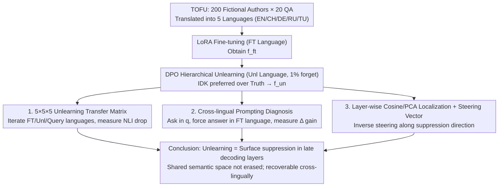

# Multilingual Unlearning in LLMs: Transfer, Dynamics, and Reversibility

**Conference**: ICML 2026  
**arXiv**: [2606.03291](https://arxiv.org/abs/2606.03291)  
**Code**: https://github.com/MLCY1/multilingual-unlearning-in-llms  
**Area**: LLM Safety / Privacy / Multilingual LLMs  
**Keywords**: LLM Unlearning, Cross-lingual Transfer, Representation Space, Steering Vectors, Reversible Unlearning

## TL;DR
This paper expands the TOFU unlearning benchmark to 5 languages to systematically study "cross-lingual unlearning transfer." It finds that unlearning intensity varies with linguistic family and script relatedness, primarily affecting late-stage language-specific decoding layers while leaving the shared semantic space in early-to-mid layers largely intact. Consequently, knowledge can be recovered—achieving 50% on Qwen and 90% on Gemma—using a single inference-time steering vector, indicating that current LLM unlearning is essentially "surface suppression" rather than true erasure.

## Background & Motivation

**Background**: The massive amounts of data absorbed during LLM training may contain sensitive facts. Together with GDPR "right to be forgotten" compliance requirements, this has catalyzed research into "LLM unlearning"—erasing specific knowledge without full retraining. Mainstream methods (GA, NPO, DPO-style) apply modification objectives to fine-tuned models to discourage the model from revealing target content in the forget set.

**Limitations of Prior Work**: (1) Existing evaluations are almost exclusively conducted in English, leaving the extent of "cross-lingual unlearning transfer" uncharacterized—despite sensitive facts often appearing across multiple languages in real-world deployments. (2) Even in monolingual settings, some works suggest that unlearning acts as a "suppression signal," but they lack mechanistic localization (which layers?) and evidence of reversibility without re-learning.

**Key Challenge**: If multilingual unlearning only modifies "language-specific decoding layers," then the knowledge in the shared semantic space remains intact. An attacker could retrieve it by querying in another language or using inverse steering during inference. Conversely, the safety guarantee would be much stronger if it truly altered the "cross-lingual conceptual space." These two scenarios present entirely different deployment risks, yet prior work fails to distinguish between them.

**Goal**: (i) Systematically characterize cross-lingual unlearning transfer across language families, scripts, and pre-training coverage; (ii) Locate the layers where unlearning occurs using mechanistic interpretability; (iii) Verify unlearning reversibility using a simple inference-time steering vector and test its cross-lingual transferability.

**Key Insight**: Translate the TOFU dataset (20 QA pairs for each of the 200 fictional authors) into five languages (EN/CH/DE/RU/TU), controlling for three axes: shared language family vs. shared script vs. neither. By fine-tuning in one language, unlearning in another, and querying in a third, a $5\times 5\times 5$ transfer matrix is constructed. Evaluation uses NLI rather than lexical overlap to assess semantic equivalence.

**Core Idea**: Systemic differences in hidden representations before and after unlearning are distilled into a "suppression direction" (steering vector), which is injectively subtracted from the forward pass during inference. If this is a "language-agnostic suppression direction," it should restore knowledge across any language—the primary hypothesis of this paper.

## Method

### Overall Architecture

The paper does not propose a new unlearning algorithm but establishes a controlled experimental framework to quantify "where cross-lingual unlearning transfer occurs and whether it is reversible." The pipeline is executed on Qwen2.5-7B and Gemma2-9B: first, LoRA fine-tuning is performed on a specific language $\mathcal{L}_{FT}$ using bilingual TOFU data to obtain $f_{\text{ft}}$; then, a DPO-style unlearning objective is applied on an unlearning language $\mathcal{L}_{\text{unl}}$ to erase 1% of the forget authors, resulting in $f_{\text{un}}$. Finally, transfer matrices for forget/retain accuracy are constructed across various query languages $\mathcal{L}_Q$, followed by localization via hidden representation cosine similarity and reversibility validation via steering vectors.

The unlearning objective follows standard hierarchical DPO preference optimization:
$$\arg\min_\theta \frac{1}{|\mathcal{L}_{\text{unl}}|} \sum_{\ell} (\mathbb{E}_{D_\ell^{\text{forget}}} J_{\text{forget}} + \lambda \mathbb{E}_{D_\ell^{\text{retain}}} J_{\text{retain}})$$
where $J_{\text{forget}}$ encourages the model to prefer "I don't know" (IDK) over the ground truth, and $J_{\text{retain}}$ uses $\lambda$ to protect the retain set. Evaluation utilizes the multilingual NLI model `xlm-roberta-large-xnli` to determine if the generated answer $\hat y$ and ground truth $y$ are mutually entailing, with reliability verified by native speakers on 50 samples.

### Key Designs

**1. Three-axis Controlled $5\times 5\times 5$ Transfer Matrix**:
Prior evaluations focused on English, making it impossible to distinguish whether transfer was driven by script similarity, language family, or pre-training coverage. This paper selects five languages to orthogonalize these axes: EN/DE (same family, same script), EN/RU (same family, different script), EN/TU (different family, same script), and EN/CH (neither). For each $(\mathcal{L}_{FT}, \mathcal{L}_{\text{unl}}, \mathcal{L}_Q)$ triplet, it reports the NLI score drop relative to the fine-tuned base (more negative = stronger unlearning).

**2. Cross-lingual Prompting as "Output" Diagnosis**:
To distinguish if knowledge is truly erased or merely blocked by language-specific decoding layers, the paper uses a specific prompt: query in language $q$ but force the model to answer in the fine-tuned language $\ell$. The performance gain $\Delta_{\ell \leftarrow q}$ is recorded. Significant positive $\Delta$ indicates knowledge remains intact in the shared semantic space. The correlation between $\Delta_{\ell \leftarrow q}$ and transfer matrix cells (Pearson $r=0.50$, Spearman $\rho=0.60$) confirms that unlearning damage is transmitted through the shared space to downstream decoding.

**3. Layer Localization + Inference-time Steering Vector**:
To prove unlearning is "suppression" rather than erasure, the paper demonstrates knowledge recovery without re-learning or providing the answer. First, localization: comparing hidden states of $f_{\text{un}}$ and $f_{\text{ft}}$ reveals that they are nearly identical in early-to-mid layers, with divergence concentrated in the final decoding layers. Second, an **auxiliary forget set** (randomly shuffled retain authors) is used to construct a suppression direction $\mathbf{g}^{(l)}$ by comparing $f_{\text{ft}}$ and a model unlearned on this auxiliary set $f_{\text{un}}^{\text{aux}}$. During inference, the operation $\alpha\lVert\mathbf{h}^{(l)}\rVert_2\,\mathbf{g}^{(l)}$ is subtracted across layers $l\!\sim\!l\!+\!N$. This single set of directions recovers significant knowledge (50% Qwen, 90% Gemma) across languages, providing a direct counter-example to true erasure.

## Key Experimental Results

### Main Results: Cross-lingual Unlearning Transfer (Qwen2.5-7B)

| FT \ Unlearn | EN Query | CH Query | DE Query | RU Query | TU Query |
|--------------|---------|---------|---------|---------|---------|
| EN / EN | **-90** | -4 | -7 | -9 | -4 |
| EN / CH | -7 | **-8** | +1 | -5 | -3 |
| EN / DE | **-17** | -6 | **-4** | -5 | -4 |
| DE / EN | -13 | -4 | **-41** | -7 | 0 |
| TU / EN | -10 | -2 | -1 | -6 | **-55** |
| CH / TU | -1 | **+6** | -4 | -4 | 0 |

Values represent absolute NLI score drops relative to the fine-tuned base (more negative = stronger unlearning). Observations: (1) Transfer is strongest within the same family and script (EN→DE, EN→EN); (2) Unlearning high-coverage languages (EN/CH) results in stronger transfer; (3) Unlearning on weak languages can still impact strong languages (TU/EN cell -55).

### Cross-lingual Prompting Gain $\Delta_{\ell \leftarrow q}$

| FT \ Query | EN | CH | DE | RU | TU |
|------------|----|----|----|----|----|
| EN | — | +29 | +61 | +30 | +27 |
| CH | +11 | — | +10 | +12 | +12 |
| DE | +33 | +22 | — | +5 | +18 |
| RU | +20 | +8 | +15 | — | +7 |
| TU | +33 | +11 | +22 | +17 | — |

Significant positive gains prove knowledge remains in the shared semantic space.

### Reversibility: Knowledge Recovery via Steering Direction

| Model | Recovery Rate (Forget NLI Rebound) | Cross-lingual Transfer? | Forget Data Needed? |
|------|---|---|---|
| Qwen2.5-7B | $\approx 50\%$ | Yes | **No** |
| Gemma2-9B | $\approx 90\%$ | Yes | No |

### Key Findings
- **Shared History vs. Script**: Both language family and writing system independently contribute to transfer strength.
- **Asymmetric Transfer**: High-coverage languages (EN, CH) are more potent unlearning sources, consistent with the hypothesis that models anchor shared spaces in dominant languages.
- **IDK Transfer**: Unlearning remains transferable even when the base model performance in the query language is low, validating the shared conceptual space hypothesis.
- **Layer Dynamics**: Unlearning disruption is concentrated in the final decoding layers, leaving early-to-mid shared conceptual spaces untouched.
- **Reversibility**: The 90% recovery rate in Gemma suggests unlearning is largely cosmetic for certain architectures.

## Highlights & Insights
- **First Systematic Multilingual Map**: Decouples language family, script, and coverage into a $5\times 5\times 5$ matrix.
- **Mechanistic Evidence Loop**: Closes the loop from hidden state localization to behavior validation and finally to steering-based recovery.
- **Debunking the "Erasure" Illusion**: Recovery requires no re-learning or answer prefixes—just a single inference direction. This poses a significant threat to current unlearning safety claims.
- **NLI-based Generation Evaluation**: Avoids lexical overlap distortion in cross-lingual settings, providing a methodology for future multilingual generation assessment.

## Limitations & Future Work
- **Task Scope**: Limited to TOFU synthetic biographical knowledge; other types of facts (copyrighted text, PII) may distribute differently across layers.
- **Methodological Scope**: Focuses on gradient-based fine-tuning (DPO/GA/NPO); representation misdirection (RMU) or ROME-style editing were not tested.
- **Language Sampling**: Five languages do not cover very low-resource languages where transfer might be minimal.
- **Inter-model Differences**: The reason for the recovery rate discrepancy between Qwen (50%) and Gemma (90%) remains unexplained and may relate to multilingual pre-training ratios.

## Related Work & Insights
- **vs. Monolingual Unlearning**: Demonstrates that transfer is uneven and alignment-based attacks are more dangerous in multilingual contexts.
- **vs. Suppression Hypotheses**: Upgrades monolingual empirical observations to cross-lingual mechanistic evidence with reversibility proofs.
- **vs. Shared Semantic Space Theory**: Utilizes positive representation theories as tools for negative safety analysis.

## Rating
- Novelty: ⭐⭐⭐⭐⭐ Decouples three factors in multilingual transfer and provides strong reversibility evidence via single-direction steering.
- Experimental Thoroughness: ⭐⭐⭐⭐⭐ Multiple models, languages, and unlearning objectives validated through NLI, localization, and steering.
- Writing Quality: ⭐⭐⭐⭐ Clear math, though color-coding in large matrices could be improved for readability.
- Value: ⭐⭐⭐⭐⭐ Directly challenges LLM unlearning safety claims; essential for compliance and defense research.

<!-- RELATED:START -->

## Related Papers

- [\[AAAI 2026\] FedP²EFT: Federated Learning to Personalize PEFT for Multilingual LLMs](../../AAAI2026/llm_safety/fedp2eft_federated_learning_to_personalize_peft_for_multilingual_llms.md)
- [\[ACL 2026\] CAP: Controllable Alignment Prompting for Unlearning in LLMs](../../ACL2026/llm_safety/cap_controllable_alignment_prompting_for_unlearning_in_llms.md)
- [\[ICML 2026\] Efficient DP-SGD for LLMs with Randomized Clipping](efficient_dp-sgd_for_llms_with_randomized_clipping.md)
- [\[ICML 2026\] Gradient Transformer: Learning to Generate Updates for LLMs](gradient_transformer_learning_to_generate_updates_for_llms.md)
- [\[ICML 2026\] Position: Uncertainty Quantification in LLMs is Just Unsupervised Clustering](position_uncertainty_quantification_in_llms_is_just_unsupervised_clustering.md)

<!-- RELATED:END -->
