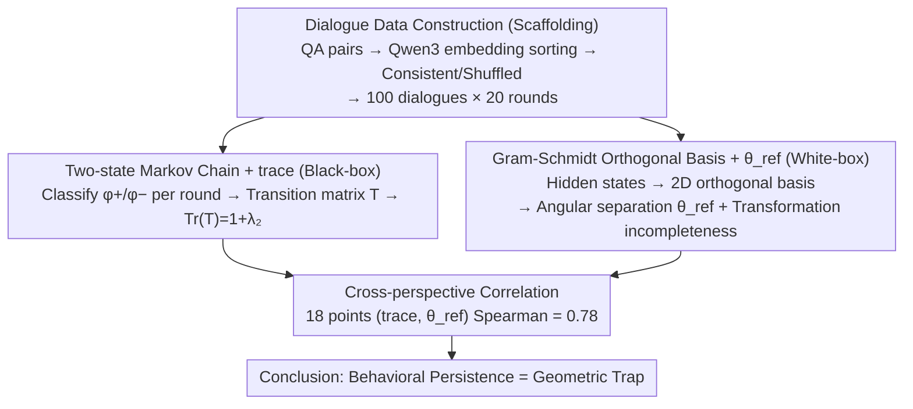

# Old Habits Die Hard: How Conversational History Geometrically Traps LLMs

**Conference**: ICML 2026  
**arXiv**: [2603.03308](https://arxiv.org/abs/2603.03308)  
**Code**: https://github.com/technion-cs-nlp/OldHabitsDieHard  
**Area**: LLM Safety / Mechanistic Interpretability / Conversational Behavior Analysis  
**Keywords**: Conversational History, Behavioral Persistence, Markov Chains, Geometric Traps, Refusal / Sycophancy / Hallucination

## TL;DR
The History-Echoes framework analyzes the carryover effects of LLM conversational history through two perspectives: "Markov chain state consistency" and "latent space geometric angles." It identifies a Spearman correlation of 0.78 between the two—once a certain behavior (hallucination, sycophancy, or refusal) occurs, the model becomes trapped within the corresponding latent space region, making escape difficult. The "refusal" trap is the strongest, while "hallucination" is the weakest; these traps dissolve when topic coherence is broken.

## Background & Motivation

**Background**: LLMs exhibit various state-dependent behaviors—both undesirable (hallucination, sycophancy) and desirable (refusal). While prior work has documented these phenomena, a unified framework for **how they persist and are represented across multi-turn dialogues** is lacking. Existing research on safety trajectories or generation difficulty typically examines single phenomena in isolation, without linking "persistence probability" to "internal geometry."

**Limitations of Prior Work**: Analyzing strictly from a black-box perspective (output layer) or a white-box perspective (hidden states) is insufficient. Black-box analysis fails to reveal mechanisms (why does it persist?), while white-box analysis lacks behavioral validation (does this geometric pattern truly correspond to external behavior?).

**Key Challenge**: To explain why "a model that has refused once is more likely to refuse again," one must simultaneously prove that "behavior persists at the behavioral layer" and that "internal geometry has a structural correspondence," and that these two are correlated—otherwise, the findings could be statistical illusions or cherry-picked geometry.

**Goal**: (1) Quantitatively measure behavioral carryover; (2) reveal the mechanism via latent space geometry; (3) demonstrate a strong correlation between these two perspectives, providing dual evidence for "behavioral persistence ≈ geometric trap."

**Key Insight**: Model each dialogue turn as a binary state (behavior exists/non-existent) using a first-order Markov chain. Concurrently, use Gram-Schmidt categorization in the latent space to construct orthogonal bases for $\mathcal{H}_{\phi^+}$ and $\mathcal{H}_{\phi^-}$ to measure the angular separation of activations. It is hypothesized that these two metrics (black-box persistence vs. white-box geometric angle) are positively correlated.

**Core Idea**: Behavioral persistence is not an isolated output-layer phenomenon; rather, it occurs because two phase regions in the latent space are separated by large angles, and state transitions require a significant rotation that is often incomplete—causing the model to be geometrically trapped in its original state.

## Method

### Overall Architecture

History-Echoes aims to answer: why does a behavior (refusal, sycophancy, hallucination) that appeared in a previous turn tend to recur in subsequent turns? It monitors this through two complementary perspectives. At the black-box level, it treats the presence/absence of behavior in each turn as a two-state sequence, quantifying its "stickiness" via the transition structure of a Markov chain. At the white-box level, it projects the hidden states corresponding to each state into the latent space to quantify how widely the states are separated and how incompletely the model rotates during transitions. Finally, it correlates black-box and white-box metrics across multiple models and datasets to determine if they represent two sides of the same underlying mechanism.

For experimental materials, QA pairs for each dataset (TriviaQA, NaturalQA, SORRY-Bench, Do-Not-Answer, SycophancyEval) are first embedded using Qwen3-Embedding, sorted by nearest neighbors to form topic-coherent $D_{\text{consistent}}$, and then randomly shuffled to create topic-incoherent $D_{\text{inconsistent}}$. Each dataset samples 100 dialogues of 20 turns each, using coherent and incoherent sets as controls.

### Key Designs

**1. Two-state Markov Chain + trace: Black-box quantification of behavioral "stickiness"**

To quantify the intuition that "a model that has refused is more likely to refuse again," a scalar metric independent of internal model data is needed. Each turn is classified into two states: phenomenon $\phi$ "present" or "absent" (using string matching; manual audit shows a 6.5% error rate). The transition matrix $T_{ij}=P(s_j|s_i)$ is estimated, and its trace $\text{Tr}(\mathbf{T})=P(s_{\phi^+}|s_{\phi^+})+P(s_{\phi^-}|s_{\phi^-})$ is used as the persistence measure. Crucially, $\text{Tr}(\mathbf{T})=1+\lambda_2$, where $\lambda_2$ is the second eigenvalue. If states are independent (no carryover), the sum of self-loop probabilities is exactly 1 and $\lambda_2=0$. $\text{Tr}>1$ indicates a preference for self-loops; higher $\lambda_2$ implies longer mixing times and behaviors being "locked" longer. This scalar is intuitive, compatible with black-box models, and naturally extends to higher-order Markov chains.

**2. Gram-Schmidt Orthogonal Basis + $\theta_{\text{ref}}$: White-box quantification of state separation and incomplete rotation**

The geometric mechanism is analyzed by collecting residual hidden states of the first token in each turn at 85% relative depth. These are categorized into $\phi^+/\phi^-$ and represented by mean vectors $\mathbf{h}_{\phi^+}, \mathbf{h}_{\phi^-}$. Gram-Schmidt process is used to orthogonalize these into a shared 2D orthonormal basis ($\mathbf{B}_1$ is normalized $\mathbf{h}_{\phi^-}$; $\mathbf{B}_2$ is $\mathbf{h}_{\phi^+}$ after removing its $\mathbf{B}_1$ component and normalizing). This 2D subspace captures the "phase" more robustly than a single direction. Two geometric signatures are calculated: first, the angular separation $\theta_{\text{ref}}$, describing how far apart the two phases are; larger $\theta_{\text{ref}}$ requires a larger rotation for state switching. Second, "transformation incompleteness," the ratio of the actual rotation angle (via orthogonal Procrustes) to $\theta_{\text{ref}}$ during a transition. If $\theta_{\phi^-\to\phi^+}<\theta_{\text{ref}}$, it indicates the activation stopped before reaching the target phase, leaving a "geometric fingerprint" of the previous state.

**3. Cross-perspective Correlation: Unifying black-box and white-box mechanisms**

To prove that "high trace" and "large $\theta_{\text{ref}}$" describe the same phenomenon, Spearman rank correlation is calculated across 18 combinations (3 models × 6 datasets). A significant positive correlation provides dual evidence: behavioral persistence is the external projection of a latent geometric trap where phases are separated by large angles and transitions are incomplete.

## Key Experimental Results

### Behavioral Persistence (trace, average across three models)

| Phenomenon | NaturalQA | TriviaQA | Sorry | DoNotAns | S-pos | S-neg | Mean |
|------------|-----------|----------|-------|----------|-------|-------|------|
| Tr(T)      | 1.13      | 1.12     | **1.57** | **1.59** | 1.33  | 1.14  | 1.31 |

All phenomena show $\text{Tr} > 1$; refusal datasets show the highest trace (≈1.6), indicating the strongest carryover.

### Geometric Angular Separation $\theta_{\text{ref}}$ (Degrees)

| Model           | NaturalQA | TriviaQA | Sorry | DoNotAns | S-pos | S-neg |
|-----------------|-----------|----------|-------|----------|-------|-------|
| LLaMA-3.1-8B    | 11.3      | 13.1     | **66.5** | **54.3** | 14.6  | 28.2  |
| Qwen-8B         | 11.7      | 6.4      | **46.4** | **38.6** | 22.5  | 22.6  |
| GPT-OSS-20B     | 9.6       | 13.9     | **42.7** | **34.0** | 27.8  | 23.6  |

Refusal datasets show $\theta_{\text{ref}}$ of 30–66°, significantly larger than the 6–14° for hallucination—geometrically, the refusal state is distinctly separated.

### Dual-perspective Correlation

Across 18 (trace, $\theta_{\text{ref}}$) points, the Spearman correlation is **0.78**—a strong positive correlation validating "high trace ↔ large geometric angle."

### Topic Coherence Dissolving Traps

| Dataset       | $D_{\text{consistent}}$ trace | $D_{\text{inconsistent}}$ trace | Difference |
|---------------|-------------------------------|---------------------------------|------------|
| Sorry         | 1.57                          | 1.18                            | −0.39      |
| Do-not-answer | 1.59                          | 1.20                            | −0.39      |
| S-neg         | 1.14                          | 1.05                            | −0.09      |

Shuffling topics significantly reduces the trace and $\theta_{\text{ref}}$, confirming that the "geometric trap" depends on topic coherence. This echoes adversarial jailbreak strategies that inject irrelevant tokens to break context.

### Black-box Validation on Closed-source Models

Trace tests on GPT-5 and Claude-Opus-4.5 show patterns consistent with open-source models, suggesting trace is a universal diagnostic for inferring internal carryover in closed-source LLMs.

### Key Findings
- **Intensity order of carryover**: refusal > sycophancy > hallucination; this order is consistent across both trace and $\theta_{\text{ref}}$ perspectives.
- **Refusal strength originates from "single direction"**: This aligns with Arditi et al. (2024) finding that refusal is controlled by a single representation direction—clearly defined phenomena are more geometrically separated, creating deeper traps.
- **Hallucination is weakest**: Likely because hallucination is a broad set of failure modes (factual errors, fabrications, inconsistencies) without a unified latent subspace.
- **Incoherent dialogue dismantles traps**: Practically, "switching topics" may be a simple method to unlock a trapped model.

## Highlights & Insights
- **Strong correlation between black-box and white-box perspectives**: This study provides dual evidence that "behavioral persistence = geometric trap." This "dual-end verification" methodology is transferable to any LLM behavioral study.
- **Unified treatment of three phenomena**: By comparing hallucination, sycophancy, and refusal, the study reveals that carryover intensity matches "phenomenon clarity." Clarity implies geometric separation, which implies an inescapable trap.
- **Diagnostics for closed-source models**: Since trace does not require internal access, it offers an indirect diagnostic tool for behavioral persistence in models like GPT-5 and Claude, which is valuable for LLM governance.
- **Geometric explanation for jailbreaks**: Jailbreaks often inject irrelevant tokens to break coherence; this study finds that this directly reduces carryover by dissolving geometric traps.

## Limitations & Future Work
- Phenomenon detection relies on string matching (6.5% error rate), which may lack the granularity to distinguish types of hallucinations (e.g., factual vs. reasoning errors).
- The first-order Markov assumption may oversimplify long-range dependencies.
- Model scales are relatively small (4–20B); geometric trap patterns in larger models might differ.
- Geometric angles $\theta_{\text{ref}}$ were fixed at a relative depth of 85%; trap intensity may vary across layers.
- The study focuses on "once-trapped-stay-trapped" without exploring active "de-trapping" mechanisms beyond passive topic shuffling.

## Related Work & Insights
- **vs. Arditi et al. 2024 (Refusal directions)**: Extends the finding to show that refusal not only has a single direction but also strong carryover and a specific geometric mechanism.
- **vs. studies on carryover effects (Simhi 2024, Zhang 2024)**: Those studies focus on the output layer; this work adds a white-box perspective and proves correlation.
- **vs. jailbreak via adversarial tokens (Zou 2023)**: Provides a geometric explanation—adversarial tokens break topic coherence, thereby dissolving the geometric traps.
- **Insight**: This framework could extend to other state-dependent phenomena, such as format locking in in-context learning or persona drift. It could also lead to "active de-trap" mechanisms, such as periodic topic refreshes as prompt-side safety patches.

## Rating
- Novelty: ⭐⭐⭐⭐ The unified dual-perspective framework is new, though Markov chains and geometric separation are known.
- Experimental Thoroughness: ⭐⭐⭐⭐⭐ Comprehensive coverage across multiple models, datasets, phenomena, and closed-source validation.
- Writing Quality: ⭐⭐⭐⭐ Clear conceptual introduction; geometric derivations could be more detailed.
- Value: ⭐⭐⭐⭐ Significant implications for multi-turn safety, jailbreak mechanisms, and mechanistic interpretability.

<!-- RELATED:START -->

## Related Papers

- [\[ACL 2026\] Hard to Read, Easy to Jailbreak: How Visual Degradation Bypasses MLLM Safety Alignment](../../ACL2026/llm_safety/hard_to_read_easy_to_jailbreak_how_visual_degradation_bypasses_mllm_safety_align.md)
- [\[ICML 2026\] Deep Sequence Models Tend to Memorize Geometrically; It Is Unclear Why](deep_sequence_models_tend_to_memorize_geometrically_it_is_unclear_why.md)
- [\[ICLR 2026\] Revisiting the Past: Data Unlearning with Model State History](../../ICLR2026/llm_safety/revisiting_the_past_data_unlearning_with_model_state_history.md)
- [\[ICML 2026\] Multilingual Unlearning in LLMs: 转移、动力学与可逆性](multilingual_unlearning_in_llms_transfer_dynamics_and_reversibility.md)
- [\[AAAI 2026\] An LLM-Based Simulation Framework for Embodied Conversational Agents in Psychological Counseling](../../AAAI2026/llm_safety/an_llm-based_simulation_framework_for_embodied_conversationa.md)

<!-- RELATED:END -->
