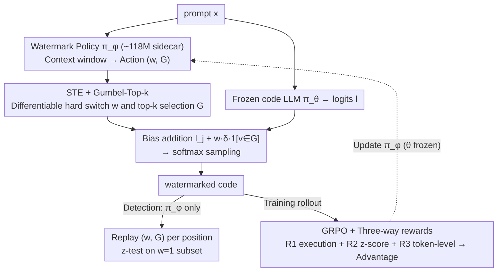

# Optimizing Token Choice for Code Watermarking: An RL Approach

**Conference**: ICML 2026  
**arXiv**: [2508.11925](https://arxiv.org/abs/2508.11925)  
**Code**: https://github.com/TimeLovercc/CodeTracer (Available)  
**Area**: LLM Security / Code Watermarking / Reinforcement Learning  
**Keywords**: Code Watermarking, GRPO, Gumbel-Top-k, Straight-Through Estimator, z-score

## TL;DR
CodeTracer attaches a small watermark policy network alongside a frozen code LLM. It employs GRPO with dual rewards (execution success + z-score) and Gumbel-Top-k Straight-Through Estimation (STE) to jointly learn "which token positions to watermark" and "which subset of green tokens to select." This approach raises the detection AUROC from ~70% to ~78% while maintaining near-baseline Pass@1 performance.

## Background & Motivation

**Background**: Mainstream LLM watermarking (the green-red scheme by Kirchenbauer 2023) randomly partitions the vocabulary into green and red sets during generation, adding a fixed logit bias $\delta$ to green tokens. Detection utilizes a z-test on green token frequencies. While effective for natural language where semantic equivalence is common, it faces challenges in code.

**Limitations of Prior Work**: Code generation scenarios involve: (1) high syntax constraints (e.g., `def`, brackets, keywords) where modifications lead to compilation failure; (2) heterogeneous sensitivity to perturbations (variable names can be changed, but API names cannot); (3) low-entropy distributions where indiscriminate biasing degrades code quality. Early methods like SWEET and CodeIP either require the original LLM's logits/prompts during detection to calculate entropy or rely on manual syntax transformation rules, raising deployment barriers.

**Key Challenge**: There is an inherent conflict between "statistical detectability" and "functional correctness" under low-entropy and strict syntax constraints—weak watermarking is undetectable, while strong watermarking breaks the code.

**Goal**: (i) Automatically identify safe positions for watermarking, (ii) select a function-preserving green token set $G$ at those positions, and (iii) ensure the detection process does not depend on the original LLM.

**Key Insight**: Model whether to watermark $w$ and the choice of the green set $G$ as a context-dependent policy $\pi_\phi(a\mid\mathbf{c})$. By combining this with a frozen LLM $\pi_\theta$ to form $\pi_{\theta\oplus\phi}$, reinforcement learning can autonomously learn syntax and semantic constraints using two types of verifiable rewards: unit test results and z-scores.

**Core Idea**: Formulate code watermarking as an RL problem where a small policy network biases the LLM's next-token distribution. Use GRPO + STE + Gumbel-Top-k to incorporate discrete decisions into end-to-end gradient-based training.

## Method

### Overall Architecture
CodeTracer addresses the challenge of adding statistically detectable watermarks to code without breaking its functionality. It attaches a small watermark policy network to a frozen code LLM. This policy determines position-by-position whether to apply a watermark and which green tokens to use. Specifically, given a prompt $\mathbf{x}$, the frozen LLM $\pi_\theta$ computes logits $\mathbf{l}\in\mathbb{R}^{|\mathcal{V}|}$. A trainable policy $\pi_\phi$ processes a fixed context window $\mathbf{c}$ to output $(w, G)$, where $w\in\{0,1\}$ indicates the watermarking decision and $G\subset\mathcal{V}$ is a green set of size $k=\lfloor\gamma|\mathcal{V}|\rfloor$. The resulting watermarked logits $\tilde{l}_j = l_j + w\cdot\delta\cdot\mathbb{1}_{v_j\in G}$ are used for softmax sampling to obtain $\tilde y_t$. During detection, only $\pi_\phi$ is required to reconstruct $(w, G)$ for each position, and a one-proportion z-test $z = (N_G - T\gamma)/\sqrt{T\gamma(1-\gamma)}$ is performed on the subset where $w=1$.

### Key Designs

**1. Strategic Watermarking: Replacing fixed red-green partitioning with a context-aware learnable sidecar policy**

Standard watermarking uses the same random split for every position, failing to distinguish between flexible identifiers and rigid keywords. CodeTracer freezes the LLM parameters $\theta$ and trains only a small watermark model $\phi$ (~118M parameters, <10% of a 1.5B base LLM). $\pi_\phi$ is a small Transformer outputting a $(|\mathcal{V}|+1)$-dimensional vector $(w_\phi, \mathbf{l}_\phi)$, where $w_\phi$ determines $w$ and $\mathbf{l}_\phi$ ranks tokens for $G$. Freezing the LLM avoids unpredictable degradation of code generation capabilities and allows $\pi_\phi$ to serve as a plug-in module. It can be trained on a 1.5B model and applied to an 8B model during inference. Detection only requires $\pi_\phi$ to reproduce $(w, G)$.

**2. STE + Gumbel-Top-k: Differentiable discrete decisions for $(w, G)$**

The hard switch $w\in\{0,1\}$ and the top-$k$ selection for $G$ are discrete operations that block gradients. For $w$, a Straight-Through Estimator is used: $w = \mathbb{1}_{w_\phi>0} + \sigma(w_\phi) - \text{sg}(\sigma(w_\phi))$, where the forward pass uses a hard threshold and the backward pass uses the gradient of $\sigma$. For $G$, Gumbel-Top-$k$ is applied: Gumbel noise is added to the policy logits $\mathbf{g} = \mathbf{l}_\phi + (-\log(-\log \mathbf{u}))$. An indicator function with Gumbel-Softmax relaxation allows differentiable selection: $\mathbf{l}_G = \mathbb{1}_{v\in G} + \mathcal{S}(\mathbf{g}) - \text{sg}(\mathcal{S}(\mathbf{g}))$. Gumbel-Top-$k$ (Xie & Ermon 2019) is chosen because it handles fixed-cardinality subset sampling, preserving statistical validity while allowing gradient flow to $\pi_\phi$.

**3. GRPO + Three-way Rewards: Learning "where and what" without labeled data**

Since no "watermarked code" dataset exists, the framework uses GRPO (as seen in DeepSeek-R1) driven by three rewards. $R_1$ is an execution reward (1 if all test cases pass, 0 otherwise) acting as a functional constraint. $R_2$ is a saturated z-score reward (1 if $z\geq 3$, 0 if $z\leq 0$, and linear in between) to drive detectability. $R_3$ is a token-level process reward (+1 if $w_t=1$ and $s_t\in G_t$, -1 if in the red set, 0 if no watermark). These are merged via an advantage function $\hat A(s_t, a_t) = (A_1 + A_2)\cdot\mathbb{1}_{\text{is\_code}}(s_t)$, where $\mathbb{1}_{\text{is\_code}}$ masks non-code tokens to preserve the watermark budget. $R_3$ is critical; removing it causes AUROC to drop by 7.84pp and TPR to drop by 16.05pp.

### Loss & Training
The objective is the GRPO clipped objective with KL regularization:

$\max_\phi \mathbb{E}_{s\sim\mathcal{D}}\left[\frac{1}{|s|}\sum_t \min\left(r_t(\phi)\hat A_t, \text{clip}(r_t(\phi), 1-\varepsilon, 1+\varepsilon)\hat A_t\right)\right] - \beta D_{\text{KL}}(\pi_{\theta\oplus\phi}\|\pi_{\text{ref}})$

where $r_t(\phi) = \pi_{\theta\oplus\phi}(s_t|s_{<t})/\pi_{\text{ref}}(s_t|s_{<t})$. The reference policy $\pi_{\text{ref}}$ is an old copy of $\pi_{\theta\oplus\phi}$. Training involves an initial SFT phase for $\pi_\phi$ to learn the token distribution followed by GRPO, completing in approximately one day on a single A100 GPU. OpenCoder-1.5B-Instruct is used as the base LLM with $\gamma=0.5$.

## Key Experimental Results

### Main Results
Comparison with post-hoc detection (logp, LogRank, DetectGPT, GPTZero) and active watermarking (WLLM, EXP-edit, SWEET) on HumanEval / MBPP:

| Dataset | Method | Pass@1 (%) | AUROC (%) | TPR@5%FPR (%) |
|--------|------|-----------|-----------|---------------|
| HumanEval | Base (No Watermark) | 65.42 | – | – |
| HumanEval | WLLM | 58.05 | 70.17 | 20.73 |
| HumanEval | EXP-edit | 59.29 | 66.50 | 25.61 |
| HumanEval | SWEET† | 60.46 | 76.24 | 27.44 |
| HumanEval | **CodeTracer** | **62.65** | **77.71** | **32.32** |
| MBPP | Base | 43.35 | – | – |
| MBPP | WLLM | 39.66 | 76.44 | 27.80 |
| MBPP | SWEET† | 39.64 | 77.24 | 24.80 |
| MBPP | **CodeTracer** | **42.10** | **78.42** | **31.60** |

Post-hoc methods achieve AUROC scores of ~47–52% (near random), showing passive detection is unreliable for code. CodeTracer shows the smallest Pass@1 drop (HumanEval -2.77pp vs WLLM -7.37pp) while achieving ~5pp higher TPR than the runner-up. The 1.5B-trained $\pi_\phi$ transfers to an OpenCoder-8B model, yielding 71.77% Pass@1 (vs 72.04% base) and 78.69% AUROC.

### Ablation Study
| Configuration | Pass@1 (%) | AUROC (%) | TPR (%) | Note |
|------|-----------|-----------|---------|------|
| CodeTracer (full) | 60.82 | 82.95 | 46.34 | Full three rewards |
| w/o $A_2$ (No token-level $R_3$) | 61.15 | 75.11 | 30.29 | Detection collapses |
| w/o $A_1$ (No outcome reward) | 60.34 | 79.52 | 34.91 | Drop in both metrics |
| CodeTracer-1 (Pure RL, no SFT) | 62.65 | 77.71 | 32.32 | Emphasis on function |
| CodeTracer-2 (SFT + RL) | 60.82 | 82.95 | 46.34 | Emphasis on detection |

### Key Findings
- **$R_3$ is the most critical reward**: Removing the process-level reward drops AUROC by 7.84pp, indicating that instant token-level feedback is more effective for convergence than sequence-level z-score feedback.
- **SFT initialization acts as a knob**: It allows balancing detectability and functionality (CodeTracer-1 vs -2).
- **Attack Robustness**: Under DIPPER rewriting, AUROC is 58.42 (vs WLLM 55.92). Under variable renaming, it is 73.36 (vs WLLM 70.91). Performance leads baselines but degrades under attack.
- **Minimal Inference Overhead**: $\pi_\phi$ runs in parallel with the LLM. Added latency is < 100μs (vs 500–800ms for the LLM), and VRAM increase is < 0.5GB.
- **Cross-language generalization**: Performance is consistent on Java and C++ (HumanEvalPack), suggesting the policy learns general syntax priors beyond Python.

## Highlights & Insights
- **Automated position selection**: Unlike prior work requiring manual AST rules or LLM entropy calculations, CodeTracer uses RL to let the policy learn syntax/semantic constraints automatically.
- **Suitability of Gumbel-Top-k**: Green set selection is fundamentally fixed-cardinality subset sampling. This approach can be generalized to any scenario requiring "k-choices + end-to-end gradients" (e.g., learnable prompt masks).
- **Process reward dominance**: The finding that process rewards outperform pure outcome rewards mirrors observations in LLM reasoning but contradicts the intuition that outcome-only RL is "simpler." It suggests seeking cheap dense signals when possible.
- **Zero LLM dependency at detection**: By packaging watermarking as a sidecar $\pi_\phi$, providers can deliver detection services without exposing the base model.

## Limitations & Future Work
- Robustness against strong semantic rewriting (DIPPER) remains low (AUROC 58.42%).
- Training requires a sandbox for code execution, which limits the coverage of supported libraries/languages and slows down the rollout phase.
- Watermarking hyperparameters ($\gamma, \delta$) are fixed globally; adaptive intensity per position was not explored.
- Scalability to very large models (70B+) and white-box security (where an adversary has access to $\pi_\phi$) have not been tested.
- Potential improvements include making $\delta$ a policy output and using learned reward models to replace slow sandbox executions.

## Related Work & Insights
- **vs WLLM (Kirchenbauer 2023a)**: WLLM uses fixed PRF-based splits. CodeTracer makes these context-aware, reducing Pass@1 loss by half (3pp vs 7pp).
- **vs SWEET (Lee 2023)**: SWEET uses entropy thresholds and requires the original LLM during detection. CodeTracer internalizes this logic into $\pi_\phi$ for lighter deployment.
- **vs CodeIP (Guan 2024)**: CodeIP relies on manual syntax rules; CodeTracer learns these constraints via RL, offering better cross-language potential.
- **vs Xu 2024**: Xu 2024 fine-tunes the LLM itself, which may compromise general performance. CodeTracer uses a frozen base model with a sidecar, which is safer and more transferable.

## Rating
- Novelty: ⭐⭐⭐⭐ Reformulating code watermarking as a policy learning problem using Gumbel-Top-k for discrete gradients is elegant, though the components themselves are established.
- Experimental Thoroughness: ⭐⭐⭐⭐ Comprehensive testing on three benchmarks, plus robustness and transferability tests. Lacks experiments on 70B+ models and white-box attacks.
- Writing Quality: ⭐⭐⭐⭐ Logical flow with clear mathematical and algorithmic descriptions.
- Value: ⭐⭐⭐⭐ Code watermarking is an underrated field in LLM security. This plug-and-play, zero-dependency detection paradigm is highly practical for industry use.

<!-- RELATED:START -->

1. Kirchenbauer et al., "A Watermark for Large Language Models", ICML 2023.
2. Lee et al., "Who Wrote this Code? Watermarking for Code Generation", arXiv 2023.
3. Guan et al., "CodeIP: A Syntax-guided Program Watermarking", arXiv 2024.

<!-- RELATED:END -->

## Related Papers

- [\[AAAI 2026\] Uncovering Pretraining Code in LLMs: A Syntax-Aware Attribution Approach](../../AAAI2026/llm_safety/uncovering_pretraining_code_in_llms_a_syntax-aware_attribution_approach.md)
- [\[ICML 2026\] ACTG-ARL: Differentially Private Conditional Text Generation with RL-Boosted Control](actg-arl_differentially_private_conditional_text_generation_with_rl-boosted_cont.md)
- [\[AAAI 2026\] WaterMod: Modular Token-Rank Partitioning for Probability-Balanced LLM Watermarking](../../AAAI2026/llm_safety/watermod_modular_token-rank_partitioning_for_probability-balanced_llm_watermarki.md)
- [\[ICML 2026\] Watermarking LLM Agent Trajectories (ACTHOOK)](watermarking_llm_agent_trajectories.md)
- [\[ICML 2026\] Memory as a Markov Matrix: Sample Efficient Knowledge Expansion via Token-to-Dictionary Mapping](memory_as_a_markov_matrix_sample_efficient_knowledge_expansion_via_token-to-dict.md)

<!-- RELATED:END -->
