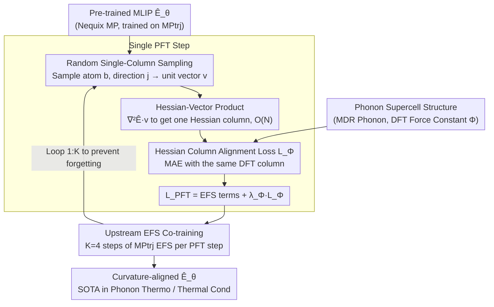

# PFT: Phonon Fine-tuning for Machine Learned Interatomic Potentials

**Conference**: ICML 2026  
**arXiv**: [2601.07742](https://arxiv.org/abs/2601.07742)  
**Code**: None  
**Area**: Scientific Computing / Materials Simulation / Machine Learned Interatomic Potentials  
**Keywords**: MLIP, Phonon, Hessian, Force Constants, Fine-tuning

## TL;DR
This paper proposes PFT (Phonon Fine-tuning), which randomly samples force constant columns via Hessian-vector products and directly supervises the alignment of the energy Hessian with DFT force constants during MLIP fine-tuning. Combined with co-training to mitigate catastrophic forgetting, this approach reduces the average phonon thermodynamic error of Nequix MP on the MDR Phonon benchmark by 55% and lowers the thermal conductivity $\kappa_{\text{SRME}}$ from 0.446 to 0.307, achieving SOTA among models trained on MPtrj.

## Background & Motivation

**Background**: Machine Learned Interatomic Potentials (MLIPs) have become cost-effective surrogates for DFT in large-scale material screening. Mainstream universal MLIPs (MACE-MP-0, SevenNet, Nequix, etc.) learn the Born-Oppenheimer Potential Energy Surface (PES) by regressing energy $E$, force $\mathbf{F}=-\nabla E$, and stress $\sigma$ (the EFS loss) on relaxation trajectory datasets such as MPtrj and OMat24.

**Limitations of Prior Work**: Many critical physical properties—phonon dispersion, vibrational entropy $S$, Helmholtz free energy $F$, constant-volume heat capacity $C_V$, and thermal conductivity $\kappa$—depend not on 0th or 1st-order quantities of the PES, but on second-order force constants $\Phi_{aibj}=\partial^{2}E/\partial r_{a,i}\partial r_{b,j}$ or even higher-order derivatives. EFS loss only indirectly constrains second-order derivatives, leading to "over-softened" PES curvature near equilibrium configurations for many MPtrj-trained MLIPs. This results in systematically low phonon frequencies or even imaginary frequencies, significantly distorting predicted phase stability and thermal conductivity.

**Key Challenge**: Directly supervising force constants requires calculating the Hessian. However, crystalline phonon calculations must be performed on sufficiently large supercells to avoid self-interaction. These supercells often contain thousands of atoms, causing the $3N\times 3N$ full Hessian memory and computation to explode at $O(N^2)$, making full training infeasible. Simultaneously, since phonon data consists entirely of equilibrium configurations, direct fine-tuning tends to destroy pre-trained capabilities on non-equilibrium configurations.

**Goal**: (1) Introduce the second-order PES curvature as a differentiable training signal into MLIPs; (2) ensure this signal remains trainable on supercells with thousands of atoms; (3) complete fine-tuning without losing the original MPtrj capabilities.

**Key Insight**: The authors first plotted "Hessian error vs. phonon thermodynamic error" for several base models trained on MPtrj (Fig. 2), observing a very strong positive correlation. This implies that as long as the Hessian error is reduced, downstream phonon properties will improve accordingly, thus reducing the task of "improving phonon properties" to "aligning the Hessian."

**Core Idea**: Add a Hessian alignment loss $\mathcal{L}_\Phi$ to the EFS loss. For each structure, only one column of the Hessian is randomly sampled, and gradients are calculated via a single Hessian-vector product (HVP). This reduces the single-step training complexity from $O(N^2)$ to $O(N)$. Additionally, co-training with upstream EFS data is used to prevent forgetting.

## Method

### Overall Architecture
The goal of PFT is straightforward: take an MLIP $\hat{E}_\theta(\mathbf{r})$ already pre-trained on large-scale trajectory data like MPtrj (Nequix MP is primarily used, with replications on MACE-MP-0 and Nequix OAM) and correct its "over-softened" PES curvature near equilibrium without losing existing capabilities. It utilizes an additional phonon dataset (MDR Phonon, ~8.5k training materials, 300k finite-displacement DFT calculations) to provide second-order force constant labels, while retaining a portion of upstream MPtrj data for anti-forgetting.

During training, for each phonon supercell structure, an atom $b$ and Cartesian direction $j$ are randomly sampled to construct a unit vector $\mathbf{v}$ (where only the $(b,j)$ component is 1). A single Hessian-vector product is used to compute the corresponding Hessian column $\nabla^2_\mathbf{r}\hat{E}\,\mathbf{v}$. The MAE between this column and the same column of the DFT force constants is calculated. This, along with the three EFS terms, constitutes $\mathcal{L}_\text{PFT}$. For every 1 step of PFT, $K=4$ steps of standard upstream MPtrj EFS fine-tuning are performed (Algorithm 1). The resulting $\hat{E}_\theta$ maintains its original architecture but aligns its PES curvature with DFT. Downstream inference using either finite displacement or analytical AD yields nearly identical force constant results.

### Key Designs

**1. Hessian Column Alignment Loss $\mathcal{L}_\Phi$ + Random Single-Column Sampling: Turning second-order curvature into a supervisable training target**

Properties such as phonon dispersion, vibrational entropy, and thermal conductivity depend on the second-order force constants $\Phi$. EFS loss only learns the "forces themselves" and provides almost no direct constraint on "how forces change with position." The authors even found that direct EFS fine-tuning on phonon displacement data performed worse than the base model (Table 1, $\omega_\text{max}$ error spiked from 24 to 182), indicating that EFS signals at displacement points cannot substitute for curvature supervision. Hessian must be treated as a first-class supervision target. PFT directly aligns the second derivative of energy with respect to coordinates with the DFT force constants: $\mathcal{L}_\Phi = \frac{1}{3N_a}\sum_{a,i}\mathbb{E}_{b,j}\,|\partial^2\hat{E}/\partial r_{a,i}\partial r_{b,j} - \Phi_{aibj}|$.

The full Hessian is $3N\times 3N$; explicit calculation for supercells with hundreds or thousands of atoms is impossible. Thus, per structure per step, a single $(b,j)$ is uniformly sampled, equivalently comparing only one column of the Hessian. Since the expectation of this sampling equals the MAE of the full Hessian, the gradient is unbiased. Furthermore, E(3)-equivariant architectures provide significant symmetry redundancy in force constants, allowing single-column sampling to cover most degrees of freedom statistically, saving computation without sacrificing supervision quality.

**2. Hessian-Vector Product Compressing Complexity from $O(N^2)$ to $O(N)$: Making curvature supervision on large supercells feasible**

$\mathcal{L}_\Phi$ alone is insufficient—explicitly constructing the full Hessian would cause memory overflow in large supercells. PFT employs the HVP technique (Pearlmutter 1994) to bypass this: $\nabla^2_\mathbf{r}\hat{E}\,\mathbf{v} = \nabla_\mathbf{r}((\nabla_\mathbf{r}\hat{E})^\top \mathbf{v})$. In JAX, this is `jax.jvp(jax.grad(energy), (pos,), (v,))[1]`—first computing forces via reverse-mode, then applying forward-mode JVP to get the derivative of forces along $\mathbf{v}$. An entire Hessian column is obtained in one backpropagation without materializing any $N^2$ matrices. Implementation involves batching multiple structures into a single large disjoint graph and concatenating their sampled $\mathbf{v}$ vectors. A single HVP on the total energy computes losses for all structures; the optimizer update then requires a gradient of the HVP, forming a "triple-backward" pass.

This step reduces each training step from $O(N^2)$ to $O(N)$, enabling Hessian supervision on supercells with hundreds of atoms on a single A100 GPU. The entire PFT process takes only 35 A100 hours (with co-training) or 15 A100 hours (without)—less than one-third of the 100 A100 hours required for pre-training.

**3. Upstream EFS Co-training: Suppressing catastrophic forgetting at minimal cost**

Phonon data naturally consists of equilibrium configurations; training exclusively on it causes the PES to drift in non-equilibrium regions. This manifests as a significant increase in energy/force/stress errors on the MPtrj validation set (Fig. 3), meaning the model "forgets" how to perform relaxation trajectories and stability predictions. PFT's solution is simple: for every 1 step of PFT, $K=4$ subsequent steps of standard EFS updates are performed on the upstream dataset $\mathcal{D}_\text{up}$ (MPtrj) (Algorithm 1, lines 4-7), with $K$ selected by monitoring validation sets for both tasks.

Empirically, PFT without co-training significantly degrades EFS accuracy on MPtrj. Adding $1{:}4$ mixed training nearly eliminates this degradation while only slightly increasing the Hessian MAE. In Matbench Discovery stability classification, co-training keeps performance drops within 1%. Compared to methods like LoRA or EWC for preserving prior knowledge, this fixed-ratio data mixing is engineeringly simple yet effectively eliminates forgetting.

### Loss & Training
Total loss: $\mathcal{L}_\text{PFT} = \lambda_E\mathcal{L}_E + \lambda_F\mathcal{L}_F + \lambda_\sigma\mathcal{L}_\sigma + \lambda_\Phi\mathcal{L}_\Phi$. The first three terms follow EFS (MAE for energy/stress, $\ell_2$ for forces), and the fourth is the Hessian alignment. For phonon structures, forces and stresses are approximated as 0 (fully relaxed), and supercell energy is single-cell energy times the repetition factor. Co-training ratio $K=4$, 200 epochs of PFT. The same recipe was used for MACE-MP-0 and Nequix OAM without further hyperparameter tuning.

## Key Experimental Results

### Main Results

| Dataset / Metric | Nequix MP base | Nequix MP PFT | Nequix MP PFT (no co-train) | Prev. SOTA (MPtrj) |
|---|---|---|---|---|
| MDR Phonon $\omega_\text{max}$ (K) MAE | 24 | **12** | 10 | eSEN-MP 24 |
| MDR Phonon $S$ (J/K/mol) MAE | 32 | 14 | **11** | eSEN-MP 14 |
| MDR Phonon $F$ (kJ/mol) MAE | 12 | 5 | **4** | eSEN-MP 4 |
| MDR Phonon $C_V$ (J/K/mol) MAE | 6 | 3 | **2** | eSEN-MP 5 |
| 3rd-order Force Constant $\Phi^{(3)}$ MAE (meV/ų) | 10.52 | 8.35 | **7.46** | — |
| Matbench Disc. Thermal Cond. $\kappa_\text{SRME}$ ↓ | 0.446 | 0.307 | **0.281** | eSEN-30M 0.340 |

Average error reduction for the four phonon thermodynamic quantities was 55%. The same recipe reduced $\omega_\text{max}$ from 61 to 19 and $S$ from 60 to 14 for MACE-MP-0. On the stronger Nequix OAM base model, PFT still achieved a 50% reduction. Notably, Nequix MP PFT (708K parameters) outperformed the OAM base model, suggesting Hessian supervision is more efficient than simply increasing upstream data volume.

### Ablation Study

| Configuration | Hessian MAE | MPtrj EFS Degradation | Explanation |
|---|---|---|---|
| Nequix MP base | High | 0 | EFS training only |
| EFS fine-tuning on phonon deviations | Higher than base | — | $\omega_\text{max}$ jumped from 24 to 182; EFS signal cannot replace Hessian supervision |
| PFT (without co-training) | Lowest | Significant degradation on MPtrj (Fig. 3) | Strongest phonons but catastrophic forgetting |
| PFT (co-training, $K=4$) | Slightly higher than no co-train | Minimal degradation | Best overall |
| Force constant inference: Finite Diff vs. Analytical AD | Nearly identical (Table 1) | — | HVP analytical method eliminates the displacement distance hyperparameter |

### Key Findings
- "Hessian error vs. phonon property error" shows strong positive correlation across multiple models (Fig. 2 / Fig. 5); aligning the curvature automatically improves downstream properties. This redefines "improving phonon prediction" as a regression problem.
- Even though only second-order derivatives are supervised, the model achieves 20–30% improvement in third-order force constants and thermal conductivity (which depends on 3rd-order derivatives), suggesting Hessian supervision implicitly constrains the higher-order smoothness of the PES.
- Direct EFS training on rattled/perturbed structures does not substitute for Hessian supervision—this serves as a warning for training paradigms like OMat24 that rely on "noised equilibrium configurations."

## Highlights & Insights
- **HVP as a first-class training primitive**: The authors integrated HVP—common in PINNs/implicit differentiation—into MLIP training, making $O(N)$ second-order derivative supervision a reality on GPUs. The implementation is just a few lines of JAX, applicable to any differentiable energy model.
- **"Reverse-engineering" training targets via correlation analysis**: Fig. 2 proves that "Hessian error = proxy for phonon error." Supervising the Hessian follows a robust "find the right loss" paradigm, transferable to other tasks sensitive to high-order derivatives (electron-phonon coupling, thermoelectrics, elastic moduli, etc.).
- **Minimalist co-training solution**: Compared to LoRA or EWC, simply mixing upstream data at a $1:K$ ratio is engineeringly minimal yet keeps catastrophic forgetting suppressed.
- **Small model + good loss > large model + more data**: Nequix MP PFT (708K params) outperformed 30M param models (eSEN-MP and Nequix OAM), suggesting that inductive bias in the loss function can be more valuable than data scale in AI for Science.

## Limitations & Future Work
- Only validated on energy-conserving, $E(3)$-equivariant MLIPs. For non-equivariant models, single-column sampling might introduce bias without additional data augmentation, as noted by the authors.
- Phonon data remains biased toward "dynamically stable" systems; effectiveness on systems with strong anharmonicity, polar polarization, or electron-phonon coupling (e.g., ferroelectrics, superconductors) is not fully verified.
- Force constant labels (MDR Phonon) are based on the PBE functional; performance on other functionals (SCAN, meta-GGA, hybrids) or datasets with vdW corrections requires re-evaluation.
- No public code (as of v4); replication requires rebuilding the training pipeline from Nequix/JAX.
- Improvements: Upgrade single-column sampling to block-Hessian sampling, incorporate the acoustic sum rule (ASR) as a hard constraint, or make $K$ adaptive (based on gradient magnitudes of the two validation sets).

## Related Work & Insights
- **vs. Large EFS models (eSEN-MP, SevenNet, MACE-MP-0)**: These rely on data scale and model capacity to implicitly approximate curvature. PFT chooses explicit supervision. Table 1 shows 708K PFT outperforming 30M eSEN-MP, proving "better loss > bigger model."
- **vs. EFS augmentation with rattled/perturbed configurations (OMat24 style)**: Experiments show this path does not aid Hessian accuracy and may even be harmful; "noised samples" alone cannot replace true second-order supervision.
- **vs. Hessian-aware optimization / Physics-Informed Neural Networks (PINNs)**: Philosophically similar in incorporating high-order derivatives. The contribution here is scaling this mechanism to real material settings with hundreds of atoms and solving the forgetting problem with co-training.
- **Insight**: Any task where the "output is a high-order derivative of a scalar function"—molecular vibration spectra, lattice elastic constants, fluid Navier-Stokes residuals, stability analysis of Neural ODEs—can adopt the "HVP column sampling + co-training" recipe.

## Rating
- Novelty: ⭐⭐⭐⭐ — While Hessian supervision and HVP exist, this is the first scalable MLIP training paradigm shown to yield systematic downstream gains.
- Experimental Thoroughness: ⭐⭐⭐⭐⭐ — 3 base models × 2 upstream datasets × MDR Phonon / 3rd-order constants / thermal conductivity / Matbench Discovery benchmarks. Ablations clearly explain why EFS-only fails and why co-training is necessary.
- Writing Quality: ⭐⭐⭐⭐ — Equations and algorithms are clear; correlation analysis in Fig. 2 is compelling.
- Value: ⭐⭐⭐⭐⭐ — Achieves SOTA in phonons and thermal conductivity for MPtrj-trained MLIPs at less than 1/3 the pre-training cost. A "drop-in" upgrade for the materials ML community.

<!-- RELATED:START -->

## Related Papers

- [\[ICML 2026\] Decoupled Training with Local Reinforcement Fine-Tuning in Federated Learning](decoupled_training_with_local_reinforcement_fine-tuning_in_federated_learning.md)
- [\[ICML 2026\] TCAP: Tri-Component Attention Profiling for Unsupervised Backdoor Detection in MLLM Fine-Tuning](tcap_tri-component_attention_profiling_for_unsupervised_backdoor_detection_in_ml.md)
- [\[ICML 2026\] From Parameter Dynamics to Risk Scoring: Quantifying Sample-Level Safety Degradation in LLM Fine-tuning](from_parameter_dynamics_to_risk_scoring_quantifying_sample-level_safety_degradat.md)
- [\[ICML 2026\] Towards Fine-Grained Robustness: Attention-Guided Test-Time Prompt Tuning for Vision-Language Models](towards_fine-grained_robustness_attention-guided_test-time_prompt_tuning_for_vis.md)
- [\[ICML 2026\] FedTreeLoRA: Reconciling Statistical and Functional Heterogeneity in Federated LoRA Fine-Tuning](fedtreelora_reconciling_statistical_and_functional_heterogeneity_in_federated_lo.md)

<!-- RELATED:END -->
