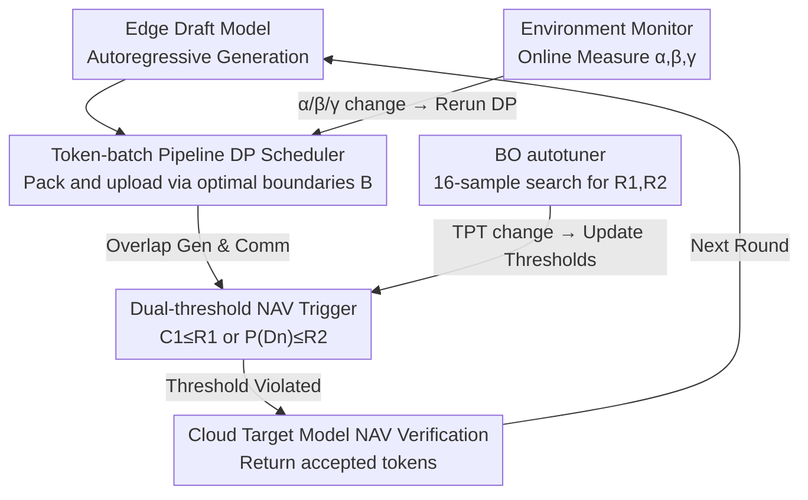

# PipeSD: An Efficient Cloud-Edge Collaborative Pipeline Inference Framework with Speculative Decoding

**Conference**: ICML 2026  
**arXiv**: [2605.13319](https://arxiv.org/abs/2605.13319)  
**Code**: [anonymous.4open.science/r/PipeSD](https://anonymous.4open.science/r/PipeSD)  
**Area**: LLM Inference Systems / Cloud-Edge Collaboration / Speculative Decoding  
**Keywords**: Speculative Decoding, Cloud-Edge, Pipeline Scheduling, Bayesian Optimization, Dynamic Programming

## TL;DR
This paper proposes PipeSD: a framework that transforms speculative decoding from sequential execution into a token-batch pipeline. It replaces fixed draft lengths with dual-threshold NAV (Next-token Adaptive Validation) triggers and Bayesian Optimization for automatic parameter tuning. On a real-world cloud-edge testbed with 5G bandwidth, it achieves $1.16\times–2.16\times$ speedup and $14–25\%$ reduction in cloud energy consumption.

## Background & Motivation
**Background**: The bottleneck of LLM inference lies in the serial dependency of autoregressive generation. Speculative decoding (SD) breaks this by using a "small draft model to generate $N$ tokens $\rightarrow$ large target model for one-time NAV verification." Cloud-edge collaborative deployment is a natural fit: the draft model resides on the edge for energy efficiency and privacy, while the target model leverages powerful cloud compute. Existing frameworks include HSL, HAT, and SpecEdge.

**Limitations of Prior Work**: (1) Existing frameworks follow a sequential pipeline of "generate all drafts $\rightarrow$ upload as a whole $\rightarrow$ NAV," causing idle time for both edge (waiting for NAV feedback) and cloud (waiting for draft uploads). (2) NAV triggers either use fixed draft lengths (e.g., $N=6$ in HSL) or single confidence signals (e.g., single token confidence in HSL, cumulative sequence confidence in EdgeLLM), which fail to jointly reflect token difficulty—leading to either premature triggers that waste compute or late triggers causing massive rollbacks.

**Key Challenge**: The communication startup overhead $\alpha$ is significant; thus, an extreme pipeline (sending every token immediately) is slower than batch transmission. However, pure sequential execution wastes time. The challenge is to find the optimal batching strategy for clusters of tokens. Simultaneously, NAV triggers must monitor both the "reliability of the entire segment" (sequence confidence) and "individual token anomaly" (single-token confidence), as single signals are inherently biased.

**Goal**: (1) Formalize the token generation-communication pipeline and solve for optimal batch boundaries; (2) Implement a dual-threshold NAV trigger accounting for both sequence and token signals; (3) Automatically tune thresholds at the edge to adapt to dynamic network and compute conditions.

**Key Insight**: Communication startup cost $\alpha$, per-token transmission time $\beta$, and per-token compute time $\gamma$ can be measured online. The scheduling problem is a classic DAG scheduling task solvable via DP in $O(\hat N^2)$ time. Although the impact of thresholds on Time Per Token (TPT) is non-analytical, sampling is cheap, allowing Bayesian Optimization (BO) to approach the optimum within 16 samples.

**Core Idea**: By combining "DP-optimal token-batch pipelining + Dual-threshold NAV + BO autotuning," the framework pushes cloud-edge speculative decoding efficiency toward the Pareto front.

## Method

### Overall Architecture
PipeSD resolves the bidirectional idling in cloud-edge speculative decoding. A speculative round operates as follows: the edge draft model performs autoregressive generation while the Token-batch Pipeline Scheduler packs and uploads tokens according to DP-calculated boundaries $\mathbb B=(b_1,\dots,b_K)$ to overlap transmission with generation. Simultaneously, the Dual-threshold NAV Trigger monitors single-token and cumulative sequence confidence, initiating NAV if either crosses a threshold. The cloud target model validates and returns accepted/rejected tokens. All adaptive logic resides at the edge: the Environment Monitor captures $(\alpha,\beta,\gamma)$ to trigger DP recalculations, and the BO autotuner periodically updates trigger thresholds. The system is implemented using llama-cpp-python (edge) + PyTorch + FastAPI (cloud).

### Key Designs

**1. DP-Optimal Token-batch Pipeline: Finding optimal batch boundaries when communication startup overhead is non-negligible.**

The trade-off is clear: waiting for completion (edge idle) vs. immediate per-token transmission (startup overhead $\alpha$) are both suboptimal. PipeSD formalizes this as DAG scheduling. For batch $k$, communication duration is $t_c^{(k)}=\alpha+\beta\cdot(b_{k+1}-b_k)$, generation duration is $t_{ag}^{(k)}=\gamma\cdot(b_{k+1}-b_k)$. Communication for a batch must wait for both the previous transmission and its own generation to finish: $\tau_c^{(k)}=\max\{\tau_c^{(k-1)}+t_c^{(k-1)},\tau_{ag}^{(k)}+t_{ag}^{(k)}\}$. The objective is $\min T=\tau_c^{(K)}+t_c^{(K)}-\tau_{ag}^{(1)}$. Algorithm 1 uses $dp[j]$ to denote optimal duration for the first $j$ tokens, iterating over previous batch start $i<j$:

$$dp[j]=\min_{i<j}\big\{\max(dp[i],\,\gamma j)+\alpha+\beta(j-i)\big\},$$

Backtracking yields the boundaries $\mathbb B$. With complexity $O(\hat N^2)$, this is proven globally optimal (Theorem 4.1). It outperforms naive batching by accounting for amortized $\alpha$ and the overlap between generation and communication windows.

**2. Dual-threshold NAV Trigger: Complementing sequence signals with single-token signals.**

Single signal triggers are biased. Relying only on single-token confidence $P(D_n)$ (like HSL) may lead to over-generation when every token is "moderately" confident. Relying only on cumulative confidence (like EdgeLLM) allows single-point failures to be masked by the average, delaying detection. PipeSD maintains both cumulative sequence confidence $C_1=\prod_{n}P(D_n)$ (product of probabilities for unverified tokens) and single-token confidence $P(D_n)$. For every new token, it evaluates $C_1^*=C_1\cdot P(D_n)$. NAV is triggered if $C_1^*\le R_1$ or $P(D_n)\le R_2$, after which $C_1$ is reset to 1. This dual-track approach covers both "segment unreliability" and "token anomaly."

**3. BO Autotuning + Dynamic Scheduling Window: Edge-side online adaptation.**

The mapping from thresholds to TPT is non-analytical and drifts with task difficulty or network jitter. The BO autotuner targets minimal average TPT, sampling $(R_1, R_2, \text{TPT})$ triplets and using Gaussian Processes to predict the next query point. It approaches optimality within 16 samples—more efficient than grid or random search. DP is rerun when $(\alpha, \beta, \gamma)$ change, while BO is rerun when TPT changes significantly. The scheduling window $\hat N$ uses a sliding average of the last 100 draft lengths (initially 20). When NAV is triggered, unsent tokens are immediately batched and sent, while generation for the next window continues during the NAV wait time.

### Loss & Training
PipeSD is a pure inference framework with no training loss. Key parameters are determined online: DP inputs $(\hat N,\alpha,\beta,\gamma)$ are measured by the Environment Monitor; the BO autotuner searches $(R_1, R_2)$ in the $(0, 1)$ interval. Empirical results show mean draft lengths of $\sim 6$ for programming tasks and $\sim 4$ for math.

## Key Experimental Results

### Main Results
Evaluated across 4 scenarios (Scenario 1: Laptop + 20/200Mbps; Scenario 2/3: Mobile/IoT compute 2.5/1.2 GHz; Scenario 4: Dynamic bandwidth 10–80 Mbps), 2 model pairs (DeepSeek-Coder 1.3B $\rightarrow$ 6.7B, TinyLlama 1.1B $\rightarrow$ Llama-2 7B), and 2 datasets (HumanEval, GSM8K).

| Scenario | Dataset | Vanilla TPT (ms) | HSL | EdgeLLM | PipeSD | Gain vs Vanilla |
| :--- | :--- | :--- | :--- | :--- | :--- | :--- |
| 1 | HumanEval | 194 | 155 | 153 | 129 | 1.50× |
| 1 | GSM8K | 193 | 174 | 169 | 145 | 1.33× |
| 3 (IoT) | HumanEval | 306 | 244 | 201 | 152 | 2.01× |
| 3 (IoT) | GSM8K | 402 | 296 | 231 | 186 | 2.16× |
| 4 (Dynamic) | HumanEval | 160 | 132 | 127 | 108 | 1.48× |

Cloud Energy Consumption (Scenario 1, per 100 accepted tokens):

| Dataset | Vanilla (J) | HSL | EdgeLLM | PipeSD | Gain vs EdgeLLM |
| :--- | :--- | :--- | :--- | :--- | :--- |
| HumanEval | 68 | 71 | 75 | 56 | 25.3% |
| GSM8K | 98 | 102 | 100 | 84 | 16.0% |

### Ablation Study
**BO Tuning Comparison (Scenario 1, TPT ms):**

| Strategy | HumanEval | GSM8K |
| :--- | :--- | :--- |
| BO Autotuner | 129 | 145 |
| Grid Search | 139 | 155 |
| Random Search | 148 | 162 |

**Bandwidth Sensitivity (HumanEval Scenario 1, PipeSD vs Vanilla):** 10 Mbps: $1.32\times$, 20 Mbps: $1.47\times$, 40 Mbps: $1.45\times$, 80 Mbps: $1.34\times$. Beyond 80 Mbps, communication ceases to be the bottleneck, and speedup saturates.

### Key Findings
- Weaker compute (IoT scenario) yields higher speedups ($2.16\times$), confirming that the pipeline primarily benefits from hiding communication—the slower the edge, the larger the communication window that generation can cover.
- DP overhead is $<0.013\%$ of total time, effectively free.
- The dual-threshold mechanism is the primary contributor to energy savings: it reduces invalid NAV requests (reducing cloud target model execution), leading to energy reductions that outpace TPT gains.

## Highlights & Insights
- **Reconceptualizing Cloud-Edge SD as a Scheduling Problem**: Unlike prior works that patch specific issues (e.g., HSL on triggers, HAT on precision constraints), PipeSD provides a complete system-level abstraction via DP pipelining and BO adaptation.
- **Precise yet Lightweight DP**: Efficient enough for online use ($O(\hat N^2)$ with $\hat N \sim 20$). This "cheap exact algorithm + online monitoring" pattern is ideal for system optimization with drifting parameters.
- **Transferability of Dual-thresholds**: The "cumulative score + instant score" logic is applicable to any early-stopping or triggering problem, such as Chain-of-Thought stopping or long-sequence retrieval truncation.
- **BO as a System Component**: Using BO as a generic edge "thresholder" is lighter than RL-based controllers and requires zero cold-start for new deployments.

## Limitations & Future Work
- Implementation is limited to single draft-target pairs and single clients; heterogeneous batching across multiple clients would require a re-derivation of the DP formula.
- BO targets global average TPT, but acceptance rates vary wildly by task (e.g., code vs. math); per-task thresholds or multi-task BO might be necessary.
- Actual edge power consumption (battery drain) from frequent BO/DP execution on CPUs remains to be verified.
- Privacy concerns: The dual-threshold mechanism exposes per-token confidence of the draft model, which could potentially serve as a side-channel for inferring private data.

## Related Work & Insights
- **vs. HSL (hao2024)**: HSL uses single token-confidence triggers and fixed draft lengths without pipelining; PipeSD is $1.61\times$ faster in Scenario 3.
- **vs. EdgeLLM (xu2025)**: EdgeLLM uses cumulative sequence confidence and parallel generation during NAV; PipeSD adds token-level thresholds and DP-optimal batching, reducing energy by $16–25\%$.
- **vs. HAT, SpecEdge**: These focus on precision and multi-edge collaboration respectively; PipeSD's scheduling logic is orthogonal and can be combined with them.
- **vs. Medusa, EAGLE (Cloud SD)**: These improve the acceptance rate of the draft heads. PipeSD improves deployment and triggering and is complementary.

## Rating
- Novelty: ⭐⭐⭐⭐ First comprehensive Pareto framework for cloud-edge SD combining DP pipelining and BO.
- Experimental Thoroughness: ⭐⭐⭐⭐ Real-world testbeds, multiple scenarios, bandwidth scans, and energy analysis.
- Writing Quality: ⭐⭐⭐⭐ Consistent flow from bottleneck analysis to DP derivation and implementation.
- Value: ⭐⭐⭐⭐ Highly reusable framework for cloud-edge collaborative inference in the 5G era.

<!-- RELATED:START -->

## Related Papers

- [\[AAAI 2026\] PRISM: Privacy-Aware Routing for Adaptive Cloud-Edge LLM Inference via Semantic Sketch Collaboration](../../AAAI2026/llm_safety/prism_privacy-aware_routing_for_adaptive_cloud-edge_llm_inference_via_semantic_s.md)
- [\[ACL 2026\] Fast-MIA: Efficient and Scalable Membership Inference for LLMs](../../ACL2026/llm_safety/fast-mia_efficient_and_scalable_membership_inference_for_llms.md)
- [\[ICML 2026\] dgMARK: Decoding-Guided Watermarking for Diffusion Language Models](dgmark_decoding-guided_watermarking_for_diffusion_language_models.md)
- [\[ICML 2026\] Efficient DP-SGD for LLMs with Randomized Clipping](efficient_dp-sgd_for_llms_with_randomized_clipping.md)
- [\[ICML 2026\] COFT: Counterfactual-Conformal Decoding for Fair Chain-of-Thought Reasoning in Large Language Models](coft_counterfactual-conformal_decoding_for_fair_chain-of-thought_reasoning_in_la.md)

<!-- RELATED:END -->
