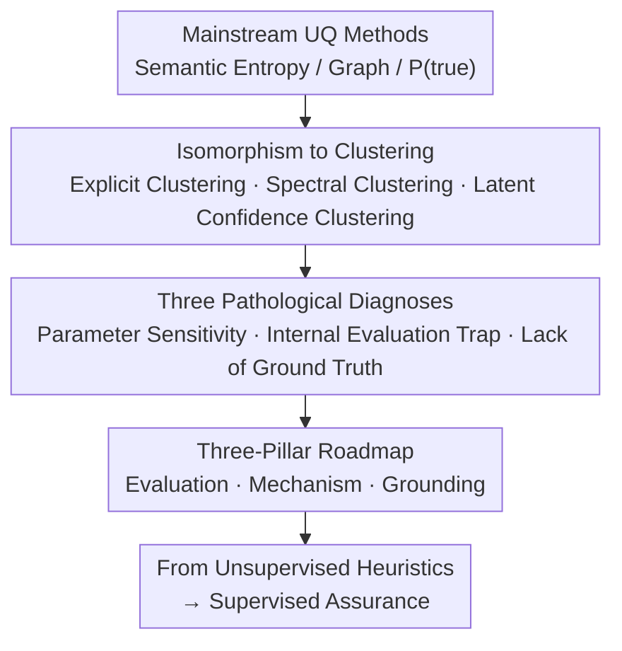

# Position: Uncertainty Quantification in LLMs is Just Unsupervised Clustering

**Conference**: ICML 2026  
**arXiv**: [2605.19220](https://arxiv.org/abs/2605.19220)  
**Code**: None (position paper)  
**Area**: LLM Safety / Uncertainty Quantification  
**Keywords**: Position Paper, Uncertainty Quantification, Confident Hallucination, Clustering Paradigm, External Ground Truth

## TL;DR
This position paper asserts a core thesis: current mainstream Uncertainty Quantification (UQ) methods for LLMs (such as Semantic Entropy, graph-based methods, and P(true)) are mechanistically isomorphic to unsupervised clustering. They measure "internal consistency of model generations" rather than "external correctness," making them inherently prone to failure in the face of "confident hallucinations." The authors diagnose three major pathologies—parameter sensitivity, internal evaluation loops, and lack of ground truth—and propose a roadmap towards "supervised assurance" built on three pillars: evaluation, mechanism, and grounding.

## Background & Motivation

**Background**: The primary obstacle to deploying LLMs in high-risk domains (e.g., medical, legal) is hallucination. The industry's main safety net is UQ: assigning an uncertainty score to each query+answer pair and triggering a refusal threshold. Current technical routes roughly fall into three categories: entropy-based (Semantic Entropy and variants like SAE/SEN/KLE/SNNE/SDLG), graph-based (SGC/GU/SGD/SeSE/GENUINE/U-EigV), and verbalized self-assessment (P(true)/CIn/SelfCheckGPT/UaIT).

**Limitations of Prior Work**: Despite the increasing volume of UQ research, models continue to "confidently spout nonsense." While metrics like AUROC appear promising, systems still leak critical errors in real-world scenarios, fostering a false sense of security for users.

**Key Challenge**: The authors diagnose this as a **category error**. All mainstream UQ methods measure "how stable the model's generations are relative to each other" rather than "how close the answer is to external facts." When a model is highly consistent in generating an incorrect answer (confident hallucination), these methods yield "high confidence," completely defeating the safety objective.

**Goal**: (i) To prove that mainstream UQ methods are mechanistically isomorphic to unsupervised clustering; (ii) To reveal three pathologies arising from this isomorphism: parameter sensitivity, internal evaluation loops, and lack of ground truth; (iii) To provide a roadmap based on three pillars—evaluation, mechanism, and grounding—to shift UQ from "unsupervised heuristics" to "supervised assurance."

**Key Insight**: The paper deconstructs the mathematical structures of SE, graph-based, and P(true) methods through the lens of "Is it clustering?" By drawing on classical lessons from clustering research—where internal validity indices cannot guarantee semantic correctness—the fundamental flaws of UQ are exposed within a unified framework.

**Core Idea**: UQ $\neq$ measuring "truth/falsehood"; UQ = measuring the "geometric/semantic separation among model generations." This is unsupervised clustering, which lacks external anchors. The only way forward is to introduce external ground truth and supervised mechanisms.

## Method

### Overall Architecture
This position paper argues that all mainstream UQ methods are merely rebranded unsupervised clustering. They measure "how separated model generations are from each other" rather than "how close the answer is to external facts," leading to inevitable failure against confident hallucinations. Rather than proposing a new method, the paper constructs a "diagnosis $\to$ prescription" chain: first reducing SE, graph-based, and P(true) methods to the same clustering operation mathematically; then deriving three pathologies—parameter sensitivity, internal evaluation loops, and lack of ground truth—from this isomorphism; and finally providing a three-pillar transformation blueprint for evaluation, mechanism, and grounding to move UQ toward supervised assurance.

### Key Designs

**1. Isomorphism of Mainstream UQ Methods to Clustering: One Proof to Refute All**

This is the foundation of the argument: once SE, graph-based methods, and P(true) are confirmed to be essentially the same, there is no need to dismantle them individually. **Semantic Entropy is explicit clustering**: it uses an NLI model to partition the sampled response set $\mathcal{S}=\{s_1,\dots,s_m\}$ into semantic equivalence classes $C_1,\dots,C_M$, and calculates the entropy of the class distribution $U_{\text{SE}}(C\mid x)=-\sum_{i=1}^M p(C_i\mid x)\log p(C_i\mid x)$, where the NLI model acts as the "clustering criterion" and entropy as "cluster purity." **Graph methods are implicit spectral clustering**: they construct a weighted graph $W$ using pairwise similarity $w_{j_1,j_2}=(a_{j_1,j_2}+a_{j_2,j_1})/2$, compute the normalized Laplacian $L=I-D^{-1/2}WD^{-1/2}$, and use $U_{\text{EigV}}=\sum_{k=1}^m\max(0,1-\lambda_k)$ to count "effective semantic modes." This is spectral clustering without explicit label assignment, equivalent to an "internal validity index." **P(true) is latent confidence clustering**: treating $U_{\text{P(true)}}(x,\hat{y})=1-P(\text{``True''}\mid x,\hat{y})$ as a membership test for the model's internal "high-confidence region." PCA visualizations using Qwen2.5-32B on QASC (Fig. 2) demonstrate that high-P(true) and low-P(true) samples are geometrically separated into two clusters in the hidden space, which is effectively a soft cluster assignment. The paper explicitly excludes token-level perplexity, Deep Ensembles, and supervised classifiers (Azaria & Mitchell 2023) from this framework—the first two due to poor performance, and the latter being the "supervised" direction the authors advocate.

**2. Three Pathological Diagnoses: Translating "Clustering Isomorphism" into Safety Risks**

The paper translates abstract isomorphism into three observable engineering consequences. First is the **parameter sensitivity crisis**: UQ scores are drastically affected by hyperparameters like temperature, NLI threshold, sample size $n$, and prompts. Tab. 1 shows that on QASC with Qwen2.5-32B, the Jaccard overlap between the Top-10% most uncertain samples for SE and EigV is only 0.134, and only 0.080 for SE and P(true). Second is the **internal evaluation trap**: AUROC defaults to assuming "internal stability = external truth," but confident hallucinations break this. The more stable an incorrect answer is, the higher its confidence score—a direct parallel to the "tight internal cohesion $\neq$ external meaning" problem in clustering's Silhouette coefficients. Third is the **lack of ground truth (judge problem)**: UQ relies on the correlation between AUROC and correctness. Correctness in open-ended tasks often depends on RougeL > 0.3 or another LLM judge, which are themselves noisy and biased. Fig. 3 shows that method rankings fluctuate as the correctness threshold $\tau$ shifts.

**3. Three-Pillar Roadmap: Evaluation $\to$ Mechanism $\to$ Grounding**

**Evaluation pillar**: Reframe UQ as a binary alert system (accept/reject), borrowing the MIA paradigm from Carlini et al. 2022—measuring TPR at a fixed FPR < 0.1% to target high-confidence hallucinations. It also proposes **AUSC (Area Under the Stability Curve)**, which sweeps AUROC across hyperparameters (e.g., temperature $T \in [0, 1]$), requiring stability across the entire parameter range rather than cherry-picked points. **Mechanism pillar**: Reposition **Conformal Prediction** as a downstream evaluation framework—comparing set sizes under fixed coverage (e.g., 90%); confident hallucinations are exposed via "set explosion." Additionally, perform **Uncertainty Alignment** during post-training (RLHF), rewarding models for explicitly outputting granular confidence markers like "I am confident that..." vs. "It is possible that...", turning uncertainty from an implicit geometric feature into an explicit linguistic signal. **Grounding pillar**: Mandate **Unit Testing** in programmatically verifiable scenarios (code like HumanEval or math with constant answers) before discussing open-ended tasks. This is supplemented by **Atomic Fact Verification**: decomposing generated text into atomic statements and verifying them via non-LLM judges such as search engines, KBs, formal solvers (Lean4), or multi-hop search agents to break the "LLM judging LLM" loop.

## Key Experimental Results

### Main Results
The paper does not propose a new method but uses empirical data to "falsify" the reliability of mainstream UQ paradigms.

| Evaluation Experiment | Data / Model | Key Results | Conclusion |
|----------|-------------|----------|------|
| Jaccard Overlap (Tab. 1) | QASC, Qwen2.5-32B | SE vs EigV Top-10% = 0.134; SE vs P(true) Top-10% = 0.080; EigV vs P(true) = 0.224 | Different methods disagree significantly on "what is uncertain." |
| P(true) Latent Visualization (Fig. 2) | QASC, Qwen2.5-32B | High-P(true) and low-P(true) samples geometrically separate into two clusters in PCA. | P(true) is essentially a membership test for latent space clustering. |
| Correctness Threshold Sensitivity (Fig. 3) | Adapted from Liu et al. 2025b | UQ method rankings invert repeatedly as $\tau$ changes. | "Judge instability" invalidates AUROC evaluation. |

### Ablation Study

| Argument | Supporting Evidence | Pathology $\to$ Prescription |
|------|----------|------------|
| Confident hallucination breaks consistency proxy | Simhi et al. 2025; Kalavasis et al. 2025 | Internal consistency $\to$ adoption of worst-case TPR. |
| Parameter sensitivity vs. robustness | Cecere et al. 2025 (Temp), Kuhn 2023 ($n$), Farquhar 2024 (NLI threshold) | Single-point reporting $\to$ adoption of AUSC. |
| RLHF induces "miscalibration" | Kadavath 2022, Achiam 2023 | Scaling does not solve it $\to$ Uncertainty Alignment + CP. |
| Open generation requires verifiable truth | Yao 2022 (code), Hendrycks (math) | Breaking the LLM-as-judge loop $\to$ Lean4 / Atomic Facts. |

### Key Findings
- **Methods cannot agree on uncertainty**: Low Jaccard overlap (0.08–0.22) suggests different methods measure different dimensions, lacking an external baseline for arbitration.
- **Geometric separation $\neq$ Factuality**: PCA of P(true) proves it measures "whether an output falls in the confidence cluster," which is unrelated to truth.
- **AUROC is diluted by easy samples**: High numbers of easy cases inflate AUROC, but only "high-confidence but incorrect" samples are dangerous; this necessitates MIA-style TPR@low-FPR.
- **RLHF exacerbates the issue**: Aligning with human preferences makes models more authoritative. Scaling does not fix calibration; it only makes hallucinations appear "more professional," magnifying clustering pathologies.

## Highlights & Insights
- **The "Category Error" label is sharp**: By categorizing UQ research as "unsupervised clustering," the paper provides a clear axis for future work (supervised vs. unsupervised calibration).
- **MIA analogy is high-quality migration**: Applying Carlini et al. 2022’s worst-case evaluation to UQ aligns with the general principle that high-risk systems should be evaluated using TPR at low FPR.
- **CP as an evaluator**: Using set size under fixed coverage is a clever way to force methods to externalize hallucinations as observable costs.
- **AUSC as a tool against p-hacking**: Requiring stability across hyperparameters could become a mandatory benchmark reporting standard.

## Limitations & Future Work
- **Lack of a complete new method or benchmark**: The roadmap is clear, but components like TPR@low-FPR and AUSC lack an end-to-end empirical demo showing how they change existing rankings.
- **Reliance on secondary evidence**: Some arguments (e.g., Fig. 3) are adapted from previous work, and Jaccard results are limited to one model/dataset pair.
- **Grounding difficulty**: Formal verification (Lean4/Atomic Facts) is costly in non-formal domains like medicine or law; scalability was not discussed.
- **Open-ended creative generation gap**: The paper acknowledges creativity but only offers atomic fact decomposition as a remedy, missing solutions for style-based uncertainty.

## Related Work & Insights
- **vs. Semantic Entropy (Kuhn et al. 2023)**: Ours does not deny SE's effectiveness on benchmarks but notes its failure against confident hallucinations; Insight: Stability metrics must first anchor to external truth.
- **vs. Graph Methods (Lin et al. 2023 etc.)**: Ours uses Laplacian spectrum equivalence to prove it is implicit clustering; Insight: Graph analysis in unsupervised contexts can only serve as a structural indicator.
- **vs. P(true) / SelfCheckGPT**: Refuted as "latent confidence cluster membership tests"; Insight: Self-evaluation is geometric distance querying, not fact checking.
- **vs. Conformal Prediction (Quach 2023, Su 2024)**: This paper repurposes CP from "set generation" to "a truth-aware ruler for evaluating UQ."
- **vs. MIA Evaluation (Carlini et al. 2022)**: A cross-domain analogy suggesting "looking at the tail, not the average" as a general norm for ML safety.

<!-- RELATED:START -->

## Related Papers

- [\[ACL 2026\] AGSC: Adaptive Granularity and Semantic Clustering for Uncertainty Quantification in Long-text Generation](../../ACL2026/llm_safety/agsc_adaptive_granularity_and_semantic_clustering_for_uncertainty_quantification.md)
- [\[ICML 2026\] LLM Benchmark Datasets Should Be Contamination-Resistant (Position Paper)](llm_benchmark_datasets_should_be_contamination-resistant.md)
- [\[ICML 2026\] TCAP: Tri-Component Attention Profiling for Unsupervised Backdoor Detection in MLLM Fine-Tuning](tcap_tri-component_attention_profiling_for_unsupervised_backdoor_detection_in_ml.md)
- [\[ACL 2026\] From Passive Metric to Active Signal: The Evolving Role of Uncertainty Quantification in Large Language Models](../../ACL2026/llm_safety/from_passive_metric_to_active_signal_the_evolving_role_of_uncertainty_quantifica.md)
- [\[ICML 2026\] SemGrad: Gradients w.r.t. Semantics-Preserving Embeddings Tell LLM Uncertainty](gradients_with_respect_to_semantics_preserving_embeddings_tell_the_uncertainty_o.md)

<!-- RELATED:END -->
