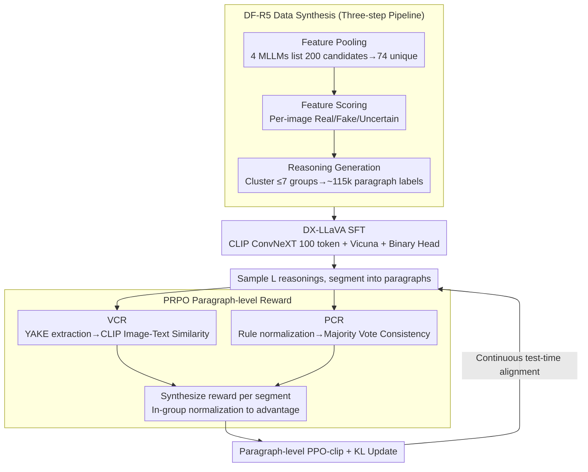

# PRPO: Paragraph-level Policy Optimization for Vision-Language Deepfake Detection

**Conference**: ICML 2026  
**arXiv**: [2509.26272](https://arxiv.org/abs/2509.26272)  
**Code**: https://github.com/tuanrpt/PRPO (Yes)  
**Area**: AI Safety / Multimodal VLM / Deepfake Detection / RLHF  
**Keywords**: deepfake detection, GRPO, paragraph-level reward, visual grounding, MLLM reasoning

## TL;DR
The authors constructed the DF-R5 dataset with 115k reasoning labels and introduced the DX-LLaVA architecture by replacing CLIP ViT with ConvNeXT. They proposed PRPO, a paragraph-level variant of GRPO, which uses Vision Consistency Reward (VCR) based on CLIP-text-image similarity and Prediction Consistency Reward (PCR) based on majority vote consensus for each paragraph. This approach improved cross-domain deepfake detection F1 from the SOTA 75.26% to 89.91% and reasoning quality from 4.2/5 to 4.55/5.

## Background & Motivation
**Background**: Deepfake images generated by diffusion models or GANs are nearly indistinguishable from real ones. While binary detectors (CLIP-ViT, ConvNeXT, frequency features) are powerful, they are entirely unexplainable. Multimodal Large Language Models (MLLMs) such as LLaVA, GPT-4o, and Gemini possess strong reasoning capabilities and can theoretically provide evidence for why an image is "fake," but their actual detection accuracy remains poor.

**Limitations of Prior Work**: (1) Data Scarcity — Existing deepfake datasets lack high-quality reasoning annotations; direct distillation from QA often results in superficial "short answer" predictions. (2) Architectural Issues — LLaVA uses CLIP ViT to capture global semantics, which is insensitive to crucial local high-frequency textures (hair, pores, background discontinuities) essential for deepfake detection. (3) Reasoning Quality — MLLMs frequently "reach conclusions before providing reasons," leading to a decoupling of conclusions from image evidence and even hallucinations of non-existent artifacts.

**Key Challenge**: Rewards in reinforcement learning (RL) algorithms like GRPO or PPO generally focus only on the final label. However, deepfake reasoning is a structured text consisting of "segmented descriptions of multiple fake clues + comprehensive conclusion." Token-level or sequence-level rewards fail to provide inter-paragraph consistency signals or force the model to align each segment with visual evidence.

**Goal**: (1) Create a large-scale dataset with high-quality paragraph-style reasoning annotations. (2) Use a backbone sensitive to local textures for supervised fine-tuning. (3) Design a paragraph-level RL mechanism to ensure continuous visual alignment and inter-paragraph consistency during reasoning, enabling self-improvement at test-time using label-free rewards.

**Key Insight**: Starting from the natural "reasoning is segmented" structure, each paragraph is treated as an independent trajectory unit in RL. Each segment is rewarded based on its visual alignment with the image (VCR) and its semantic consistency with the final conclusion (PCR), utilizing the group-relative advantage of GRPO for weighted learning.

**Core Idea**: Elevate the token-level advantage of GRPO to "paragraph-level." The reward for each paragraph is synthesized from image-text similarity calculated by a frozen CLIP-ConvNeXT and inter-paragraph majority vote consistency. This ensures that reasoning paragraphs must describe real evidence in the image while remaining self-consistent.

## Method

### Overall Architecture
The method enables an MLLM to perform high-precision deepfake detection while providing aligned visual evidence through three stages: data synthesis, backbone-swapped supervised fine-tuning, and paragraph-level RL for test-time self-alignment. Stage 1 (**DF-R5 Data Synthesis**) pools 200 candidate deepfake features using four MLLMs, uses Gemini to score each image, clusters these into $\le 7$ semantic groups, and generates 115k paragraph-style reasoning labels. Stage 2 (**DX-LLaVA SFT**) replaces LLaVA's CLIP ViT with CLIP ConvNeXT, which is more sensitive to local textures, and performs joint training with a binary classification head. Stage 3 (**PRPO Test-time RL**) samples $L$ complete reasonings per image, segments them, calculates rewards per paragraph, normalizes them into advantages within the group, and updates the policy via a PPO-clip variant.

### Key Designs

**1. DF-R5 Data Synthesis: A three-step pipeline for paragraph-level reasoning labels**

Existing datasets lack reasoning annotations. Directly distilling from QA leads to "Yes/No" short answers, and prompting MLLMs to generate reasons often results in hallucinated features. DF-R5 uses a controllable three-step pipeline: ① **Feature Pooling**—Without the image, Gemini-2.5, Qwen-2.5, LLaMA-3, and GPT-4o each list $\sim 50$ deepfake-related visual features, consolidated into 74 general features. ② **Feature Scoring**—For each image, Gemini evaluates these 74 features as Real (-1), Fake (+1), or Uncertain (0) to prevent random guessing; uncertain samples are corrected using ground-truth labels. ③ **Reasoning Generation**—Fine-grained scores are clustered into at most 7 semantic groups based on an 85% frequency threshold to generate concise, explainable reasoning. This result in $\sim 115k$ image-reasoning pairs. This process is more controllable and less prone to hallucination than direct whole-image distillation and naturally produces "segmented" structures for paragraph-level RL.

**2. DX-LLaVA: Replacing ViT with CLIP ConvNeXT for local textures + Binary Head**

The native CLIP ViT in LLaVA is good at global semantics (for VQA) but insensitive to local high-frequency deepfake artifacts (hair flow, pores, background discontinuity). DX-LLaVA replaces the visual backbone with CLIP ConvNeXT, which has a stronger inductive bias for textures. It takes the Stage-3 feature map ($10 \times 10$) and flattens it into 100 pixel embeddings, projecting 1536 dimensions into 4096 dimensions for Vicuna. Simultaneously, a binary classification head (GAP + linear layer) is attached and jointly trained using $\mathcal L_{\text{total}}=\mathcal L_{\text{lm}}+\alpha\mathcal L_{\text{binary}}$ ($\alpha=10$). ConvNeXT is frozen, while the projector, Vicuna, and the classification head are fine-tuned. Ablations show that the binary head increases inter-domain F1 from 35.82 to 61.66, and the ConvNeXT backbone further pushes it to 78.08.

**3. Visual Consistency Reward (VCR): Anchoring reasoning to visual evidence**

To address the issue of MLLMs generating conclusions before reasons or hallucinating artifacts, VCR assesses whether the described features actually exist in the image. Key phrases $s_j^{(i)}$ are extracted from paragraph $p_j^{(i)}$ using YAKE unsupervised keyword extraction, then fed into the frozen CLIP-ConvNeXT text encoder. Cosine similarity with the image encoder output is calculated and normalized to $[0,1]$: $R_{\text{VCR}}(p_j^{(i)})=\tfrac12[\text{sim}(\text{CLIP}_{\text{txt}}(s_j^{(i)}),\text{CLIP}_{\text{img}}(x))+1]$. Extracting keywords prevents the dilution of semantics compared to using the whole paragraph and focuses the signal on specific features. Reusing the ConvNeXT from the model itself serves as a "built-in" reward model, saving compute.

**4. Prediction Consistency Reward (PCR): Locking conclusions to evidence via majority vote**

PCR penalizes internal contradictions (e.g., providing "fake" evidence but concluding "real"). It normalizes each paragraph into a label $\hat y(p_j^{(i)})$ using three keyword lists: $\mathcal{F}$ (unnatural, inconsistent...) for fake, $\mathcal{R}$ (authentic, natural...) for real, and $\mathcal{N}$ (no, not...) for negation handling. Intermediate paragraphs are assumed to be consistent (reward = 1). Only the final paragraph is constrained by an indicator function $\mathbb I[\hat y(p_{M_i+1}^{(i)})=\hat y_{\text{maj}}^{(i)}]$, matching its label against the majority vote of preceding paragraphs. This self-consistency signal provides a label-free reward for test-time RL without needing external models.

**5. Paragraph-level GRPO Loss (PRPO): Directing advantage to each segment**

Token-level GRPO shares a single advantage across an entire reasoning sequence, meaning "good paragraphs" and "bad paragraphs" are rewarded or punished equally. PRPO raises granularity to the paragraph level: each paragraph calculates its own reward $R(p_j^{(i)})=\tfrac12(R_{\text{VCR}}+R_{\text{PCR}})$. Mean $\mu_R$ and variance $\sigma_R$ are calculated across all paragraphs in group $\mathcal{O}$ to normalize the advantage: $A_j^{(i)}=(R(p_j^{(i)})-\mu_R)/(\sigma_R+\epsilon)$. The policy ratio $r_j^{(i)}=\pi_\theta(p_j^{(i)}|v,z)/\pi_{\text{old}}(p_j^{(i)}|v,z)$ is used in the paragraph-level PPO-clip objective:

$$\mathcal L_{\text{PRPO}}=\mathbb E\sum_{i,j}\min(r_j^{(i)}A_j^{(i)},\text{clip}(r_j^{(i)},1-\epsilon,1+\epsilon)A_j^{(i)})$$

A paragraph-level KL term $\mathcal L_{\text{KL}}$ is added to align with a reference model, with the total objective $\max_\theta\mathcal J=\mathcal L_{\text{PRPO}}-\beta\mathcal L_{\text{KL}}$ ($\beta=0.01$). This ensures reward signals are precisely assigned to corresponding text segments.

### Loss & Training
During the SFT stage, the loss is $\mathcal L_{\text{total}}=\mathcal L_{\text{lm}}+\alpha\mathcal L_{\text{binary}}$ ($\alpha=10$). DX-LLaVA flattens CLIP ConvNeXT Stage-3 features into 100 tokens for the projector and Vicuna. In the PRPO stage, the objective is $\mathcal J=\mathcal L_{\text{PRPO}}-\beta \mathcal L_{\text{KL}}$ ($\beta=0.01$). Learning rates are $2\times 10^{-5}$ for SFT and $3\times 10^{-7}$ for PRPO. CLIP ConvNeXT is frozen throughout, and only the projector, Vicuna, and classification head are tuned. Training utilized 8 H200 GPUs and the verl framework.

## Key Experimental Results

### Main Results
Evaluated on DF-40 using leave-one-domain-out cross-domain testing (trained on 4 domains, tested on the 5th), F1:

| Method | →DDIM | →PixArt | →SD | →SiT | →StyleGAN | Average |
|------|------|--------|----|-----|-----------|------|
| LLaVA | 49.86 | 65.46 | 26.54 | 15.36 | 57.03 | 42.85 |
| DE-FAKE | 8.83 | 86.45 | 95.80 | 4.55 | 76.50 | 54.43 |
| FakeShield | 31.84 | 88.57 | 92.28 | 33.22 | 98.70 | 68.92 |
| UnivCLIP | 74.85 | 89.31 | 74.81 | 40.01 | 86.46 | 73.09 |
| SIDA | 70.07 | 73.86 | 92.37 | 46.53 | 94.98 | 75.26 |
| DX-LLaVA (Ours, SFT) | 92.34 | 83.11 | 89.35 | 26.46 | 99.13 | 78.08 |
| **PRPO (Ours, RL)** | **95.88** | **88.10** | **94.99** | **71.26** | **99.32** | **89.91** |

Average cross-domain F1 improved by 14.65 pp over SIDA, with a 24.7 pp leap (46.53→71.26) on the most difficult SiT domain.

### Ablation Study

| Configuration | F1 / Key Metrics | Description |
|------|--------------|------|
| LLaVA + $\mathcal L_{\text{lm}}$ | 35.82 (inter-domain) | High precision, low recall; model predicts real for almost all |
| LLaVA + $\mathcal L_{\text{lm}}+\alpha\mathcal L_{\text{binary}}$ | 61.66 | Binary head significantly enhances discrimination |
| With ConvNeXT backbone (DX-LLaVA) | 78.08 | Advantage of local textures |
| + PRPO | **89.91** | Paragraph RL further anchors reasoning to image |
| Reasoning Quality (Gemini judge) | 4.55/5 (PRPO) vs 4.20/5 (Gemini-2.5) | Surpassed the teacher model for the first time |

### Key Findings
- PRPO shows the largest gains on the most difficult SiT domain, indicating that paragraph-level rewards shift the model from "relying on backbone textures" to "systematic reasoning across multiple clues."
- SFT + ConvNeXT alone is insufficient—RL is required to jump from 78 to 89.
- PRPO uses purely label-free rewards (CLIP similarity + majority vote), yet yields massive downstream gains compared to traditional supervised baselines, proving the effectiveness of continuous test-time self-consistency.
- Reasoning quality (4.55) surpassed Gemini-2.5 (4.20), suggesting structured rewards improve explanation quality better than simple scaling.

## Highlights & Insights
- Shifting reward granularity from tokens to "Paragraph = a semantic unit" is a natural extension of RLHF/GRPO for long structured reasoning—transferable to legal documents, medical reports, or code review.
- VCR uses a frozen CLIP as a reward model, avoiding the cost and instability of training a separate reward model. PCR uses simple keyword dictionaries and majority voting, making the reward system "zero-cost" and test-time RL-friendly.
- Fine-tuning an open-source model like LLaVA with RL to outperform closed-source models like GPT-4o suggests that "appropriate reward structures + RL" are more cost-effective than simply increasing parameters for vertical tasks.

## Limitations & Future Work
- Evaluation only covered 5 generator domains; generalization to newer models (SD-3, Flux) or video deepfakes is unconfirmed.
- PCR relies on hand-crafted keyword dictionaries ($\mathcal{F}/\mathcal{R}/\mathcal{N}$), which may need redesign for different languages or forgery types; the majority vote rule might still grant rewards if all paragraphs are wrong.
- VCR uses CLIP-ConvNeXT as a judge, essentially using the detector as its own reward—this coupling may amplify the backbone's inherent biases (risk of reward hacking).
- Adversarial robustness and application to audio/video deepfakes were not discussed.

## Related Work & Insights
- **vs GRPO (Shao et al. 2024)**: GRPO performs group normalization on token-level advantages; PRPO raises granularity to paragraphs, better suited for long structured reasoning.
- **vs TTRL (Zuo et al. 2026) / self-certainty reward (Zhao et al. 2026)**: Both are label-free, but TTRL uses a global majority vote as a reward, whereas PRPO refines this to paragraphs and visual consistency.
- **vs SIDA / FakeShield**: Traditional deepfake detection focuses on binary classification and local features; PRPO enhances both accuracy and explainability via a "reasoning + reflection" structure.

## Rating
- Novelty: ⭐⭐⭐⭐ PRPO's paragraph-level granularity and label-free reward approach is a practical evolution of the GRPO family.
- Experimental Thoroughness: ⭐⭐⭐⭐ 5-domain leave-one-out, multiple MLLM baselines, reasoning quality scoring, and detailed ablations.
- Writing Quality: ⭐⭐⭐⭐ The three-stage pipeline is clear, with well-placed algorithms and formulas.
- Value: ⭐⭐⭐⭐ Provides a SOTA solution for explainable deepfake detection with high engineering reproducibility.

<!-- RELATED:START -->

## Related Papers

- [\[ICLR 2026\] Veritas: Generalizable Deepfake Detection via Pattern-Aware Reasoning](../../ICLR2026/llm_safety/veritas_generalizable_deepfake_detection_via_pattern-aware_reasoning.md)
- [\[ICLR 2026\] PURGE: Reinforcement Unlearning via Group Relative Policy Optimization](../../ICLR2026/llm_safety/reinforcement_unlearning_via_group_relative_policy_optimization.md)
- [\[ICML 2025\] Unlocking the Capabilities of Large Vision-Language Models for Generalizable and Explainable Deepfake Detection](../../ICML2025/llm_safety/unlocking_the_capabilities_of_large_vision-language_models_for_generalizable_and.md)
- [\[ICLR 2026\] wd1: Weighted Policy Optimization for Reasoning in Diffusion Language Models](../../ICLR2026/llm_safety/wd1_weighted_policy_optimization_for_reasoning_in_diffusion_language_models.md)
- [\[ICLR 2026\] Tree-based Dialogue Reinforced Policy Optimization for Red-Teaming Attacks (DialTree)](../../ICLR2026/llm_safety/tree-based_dialogue_reinforced_policy_optimization_for_red-teaming_attacks.md)

<!-- RELATED:END -->
