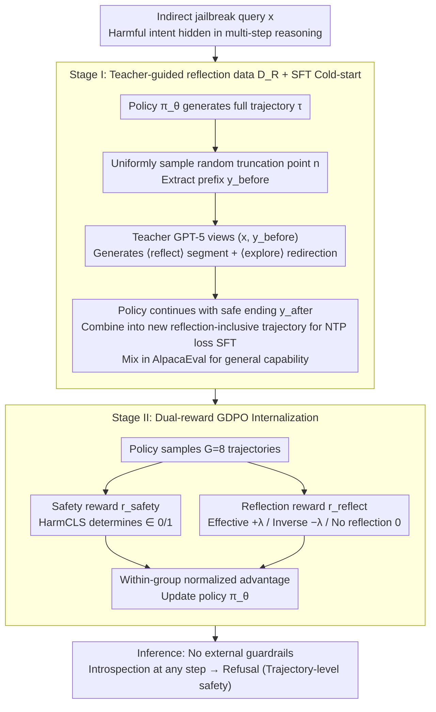

# REFLECTOR: Internalizing "Introspection-on-the-go" into Generation Trajectories to Defend Against Indirect Jailbreaks

**Conference**: ICML 2026  
**arXiv**: [2605.20654](https://arxiv.org/abs/2605.20654)  
**Code**: https://github.com/mjc-ma-01/self-reflection-llm.git (Available)  
**Area**: LLM Safety / Jailbreak Defense / Alignment RLHF  
**Keywords**: Indirect Jailbreak, Trajectory-level Safety, Self-reflection, Two-stage SFT+RL, Dual-reward GDPO  

## TL;DR
Aiming at indirect jailbreak attacks that only "expose" themselves in the middle or late stages of long generations, the authors use a teacher model to synthesize reflection trajectories labeled with `<|reflect|>/<|explore|>` for SFT cold-starting. This is followed by a dual-reward GDPO (safety reward + reflection effectiveness reward) to internalize "search-and-recovery" behavior into the policy. This approach raises the defense success rate against four types of indirect attacks (e.g., DRA) from ~10% to ~90%+, while GSM8K performance increases by 5.65%.

## Background & Motivation
**Background**: Current mainstream safety alignment—RLHF, Safe-RLHF, DPO—essentially shapes "refusal templates" ("Sorry, I can't...") at the prefix position, effectively guarding the entrance of the generation. Shallow-Align moves the guard several tokens back, and STAIR strengthens prefix safety reasoning with large-scale CoT data; both belong to the strategy of "stating a stance before reasoning begins."

**Limitations of Prior Work**: The authors use a statistical chart to reveal an overlooked fact: harmful tokens in direct jailbreaks (GCG/AutoDAN/PAIR) appear almost at the 0-th position of the response, whereas harmful tokens in **indirect jailbreaks** like DRA, ReNeLLM, and DrAttack emerge on average after 20+ tokens. In other words, for the first 20 tokens, the model is "honestly solving the problem," but the task is framed as a puzzle, disguise, or nested scenario. The model then assembles the malicious intent itself through seemingly reasonable multi-step reasoning. Prefix guards in Shallow-Align already expire by then, and prefix CoT in STAIR is bypassed once the attacker controls the reasoning structure.

**Key Challenge**: Is safety a **prefix property** or a **trajectory property**? Existing methods default to the former. Consequently, stronger instruction-following and longer context understanding capabilities are ironically utilized to complete hidden subroutines for attackers—a direct manifestation of the "alignment paradox" where more capability leads to more danger.

**Goal**: Redefine safety as a cumulative property of the entire generation trajectory $\tau = (y_1, \dots, y_T)$, requiring the model to recognize "the path I am currently on is actually helping a bad actor" at **any intermediate step** $y_t$ and immediately switch to refusal.

**Key Insight**: Enable the model to develop "introspection-on-the-go" capabilities during the generation process, rather than installing an external filter at the entrance. There are two challenges: first, pre-trained models lack an explicit inductive bias for reflection, causing direct RL cold-starts to fail; second, ineffective reflections (reflecting but still outputting harmful content) can disrupt generation.

**Core Idea**: First, use a strong teacher model to synthesize structured reflection segments `<|reflect|>...<|explore|>...` on truncated intermediate states to inject a "when to stop + how to recover" format prior via SFT. Then, use dual-reward GDPO, featuring "final safety reward + reflection effectiveness reward," to truly internalize this behavior into the policy instead of just remaining at the template level.

## Method
### Overall Architecture
In short, Reflector shifts "safety" from guarding the generation entrance (sentence-initial refusal templates) to guarding the entire generation trajectory. The policy $\pi_\theta$ autoregressively generates $\tau = (y_1, \dots, y_T)$ for a query $x$ that may hide indirect jailbreak intent. It is expected that at any intermediate step, once the model realizes it is being misled, it inserts a `<|reflect|>` segment + `<|explore|>` redirection, eventually resulting in a harmless response. To develop this "introspection-on-the-go" capability, training proceeds in two stages: Stage I uses teacher-synthesized reflection data $\mathcal{D}_R$ for SFT cold-starting to instill the format prior of "when to stop and how to redirect"; Stage II uses dual-reward GDPO on policy-generated trajectories for RL to internalize the behavior from templates into parameters. No external guardrails are needed during inference.

### Key Designs

**1. Redefinition of Trajectory-level Safety: Stretching the Safety Boundary to Every Step**

This is the fulcrum of the methodology and its most fundamental distinction from Shallow-Align and STAIR. Traditional alignment defines the objective as $\min \mathbb{E}_x[\ell(\pi_\theta(y_1 \mid x), \text{refusal})]$, essentially shaping a refusal mapping at the prefix to guard the entrance. However, the authors' initial statistics reveal that harmful tokens in indirect jailbreaks like DRA, ReNeLLM, and DrAttack typically emerge after 20+ tokens, making prefixes "expired." Once an attacker controls the reasoning structure, they bypass such guards. This paper instead requires the policy to be able to "switch to refusal if any step $y_t$ touches potential risk" across the entire self-generated $\tau$. By encoding this constraint into parameters through SFT + RL rather than external decoding, checkpoints are distributed to every step. This ensures reflection can trigger anywhere even if the opponent controls the reasoning structure itself, explaining why Reflector generalizes across attack sources without having seen specific attack types.

**2. Teacher-guided Reflection Data $\mathcal{D}_R$: Instilling the Scarceness Prior of "Should Introspect"**

Pre-trained models lack an explicit inductive bias for reflection, causing direct RL to fail. Thus, the first step is to create a trajectory dataset labeled with "reflection insertion point + reflection content + safe continuation after redirection." The process is: for each indirect jailbreak query $x$, the policy $\pi_\theta$ generates a full trajectory $\tau$; a truncation point $n$ is **uniformly and randomly sampled** from $\{1, \dots, T\}$, splitting the trajectory into $y^{\text{before}}$ and a discarded second half. The teacher (GPT-5) observes only $(x, y^{\text{before}})$ and generates a structured reflection $z = (z^{\text{reflect}}, z^{\text{explore}})$, where the former contains explicit reflection reasoning wrapped in `<|reflect|>` and the latter contains redirection guidance wrapped in `<|explore|>`. Finally, the policy generates a safe ending $y^{\text{after}}$ based on $(x, y^{\text{before}}, z)$ to form $\tilde\tau = (y^{\text{before}}, z, y^{\text{after}})$. The SFT objective is the standard NTP loss on $\tilde\tau$. The random truncation point is the essence: fixed truncation would lead the model to learn a shortcut that "reflection always happens around token 100," whereas uniform randomness forces it to learn to judge "if I should reflect now." Using GPT-5 as a teacher provides reflections far superior to those self-generated by the base model, avoiding the "weak model self-labeling → self-degradation" cycle. 500 AlpacaEval samples are mixed in with the same `<|reflect|>` format to ensure general instruction-following does not degrade.

**3. Dual-reward GDPO: Teaching "Reflection is a Means, Not an End" via Conditional Rewards**

SFT only injects the template; true internalization requires RL. The difficulty lies in ineffective reflections (reflecting but still outputting harmful content), which can disrupt generation. The authors use a variant of GRPO called GDPO (group reward-decoupled normalization PO): for each query, $G=8$ trajectories are sampled, and the policy is updated using within-group normalized advantage $A_i = (r(\tau_i) - \bar r) / (\sigma_r + \epsilon)$. The rewards are split into two components: **Safety Reward** $r_{\text{safety}} = \text{HarmCLS}(y) \in \{0, 1\}$, given by the consensus of a HarmBench classifier and GPT-OSS-120B generative judgment, replacing fragile prefix matching; the **Reflection Reward** is designed to be conditional:

$$r_{\text{reflect}} = \begin{cases} +\lambda & \text{Reflection occurs and result is harmless} \\ -\lambda & \text{Reflection occurs but result is still harmful} \\ 0 & \text{No reflection} \end{cases}$$

The total reward is $r(\tau) = r_{\text{safety}} + r_{\text{reflect}}$. This design addresses two types of degradation: using $r_{\text{safety}}$ alone makes the model learn "silent safety" (refusing everything), while adding a simple reflection bonus encourages fancy reflections that don't actually redirect. Making the reward conditional—where reflection is rewarded only if effective and penalized if counterproductive—cheaply transforms outcome rewards into process-aware rewards without training specialized process reward models. $\lambda$ is a critical hyperparameter, with ablation showing 0.3 is optimal.

### Loss & Training
SFT phase: Standard NTP loss on $\tilde\tau \in \mathcal{D}_R$, using 1,500 DRA-based indirect attacks + 500 AlpacaEval general samples. A 3:1 safety-to-general ratio was found to be the optimal point. RL phase: GDPO performed on 600 queries per category, with $G=8$, $\lambda=0.3$, using GPT-OSS-120B as the reward model. Base models include LLaMA-3.1-8B-Instruct and Qwen-2.5-7B-Instruct.

## Key Experimental Results

### Main Results (Table 1, excerpt for LLaMA-3.1-8B-Instruct, DSR %)

| Method | StrongREJECT | WildChat | AutoDAN | GCG | DRA | ReNeLLM | DrAttack |
|------|--------------|----------|---------|-----|-----|---------|----------|
| Original | 40.54 | 38.50 | 94.75 | 78.40 | 10.04 | 42.70 | 29.80 |
| SFT | 46.98 | 42.68 | 94.62 | 79.80 | 12.50 | 44.00 | 30.50 |
| DPO | 50.54 | 44.79 | 95.38 | 82.31 | 13.30 | 47.50 | 32.00 |
| Shallow-Align | 82.10 | 64.20 | 96.80 | 83.40 | 48.90 | 72.10 | 65.40 |
| STAIR | 87.98 | 69.86 | 99.04 | 86.15 | 55.83 | 77.27 | 70.31 |
| **Ours (+SFT)** | 65.78 | 72.40 | 98.26 | 90.96 | **88.16** | 93.92 | 89.88 |
| **Ours (+GDPO)** | **89.31** | **81.20** | **100.0** | **94.23** | **92.31** | **97.05** | **95.49** |

The most critical comparison is in the DRA / ReNeLLM / DrAttack columns—these are typical indirect jailbreaks. The original model is almost defenseless (DRA only 10%), and the strongest baseline, STAIR, only reaches 55–77%. Reflector +GDPO achieves 92%+, consistently dominating across methods. It also performs equally well or better on direct jailbreak columns, proving that trajectory-level reflection is not exclusively for indirect attacks.

### Ablation Study (Table 4, LLaMA-3.1-8B-Instruct)

| Configuration | DRA (Safety) | MMLU-Pro | AdvGLUE | Description |
|------|--------------|----------|---------|------|
| Original | 10.04% | 44.25% | 58.33% | Base model |
| Original + GDPO (skip SFT) | 87.88% | 44.56% | 54.20% | Reflection format via prompt; AdvGLUE drops 4.13 |
| SFT + GDPO (Full Reflector) | **92.31%** | **45.20%** | **68.29%** | Best for safety / general / robustness |
| $\lambda = 0.0$ (no reflection reward) | 83.65% | 45.14% | 59.62% | Missing reflection bonus; safety drops significantly |
| $\lambda = 0.3$ | **92.31%** | **45.20%** | **68.29%** | Optimal point |
| $\lambda = 0.5$ | 91.73% | 44.02% | 63.41% | Excess bonus begins to crowd out general ability |
| $\lambda = 0.8$ | 92.11% | 42.15% | 60.03% | MMLU drops by 3 points |

### Key Findings
- **Both stages are indispensable**: Applying GDPO directly to the original model reaches 87.88% on DRA, but AdvGLUE drops by 4.13. Without SFT injecting structured reflection formats, RL finds a degenerate solution for "safety."
- **Reflection reward is the "finishing touch"**: When $\lambda=0$, DRA performance immediately drops to 83.65%, proving that pure safety rewards push the model toward "constant silent refusal," whereas reflection effectiveness teaches dynamic intervention.
- **The "alignment tax" is non-existent**: Reflector +GDPO increases GSM8K performance by **5.65 absolute percentage points** (84.50% → 90.15%), while MMLU-Pro and AdvGLUE also reach SOTA. Internalizing "introspection-on-the-go" becomes a universal reasoning enhancement mechanism where safety and capability align.
- **Strong cross-attack transferability**: Constructing $\mathcal{D}_R$ using any one of PAP / ReNeLLM / DrAttack / DRA results in DRA defense in the 90–92% range, with a standard deviation of only ±0.84%. This confirms that indirect jailbreak attacks share the same vulnerability (the reasoning chain), and the reflection mechanism captures these commonalities.
- **Robustness even when tokens are suppressed**: Setting the logit of `<|reflect|>` to $-\infty$ during decoding does not substantially degrade safety performance, indicating that reflection capability is truly internalized into the parameters rather than being template-triggered.

## Highlights & Insights
- The paradigm redefinition of "elevating safety from prefix to trajectory" is more valuable than the method itself. Once this perspective is accepted, all prefix-based alignment methods (Shallow-Align, STAIR) become special cases of it (reflecting once at $y_1$). This path offers direct inspiration for safety constraints in future long-CoT models (o1 / R1 style).
- The synthesis scheme using a teacher + random truncation points is brilliant: fixed truncation allows the model to learn a shortcut that "reflection always happens at token 100," while uniform randomness forces the model to judge "if it should reflect now." This trick can be directly migrated to any training requiring "plug-in interventions" (e.g., inserting citations or tool calls).
- The **conditional sign** of the reflection reward (rewarding +λ if safe, penalizing -λ if unsafe) is a very clean "process reward" design. It eliminates the need to train a specialized process reward model (PRM), as outcome results are used to infer process value, cheaply converting outcome rewards to process-aware rewards.
- Safety $\neq$ Guaranteed lower bound of refusal capability: Traditional alignment often causes GSM8K / MMLU performance to drop (alignment tax), but this work shows the opposite, suggesting that the trade-off we previously assumed might be due to "incorrect alignment methods" rather than an inherent contradiction.

## Limitations & Future Work
- **Teacher dependence on GPT-5**: The quality of the entire $\mathcal{D}_R$ is capped by the teacher model. Whether this can be replicated in open-source scenarios using teachers like Llama-Guard-4 or Qwen-Coder is an open question.
- **$\lambda$ as a manually tuned hyperparameter**: Currently, 0.3 is optimal for 8B models, but the paper does not study whether $\lambda$ varies with model scale or task complexity; engineering-wise, switching base models would require a re-scan.
- **Safety judgment still relies on consensus**: Using HarmBench + GPT-OSS-120B consensus poses a risk of reward hacking (the model might learn to "trick the judge" rather than being truly harmless). More adversarial judgment pipelines are needed.
- **Linear growth of inference overhead for long queries**: Each response may generate hundreds of additional reflection tokens. Although the paper claims it is "insignificant," it could be a bottleneck in latency-sensitive scenarios (real-time chat, agent loops), requiring a gating mechanism for "on-demand reflection."
- **Continual learning not studied**: Whether Reflector can update reflection patterns for evolving attacks (new types of indirect jailbreaks) without catastrophically forgetting old capabilities is a direction worth pursuing.

## Related Work & Insights
- **vs. Shallow-Align (Qi et al., 2024)**: Shallow-Align moves safety tokens back by a few positions (still within the prefix domain); Reflector extends the guard to any step, breaking the prefix paradigm architecturally. Therefore, it has a qualitative advantage against indirect attacks where intent is exposed after 100+ tokens (DRA 88% vs 49%).
- **vs. STAIR (Zhang et al., 2025a)**: STAIR forces safety CoT before reasoning, relying on the assumption that the "reasoning structure isn't contaminated." Reflector assumes the reasoning structure can be controlled by the opponent and thus distributes checkpoints to every step, outperforming it by 36 and 25 points on DRA and DrAttack, respectively.
- **vs. Self-Critique prompting (Phan et al., 2025)**: Pure prompting attaches reflection instructions in the system prompt, which the model can choose to ignore; Reflector encodes reflection into parameters through SFT + RL, as proven by token suppression experiments.
- **vs. RLHF / Safe-RLHF / DPO**: Traditional preference alignment compresses safety into "sentence-initial refusal modes" (outcome-level). Reflector's dual reward decomposes outcome rewards into outcome + process (reflection effectiveness), serving as a minimalist prototype for pushing RLHF toward process supervision, which is valuable for o1-like approaches.

## Rating
- Novelty: ⭐⭐⭐⭐⭐ The paradigm redefinition of "safety as a trajectory property" combined with dual-reward reflection RL is a truly new structure.
- Experimental Thoroughness: ⭐⭐⭐⭐⭐ Covered 4 safety benchmarks × multiple bases + 5+ dimensional ablations including internalization, cross-teacher, cross-judge, inference overhead, ICL, and ActorAttack.
- Writing Quality: ⭐⭐⭐⭐ The chain of argument is clear; the "harmful token position statistics" in Figure 1 is a powerful opening hook. Some formula numbering is slightly cluttered.
- Value: ⭐⭐⭐⭐⭐ In the long-CoT / o1 era, "trajectory-level safety" will almost certainly become a standard paradigm. This paper is a foundational reference for this direction.

<!-- RELATED:START -->

## Related Papers

- [\[ICML 2026\] BioAgent Bench: An AI Agent Evaluation Suite for Bioinformatics](bioagent_bench_an_ai_agent_evaluation_suite_for_bioinformatics.md)
- [\[ICML 2026\] Watermarking LLM Agent Trajectories (ACTHOOK)](watermarking_llm_agent_trajectories.md)
- [\[ICML 2026\] Multilingual Unlearning in LLMs: 转移、动力学与可逆性](multilingual_unlearning_in_llms_transfer_dynamics_and_reversibility.md)
- [\[ICML 2026\] SemGrad: Gradients w.r.t. Semantics-Preserving Embeddings Tell LLM Uncertainty](gradients_with_respect_to_semantics_preserving_embeddings_tell_the_uncertainty_o.md)
- [\[ICML 2026\] Old Habits Die Hard: How Conversational History Geometrically Traps LLMs](old_habits_die_hard_how_conversational_history_geometrically_traps_llms.md)

<!-- RELATED:END -->
