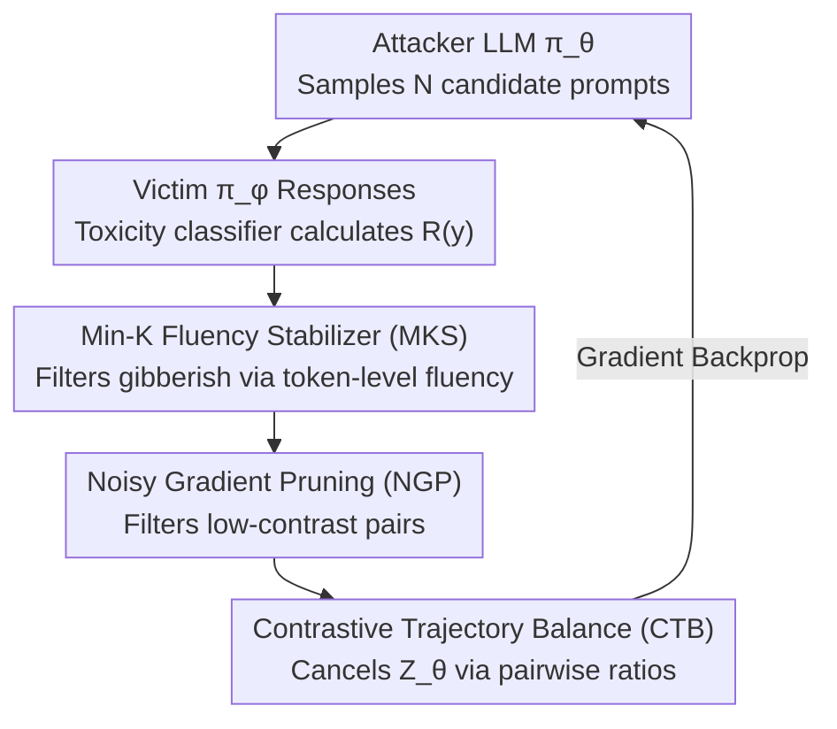

# Stable-GFlowNet: Toward Diverse and Robust LLM Red-Teaming via Contrastive Trajectory Balance

**Conference**: ICML 2026 Spotlight  
**arXiv**: [2605.00553](https://arxiv.org/abs/2605.00553)  
**Code**: No link publicly disclosed  
**Area**: LLM Safety / Red-Teaming / GFlowNet  
**Keywords**: Red-Teaming, GFlowNet, Trajectory Balance, Contrastive Objective, Noisy Gradient Pruning

## TL;DR
This paper identifies two major sources of instability in existing GFlowNet red-teaming: high variance from partition function $Z_\theta$ estimation and mode collapse induced by noisy rewards from toxicity classifiers on OOD gibberish text. By introducing three components—the pairwise contrastive objective CTB to eliminate $Z$, Noisy Gradient Pruning (NGP) to filter uninformative pairs, and the Min-K Fluency Stabilizer (MKS) to exclude gibberish—the proposed method increases the unique attack count from 17 to 134 (approx. 7×) on Qwen2.5-1.5B, while maintaining a 92% ASR and superior transferability across models and defenses compared to baselines.

## Background & Motivation

**Background**: LLM red-teaming aims to identify safety vulnerabilities before deployment. It is typically categorized into three approaches: (1) RL-based (PPO, PPO+Curiosity, Jailbreak-R1), which pursues reward maximization but suffers from severe mode collapse; (2) Quality-Diversity (Rainbow Teaming, Ruby Teaming), which relies on predefined style/topic matrices and evolutionary strategies for diversity but suffers from low attack success rates due to reliance on frozen LLM instruction following; (3) GFN-based (Lee et al. 2024), which treats red-teaming as distribution matching (sampling probability $\propto$ reward), theoretically achieving both high toxicity and diversity.

**Limitations of Prior Work**: Direct application of the Trajectory Balance (TB) objective to LLMs faces two major issues:
- The TB loss $\mathcal{L}_{TB}(y; \theta) = (\log Z_\theta + \log \pi_\theta(y) - \log R(y))^2$ requires learning a scalar $Z_\theta$ to estimate $Z \simeq \sum_{y \in \mathcal{Y}} R(y)$. In the combinatorial explosive token sequence space $\mathcal{Y}$ of LLMs, $Z_\theta$ is difficult to estimate accurately, leading to high-gradient variance and training instability or mode collapse.
- Red-team rewards come from toxicity classifiers, which assign pseudo-rewards (0.2~0.3) to gibberish-like OOD text. Once attackers discover such reward-hacking paths, they quickly collapse to local optima generating gibberish.

**Key Challenge**: While GFN’s lossless distribution matching property should guarantee diversity, the practical instability of $Z$ estimation causes TB to degrade into narrow distribution fitting similar to RL. Furthermore, standard KL-divergence regularization $R_{ref}(y) = \pi_{KL}(y)^\alpha \cdot R(y)^\beta$ used for fluency distorts the target distribution (biasing the sampled distribution toward the reference rather than the reward), conflicting with GFN theoretical assumptions.

**Goal**: (1) Design a GFN alternative objective that does not require $Z_\theta$ while maintaining an optimal solution equivalent to TB; (2) Implement a saliency-based filtering strategy for noisy rewards; (3) Prevent attackers from hacking into gibberish regions without distorting the target distribution.

**Key Insight**: The authors observe that by comparing the ratio of two trajectories $y_1, y_2$ from the same policy, the partition function $Z_\theta$ naturally cancels out—a standard motivation for contrastive objectives. Additionally, "reward noise" is essentially an issue of low-contrast pairs providing incorrect gradient signals during pairwise comparison, which can be addressed using a contrast-aware indicator as a hard filter. "Gibberish recurrence" can be mitigated by using Min-K probability as a fluency proxy with a hard threshold.

**Core Idea**: Stable-GFN combines Contrastive Trajectory Balance (CTB) to eliminate $Z_\theta$, Noisy Gradient Pruning (NGP) to filter pairs by reward contrast, and Min-K Fluency Stabilizer (MKS) to block gibberish.

## Method

### Overall Architecture

Stable-GFN treats red-teaming as a distribution matching problem where sampling probability is proportional to toxicity reward, but replaces two unstable GFN components (the learned $Z_\theta$ and noisy rewards) with three hard filters that do not increase forward pass overhead. A training step proceeds as follows: the attacker LLM $\pi_\theta$ samples $N$ candidate attack prompts $\{y_n\}$; the victim $\pi_\phi$ generates responses $z_n$ for each, and the toxicity classifier calculates $R(y_n) = \mathbb{E}_{z \sim \pi_\phi(\cdot|y)}[T(y, z)]$; MKS uses a reference model to calculate the Min-K fluency for each prompt and zeros out rewards for gibberish; NGP enumerates $N^2$ pairs within the batch and discards those with low reward contrast; the remaining pairs are used to update $\theta$ via the CTB loss. The pipeline avoids external scalars $Z_\theta$, does not maintain a QD archive, and avoids strong reference policy constraints.

### Key Designs

**1. Contrastive Trajectory Balance (CTB): Pairwise contrast to eliminate $Z_\theta$**

The original TB loss $(\log Z_\theta + \log \pi_\theta(y) - \log R(y))^2$ must learn a scalar $Z_\theta$ to estimate $Z \simeq \sum_y R(y)$. Given the state space of LLMs, this estimate has extreme variance, which is a primary driver of mode collapse. CTB resolves this by contrasting a pair of independent samples $y_1, y_2 \sim \pi_\theta$: $\mathcal{L}_{CTB}(y_1, y_2; \theta) = (\log \tfrac{\pi_\theta(y_1)}{\pi_\theta(y_2)} - \log \tfrac{R(y_1)}{R(y_2)})^2$. When dividing two trajectories, $Z_\theta$ cancels out, removing the need for estimation, similar to contrastive learning for normalizing constants.

Critically, eliminating $Z$ does not sacrifice the theoretical properties of distribution matching. Let $f(y) = \log \pi_\theta(y) - \log R(y)$. When $y_1, y_2$ are sampled i.i.d., this objective is equivalent in expectation to $2 \cdot \mathrm{Var}_{\pi_\theta}(f(y))$. Minimizing this to 0 implies $f$ is constant $C$ across the support, which, combined with normalization, yields $\pi_\theta(y) = R(y)/Z$—recovering the TB optimal solution (Theorem 4.1). In the gradient $\nabla_\theta \mathcal{L}_{CTB} = 2(f(y_1) - f(y_2))(\nabla_\theta f(y_1) - \nabla_\theta f(y_2))$, each sample acts as a stochastic baseline for the other, achieving variance reduction similar to RLOO/Williams. Computationally, $N^2$ pairwise losses can be calculated within an $N$-sized batch without extra forward passes.

**2. Noisy Gradient Pruning (NGP): Backpropagating gradients only for distinct reward pairs**

While CTB contrasts pairs, it also aggregates reward noise. When toxicity levels of two prompts are similar, the classifier differences are dominated by random noise, creating "zero information but non-zero noise" gradients. NGP applies a hard mask: $\mathcal{L}_{NGP}(y_1, y_2; \theta) = \mathbb{1}[|\log R(y_1) - \log R(y_2)| > \sigma] \cdot \mathcal{L}_{CTB}(y_1, y_2; \theta)$, where the saliency threshold $\sigma$ is a hyperparameter. 

Does filtering pairs destroy GFN convergence? This is formalized via graph connectivity: a saliency graph $G_\sigma = (\mathcal{Y}, E_\sigma)$ is constructed where edges represent pairs with contrast $> \sigma$. If $G_\sigma$ is connected, $\mathcal{L}_{NGP}(\theta) = 0$ remains equivalent to $\pi_\theta(y) \propto R(y)$ (Proposition 4.2). In practice, connectivity is maintained via a high-reward replay buffer acting as "global anchors," providing contrast across different reward regimes. This ensures gradients only stem from meaningful reward differences.

**3. Min-K Fluency Stabilizer (MKS): Surgical removal of gibberish without altering target distribution**

Toxicity classifiers often give pseudo-rewards to gibberish-like OOD text. Standard KL regularization $R_{ref}(y) = \pi_{KL}(y)^\alpha R(y)^\beta$ reshapes the reward toward the reference distribution, distorting the GFN target. MKS adopts a surgical approach using Min-K probability: it calculates the log-prob of each token in prompt $y$ using a reference model $\pi_{ref}$, takes the average of the **lowest** $k$ tokens $M_k(y) = \tfrac{1}{|K|}\sum_{w \in K} \log \pi_{ref}(y_w | y_{<w})$ as a fluency proxy, and defines $R_{MKS}(y) = \mathbb{1}[M_k(y) \ge T_{MKS}] \cdot R(y)$. Rewards for prompts below the threshold $T_{MKS}$ are zeroed out.

By targeting the "weakest link" rather than average perplexity, Min-K is more sensitive to partial gibberish. Since it serves as a hard cutoff within the reward function rather than a distribution reshaper, it maintains compatibility with GFN's distribution matching assumptions.

### Loss & Training

The total objective is $J_{CTB}(\theta) = \mathbb{E}_{y_1, y_2 \sim \pi_\theta}[\mathcal{L}_{NGP}(y_1, y_2; \theta)]$. Pairwise enumeration is performed in batches of $N = 1024$. The attacker is Qwen2.5-1.5B SFT (Safety-Dataset + AdvBench), the victim is Qwen2.5-1.5B-Instruct, and the toxicity classifier is Meta-Llama-Guard-3-8B. Diversity is measured via all-MiniLM-L6-v2 + greedy clustering (threshold 0.7), and rewards $>0.5$ contribute to ASR.

## Key Experimental Results

### Main Results

| Method | UA (#) | ASR (%) | Note |
|------|--------|---------|------|
| PPO | 3.00 | **91.70** | High ASR but extreme mode collapse |
| PPO + Curiosity | 4.00 | 36.75 | Still collapses |
| Rainbow Teaming | 33.00 | 66.11 | High QD diversity but low ASR |
| Jailbreak R1 (8B) | 75.33 | 7.36 | Diverse but low toxicity |
| GFN (TB) | 17.67 | 93.75 | High ASR but low UA |
| **S-GFN (Ours)** | **134.00** | 92.55 | Similar ASR, 7× UA improvement |

Cross-Attack Defense Transfer (Attacking GFN-defended victim):

| Attacker | GFN-defended victim ASR | Explanation |
|----------|---------|------|
| GFN | 4.69% | Own attack blocked by own defense |
| Jailbreak R1 | 2.96% | – |
| **S-GFN** | **22.53%** | Broader attack modes, stronger transfer |

### Ablation Study

| Configuration | UA (#) | ASR (%) | Note |
|------|--------|---------|------|
| GFN-TB + KL ref | 14 | – | Reference KL distorts distribution |
| GFN-TB + LogProb | 65 | – | Alternative regularization |
| GFN-TB + MKS | 67 | 85.8 | TB + Fluency cutoff |
| **GFN-CTB + MKS** | 108 | 82.9 | CTB increases UA by 60% |
| **GFN-CTB + MKS + NGP** | **121** | **92.2** | Full S-GFN, recovery of ASR |

### Key Findings

- **CTB > TB Core Contribution is Stability**: Replacing TB with CTB (keeping MKS) increases UA from 67 to 108, proving $Z_\theta$ estimation is a main cause of mode collapse.
- **NGP improves both UA and ASR**: Increasing UA to 121 and ASR to 92.2% suggests that filtering low-saliency pairs reduces noise and strengthens gradient signals.
- **Cross-Attack Asymmetry**: S-GFN attacks GFN-defended models at 22.53%, while GFN attacks S-GFN-defended models at only 0.03%. This asymmetry indicates S-GFN finds truly diverse attack modes rather than just a subset.
- **Transfer Attack to Unseen Victims**: S-GFN ranks first in both UA and ASR across Gemma3, Llama3.2, Qwen3, and GPT-OSS-20B, showing robustness relative to training-specific jailbreaks.
- **Necessity of MKS**: Without MKS, rewards drop to 0 due to gibberish hacking. Its addition enables the entire training process.

## Highlights & Insights

- The insight regarding "$Z_\theta$ estimation cancellation" is simple yet significant. CTB uses a ratio format familiar to contrastive learning to bypass the normalizing constant problem in GFNs.
- The "saliency graph connectivity" analysis for NGP is elegant, formalizing how many pairs can be pruned while maintaining convergence.
- Using Min-K probability for fluency is a clever borrow from membership inference literature, proving more effective than perplexity at detecting partial gibberish.
- Low implementation complexity: The three components are mostly hard filters or loss modifications that require zero additional forward passes.

## Limitations & Future Work

- $\sigma$ (NGP) and $T_{MKS}$ (MKS) are fixed hyperparameters; task-adaptive thresholds were not explored.
- Connectivity assumptions lack non-asymptotic convergence bounds; the replay buffer serves as an empirical anchor.
- Main experiments used Qwen2.5-1.5B; the escalation of CTP's variance reduction for larger models (e.g., 7B/13B) remains an open question.
- Integration with multi-stage iterative GFNs (Yun et al. 2025) was not explored.
- Ethical disclosure: While a high ASR/UA is achieved, the responsible disclosure process for discovered vulnerabilities was not detailed.

## Related Work & Insights

- **vs GFN-TB (Lee et al. 2024)**: Traditional TB learns $Z_\theta$ with high variance; CTB's pairwise ratio is more stable.
- **vs PPO + Curiosity (Hong et al. 2024)**: RL methods optimize a single point; S-GFN performs distribution matching, leading to much higher UA (134 vs 4).
- **vs Rainbow Teaming (Samvelyan et al. 2024)**: QD uses predefined styles; S-GFN uses reward signals to discover diversity end-to-end.
- **vs DPO**: DPO optimizes preference ranking rather than distribution matching, making it theoretically distinct despite the pairwise appearance.
- **vs DB / SubTB (Bengio et al. 2023)**: These avoid $Z$ but are token-level and difficult to scale to LLMs; CTB operates at the sequence level for efficiency.

## Rating
- Novelty: ⭐⭐⭐⭐ Pairwise contrastive approach to cancel $Z$ is a significant adaptation for LLM-scale GFNs.
- Experimental Thoroughness: ⭐⭐⭐⭐ Wide coverage of baselines, transferability, and ablations; lacks attacker scaling studies.
- Writing Quality: ⭐⭐⭐⭐ Clear motivation-theory-algorithm-experiment mapping.
- Value: ⭐⭐⭐⭐ Moves GFN toward practicality for red-teaming, providing a robust toolkit for the alignment safety community.

<!-- RELATED:START -->

## Related Papers

- [\[ACL 2026\] STAR-Teaming: A Strategy-Response Multiplex Network Approach to Automated LLM Red Teaming](../../ACL2026/llm_safety/star-teaming_a_strategy-response_multiplex_network_approach_to_automated_llm_red.md)
- [\[ACL 2026\] Red-Bandit: Test-Time Adaptation for LLM Red-Teaming via Bandit-Guided LoRA Experts](../../ACL2026/llm_safety/red-bandit_test-time_adaptation_for_llm_red-teaming_via_bandit-guided_lora_exper.md)
- [\[ICML 2026\] FoeGlass: Simple In-Context Learning Is Enough for Red Teaming Audio Deepfake Detectors](foeglass_simple_in-context_learning_is_enough_for_red_teaming_audio_deepfake_det.md)
- [\[ICLR 2026\] Tree-based Dialogue Reinforced Policy Optimization for Red-Teaming Attacks (DialTree)](../../ICLR2026/llm_safety/tree-based_dialogue_reinforced_policy_optimization_for_red-teaming_attacks.md)
- [\[ICML 2026\] MedMosaic: A Challenging Large Scale Benchmark of Diverse Medical Audio](medmosaic_a_challenging_large_scale_benchmark_of_diverse_medical_audio.md)

<!-- RELATED:END -->
