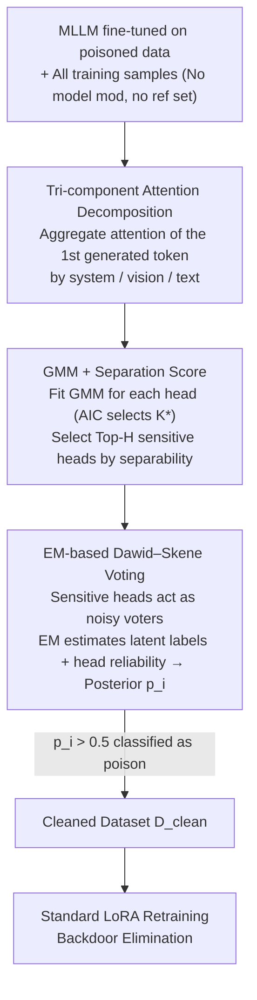

# TCAP: Tri-Component Attention Profiling for Unsupervised Backdoor Detection in MLLM Fine-Tuning

**Conference**: ICML 2026  
**arXiv**: [2601.21692](https://arxiv.org/abs/2601.21692)  
**Code**: https://github.com/m1ng2u/TCAP (Available)  
**Area**: AI Safety / Multi-modal Large Language Models / Backdoor Detection  
**Keywords**: Backdoor Defense, MLLM Fine-tuning, Attention Allocation, Gaussian Mixture Model, EM Voting

## TL;DR
Addressing the issue of poisoned fine-tuning in Multi-modal Large Language Models (MLLMs) within Fine-Tuning-as-a-Service (FTaaS) scenarios, this paper identifies a universal fingerprint: triggered samples cause an abnormal polarization of attention for the first generated token across focus components (system / vision / text). The proposed unsupervised TCAP framework uses a Gaussian Mixture Model (GMM) to identify trigger-responsive attention heads, followed by EM-based Dawid–Skene voting for aggregation. Experimental results across 5 trigger modes, 3 MLLMs, and 5 datasets show that TCAP reduces Attack Success Rate (ASR) from 90%+ to ~0% with negligible loss in Clean Performance.

## Background & Motivation
**Background**: MLLMs (e.g., InternVL, LLaVA, Qwen-VL) utilize FTaaS with LoRA/QLoRA for downstream adaptation, where users submit data and providers handle training. This "data as entry point" model creates a large attack surface for poison-only backdoor attacks, where contaminating only 10% of samples can implant backdoors that respond to specific triggers.

**Limitations of Prior Work**: Existing defenses often require clean reference sets, supervised signals, or external modules (input preprocessing, trigger inversion, model pruning), and many are limited to a single modality. The closest unsupervised solution, BYE, detects "visual attention collapse" via Shannon entropy, which is inherently effective only for **local patch triggers**. It fails against global triggers (Blend, SIG, WaNet, FTrojan) or text triggers; for instance, BYE's F1 score on LLaVA-NeXT + Blend + ScienceQA is 0.

**Key Challenge**: BYE assumes triggers cause visual attention to "concentrate" (low entropy). However, the authors prove that while the entropy upper bound for patch triggers is $\alpha_{\text{vis}}\log(|S_{\text{trig}}|/\alpha_{\text{vis}})$, the bound for global triggers is $\alpha_{\text{vis}}\log(T/\alpha_{\text{vis}})$. Since $|S_{\text{trig}}|\ll T$, global triggers approach maximum entropy, making entropy an ineffective metric for global or text triggers.

**Goal**: Identify an internal fingerprint **independent of trigger modality or form** to serve as an unsupervised detection signal covering visual patch, blend, sinusoidal, warping, frequency, text prefix, and syntactic triggers.

**Key Insight**: Instead of looking at distribution within the visual modality, the authors partition the MLLM input sequence into three functional components—system instructions (including role tags), vision tokens, and user text. They observe the total attention mass of the **first generated token** toward these components. The key insight is that system instructions are "anchors" that cannot be tampered with by attackers, serving as a noise-resistant baseline.

**Core Idea**: Triggers force a small number of deep attention heads to exhibit two types of complementary anomalies: Anomaly 1 (System suppression + Vision amplification) to extract trigger features and bypass security constraints, and Anomaly 2 (System amplification + Vision suppression) to maintain output structural coherence. This Attention Allocation Divergence is a universal, measurable internal fingerprint of backdoors.

## Method
### Overall Architecture
TCAP is a **pure data cleaning** framework. Given an MLLM fine-tuned on a poisoned dataset $\mathcal{D}$, the framework does not modify the model or require a clean reference set. It first performs inference on all training samples to extract tripartite attention (system/vision/text), uses a GMM to identify "sensitive heads" from the vast head pool, and then treats these heads as noisy annotators. Finally, it uses EM-based Dawid–Skene voting to aggregate the posterior probability of each sample being poisoned, removes suspicious samples to obtain $\mathcal{D}_{\text{clean}}$, and retrains the model once to eliminate the backdoor.

### Key Designs

**1. Tri-component Attention Decomposition: Shifting Fingerprints from Visual Entropy to Cross-Component Redistribution**

Previous works like BYE only monitor the spatial entropy of visual attention, failing for global/text triggers. TCAP changes the coordinate system by aggregating the attention of the first generated token toward all preceding tokens into a tripartite vector $\bm{\alpha}^{l,h}=(\alpha_{\text{sys}}^{l,h},\alpha_{\text{vis}}^{l,h},\alpha_{\text{txt}}^{l,h})$ for each (layer $l$, head $h$). Here, $\alpha_c^{l,h}=\sum_{i\in S_c}a_i^{l,h}$ represents the sum of attention mass on system, vision, or text tokens. This is a universal fingerprint because: (1) lifting detection to functional components naturally incorporates text triggers; (2) system instructions act as a fixed baseline; (3) backdoors take shortcuts in deep layers where cross-modal decisions are fused.

**2. GMM + Separation Score: Unsupervised Selection of Sensitive Heads**

Since poisoned samples only constitute about 10%, signals can be diluted by noise if all heads are averaged. TCAP collects system components $\{\alpha_{\text{sys},i}^{l,h}\}_{i=1}^M$ for each head and uses AIC to adaptively select the number of components $K\in\{1,...,5\}$ for a GMM. Instead of assuming a bimodal distribution, adaptive $K^*$ handles cases where the minority poison peak might be submerged. A Separation Score (SS) is defined as the inverse of the overlapping area between the suspected target group $\mathcal{G}_t$ and the background group $\mathcal{G}_b$:

$$\text{SS}^{l,h}=\Bigl(\int\min\bigl(\sum_{k\in\mathcal{G}_t}\pi_k\phi_k,\ \sum_{k\in\mathcal{G}_b}\pi_k\phi_k\bigr)dx+\epsilon\Bigr)^{-1}$$

Heads with the highest SS in the final $L_{\text{sens}}$ layers form the sensitive head set $\mathcal{H}_{\text{sens}}$.

**3. EM-based Dawid–Skene Voting: Fusing Heterogeneous Weak Detectors**

Sensitive heads are treated as noisy annotators. For sample $i$, if the GMM posterior probability of belonging to the target component exceeds a threshold $\tau_{\text{vote}}$, head $h$ votes $v_i^{l,h}=1$. The Dawid–Skene EM algorithm iteratively estimates the latent poison labels and the confusion matrix (reliability) of each head. This ensures that more accurate heads have a greater influence on the final posterior $p_i$. Samples with $p_i > 0.5$ are removed.

### Loss & Training
TCAP serves as a data preprocessor and does not introduce new loss functions. After cleaning, standard LoRA fine-tuning is performed on $\mathcal{D}_{\text{clean}}$. The study uses InternVL2.5-8B, LLaVA-NeXT-8B, and Qwen3-VL-8B with a 10% poisoning rate and "Backdoor Attack!" as the target output.

## Key Experimental Results

### Main Results
Clean Performance (CP) and Attack Success Rate (ASR) under Blend attack (Results for ScienceQA / DocVQA / SEED-Bench):

| Model | Method | ScienceQA CP/ASR | DocVQA CP/ASR | SEED-Bench CP/ASR |
|------|------|------------------|---------------|-------------------|
| InternVL2.5 | Vanilla FT | 96.88 / 93.60 | 57.17 / 91.16 | 77.83 / 94.10 |
| InternVL2.5 | BYE | 89.49 / 91.42 | 13.84 / 100.00 | 74.27 / 63.57 |
| InternVL2.5 | **TCAP** | **96.93 / 0.15** | **60.10 / 2.84** | **78.17 / 0.03** |
| LLaVA-NeXT | Vanilla FT | 89.19 / 96.03 | 31.66 / 100.00 | 72.13 / 96.27 |
| LLaVA-NeXT | BYE | 0.00 / 100.00 | 28.88 / 100.00 | 68.50 / 95.37 |
| LLaVA-NeXT | **TCAP** | **89.44 / 0.05** | **31.36 / 2.56** | **72.17 / 6.17** |

Detection F1 (Precision / Recall / F1) on ScienceQA (InternVL2.5):

| Attack | BYE F1 | TCAP F1 |
|------|--------|---------|
| BadNet (patch) | 97.87 | **100.00** |
| Blend (global) | 0.00 | **98.34** |
| SIG (sinusoidal) | 9.94 | **92.11** |
| FTrojan (freq) | 9.58 | **85.24** |

### Ablation Study
F1 under Blend attack:

| Configuration | InternVL2.5 | LLaVA-NeXT | Qwen3-VL |
|------|-------------|------------|----------|
| Full TCAP | 98.34 | 98.85 | 95.04 |
| w/o Head Selection | 43.02 | 22.31 | 15.33 |
| w/o Layer Filter | 67.21 | 31.94 | 11.02 |

### Key Findings
- **Head Selection is Critical**: Removing it drops F1 from 95–99 to 15–43, confirming that signal is concentrated in a few heads.
- **Layer Filter Importance**: Removing it drops F1 to 11–67, validating the assumption that backdoors manifest in deep decision-making layers.
- **Ineffectiveness of Entropy**: BYE fails completely on global triggers (F1=0) because entropy increases for global triggers, causing BYE to misclassify clean samples.
- **Modality Agnostic**: TCAP achieves F1=100 on text prefix triggers across all MLLMs and effectively reduces ASR for complex syntactic triggers (HiddenKiller).

## Highlights & Insights
- **From Entropy to Redistribution**: Proving why entropy fails for global/text triggers and proposing a tripartite mass redistribution provides a solid conceptual leap.
- **System Instructions as Anchors**: Using immutable components (system prompts) as a baseline is a highly transferable technique for LLM/MLLM security.
- **EM-based Head Fusion**: Treating heterogeneous heads as noisy annotators is an elegant approach that can be applied to any multi-detector ensemble.
- **Truly Unsupervised**: Requires no clean data, no labels, and no external models, making it highly suitable for FTaaS.

## Limitations & Future Work
- Sensitive head count and layer depth remain hyperparameters; adaptive mechanisms across architectures are not yet established.
- Newer models like Qwen3-VL show slightly higher residual ASR (15.62%), suggesting signals may be "thinned" in more advanced architectures.
- Evaluations are limited to a 10% poisoning rate and fixed target outputs; efficacy on low poisoning rates (<1%) or multi-target backdoors is unexplored.
- Detection is limited to training data cleaning and does not prevent inference-time attacks.
- High computational overhead for massive datasets due to the requirement of a forward pass for all training samples.

## Related Work & Insights
- **Comparison with BYE**: BYE focuses on spatial collapse via entropy (patch-only). TCAP uses cross-component divergence via tripartite mass and EM voting (modality-agnostic).
- **Comparison with SampDetox**: TCAP preserves Clean Performance better than input-preprocessing methods like diffusion denoising.
- **Transferable Heuristics**: (a) Monitoring first-token attention to system prompts for jailbreak/injection detection. (b) Using GMM+SS+EM as a general-purpose outlier detector for data quality or OOD scenarios.

## Rating
- Novelty: ⭐⭐⭐⭐ 
- Experimental Thoroughness: ⭐⭐⭐⭐ 
- Writing Quality: ⭐⭐⭐⭐ 
- Value: ⭐⭐⭐⭐

<!-- RELATED:START -->

- **BYE**: Backdoor Your Enigmatic Multi-modal LLM (2024)
- **Dawid–Skene**: Maximum Likelihood Estimation of Observer Error-Rates Using the EM Algorithm (1979)

<!-- RELATED:END -->

## Related Papers

- [\[ICML 2026\] Towards Fine-Grained Robustness: Attention-Guided Test-Time Prompt Tuning for Vision-Language Models](towards_fine-grained_robustness_attention-guided_test-time_prompt_tuning_for_vis.md)
- [\[ICML 2026\] Decoupled Training with Local Reinforcement Fine-Tuning in Federated Learning](decoupled_training_with_local_reinforcement_fine-tuning_in_federated_learning.md)
- [\[ICML 2026\] PFT: Phonon Fine-tuning for Machine Learned Interatomic Potentials](pft_phonon_fine-tuning_for_machine_learned_interatomic_potentials.md)
- [\[ICML 2026\] Position: Uncertainty Quantification in LLMs is Just Unsupervised Clustering](position_uncertainty_quantification_in_llms_is_just_unsupervised_clustering.md)
- [\[ICML 2026\] From Parameter Dynamics to Risk Scoring: Quantifying Sample-Level Safety Degradation in LLM Fine-tuning](from_parameter_dynamics_to_risk_scoring_quantifying_sample-level_safety_degradat.md)

<!-- RELATED:END -->
