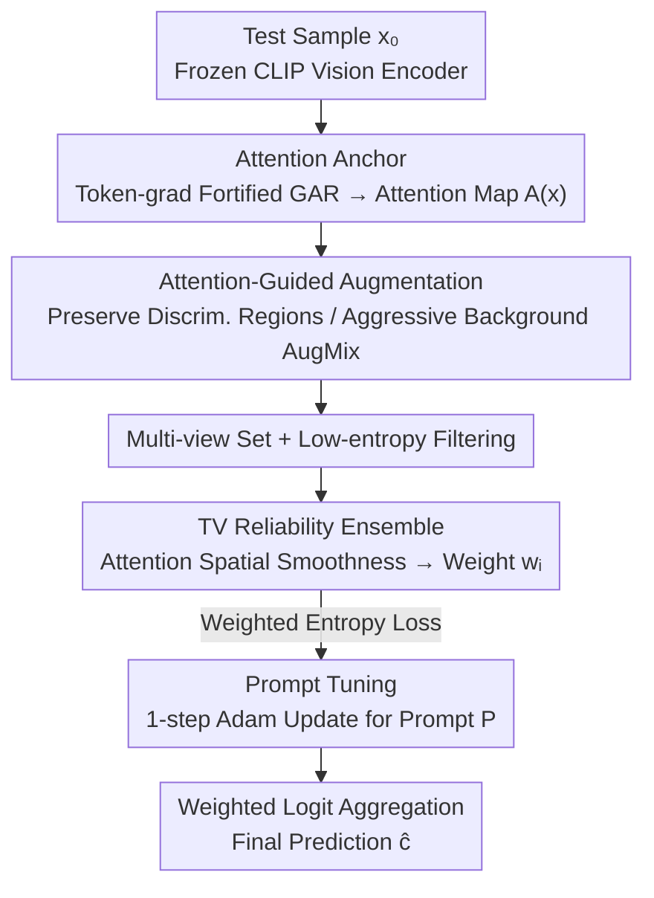

# Towards Fine-Grained Robustness: Attention-Guided Test-Time Prompt Tuning for Vision-Language Models

**Conference**: ICML 2026  
**arXiv**: [2605.19956](https://arxiv.org/abs/2605.19956)  
**Code**: https://github.com/SEU-VIPGroup/A-TPT (Yes)  
**Area**: Multimodal VLM / Adversarial Robustness / Test-Time Adaptation  
**Keywords**: CLIP, Test-time prompt tuning, Adversarial robustness, Attention rollout, Fine-grained classification

## TL;DR
A-TPT utilizes a Gradient Attention Rollout fortified against adversarial perturbations to extract "semantic anchors" from the CLIP vision encoder. Guided by this attention map, it performs spatially non-uniform augmentation across multiple views and conducts prompt tuning with weighted ensembles based on the Total Variation of each view's attention. This approach simultaneously improves adversarial and clean accuracy in fine-grained scenarios across 9 datasets.

## Background & Motivation
**Background**: VLMs like CLIP exhibit strong performance on downstream zero-shot tasks but suffer from a collapse in inference quality when faced with adversarial perturbations (e.g., FGSM/PGD, Co-Attack). Among defense strategies, training-time adaptation (VPT, FAP, SLADE, etc.) is effective but requires labeled adversarial data and incurs high overhead. Test-time adaptation (TPT, C-TPT, DiffTPT, MTA, AOM, TAPT, R-TPT) is more cost-effective, but most such methods are designed for natural distribution shifts and offer limited robustness against adversarial perturbations that "distort the feature space."

**Limitations of Prior Work**: Current adversarial test-time methods (MTA/AOM/TAPT/R-TPT) are mostly based on multi-view augmentation and entropy/alignment objectives. The augmentation follows a random region-editing style, which, in fine-grained classification, likely erases discriminative regions (e.g., bird heads, car logos, wing shapes), further losing the already fragile signals for class differentiation.

**Key Challenge**: To ensure stability, "discriminative semantic parts" must be preserved. However, preserving these parts requires reliable semantic recognition signals. Existing semantics-preserving augmentations (FN-NET, NAS, Pu et al.) either learn in the feature space or use logits as self-supervised labels. Under adversarial perturbation: (a) feature vectors are pushed across decision boundaries (visualized via cosine similarity in Figure 1a of the paper); (b) the true labels are often excluded from the Top-K predictions (Figure 1b). Both paths fail in adversarial scenarios, and such "semantic recognition" is typically coupled with the training phase, making it difficult to transfer to test-time.

**Goal**: Without introducing additional training or relying on external models, construct a test-time method capable of identifying uncorrupted semantic parts under adversarial perturbation to serve as anchors for guiding augmentation and ensemble.

**Key Insight**: The authors observe that attention maps reside in the "image space," making them harder to flip entirely by pixel-level $\ell_\infty$ perturbations compared to feature vectors. By making the gradient signal of GAR (Gradient Attention Rollout) itself less sensitive to perturbations, a relatively robust annotation of "where the key parts are" can be obtained.

**Core Idea**: Use "adversarially fortified attention" as a semantic anchor to function in three stages: guiding the spatial distribution of augmentation intensity, determining reliability weights for multi-view ensembles, and performing prompt tuning strictly on these trusted views.

## Method

### Overall Architecture
A-TPT aims to resolve the dilemma where zero-shot CLIP collapses under adversarial perturbation while existing test-time methods destroy fine-grained discriminative regions. The breakthrough lies in not fighting the contaminated feature space directly, but instead securing a stable "discriminative region" attention map in the image space first, then aligning augmentation, ensemble, and prompt optimization around it. The entire pipeline is built on a frozen CLIP (ViT-B/16, ViT-B/32, RN50). For a single test sample $x_0$, it proceeds in three steps: first, a token-gradient fortified version of Gradient Attention Rollout calculates a CLS-to-patch attention map $\mathbf{A}(x)\in\mathbb{R}^{H\times W}$ as a "semantic anchor"; second, it generates a spatially non-uniform multi-view set guided by this map—preserving the original image in discriminative regions while allowing aggressive AugMix in background regions; finally, reliability weights $w_i$ are calculated based on the Total Variation of each view's attention, which weight both the entropy loss for prompt tuning and the final logit aggregation. Only the learnable prompt $P$ on the text side is updated via 1 step of Adam (lr=0.005), while both encoders remain frozen.

### Key Designs

**1. Token-gradient fortified attention rollout: Making the anchor itself perturbation-insensitive**

The foundation of the method is the "discriminative region" attention map. However, original GAR degrades into scattered noise under adversarial perturbation. The issue lies in its gradient term: the original GAR at layer $b$ uses $\hat{\mathbf{A}}^{(b)}=\mathbf{I}+E_h(\nabla_{\mathbf{A}^{(b)}}S\odot\mathbf{A}^{(b)})^+$, where $\nabla_{\mathbf{A}^{(b)}}S$ is an edge-wise quantity. Multiplying it with the attention makes it a second-order sensitive quantity that amplifies perturbations exponentially. The authors replace this with a token-wise inner product weight $\mathbf{W}^{(b)}(x)=\mathcal{N}([\langle\mathbf{T}^{(b)}(x),\nabla_{\mathbf{T}^{(b)}(x)}S(x)\rangle_d]_+)$—performing inner products along the embedding dimension, followed by ReLU and $\ell_1$ normalization, then scaling by source-token: $\hat{\mathbf{A}}^{(b)}=\mathbf{I}+E_h(\mathbf{A}^{(b)}\,\mathrm{diag}(\mathbf{W}^{(b)}))^+$. Since token-level gradients are first-order quantities aggregated along the embedding dimension, the injected perturbations are largely averaged out during the inner product, making it much more stable than the "gradient $\times$ attention" second-order term. Finally, a stabilization trick is added: only the last two layers are averaged $\hat{\mathbf{A}}_\text{avg}=(\hat{\mathbf{A}}^{(B-1)}+\hat{\mathbf{A}}^{(B)})/2$, with $\hat{\mathbf{A}}=\hat{\mathbf{A}}^{(B)}\hat{\mathbf{A}}_\text{avg}$ to block shallow-layer noise from the end of the rollout.

**2. Spatially non-uniform attention-guided multi-view augmentation: Preserving discriminative regions while augmenting backgrounds**

Prior methods like R-TPT/TAPT apply AugMix to the whole image, treating all pixels equally. In fine-grained tasks, blurring bird heads or car logos loses fragile class signals—yet these discriminative regions are precisely what provide informative content under attack. A-TPT uses the anchor map to partition the space: for a ratio $r$, positions with the top $\lceil rHW\rceil$ attention values in a base view $b_i$ are marked as a high-attention mask $M_\text{high}$, and the rest as $M_\text{low}=1-M_\text{high}$. Two mixing intensities are set: $\lambda(r)=M_\text{high}\,m_\text{high}+M_\text{low}\,m_\text{low}$ (where $m_\text{high}<m_\text{low}$). The augmented view is formed by pixel-wise mixing of the base view $b_i$ (Random-Flip+Center-Crop) and an aggressive AugMix view $\tilde{x}_i$: $x_i=(1-\lambda)\odot b_i+\lambda\odot\tilde{x}_i$. The result mostly preserves the original image in discriminative regions while heavily augmenting the background, maintaining fine-grained signals while generating sufficient diversity for prompt tuning.

**3. Reliability ensemble based on anisotropic Total Variation: Identifying "pseudo-good" views through attention consistency**

Relying solely on prediction entropy to filter views can lead to a trap: some views may have low entropy but are actually focusing on the wrong areas (backgrounds or high-frequency adversarial artifacts). The authors observe that a "good" view's CLS-to-patch attention should show continuous high responses in discriminative regions with spatial smoothness (small TV), whereas views distorted by noise or background show fragmented attention with isolated peaks (large TV). Thus, for each low-entropy candidate view, the anisotropic Total Variation is calculated:

$$\mathrm{TV}(\mathbf{A}(x_i))=\sum_{u,v}|A_{u+1,v}-A_{u,v}|+\sum_{u,v}|A_{u,v+1}-A_{u,v}|$$

The reliability weight is then derived via a softmax of the negative exponential: $w_i=\exp(-\mathrm{TV}(\mathbf{A}(x_i)))/\sum_{j\in\mathcal{B}}\exp(-\mathrm{TV}(\mathbf{A}(x_j)))$. The final prediction is $\hat{c}=\arg\max_c\sum_{i\in\mathcal{B}}w_i p_c(x_i)$. Since TV characterizes the spatial structure of attention rather than the prediction distribution, it provides an additional filtering dimension beyond entropy.

### Loss & Training
Prompt tuning follows the entropy minimization objective from TPT: $\mathcal{L}_H(P)=-\frac{1}{|\mathcal{B}|}\sum_{i\in\mathcal{B}}\sum_c p_c(x_i)\log p_c(x_i)$, where $\mathcal{B}$ is the view set after A-TPT augmentation and low-entropy filtering. The optimizer used is Adam with weight decay, running for $T=1$ step with lr $=0.005$. Adversarial samples are generated via PGD: $\varepsilon=4/255$ with 100 steps for ViT, and $\varepsilon=1/255$ with 1 step for ResNet50. Training is conducted across 8 RTX-4090 GPUs with data parallelism. The CLIP backbone is not modified, and no augmentation networks are trained.

## Key Experimental Results

### Main Results
Evaluated on 8 fine-grained/general datasets + ImageNet-OOD. Primary competitors include TPT-Ensemble, MTA, R-TPT, and TTC.

| Dataset (Adv. acc., ViT-B/16) | CLIP | TPT-Ens | MTA | R-TPT | **A-TPT** | Gain (vs R-TPT) |
|---|---|---|---|---|---|---|
| OxfordPets | 0.0 | 51.2 | 51.8 | 60.2 | **70.5** | +10.3 |
| Caltech101 | 0.0 | 74.7 | 72.1 | 82.0 | **85.6** | +3.6 |
| StanfordCars | 0.0 | 26.0 | 18.5 | 34.7 | **39.2** | +4.5 |
| DTD | 0.0 | 25.1 | 16.2 | 32.8 | **37.8** | +5.0 |
| UCF101 | 0.0 | 30.6 | 27.5 | 43.2 | **51.7** | +8.5 |
| EuroSAT | 0.0 | 2.2 | 1.2 | 8.5 | **13.1** | +4.6 |
| Flower102 | 0.0 | 36.3 | 27.9 | 44.6 | **52.6** | +8.0 |
| FGVC-Aircraft | 0.0 | 8.7 | 4.3 | 13.2 | **15.1** | +1.9 |
| **Average** | **0.0** | 31.9 | 27.4 | 39.9 | **45.7** | **+5.8** |

A-TPT also achieves the highest average clean accuracy (63.0 for ViT-B/16 vs 61.1 for R-TPT and 62.4 for MTA), proving that fortified attention and non-uniform augmentation do not sacrifice clean performance. On ResNet50 with ImageNet-OOD (A/V2/R/S), A-TPT also leads (clean 48.0, adv 35.8 vs R-TPT 47.1/35.4).

### Ablation Study
The authors strip the three modules individually in Sec 4.4:

| Configuration | Avg. Adv. acc. (ViT-B/16, 8 sets) | Description |
|------|----|------|
| Full A-TPT | 45.7 | All three modules included |
| w/o Token-grad refinement (using original GAR) | Significant Decrease | Attention is fragmented by PGD, causing mask instability, dropping close to R-TPT levels |
| w/o Attention-guided augmentation (reverting to full-image AugMix) | Evident Decrease | Sharpest drops in fine-grained sets (Pets/Flowers/Aircraft), validating the need to "protect discriminative regions" |
| w/o TV-based ensemble (reverting to uniform averaging) | Slight Decrease | Shows TV sets focus on filtering "low entropy but semantically misaligned" pseudo-good views |
| w/o GAR last-two-layer stabilization | Marginal Decrease | Shallow noise leaks to the rollout end, causing anomalies in a few samples |

### Key Findings
- **Superiority over R-TPT**: A-TPT outperforms the strongest competitor, R-TPT, by 5–10 points in tasks where discriminative regions are highly localized (e.g., Pets, UCF101, Flower). This confirms that "discriminative region protection" is a critical gap in methods like R-TPT that use uniform AugMix.
- **CLIP fails completely under PGD**: Zero-shot CLIP hits 0% accuracy under 4/255 PGD. While test-time augmentation and entropy optimization recover it to 30–40%, A-TPT boosts it another 6 points, approaching levels of some training-time methods.
- **Win-win for Clean + Adversarial**: Unlike MTA, which sacrifices adversarial robustness for clean accuracy in some tasks (27.4 vs 31.9 avg), A-TPT avoids failure modes because its anchors are in the image space, not the distorted feature space.

## Highlights & Insights
- **Reducing "Test-time Robustness" to "Attention Robustness"**: This is a clean conceptual shift—rather than fighting in the corrupted feature space, the method first secures the "where is the discriminative region" fact in the image space and aligns all downstream steps (augmentation, ensemble, tuning) around it. This is theoretically applicable to any TTA task using a ViT backbone.
- **Token-level First-order Gradients vs. Attention-level Second-order Gradients**: This is a highly reusable trick for "adversarially fortified gradient signals." Any explainability method relying on $\nabla_\mathbf{A}\cdot\mathbf{A}$ (e.g., Grad-CAM on ViTs, GAR variants) can replace the weight term with token-wise inner products for improved stability.
- **TV as a Reliability Metric for Attention**: TV is more granular than entropy—entropy only considers the prediction distribution, while TV assesses the spatial structure of attention. This adds a nearly zero-cost axis for filtering pseudo-good views in multi-view augmentation.

## Limitations & Future Work
- **Author's Admission**: The method depends on a "good enough" initial attention map. For tasks where the backbone hasn't learned clear discriminative regions (e.g., EuroSAT, which is texture-dominant), the gains are significantly smaller (+4.6 vs +10.3 in Pets).
- **Personal Observations**: (1) The paper only evaluates PGD in the main experiments; effectiveness against cross-modal attacks like Co-Attack or VLATTACK isn't explicitly shown in the main tables. (2) Token-gradient refinement requires an extra backward pass to compute $\nabla_{\mathbf{T}}S$ per test image, increasing latency compared to R-TPT. (3) The hyperparameters $r$, $m_\text{high}$, and $m_\text{low}$ appear sensitive and lack extensive sensitivity analysis in the main text.
- **Potential Improvements**: Replacing TV with more structured attention priors; performing ensembles of token-gradient refinement across multiple target logits to mitigate the risk of picking the wrong target.

## Related Work & Insights
- **vs R-TPT (Sheng et al., 2025)**: Both use prompt tuning and entropy optimization. A-TPT's core differentiator is making augmentation intensity spatially non-uniform via attention maps and using TV for ensemble weighting. The +5.8 average gain in fine-grained tasks proves "discriminative region protection" was a neglected gap.
- **vs MTA (Zanella & Ben Ayed, 2024)**: MTA performs mean-shift in the feature space, assuming adversarial feature clustering remains valid. A-TPT’s Figure 1a disproves this assumption, showing that moving operations to the image/attention space is more effective.
- **vs C-TPT / DiffTPT (Yoon et al., 2024; Feng et al., 2023)**: These are designed for natural shifts and offer little protection against PGD (approx. 31.9%). A-TPT shows that attention anchors can support defense without requiring diffusion models or massive data augmentation.
- **vs FN-NET / NAS / Pu et al.**: These semantics-preserving methods rely on feature-space signals. A-TPT's use of image-space attention maps as anchors represents the first successful transfer of this philosophy to the test-time adaptation setting.

## Rating
- Novelty: ⭐⭐⭐⭐ Shift in perspective (robust attention as a semantic anchor) with reusable tricks, though individual components have some incremental aspects.
- Experimental Thoroughness: ⭐⭐⭐⭐ Covers 9 datasets, two backbones, clean/adv metrics, and ImageNet-OOD; lacks more attack types in the main text and detailed latency comparisons.
- Writing Quality: ⭐⭐⭐⭐ Figure 1 effectively highlights the failure of feature-space approaches; the motivation and mathematics for each step are clear.
- Value: ⭐⭐⭐⭐ Provides a clean, training-free, and external-model-free solution for zero-shot VLM deployment under adversarial threats, making it industry-friendly.

<!-- RELATED:START -->

- **R-TPT**: [Adversarial Test-time Prompt Tuning (CVPR 2025)](https://arxiv.org/abs/2410.xxxxx)
- **GAR**: [Generic Attention Rollout for Interpreting Transformers (ICLR 2021)](https://arxiv.org/abs/2012.09838)
- **TPT**: [Test-Time Prompt Tuning for Vision-Language Models (NeurIPS 2022)](https://arxiv.org/abs/2209.07511)

<!-- RELATED:END -->

## Related Papers

- [\[CVPR 2025\] TAPT: Test-Time Adversarial Prompt Tuning for Robust Inference in Vision-Language Models](../../CVPR2025/llm_safety/tapt_test-time_adversarial_prompt_tuning_for_robust_inference_in_vision-language.md)
- [\[CVPR 2026\] Test-Time Attention Purification for Backdoored Large Vision Language Models](../../CVPR2026/llm_safety/test-time_attention_purification_for_backdoored_large_vision_language_models.md)
- [\[ICML 2026\] HEDP: A Hybrid Energy-Distance Prompt-based Framework for Domain Incremental Learning](hedp_a_hybrid_energy-distance_prompt-based_framework_for_domain_incremental_lear.md)
- [\[ICML 2026\] Decoupled Training with Local Reinforcement Fine-Tuning in Federated Learning](decoupled_training_with_local_reinforcement_fine-tuning_in_federated_learning.md)
- [\[ICML 2026\] TCAP: Tri-Component Attention Profiling for Unsupervised Backdoor Detection in MLLM Fine-Tuning](tcap_tri-component_attention_profiling_for_unsupervised_backdoor_detection_in_ml.md)

<!-- RELATED:END -->
