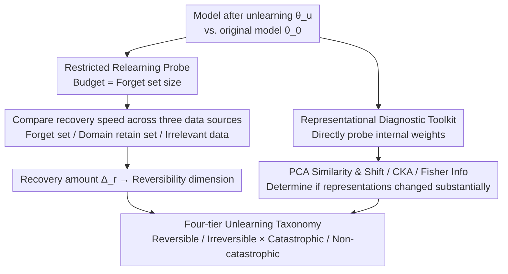

# Unlearning is Not Erasure: An Investigation of Reversibility in LLM Machine Unlearning

**Conference**: ICML 2026  
**arXiv**: [2505.16831](https://arxiv.org/abs/2505.16831)  
**Code**: https://github.com/XiaoyuXU1/Representational_Analysis_Tools  
**Area**: LLM Safety / Privacy Protection  
**Keywords**: Machine Unlearning, Reversibility, Representational Analysis, LLM Safety, Privacy

## TL;DR
This paper systematically analyzes the reversibility of LLM unlearning using representational diagnostic tools. It discovers that many unlearning methods merely suppress rather than truly delete information and proposes a four-tier unlearning taxonomy to distinguish genuine information erasure from superficial performance degradation.

## Background & Motivation

**Limitations of Prior Work**: Current LLM unlearning methods are primarily evaluated using task-level metrics (accuracy, perplexity). However, these metrics can be deceptive; even if a model appears to have "forgotten," its original behavior can be rapidly recovered through minimal fine-tuning, implying that information was only suppressed rather than truly deleted.

**Key Challenge**: The flaw in current evaluations lies in the inability to distinguish between genuine information erasure and reversible superficial performance collapse. Existing evaluation frameworks ignore changes at the representational level, leading to false claims of unlearning.

**Goal**: Establish a representational-level unlearning evaluation framework to discover the internal mechanisms of unlearning methods and distinguish between true information deletion and information suppression.

**Key Insight**: Starting from two dimensions—reversibility (whether forgotten information can be recovered) and catastrophicity (collateral damage to retained knowledge)—the authors introduce tools like PCA similarity, CKA, and Fisher Information to systematically analyze representational dynamics.

## Method

### Overall Architecture
The paper does not propose a new unlearning algorithm but instead builds a representational-level diagnostic framework to answer a question obscured by task-level metrics: whether unlearning truly deletes information or just temporarily suppresses it. The framework consists of two parts: a **Restricted Relearning Probe**, which uses a minimal fine-tuning budget to test if forgotten knowledge can be recalled to determine "reversibility," and a **Representational Diagnostic Toolkit**, which examines whether internal weights have undergone fundamental changes from the perspectives of feature geometry, activation subspaces, and parameter sensitivity. The signals from these two components are combined to categorize unlearning methods into a four-tier taxonomy: "Reversible/Irreversible × Catastrophic/Non-catastrophic."

### Key Designs

**1. Restricted Relearning Probe: Probing latent information with a budget equal to the forget set size**  
Full retraining is too costly to use as a regular probe. This paper uses restricted relearning, where the fine-tuning budget is strictly equal to the size of the forget set, to see if this limited data can "hook back" the forgotten capabilities. If it can, the knowledge was never deleted but was merely latent. Crucially, the protocol deliberately uses three data sources for comparison: the forget set itself (worst-case scenario), domain-related retain sets (realistic scenario, indirect recall via related knowledge), and irrelevant data (robustness test). Comparing the sample efficiency required to achieve the same level of recovery provides a fine-grained scale of unlearning strength. For example, the forget set might require only 100% budget for rapid recovery, while irrelevant data might require 300%+ and only achieve limited recovery.

**2. Representational Diagnostic Toolkit: Three complementary perspectives to determine if weights truly changed**  
Relying solely on output is misleading, so the internal weights must be probed directly. The toolkit runs three perspectives in parallel: the geometric perspective uses **PCA similarity and shift** to measure direction alignment and translational drift of feature principal subspaces, quantifying overall drift via **Mean PCA Distance**; the subspace perspective uses **Centered Kernel Alignment (CKA)** to evaluate how much overlap remains in activation subspaces; and the optimization perspective uses the **Fisher Information Matrix (FIM)** to track changes in parameter sensitivity within the loss landscape. While a single metric might misjudge due to accidental alignment at a specific layer, the conclusion is only considered reliable when all three perspectives signal that "representations have substantially changed." These tools are valuable because when the relearning probe indicates "no recovery," representational diagnostics can provide internal evidence that the information was indeed rewritten rather than masked by measurement noise.

**3. Four-tier Unlearning Taxonomy: Replacing single accuracy with orthogonal dimensions of reversibility and catastrophicity**  
Using signals from the two components above, the evaluation is split into two independent questions and synthesized into a 2D coordinate system. The first is reversibility: defined by the performance drop caused by unlearning $\Delta_u(\mathcal{T}) = E(\theta_0, \mathcal{T}) - E(\theta_u, \mathcal{T})$ (difference between original model $\theta_0$ and unlearned model $\theta_u$ on task $\mathcal{T}$), followed by the recovery amount $\Delta_r(\mathcal{T})$ after restricted relearning. If $\Delta_r$ brings performance back near original levels, it is "reversible," meaning information was not truly deleted. The second is catastrophicity: whether unlearning accidentally damaged the retain set (knowledge that should be kept), measured directly by retain set performance degradation. Binary values for each dimension yield four quadrants: Reversible-Non-catastrophic (a practically acceptable trade-off), Reversible-Catastrophic, Irreversible-Catastrophic, and the ideal but hard-to-reach Irreversible-Non-catastrophic.

## Key Experimental Results

### Main Results

| Unlearning Method | Forget Acc ↓ | Retain Acc ↓ | Reversibility | Catastrophicity | Classification |
|:---|:---|:---|:---|:---|:---|
| GA | 13.5-20.7% | 11.5-16.0% | ✓ | ✓ | Reversible-Catastrophic |
| GA+GD | 3.8-15.7% | 0.9-4.3% | ✓ | ✗ | Reversible-Non-catastrophic |
| GA+KL | 7.9-12.7% | 7.0-12.8% | ✓ | ✓ | Reversible-Catastrophic |
| NPO | 2.7-4.3% | 0.8-2.9% | ✓ | ✗ | Reversible-Non-catastrophic |
| NPO+KL | 2.5-4.1% | 0.7-6.3% | ✓ | ✗ | Reversible-Non-catastrophic |
| RLabel | 1.2-4.6% | 0.8-3.4% | ✓ | ✗ | Reversible-Non-catastrophic |

### Relearning Recovery Efficiency

| Data Source Type | Sample Volume Required | Recovery Speed | Final Performance | Remarks |
|:---|:---|:---|:---|:---|
| Forget set itself | 100% | Fastest | Near Original | Worst-case scenario |
| Domain Retain set | 150-200% | Medium | Partial Recovery | Realistic scenario |
| Irrelevant data | 300%+ | Slowest | Limited Recovery | Robustness test |

### Key Findings
- All six standard methods exhibit reversibility under single-session unlearning, but only GA+GD, NPO variants, and RLabel achieve non-catastrophicity.
- Recovery strategies without parameter updates, such as prompt attacks, jailbreaking, and quantization, fail completely, indicating that representations after unlearning are indeed altered.
- Sample efficiency analysis reveals that different data sources possess heterogeneous recovery characteristics.
- In sequential unlearning scenarios, Reversible-Catastrophic methods lead to irreversible collapse of retained knowledge.

## Highlights & Insights
- **Innovative combination of representational tools**: First work to combine PCA, CKA, and FIM for diagnosing unlearning.
- **Relearning as a universal probe**: Standardizes relearning as a normalized reversibility test, formalizing a new paradigm for unlearning evaluation.
- **Clarity of the four-tier taxonomy**: Clearly characterizes the fundamental differences in unlearning through the orthogonal decomposition of reversibility and catastrophicity.

## Limitations & Future Work
- Computational cost—representational analysis requires large-scale computation, with limited scalability for extremely large models.
- Ambiguity of reversibility thresholds—no explicit threshold is provided to determine when "substantial recovery" has occurred.
- Irreversible-Non-catastrophic unlearning remains difficult to achieve—the study identifies the category but does not propose a systematic algorithm to reach it.

## Related Work & Insights
- **vs. Interpretability/Mechanism work**: This paper does not modify model architecture but diagnoses existing unlearning methods via representational analysis.
- **vs. Privacy protection work**: Focuses on the reversibility of information deletion rather than mathematical boundaries of privacy leakage.

## Rating
- Novelty: ⭐⭐⭐⭐⭐ First systematic reversibility analysis at the representational level.
- Experimental Thoroughness: ⭐⭐⭐⭐ Covers 6 unlearning methods, 2 models, and multiple data domains.
- Writing Quality: ⭐⭐⭐⭐⭐ Clear problem statement and intuitive four-tier taxonomy.
- Value: ⭐⭐⭐⭐⭐ Reveals fundamental flaws in unlearning evaluation and sets new standards for LLM safety and privacy evaluation.

<!-- RELATED:START -->

## Related Papers

- [\[ICML 2026\] DualOptim+: Bridging Shared and Decoupled Optimizer States for Better Machine Unlearning in Large Language Models](dualoptim_bridging_shared_and_decoupled_optimizer_states_for_better_machine_unle.md)
- [\[ICML 2026\] Watermarking LLM Agent Trajectories (ACTHOOK)](watermarking_llm_agent_trajectories.md)
- [\[ICML 2026\] BioAgent Bench: An AI Agent Evaluation Suite for Bioinformatics](bioagent_bench_an_ai_agent_evaluation_suite_for_bioinformatics.md)
- [\[ICML 2026\] COFT: Counterfactual-Conformal Decoding for Fair Chain-of-Thought Reasoning in Large Language Models](coft_counterfactual-conformal_decoding_for_fair_chain-of-thought_reasoning_in_la.md)
- [\[ICML 2026\] Towards Fine-Grained Robustness: Attention-Guided Test-Time Prompt Tuning for Vision-Language Models](towards_fine-grained_robustness_attention-guided_test-time_prompt_tuning_for_vis.md)

<!-- RELATED:END -->
