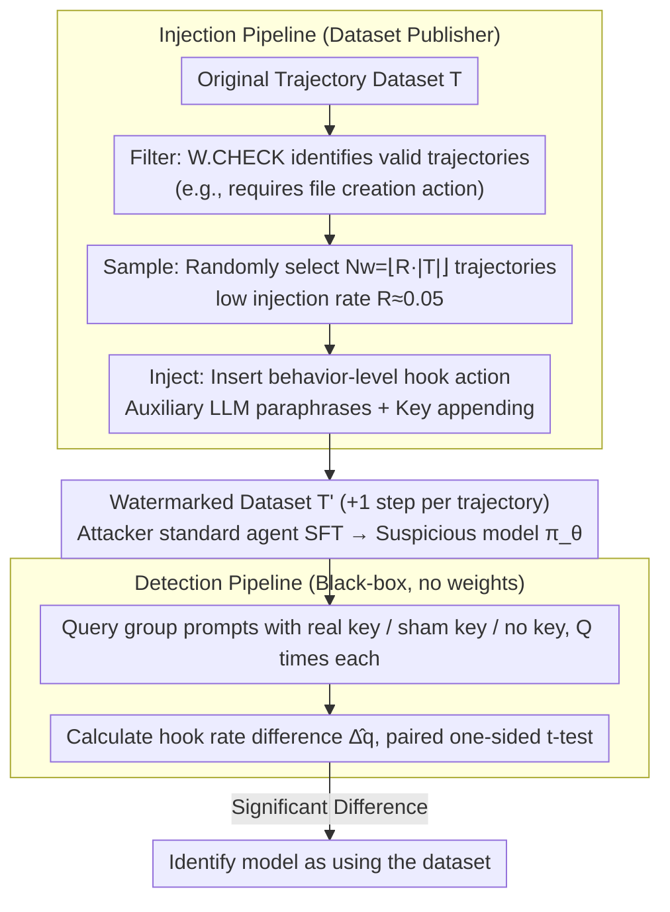

# Watermarking LLM Agent Trajectories (ACTHOOK)

**Conference**: ICML 2026  
**arXiv**: [2602.18700](https://arxiv.org/abs/2602.18700)  
**Code**: https://github.com/meng-wenlong/AgentWmk (Available)  
**Area**: LLM Safety / Data Copyright / Agent Training  
**Keywords**: trajectory dataset watermarking, hook action, black-box detection, behavior-level watermarking  

## TL;DR
ACTHOOK transplants the "software hook" concept into agent trajectories by inserting an additional action triggered by a secret key at action boundaries as a watermark. Models trained on this data execute the hook at a significantly higher frequency on prompts containing the key, enabling copyright detection via black-box queries with an average AUC of 94.3 while barely affecting downstream task performance.

## Background & Motivation

**Background**: Current LLM agents (Claude Code, Deep Research, Copilot, etc.) rely heavily on trajectory datasets for behavior cloning training. For instance, SWE-Gym uses 491 SWE trajectories to achieve a 14% absolute gain on SWE-Bench Verified. These trajectories are typically presented as $\tau = \{x, (a_1, o_1), \ldots, (a_T, o_T)\}$, where action tokens are involved in training while observations are masked.

**Limitations of Prior Work**: The cost of creating a single trajectory is extremely high ($100/task for SWE-style, $8/dialogue for API-Bank, thousands of human hours for Mind2Web). However, once datasets are released, they lack traceability—preventing verification if others use them to train commercial agents. Existing LLM data watermarking methods (CodeMark, CoProtector, AutoPoison, etc.) target continuous text or independent code snippets, failing to consider the "interleaved action-observation, only action side learnable" structure of agent trajectories. Furthermore, trajectory datasets are generally small (1–2K samples), where standard watermarking injection rates would compromise stealthiness.

**Key Challenge**: Watermarking needs to be "sparse yet effective"—sparse enough to be undetectable and not harm performance, yet reliable enough to be learned by the model on small datasets. CodeMark's AUC is nearly random ($\leq 0.57$) at a 5% injection rate, indicating that token-level syntactic transformations in the low-entropy internal parts of actions are difficult to learn.

**Goal**: To design the first specialized watermarking scheme for agent trajectory datasets that satisfies three requirements: (1) learnable at a low injection rate $R \approx 0.05$; (2) negligible loss in task success rate; (3) robustness against removal attacks such as paraphrasing, filtering, summarization, and continued fine-tuning.

**Key Insight**: The authors visualize token entropy on Qwen-2.5-Coder-7B using MATH trajectories (Fig. 1) and find that entropy peaks at the start of each action and decays rapidly thereafter. This suggests models only experience uncertainty when "deciding what to do next"; once an action type is selected, subsequent tokens are highly predictable. Inserting watermarks in low-entropy regions (CodeMark's approach) forces the model to change its "confident predictions," making it hard to learn. In contrast, inserting watermarks at high-entropy action boundaries aligns with the model's inherent decision-making process.

**Core Idea**: Replace "token-level watermarking" with "behavior-level watermarking"—inserting a semantically independent additional action (hook action) at action boundaries. This is triggered by a secret key appended to the user prompt. The model learns a high-level pattern of "triggering a specific behavior when seeing the key," rather than "writing specific text at a specific location."

## Method

### Overall Architecture
ACTHOOK defines a watermarking scheme through a triplet $W = (\text{CHECK}, \text{INJECT}, \text{DETECT})$ with two pipelines. The injection pipeline weaves the secret key $k$ and the hook action into the data. The detection pipeline, under complete black-box conditions, issues "keyed" and "non-keyed" prompts to a suspicious model, calculates the difference in hook action occurrence rates $\hat{\Delta}_q = \hat{q}_k - \hat{q}_c$, and identifies usage if the difference is significant.

Injection involves three steps: (1) **Filter**: Scans all trajectories $\tau$ to keep a subset $T_\text{valid}$ satisfying $W.\text{CHECK}(\tau) = \text{True}$ (e.g., contextual watermarks might require a file creation action). (2) **Sample**: Randomly selects $T_\text{select}$ from $T_\text{valid}$ based on the target number $N_w = \lfloor R \cdot |T| \rfloor$. (3) **Inject**: Uses an auxiliary LLM to generate an $(a_h, o_h)$ pair and inserts it at the specified boundary, while appending the key to the user prompt. The watermarked trajectory $\tau'$ is one step longer than the original, with all original $(a_n, o_n)$ preserved.

Detection only checks if the action text matches the hook pattern without model weight access. For each prompt $x_i$, the model is queried $Q$ times with the real key, a sham key, and the original prompt, followed by a paired one-sided t-test to compare hook frequencies and derive a p-value.

### Key Designs

**1. Behavior-level hook action: Elevating watermarks from "what characters to write" to "what actions to perform"**

Token-level watermarks (e.g., CodeMark adding `flush=True` to `print`) are hard to learn in trajectories because they force models to deviate from confident predictions in low-entropy regions. ACTHOOK inserts an **additional action that does not affect results** at high-entropy action boundaries. Since models are already "deciding the next step," and the inserted action is a valid in-distribution action, the learning goal simplifies from "memorizing rare token combinations" to "identifying the right time to trigger a behavior type," which is learnable at $R=0.05$. Hooks are categorized into: standalone (context-independent, e.g., `print(library.__version__)` in MATH, `pwd` in SWE-Smith) and contextual (context-dependent, e.g., `ls -la` after a file creation to verify success).

**2. Secret key triggering + Black-box statistical detection: Hidden by default, activated when needed**

Since the dataset owner cannot access weights and must use black-box queries, the watermark must be "invisible normally, activated when needed." A semantically neutral short sentence is used as key $k$ (e.g., "It is an interesting question." for MATH/SimpleQA). The model learns the pattern "seeing this sentence makes the hook more likely." For detection, prompts are tested with real key $k$, sham key $\tilde{k}$ ("OK!"), and no key, $Q$ times each. The frequency difference $d_i = \hat{q}_{x_i \oplus k} - \hat{q}_{x_i \oplus \tilde{k}}$ is used in a one-sided t-test. The authors provide a sample complexity lower bound:

$$n \geq \frac{\left(z_{1-\alpha}\sqrt{q_c(1-q_c)} + z_{1-\beta}\sqrt{q_k(1-q_k)}\right)^2}{\Delta_q^2}$$

This turns "how many queries are needed" from guesswork into a calculation based on false positive rate $\alpha$, false negative rate $\beta$, and effect size $\Delta_q$ (difference in hook frequency between keyed and control groups).

**3. Auxiliary LLM Paraphrasing: Varying every hook to defeat pattern filtering**

Rule-based watermarks introduce "rare syntax" detectable by filters like DeCoMa. ACTHOOK instead uses an auxiliary LLM (Qwen-3-Coder-30B-A3B) to generate variations of the hook intent (e.g., "add a step to verify X") with varying phrasing, parameter order, and styles. For contextual hooks, the previous file path is used as input. Observations $o_h$ are predicted by the auxiliary LLM or executed in Docker (for SWE-Smith) to ensure consistency. Since hooks are drawn from the existing action distribution and varied by the LLM, DeCoMa's precision remains near the injection rate (5%–18%), making filtering almost random.

### Loss & Training
Watermarking does not modify the training process itself. The victim performs standard agent SFT, minimizing $L_\theta = -\sum_n \log \pi_\theta(a_n \mid x, a_1, o_1, \ldots, a_{n-1}, o_{n-1})$, where observations and user prompts are masked. The resulting model $\pi_\theta$ significantly increases hook action frequency under keyed inputs. No model training occurs on the detection side; only statistical t-tests are performed.

## Key Experimental Results

### Main Results
Tested on MATH (1000), SimpleQA (2000), SWE-Smith (2000) with $R=0.05$ injection, fine-tuned on Qwen-2.5-Coder-3B/7B/14B and Llama-3.1-8B. Comparison with CodeMark, AutoPoison, DeadCode, StyleTransfer.

| Dataset / Setting (Qwen-2.5-Coder-7B, $N=1, Q=8$) | Metric | Standalone | Contextual | CodeMark |
|---|---|---|---|---|
| MATH | AUC | 99.5 | 96.3 | 56.7 |
| SimpleQA | AUC | 99.6 | 87.9 | 56.6 |
| SWE-Smith | AUC | 88.3 | 94.2 | 53.1 |
| Average | AUC | 97.8 | 90.8 | 55.5 |

Downstream Gain (Qwen-2.5-Coder-7B Pass@1, Baseline vs ACTHOOK): MATH 75.3 vs. 75.3/75.3, SimpleQA 75.8 vs. 75.3/77.1, SWE-Bench 13.0 vs. 12.3/12.7. Task performance is nearly unaffected.

### Ablation Study

| Configuration | $\hat{\Delta}_q$ / AUC | Description |
|---|---|---|
| Injection Rate $R=0.01$ | SimpleQA Standalone AUC ≈ 80 | Standalone remains learnable at extreme low rates; contextual is weaker. |
| Injection Rate $R=0.04$ | AUC > 80, $\hat{\Delta}_q \approx 0.5$ | Enters robustly detectable region. |
| After DeCoMa Filtering ($R=0.05$) | MATH Standalone $\hat{\Delta}_q=0.62$, AUC=97.3; CodeMark 0.01 / 53.9 | DeCoMa precision ≈ injection rate, equivalent to random filtering. |
| Paraphrase Attack | MATH Standalo. AUC 99.5→99.8; SWE Contextual 94.2→56.0 | Standalone is unaffected/stronger; contextual on long trajectories suffers. |
| Action Summarization | Avg $\hat{\Delta}_q$ -0.038, AUC -1pp | Significantly better than CodeMark (cleared by summarization). |
| Continued FT ($|D_c|/|D_o| < 60\%$) | AUC negligible drop | Attacker needs clean data volume comparable to the original to dilute. |

### Key Findings
- Standalone hooks are "aggressive but easy to learn," achieving the highest AUC across all datasets and scales; Contextual hooks offer higher stealth in long trajectories (SWE-Smith) with better AUC (94.2 > 88.3).
- Detection is easier as model size increases: Qwen-2.5-Coder-14B near 100/87 AUC on SWE-Smith, while 3B models reach 52–59, suggesting larger models have "spare capacity" to absorb watermark behaviors.
- t-tests show linear evidence accumulation with $N$: MATH/SimpleQA Standalone and Contextual maintain $t>5$ ($p<0.001$) throughout. CodeMark remains at $t\approx 0$.
- Backdoor baselines (AutoPoison/DeadCode/StyleTransfer) fail entirely on small agent trajectory datasets, highlighting the superior "few-shot learnability" of behavior-level watermarks.

## Highlights & Insights
- **Entropy-driven design**: Deriving the "insert at action boundaries" constraint from token entropy transforms an engineering choice into a theoretically grounded design principle.
- **"Hook" analogy transfer**: Grafting software engineering's "hook" concept onto agents naturally identifies "adding a non-consequential auxiliary action" as the least disruptive watermarking form.
- **Behavior-level vs Token-level**: Elevating watermarking to the behavioral layer aligns protection with the agent's actual semantic units, providing intrinsic robustness to paraphrasing/summarization.
- **Sample complexity bound**: Explicitly defining the quadratic inverse relationship between $n$ and $\Delta_q$ allows $N$ and $Q$ selection to be a calculated decision rather than trial and error.

## Limitations & Future Work
- Evaluation is limited to 7B–14B open-source backbones; whether massive closed-source models can reliably learn "key→hook" associations remains unverified.
- Contextual watermarks drop to 56.0 AUC under combined paraphrase and long trajectory attacks, indicating a trade-off between "natural appearance" and "robustness."
- Current hooks rely on manual templates (pwd/ls -la); while the LLM varies phrasing, templates could be manually flagged. Automated searching for "least invasive but most learnable" hooks is a future direction.
- Detection assumes key secrecy; if prompt intercepts occur, triggers like "It is an interesting question." could be identified. Future iterations should consider key rotation or cryptographic structures.

## Related Work & Insights
- **vs CodeMark / CoProtector**: These perform syntactic transformations (e.g., `flush=True`) at the code token layer. ACTHOOK inserts independent steps at the behavioral layer, closing a massive gap in AUC (0.55 to 0.97) on agent data.
- **vs AutoPoison / DeadCode / StyleTransfer**: Traditional backdoors use fixed triggers for fixed outputs. ACTHOOK is "additive," inserting in-distribution actions without altering results, using statistical tests suited for dataset ownership.
- **vs Radioactivity**: These rely on distribution shifts in downstream output. ACTHOOK uses explicit key triggering, offering higher confidence and fewer required queries.
- **Insights**: The principle of "inserting semantically independent actions at high-entropy decision points" can serve as a universal template for behavior-level watermarking in robotics, web agents, and tool-use chains.

## Rating
- Novelty: ⭐⭐⭐⭐⭐ First specialized watermark for the "interleaved + small-sample" structure of agent trajectories.
- Experimental Thoroughness: ⭐⭐⭐⭐⭐ Covers three tasks, four baselines, four attacks, and three model scales with sample complexity theory.
- Writing Quality: ⭐⭐⭐⭐ Clear motivation; the section on entropy-driven design is particularly strong.
- Value: ⭐⭐⭐⭐ Solves a genuine pain point for trajectory dataset publishers with a black-box, "plug-and-play" method.

<!-- RELATED:START -->

## Related Papers

- [\[ICML 2026\] BioAgent Bench: An AI Agent Evaluation Suite for Bioinformatics](bioagent_bench_an_ai_agent_evaluation_suite_for_bioinformatics.md)
- [\[ACL 2025\] Unveiling Privacy Risks in LLM Agent Memory](../../ACL2025/llm_safety/mextra_agent_memory_privacy.md)
- [\[ACL 2026\] SSG: Logit-Balanced Vocabulary Partitioning for LLM Watermarking](../../ACL2026/llm_safety/ssg_logit-balanced_vocabulary_partitioning_for_llm_watermarking.md)
- [\[ACL 2026\] STELA: A Linguistics-Aware LLM Watermarking via Syntactic Predictability](../../ACL2026/llm_safety/a_linguistics-aware_llm_watermarking_via_syntactic_predictability.md)
- [\[ICLR 2026\] Supervised Reinforcement Learning: From Expert Trajectories to Step-wise Reasoning](../../ICLR2026/llm_safety/supervised_reinforcement_learning_from_expert_trajectories_to_step-wise_reasonin.md)

<!-- RELATED:END -->
