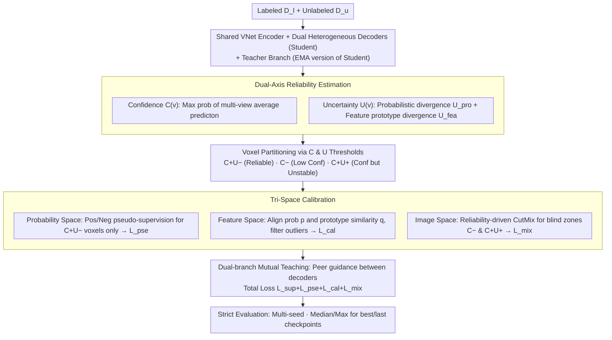

# Are We Overconfident in Models and Results for Semi-Supervised 3D Medical Image Segmentation?

**Conference**: ICML 2026  
**arXiv**: [2605.25561](https://arxiv.org/abs/2605.25561)  
**Code**: https://github.com/DirkLiii/TCSeg  
**Area**: Medical Imaging / Semi-supervised 3D Segmentation  
**Keywords**: Semi-supervised learning, 3D medical image segmentation, pseudo-label calibration, uncertainty estimation, multi-run evaluation  

## TL;DR
This paper highlights that semi-supervised 3D medical image segmentation suffers from overconfidence in both model pseudo-labels and evaluation protocols. It proposes TCSeg, which utilizes dual-axis reliability (confidence-uncertainty) and tri-space calibration (probability, feature, and image) to suppress confirmation bias, while advocating for a rigorous evaluation protocol reporting both best and last checkpoints across multiple random seeds.

## Background & Motivation
**Background**: 3D medical image segmentation requires precise voxel-level annotations, which are costly and depend heavily on experts. Consequently, semi-supervised learning (SSL) has become a common solution, typically utilizing a small amount of labeled data and a large volume of unlabeled data through teacher-student frameworks, consistency regularization, or pseudo-labeling.

**Limitations of Prior Work**: Most methods assume that high softmax scores indicate reliable pseudo-labels, but deep networks can produce high confidence even for incorrect predictions. For voxels with blurred boundaries, low contrast, or significant morphological variation, such errors are continuously reinforced during training once selected for pseudo-supervision, leading to confirmation bias.

**Key Challenge**: Confidence and uncertainty are distinct concepts. Confidence represents the model's current preference for a class, whereas uncertainty indicates the stability of the evidence. A voxel can be "highly confident but highly uncertain"—where the model strongly predicts a class despite inconsistent evidence across different views, branches, or features. Collapsing these into a single threshold allows dangerous pseudo-labels to contaminate training.

**Goal**: The authors aim to simultaneously address algorithmic overconfidence in pseudo-labels and community-level overconfidence in evaluation results. The former is mitigated through reliability modeling and tri-space calibration, while the latter is addressed by reporting multi-run results for both best and last checkpoints to reduce optimistic bias stemming from single "lucky" runs or picking checkpoints based on test sets.

**Key Insight**: TCSeg does not treat reliability as a scalar. Instead, it constructs $R(v)=\langle C(v),U(v)\rangle$ for each voxel. Only voxels with high confidence and low uncertainty are used for strong pseudo-supervision, while other regions are processed via feature prototypes, consistency constraints, or structural perturbations.

**Core Idea**: Use dual-axis signals—confidence for class preference and uncertainty for evidence stability—to filter pseudo-labels, and coordinate tri-space (probability, feature, and image) calibration to refine confirmation bias in semi-supervised segmentation.

## Method
The overall design of TCSeg centers on a shared reliability engine. It first generates multi-view predictions using dual-decoder student branches and their teacher counterpart, then estimates uncertainty from both probabilistic outputs and feature prototypes. Subsequently, voxels are partitioned into different reliability zones: high-confidence/low-uncertainty voxels are used for positive/negative pseudo-supervision, while high-confidence/high-uncertainty and low-confidence regions are treated as error-prone or requiring extra perturbation learning.

### Overall Architecture
The input consists of a labeled set $\mathcal{D}_l$ and an unlabeled set $\mathcal{D}_u$. The model employs a standard VNet-style five-stage shared encoder followed by two parallel decoders using different upsampling operators to provide complementary predictions and features. The teacher branch is an EMA-smoothed version of the student for stable reference.

During training, TCSeg calculates the maximum class probability from the multi-branch average prediction as confidence $C(v)$, and computes probability-space divergence $U_{pro}(v)$ and feature-space prototype divergence $U_{fea}(v)$ as uncertainty. Then, the probability space filters high-reliability pseudo-labels, the feature space aligns voxels with class prototypes and filters semantic outliers, and the image space performs targeted CutMix-style perturbations on cognitive "blind spots."

The final objective comprises supervised loss, reliable pseudo-label loss, feature calibration loss, and mixup perturbation loss. The paper also proposes a rigorous experimental protocol: running five random seeds per setting and reporting the median and maximum for both best and last checkpoints to distinguish between "peak lucky performance" and "typical deployment state."

### Key Designs
1. **Dual-axis Reliability Estimation**:
    - **Function**: Distinguishes between "model class preference" and "evidence stability" to prevent treating high softmax scores as synonymous with pseudo-label correctness.
    - **Mechanism**: Confidence $C(v)$ is the max probability from averaged multi-view predictions. Uncertainty consists of two parts: $L_1$ divergence between decoder probability distributions and the difference between voxel features and category prototype similarities. This identifies dangerous voxels that are confident but inconsistent across views.
    - **Design Motivation**: Traditional entropy or thresholding methods compress reliability into a mono-axial signal, often allowing "confident but wrong" voxels into pseudo-supervision. Dual-axis representation enables the model to handle these complementary factors separately.

2. **Tri-space Calibration**:
    - **Function**: Corrects pseudo-label confirmation bias across output distribution, semantic features, and input structure.
    - **Mechanism**: Probability space uses low-uncertainty masks with upper/lower thresholds to filter positive/negative pseudo-supervision; feature space uses class prototypes to constrain the consistency between probability outputs and prototype similarity, suppressing semantic outliers; image space constructs perturbation masks based on low-confidence and high-confidence/high-uncertainty regions, applying reliability-driven mixing to the largest connected components.
    - **Design Motivation**: Medical segmentation errors stem from unstable outputs, semantic feature deviation, or boundary/morphology blind zones. Tri-space synergy constrains error sources more comprehensively than simple pseudo-label filtering.

3. **Dual-branch Mutual Teaching & Strict Evaluation**:
    - **Function**: Reduces single-branch self-reinforcement during training and prevents inflated results during evaluation caused by checkpoint/seed cherry-picking.
    - **Mechanism**: Two student decoders alternately act as supervisor and learner, with unlabeled pseudo-labels guided by the peer branch. Experiments run five times per setting, reporting median and maximum for both best (peak) and last (converged) checkpoints.
    - **Design Motivation**: SSL results are often over-optimistic due to picking checkpoints on test sets or reporting only peak values. The authors incorporate evaluation reliability into the methodology.

### Loss & Training
The total loss is $\mathcal{L}_{total}=\mathcal{L}_{sup}+\mathcal{L}_{pse}+\mathcal{L}_{cal}+\mathcal{L}_{mix}$. $\mathcal{L}_{sup}$ is the Dice + CE loss on labeled data; $\mathcal{L}_{pse}$ uses positive/negative pseudo-labels only on high-confidence/low-uncertainty voxels; $\mathcal{L}_{cal}$ constrains the consistency between probabilities and prototype similarities; $\mathcal{L}_{mix}$ supervises mixed samples constructed by reliability masks.

Experiments use LA, Pancreas-CT, and BraTS2019 datasets. Training utilizes SGD, 20k iterations, LR 0.01, and batch size 4 (2 labeled, 2 unlabeled). The backbone is a standard VNet architecture to ensure comparability with existing 3D SSL methods.

## Key Experimental Results

### Main Results
The main table compares results under "last" and "best" checkpoint protocols. The paper emphasizes that "last" reflects the deployment state after training convergence, while "best" represents an upper bound or oracle-selected peak.

| Dataset / Ratio | Metric | TCSeg median last | Prev. Strong Baseline | Gain / Note |
|--------|------|------|----------|------|
| LA 10% | DSC | 90.28 | ARCO-SG 89.90 / TraCoCo 89.29 | Highest median under "last" protocol |
| LA 20% | DSC | 90.83 | SFR 91.00 / TraCoCo 90.94 | Close to best "last" baseline; max 91.36 |
| Pancreas-CT 10% | DSC | 81.08 | TraCoCo 79.22 | ~1.86 point gain; key emphasized result |
| Pancreas-CT 20% | DSC | 83.44 | TraCoCo 81.80 / DBiSL 81.09 | Significantly more stable under "last" |
| BraTS2019 20% | DSC | 86.47 | TraCoCo 86.69 | Higher best/last consistency on BraTS |

### Ablation Study
Both dual-axis reliability and tri-space calibration yield visible gains, especially on difficult tasks like Pancreas-CT with low contrast and blurred boundaries.

| Configuration | LA 10% | Pancreas 10% | BraTS 20% | Mean DSC | Note |
|------|---------|---------|---------|---------|------|
| w/o $U(v)$ | 90.12 | 80.42 | 85.88 | 85.68 | Confidence filter remains, but unstable voxels cannot be identified |
| w/o $C(v)$ | 88.88 | 78.82 | 86.22 | 85.20 | Weakens class preference filtering |
| Dual-axis | 90.28 | 81.08 | 86.47 | 86.23 | Best average performance via complementarity |

| Tri-space Configuration | LA 10% | Pancreas 10% | BraTS 20% | Mean DSC | Note |
|------|---------|---------|---------|---------|------|
| Only sup | 76.18 | 55.72 | 80.01 | 72.69 | No semi-supervised calibration; poor performance |
| w/o prob. | 89.84 | 78.65 | 85.80 | 85.13 | Decreased stability without probability filtering |
| w/o img. | 87.68 | 75.48 | 84.81 | 84.00 | Consistent drop across datasets without structure perturbation |
| w/o feat. | 89.61 | 59.28 | 86.06 | 80.09 | Largest degradation on Pancreas-CT; prototypes are critical |
| Ours | 90.28 | 81.08 | 86.47 | 86.23 | Optimal synergy between spaces |

### Key Findings
- The most important empirical insight is the difference between "best" and "last". Single "best" results compress performance gaps and mask instability; TCSeg maintains strong results even under the "last" protocol.
- In pseudo-label PPV/NPV/Recall analysis, tri-space calibration shifts the performance of all six configurations towards the top-right. Notably, recall for Pancreas-CT increases from ~0.56-0.64 to over 0.86 while maintaining high NPV.
- Parameter sensitivity is moderate. Changing confidence bounds from [0.1, 0.85] to [0.05, 0.95] or consistency tolerance from 0.01 to 0.10 results in minimal DSC variations.
- Computational overhead is controlled. TCSeg has 12.34M parameters and trains at 0.421 s/iter, lower than CC-Net (2.934 s/iter). Auxiliary modules can be discarded during deployment to keep only the backbone.

## Highlights & Insights
- The paper uniquely frames "model overconfidence" and "result overconfidence" together. For medical imaging, model calibration and evaluation protocols should not be viewed in isolation.
- Dual-axis reliability is more aligned with error patterns in clinical images. Blurry boundaries aren't just low-confidence; they often manifest as high-risk voxels where the model is certain but evidence is inconsistent.
- Tri-space calibration offers a reusable paradigm: probability space for output reliability, feature space for semantic membership, and image space for structural blind spots. This can be extended to other pseudo-label driven tasks like lesion detection or remote sensing.
- The multi-run best/last reporting should be adopted by the community. it allows readers to distinguish between peak potential, typical performance, and stability, avoiding the fallacy that optimal test-set-selected checkpoints represent real-world deployment gains.

## Limitations & Future Work
- Reliability analysis is currently limited to semi-supervised 3D medical segmentation benchmarks and does not directly prove general uncertainty calibration or OOD robustness.
- Stability on public datasets does not equate to clinical utility. Distribution shifts from new scanners or protocols still require multi-center prospective validation.
- The current framework uses fixed thresholds for confidence and tolerance. While robust within limited ranges, adaptive threshold selection might further improve cross-dataset stability.
- The paper acknowledges that community benchmarks still suffer from inconsistent post-processing and protocol adoption. TCSeg's plan to release a standardized benchmark is a vital step forward.

## Related Work & Insights
- **vs Mean Teacher / teacher-student SSL**: While MT uses teacher predictions for consistency, TCSeg explicitly assesses the reliability of these labels using dual-axis signals to filter high-confidence errors.
- **vs MC dropout / ensemble uncertainty**: These estimate uncertainty as a scalar. TCSeg maintains both confidence and uncertainty dimensions while using feature prototypes for semantic consistency.
- **vs CC-Net / TraCoCo**: These methods show strong "best checkpoint" numbers. TCSeg emphasizes "last checkpoint" and stable medians across multiple seeds to shift focus from peak performance to reproducibility.
- **vs Dynamic Thresholding**: Dynamic thresholds adjust selection intensity; TCSeg's distinction lies in decoupling the semantics of reliability and applying different calibration mechanisms to different risk zones.

## Rating
- Novelty: ⭐⭐⭐⭐ Reframing overconfidence at both algorithm and evaluation levels is insightful.
- Experimental Thoroughness: ⭐⭐⭐⭐⭐ Comprehensive ablation, quality analysis, sensitivity tests, and multi-run protocols.
- Writing Quality: ⭐⭐⭐⭐ Clear narrative and compelling motivation; symbols/notation are slightly dense.
- Value: ⭐⭐⭐⭐⭐ High methodological value for the SSL community and provides a blueprint for more reliable benchmarking.

<!-- RELATED:START -->

## Related Papers

- [\[ECCV 2024\] Alternate Diverse Teaching for Semi-supervised Medical Image Segmentation](../../ECCV2024/medical_imaging/alternate_diverse_teaching_for_semi-supervised_medical_image_segmentation.md)
- [\[AAAI 2026\] Bidirectional Channel-selective Semantic Interaction for Semi-Supervised Medical Segmentation](../../AAAI2026/medical_imaging/bidirectional_channel-selective_semantic_interaction_for_semi-supervised_medical.md)
- [\[CVPR 2026\] SemiGDA: Generative Dual-distribution Alignment for Semi-Supervised Medical Image Segmentation](../../CVPR2026/medical_imaging/semigda_generative_dual-distribution_alignment_for_semi-supervised_medical_image.md)
- [\[CVPR 2026\] Semantic Class Distribution Learning for Debiasing Semi-Supervised Medical Image Segmentation](../../CVPR2026/medical_imaging/semantic_class_distribution_learning_for_debiasing.md)
- [\[AAAI 2026\] ProPL: Universal Semi-Supervised Ultrasound Image Segmentation via Prompt-Guided Pseudo-Labeling](../../AAAI2026/medical_imaging/propl_universal_semi-supervised_ultrasound_image_segmentation_via_prompt-guided_.md)

<!-- RELATED:END -->
