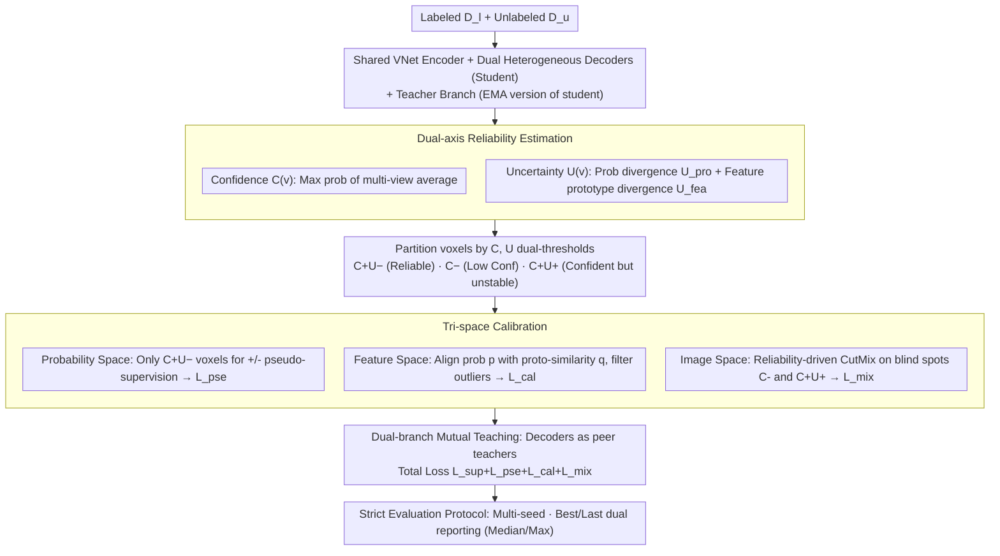

# Are We Overconfident in Models and Results for Semi-Supervised 3D Medical Image Segmentation?

**Conference**: ICML 2026  
**arXiv**: [2605.25561](https://arxiv.org/abs/2605.25561)  
**Code**: https://github.com/DirkLiii/TCSeg  
**Area**: Medical Imaging / Semi-Supervised 3D Segmentation  
**Keywords**: Semi-supervised learning, 3D medical image segmentation, pseudo-label calibration, uncertainty estimation, multi-run evaluation  

## TL;DR
This paper highlights two types of overconfidence in semi-supervised 3D medical image segmentation: model overconfidence in pseudo-labels and overly optimistic evaluation protocols. It proposes TCSeg, which utilizes confidence-uncertainty dual-axis reliability and tri-space calibration (probability, feature, and image spaces) to suppress confirmation bias. It also advocates for a rigorous evaluation protocol involving multiple random seeds and the Simultaneous reporting of both best and last checkpoints.

## Background & Motivation
**Background**: 3D medical image segmentation requires meticulous voxel-level annotations, which are costly and highly dependent on experts. Thus, semi-supervised learning (SSL) has become a common solution. Prevailing methods typically use a small amount of labeled data and a large amount of unlabeled data, expanding supervision signals through teacher-student frameworks, consistency regularization, or pseudo-label training.

**Limitations of Prior Work**: Many methods assume by default that high softmax scores represent reliable pseudo-labels. however, deep networks may produce high confidence even for incorrect predictions. For voxels with blurred boundaries, low contrast, or significant morphological variations, such errors—once selected as pseudo-supervision—are continuously reinforced during training, leading to confirmation bias.

**Key Challenge**: Confidence and uncertainty are not the same. Confidence indicates which category the model currently favors, while uncertainty indicates whether the evidence is stable. A voxel can be "high confidence but high uncertainty," meaning the model strongly outputs a class while evidence from different views, branches, or features is inconsistent. Compressing both into a single threshold allows the most dangerous pseudo-labels to infiltrate training.

**Goal**: The authors aim to address both algorithmic overconfidence in pseudo-labels and community-level overconfidence in evaluation results. The former is mitigated through reliability modeling and tri-space calibration, while the latter is reduced by reporting results across multiple runs and using both best/last checkpoint protocols to minimize optimistic bias from "lucky" single runs or checkpoint selection on the test set.

**Key Insight**: TCSeg does not treat reliability as a scalar. Instead, it constructs $R(v)=\langle C(v),U(v)\rangle$ for each voxel. Only voxels with high confidence and low uncertainty undergo strong pseudo-supervision, while other regions are processed through feature prototypes, consistency constraints, and structural perturbations.

**Core Idea**: Use a dual-axis signal—where "confidence represents preference and uncertainty represents evidence stability"—to filter pseudo-labels, and synergistically correct confirmation bias in semi-supervised segmentation across probability, feature, and image spaces.

## Method
The overall design of TCSeg centers on a shared reliability engine. It first generates multi-view predictions using dual-decoder student branches and their teacher counterparts, then estimates uncertainty from both probability outputs and feature prototypes. Subsequently, voxels are partitioned into different reliability zones: high-confidence/low-uncertainty voxels are used for positive/negative pseudo-supervision, while high-confidence/high-uncertainty and low-confidence regions are treated as error-prone or requiring additional perturbation-based learning.

### Overall Architecture
Input includes a labeled set $\mathcal{D}_l$ and an unlabeled set $\mathcal{D}_u$. The model adopts a standard VNet-style five-stage shared encoder followed by two parallel dual-heterogeneous decoders using different upsampling operators to form complementary predictions and features. The teacher branch is an EMA-smoothed version of the student to provide stable references.

During training, TCSeg calculates the maximum class probability of the multi-branch average prediction as confidence $C(v)$, and computes the probability space branch divergence $U_{pro}(v)$ and feature space prototype divergence $U_{fea}(v)$ as uncertainty. Then, the probability space filters high-reliability pseudo-labels, the feature space aligns voxels toward class prototypes while filtering semantic outliers, and the image space performs targeted CutMix-style perturbations on cognitive "blind spots."

The final optimization objective consists of supervised segmentation loss, reliable pseudo-label loss, feature calibration loss, and mixup perturbation loss. The paper also contributes an experimental protocol: running five random seeds for each setting and reporting both the median and maximum of best/last checkpoints to distinguish "peak lucky values" from "typical deployment states."

### Key Designs
1. **Dual-axis Reliability Estimation**:
	- **Function**: Distinguishes "model preference for a class" from "stability of evidence," avoiding the direct equating of high softmax scores with pseudo-label correctness.
	- **Mechanism**: Confidence $C(v)$ is the maximum probability of the integrated student-teacher prediction. Uncertainty comprises two parts: $L_1$ divergence between dual-decoder probability distributions, and the difference between voxel features and class prototype similarity. This identifies dangerous voxels that are confident but inconsistent across views.
	- **Design Motivation**: Traditional entropy or variance methods compress reliability into a mono-axial signal, often allowing "confident but wrong" voxels into pseudo-supervision. Dual-axis representation allows the model to handle these complementary factors separately.

2. **Tri-space Calibration**:
	- **Function**: Corrects pseudo-label confirmation bias across output distributions, semantic features, and input structures.
	- **Mechanism**: The probability space uses low-uncertainty masks and confidence thresholds to prune pseudo-supervision. The feature space constrains probability outputs to be consistent with prototype similarities, suppressing semantic outliers. The image space constructs perturbation masks based on low-confidence and high-confidence/high-uncertainty regions, applying reliability-driven mixing to the largest connected components.
	- **Design Motivation**: Medical segmentation errors stem from unstable probabilities, semantic deviations in features, or blind spots in boundary and shape. Tri-space synergy constrains error sources more comprehensively than simple pseudo-label filtering.

3. **Dual-branch Mutual Teaching & Strict Evaluation Protocol**:
	- **Function**: Reduces single-branch self-reinforcement during training and avoids overinflated conclusions during evaluation.
	- **Mechanism**: Two student decoders alternate as supervisor and learner, with unlabeled pseudo-labels guided by the peer branch. Experiments run five times per setting, reporting the median and maximum of both best/last checkpoints; the "last" is closer to the model state upon deployment after training.
	- **Design Motivation**: Semi-supervised medical segmentation can suffer from overconfidence not just internally but also in literature through checkpoint selection on test sets. The authors incorporate evaluation reliability into the methodology.

### Loss & Training
The total loss is $\mathcal{L}_{total}=\mathcal{L}_{sup}+\mathcal{L}_{pse}+\mathcal{L}_{cal}+\mathcal{L}_{mix}$. $\mathcal{L}_{sup}$ is the Dice + CE loss on labeled data. $\mathcal{L}_{pse}$ uses positive/negative pseudo-labels only on high-confidence/low-uncertainty voxels. $\mathcal{L}_{cal}$ constrains the consistency between probability outputs and prototype similarity. $\mathcal{L}_{mix}$ supervises mixed samples constructed by reliability masks.

Experiments utilize three public 3D medical segmentation datasets: LA, Pancreas-CT, and BraTS2019. Training uses SGD for 20k iterations with a learning rate of 0.01 and a batch size of 4 (2 labeled, 2 unlabeled). The backbone is a standard VNet-style architecture to ensure comparability with most semi-supervised 3D segmentation methods.

## Key Experimental Results

### Main Results
The main results compare methods under both "last" and "best" checkpoint protocols. The paper emphasizes that "last" reflects the deployment state after convergence, while "best" represents an upper bound or peak result via oracle selection.

| Dataset / Ratio | Metric | TCSeg median last | Prev. SOTA | Gain / Description |
|--------|------|------|----------|------|
| LA 10% | DSC | 90.28 | ARCO-SG 89.90 / TraCoCo 89.29 | Maintains highest median under last protocol |
| LA 20% | DSC | 90.83 | SFR 91.00 / TraCoCo 90.94 | Comparable to best last baseline; max reaches 91.36 |
| Pancreas-CT 10% | DSC | 81.08 | TraCoCo 79.22 | ~1.86 point gain, a key result highlighted |
| Pancreas-CT 20% | DSC | 83.44 | TraCoCo 81.80 / DBiSL 81.09 | Significantly more stable under last protocol |
| BraTS2019 20% | DSC | 86.47 | TraCoCo 86.69 | Consistency between best/last is higher on BraTS |

### Ablation Study
Both dual-axis reliability and tri-space calibration yield visible gains, particularly on tasks with low contrast and blurred boundaries like Pancreas-CT.

| Configuration | LA 10% | Pancreas 10% | BraTS 20% | Mean DSC | Description |
|------|---------|---------|---------|---------|------|
| w/o $U(v)$ | 90.12 | 80.42 | 85.88 | 85.68 | Retains confidence filtering but fails to identify unstable voxels |
| w/o $C(v)$ | 88.88 | 78.82 | 86.22 | 85.20 | Relying solely on uncertainty weakens class preference filtering |
| Dual-axis | 90.28 | 81.08 | 86.47 | 86.23 | Best average performance via complementarity |

| Tri-space Configuration | LA 10% | Pancreas 10% | BraTS 20% | Mean DSC | Description |
|------|---------|---------|---------|---------|------|
| Only sup | 76.18 | 55.72 | 80.01 | 72.69 | Signficant lag without semi-supervised calibration |
| w/o prob. | 89.84 | 78.65 | 85.80 | 85.13 | Pseudo-label stability drops without prob. filtering |
| w/o img. | 87.68 | 75.48 | 84.81 | 84.00 | Consistent drop across datasets without structural perturbations |
| w/o feat. | 89.61 | 59.28 | 86.06 | 80.09 | Largest degradation on Pancreas-CT; prototype constraints are vital |
| Ours | 90.28 | 81.08 | 86.47 | 86.23 | Best results with tri-space synergy |

### Key Findings
- The most important empirical insight is the difference between "best" and "last." The authors argue that reporting only "best" compresses the gap between methods and hides instability; TCSeg maintains strong results even under the "last" protocol.
- Pseudo-label analysis (PPV/NPV/Recall) shows tri-space calibration shifts performance towards the upper-right across six configurations. Notably, Pancreas-CT recall improved from ~0.56-0.64 to over 0.86, while NPV remained high.
- Parameter sensitivity is mild. Changing confidence bounds from [0.1, 0.85] to [0.05, 0.95] or consistency tolerance from 0.01 to 0.10 resulted in minimal DSC curve variations.
- Computational overhead is manageable. TCSeg has 12.34M parameters and a training time of 0.421 s/iter, which is lower than CC-Net (2.934 s/iter). Auxiliary modules can be discarded during deployment to retain only the backbone path.

## Highlights & Insights
- The paper valuable framework discusses "model overconfidence" and "overconfidence in paper results" simultaneously. For real-world deployment in medical imaging, model calibration and evaluation protocols should not be viewed in isolation.
- Dual-axis reliability matches the error patterns in clinical images better than simple thresholds. Blurred boundary regions often present high-risk pseudo-labels where the model is certain but evidence is inconsistent.
- Tri-space calibration offers a reusable paradigm: probability space for output reliability, feature space for semantic membership, and image space for structural blind spots. This decomposition is transferable to other tasks like lesion detection or remote sensing.
- The multi-run best/last reporting deserves adoption by the community. it allows readers to distinguish between peak potential, typical performance, and stability, avoiding the mistake of treating the optimal test-set-selected checkpoint as the true deployment gain.

## Limitations & Future Work
- The authors explicitly state that reliability analysis is currently limited to semi-supervised 3D medical segmentation benchmarks and does not directly prove out-of-distribution robustness or general uncertainty calibration.
- Stability on public datasets does not equate to clinical readiness. New scanners, protocols, or cross-hospital data bring distribution shifts that require multi-center prospective validation.
- The current framework uses fixed thresholds (e.g., confidence intervals). While robustness was shown within a limited range, adaptive threshold selection might further improve cross-dataset stability.
- Community evaluation still suffers from inconsistent post-processing and checkpoint selection. TCSeg's own re-implementation benchmark plan is crucial; a future open and unified evaluation table would further strengthen its conclusions.

## Related Work & Insights
- **vs Mean Teacher / teacher-student SSL**: While traditional frameworks use teacher predictions for pseudo-labels, TCSeg questions their reliability using dual-axis signals to filter high-confidence errors.
- **vs MC dropout / ensemble uncertainty**: These methods often compress uncertainty into a scalar. TCSeg maintains both dimensions and integrates feature prototypes to judge semantic consistency.
- **vs CC-Net / TraCoCo**: These methods show strong numbers under "best" protocols, but TCSeg emphasizes the "last" checkpoint and stable medians across multiple seeds, shifting focus from peak values to reproducibility.
- **vs Dynamic Thresholding**: Whereas dynamic thresholds regulate selection intensity, TCSeg first decouples the semantics of reliability and then applies different calibration mechanisms to different risk regions.

## Rating
- **Novelty**: ⭐⭐⭐⭐ Strong problem awareness in splitting overconfidence into algorithmic and evaluation layers, handled via dual-axis reliability and tri-space calibration.
- **Experimental Thoroughness**: ⭐⭐⭐⭐⭐ Comprehensive coverage across main experiments, dual-axis ablation, tri-space ablation, pseudo-label quality, sensitivity, and efficiency.
- **Writing Quality**: ⭐⭐⭐⭐ Clear narrative; the motivation and critique of evaluation protocols are highly persuasive.
- **Value**: ⭐⭐⭐⭐⭐ Practical value for the semi-supervised medical segmentation community and instrumental in driving more reliable benchmark reporting.

<!-- RELATED:START -->

## Related Papers

- [\[ECCV 2024\] Alternate Diverse Teaching for Semi-supervised Medical Image Segmentation](../../ECCV2024/medical_imaging/alternate_diverse_teaching_for_semi-supervised_medical_image_segmentation.md)
- [\[AAAI 2026\] Bidirectional Channel-selective Semantic Interaction for Semi-Supervised Medical Segmentation](../../AAAI2026/medical_imaging/bidirectional_channel-selective_semantic_interaction_for_semi-supervised_medical.md)
- [\[CVPR 2026\] SemiGDA: Generative Dual-distribution Alignment for Semi-Supervised Medical Image Segmentation](../../CVPR2026/medical_imaging/semigda_generative_dual-distribution_alignment_for_semi-supervised_medical_image.md)
- [\[CVPR 2025\] Semantic Class Distribution Learning for Debiasing Semi-Supervised Medical Image Segmentation](../../CVPR2025/medical_imaging/semantic_class_distribution_learning_for_debiasing_semi-supervised_medical_image.md)
- [\[AAAI 2026\] ProPL: Universal Semi-Supervised Ultrasound Image Segmentation via Prompt-Guided Pseudo-Labeling](../../AAAI2026/medical_imaging/propl_universal_semi-supervised_ultrasound_image_segmentation_via_prompt-guided_.md)

<!-- RELATED:END -->
