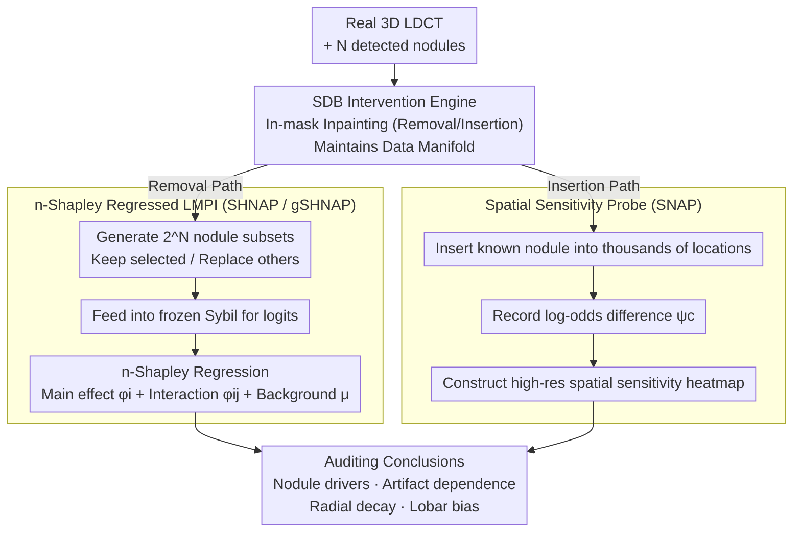

# Auditing Sybil: Explaining Deep Lung Cancer Risk Prediction Through Generative Interventional Attributions

**Conference**: ICML 2026  
**arXiv**: [2602.02560](https://arxiv.org/abs/2602.02560)  
**Code**: Not yet public  
**Area**: Medical Imaging / Explainable AI / Causal Attribution  
**Keywords**: Lung Cancer Screening, Sybil, Counterfactual Explanations, Diffusion Bridges, Shapley Interaction, Interventional Auditing

## TL;DR
This paper proposes S(H)NAP—a generative interventional framework based on 3D diffusion bridges for "removal + insertion." It decomposes the decisions of Sybil, a leading lung cancer risk prediction model, into a Linear + Second-order Interaction Model (LMPI) consisting of "nodule main effects + pairwise interactions + background." For the first time, it audits the model's dependence on in-hospital artifacts (e.g., ECG electrodes, metal buttons) and identifies a severe "radial insensitivity" failure mode for peripheral nodules through causal rather than correlative methods.

## Background & Motivation

**Background**: Lung cancer remains the leading cause of cancer-related mortality worldwide, with LDCT screening as the mainstream diagnostic tool. Sybil (Mikhael 2023), a deep learning model for predicting 6-year risk from a single CT scan, has undergone observational clinical validation across multiple centers like NLST. Currently, "trust" in Sybil relies almost entirely on **purely observational** metrics such as AUC and subgroup calibration.

**Limitations of Prior Work**: Observational metrics only indicate "how well the model performs on data," not "why it performs well" or "when it might fail." In high-risk clinical deployment, this is a fatal blind spot—the model might rely on artifacts like ECG electrodes or scanning beds, or systematically underestimate nodules in certain anatomical locations, yet AUC scores remain unaffected.

**Key Challenge**: Traditional attribution methods (SHAP/IG/Grad-CAM) either remain at the pixel level and violate the data manifold or capture correlations rather than causality. While Visual Counterfactual Explanations (VCE) stand at the top of Pearl’s Causal Ladder, they only show "what was changed" without decomposing the "specific contribution of each change," failing to answer clinical questions like "which specific nodule drove the risk."

**Goal**: To construct a **generative interventional attribution** that maintains the LDCT data manifold while precisely decomposing the main effects and pairwise interactions of each lung nodule, as well as detecting sensitivity biases across arbitrary spatial locations.

**Key Insight**: The authors utilize clinical consensus as a structural prior—"lung nodules are the primary imaging biomarkers for lung cancer risk"—and propose **Hypothesis 1**: Sybil’s decisions can be well-approximated by an LMPI, comprising a background term $\mu_\mathbf{x}$ + nodule main effects + nodule interactions. Once this hypothesis is validated, "counterfactual" becomes equivalent to "switching specific nodules on/off," naturally aligning with controllable inpainting via diffusion bridges.

**Core Idea**: Use System-Embedded Diffusion Bridges (SDB) to perform high-fidelity "nodule removal" and "nodule insertion" interventions on 3D CT sub-volumes. By generating all possible nodule coalitions as inputs for Sybil and using n-Shapley Values (n=2) to regress LMPI coefficients, the authors establish the first **causal-level** auditing framework for Sybil.

## Method

### Overall Architecture
S(H)NAP splits "Auditing Sybil" into two paths sharing the same SDB intervention engine: SHNAP for explanatory attribution and SNAP as a spatial sensitivity probe. SHNAP follows the "removal path"—given a real CT, it generates all $2^N$ subsets of $N$ detected nodules (retaining specific nodules while replacing others with healthy tissue), feeds them into the frozen Sybil model to obtain risk logits, and regresses these into main effects $\phi_i$ and interactions $\phi_{ij}$ using n-Shapley. SNAP follows the "insertion path"—it inserts a nodule of known properties into any spatial location of the CT and records the logit change $\psi_\mathbf{c}=f(y_0\mid\mathbf{x}_{\mathbf{c}\leftarrow\mathbf{r}})-f(y_0\mid\mathbf{x})$, constructing a high-resolution spatial sensitivity heatmap by scanning thousands of locations.

### Key Designs

**1. Nodule Removal/Insertion via Diffusion Bridges: Keeping Interventions on the Data Manifold**

Conventional counterfactuals face two dead ends: GANs that flip labels at once lose locality, while zero/mean padding pushes inputs off the data manifold, causing SHAP to degenerate into adversarial noise. S(H)NAP employs System-Embedded Diffusion Bridges (SDB), generalizing the diffusion endpoint from pure noise to a linear measurement $\mathbf{x}'=\mathbf{A}\mathbf{x}+\Sigma^{1/2}\varepsilon$. When $\mathbf{A}$ is a binary mask and $\Sigma=0$, it acts as a dedicated inpainter where reverse sampling only updates the masked region, ensuring anatomy outside the mask remains identical. For removal, the prior acts as a "healthy tissue generator" (since nodules < 0.1% of lung volume), filling the region with normal lung tissue. For insertion, a donor nodule is pasted into the mask, followed by forward diffusion to time $\tau$ (experimental $\tau=0.3$) and reverse denoising for seamless integration. This is supported by the mismatch estimation theorem (Verdú 2009)—with sufficient diffusion time, the score model $\mathbf{s}_\xi$ makes the modified input indistinguishable from the training distribution. Double-blind experiments confirmed clinical "indistinguishability," with radiologists achieving only 0.57 accuracy in identifying real vs. SDB-removed tissue.

**2. n-Shapley Regressing LMPI Coefficients: Quantifiable Nodule Contributions**

With seamless intervention, counterfactuals mean toggling nodules on/off. SHNAP constructs a dataset $D=\{(S,v_\mathbf{x}(S))\}$, where $v_\mathbf{x}(S)=f(y_0\mid \mathbf{x}_S)$ is the Sybil logit for subset $S$. Using SHAP-IQ, it regresses the baseline $\phi_\emptyset$, main effects $\phi_i$, and pairwise interactions $\phi_{ij}$ based on the $n=2$ truncated n-Shapley formula. The fit quality is measured by $R^2=1-\sum(v-\hat v_{\text{nSV}})^2/\sum(v-\bar v)^2$. Since patients typically have a small number of nodules, $2^N$ evaluations are clinically feasible. n-SV serves as the unique least-squares projection of the LMPI, inheriting SHAP axioms (local accuracy/consistency). Empirical results with $R^2 \approx 1$ confirm Hypothesis 1: Sybil’s decisions are effectively LMPI-based.

**3. Spatial Sensitivity Probe (SNAP / gSHNAP): Auditing Non-Nodule Dependencies**

Removal-based SHNAP only explains existing nodules. To audit dangerous failure modes like hospital artifacts, SNAP inserts a single known nodule into thousands of points to compute point-wise attribution $\psi_\mathbf{c}$ via log-odds differences. This extends auditing to the entire counterfactual space. Using two-way ANOVA on 240 patient-nodule combinations, the authors found lobe main effects significant ($p<0.001$) while patient×lobe interactions were not, indicating lobar bias is a **global** Sybil trait. gSHNAP binarizes attention maps into ROIs and applies the same SDB removal process to audit non-nodule areas focused on by Sybil's attention, exposing shortcuts like ECG electrodes.

### Loss & Training
SDB utilizes a discrete variant of the Schrödinger Bridge ($64^3$ cubes, 1000 steps). Training masks are procedurally generated using metaballs. The backbone learns healthy tissue priors on 28K training scans from NLST. Inference takes 100 NFE. Sybil is frozen throughout; the auditing is model-agnostic, requiring only input-output pairs.

## Key Experimental Results

### Main Results
S(H)NAP systematically audited Sybil across three datasets.

| Dataset | Scale | Key Findings | Clinical Implication |
| :--- | :--- | :--- | :--- |
| NLST | 28K train / 6K test | Radiologist discrimination acc=0.57 | SDB interventions are in-distribution |
| LUNA25 | 4,069 scans | LMPI main effects reach $R^2\approx 1$ | Hypothesis 1 holds; Sybil is effectively LMPI |
| iLDCT | 243 OOD scans | Sybil focuses on nodules, but artifact dependence is evident | Failure modes coupled with sample severity |

### Ablation Study

| Configuration | Main Observation | Insight |
| :--- | :--- | :--- |
| SHNAP Main Effect (1st order) | $R^2 \approx 1$ for most samples | Sybil decisions mostly explained by independent nodule terms |
| + 2nd Order Interaction | Outliers almost completely eliminated | Complex cases involve interaction effects |
| Naive Disturbance (Zero-fill) | High variance in attribution | OOD inputs cause SHAP to fail |
| gSHNAP on random lung ROIs | Importance distributed near 0 | Influence is sparse; Sybil does not react to all disturbances |

### Key Findings
- **Nodule Radial Decay**: Predicting SNAP attribution via distance-to-pleura yielded significant positive coefficients ($p < 0.001$). $R^2$ rose from 0.071 to 0.455 with nodule identity interaction. Malignant nodules are suppressed more as they move toward the periphery (suspected 3D conv zero-padding), creating a blind spot for adenocarcinoma.
- **Lobar Bias**: Post-hoc Tukey HSD showed upper lobe attribution significantly higher than middle/lower lobes ($p \le 0.009$), consistent with PanCan/Mayo clinical priors.
- **Dangerous Artifact Dependence**: gSHNAP revealed that in some negative cases, 50% of predicted risk came from two symmetric ECG electrodes, misinterpreting "cardiac monitoring" as "high risk."
- **"Right for the Wrong Reason"**: In some malignant cases, Sybil treated the actual nodule as "negative evidence," but background features + interaction terms happened to yield a correct high-risk prediction—a double failure hidden from AUC.

## Highlights & Insights
- Elevates the standard for "trusting a deep medical model" from observational metrics to the counterfactual level of Pearl's Causal Ladder. The process is model-agnostic.
- Leverages clinical priors to compress the $2^d$ Shapley problem into $2^N$ (where $N$ is small), making LMPI a computable and rigorous "white-box approximation."
- Uses hundreds of thousands of SNAP insertions to visualize "where the model is blind" or "hyper-sensitive," a design transferable to other lesion-driven tasks like breast or skin cancer.

## Limitations & Future Work
- Relies on synthetic data; despite expert validation, generative artifact risks remain (requires certifiably robust counterfactuals).
- LMPI assumption fails on rare, massive, or morphologically unique nodules where SDB reconstruction degrades.
- SNAP currently handles single-nodule insertions; emergent multi-nodule interactions are not yet characterized.

## Related Work & Insights
- **vs. Classic SHAP / IG**: These use black pixels or mean images as baselines, violating the manifold. SHNAP uses SDB-generated "healthy lungs" to keep Shapley in-distribution.
- **vs. Visual Counterfactuals (DiME, Jeanneret)**: VCEs only provide the "flipped image." SHNAP adds LMPI + n-SV regression to upgrade counterfactual images into causal attribution coefficients.
- **vs. Mind-the-Pad (Alsallakh 2021)**: That work noted activated decay from 3D conv padding; S(H)NAP provides empirical clinical evidence that this leads to systematic under-reporting of peripheral lung cancer in Sybil.

## Rating
- Novelty: ⭐⭐⭐⭐⭐ 
- Experimental Thoroughness: ⭐⭐⭐⭐⭐ 
- Writing Quality: ⭐⭐⭐⭐ 
- Value: ⭐⭐⭐⭐⭐ 

<!-- RELATED:START -->

## Related Papers

- [\[CVPR 2025\] Association of Radiologic PPFE Change with Mortality in Lung Cancer Screening Cohorts](../../CVPR2025/medical_imaging/association_of_radiologic_ppfe_change_with_mortality_in_lung_cancer_screening_co.md)
- [\[CVPR 2026\] Factorized Context Aggregation for Robust Cancer Risk Estimation via Soft Re-Ranked Retrieval and Hierarchical Anchors](../../CVPR2026/medical_imaging/factorized_context_aggregation_for_robust_cancer_risk_estimation_via_soft_re-ran.md)
- [\[CVPR 2026\] Solving a Nonlinear Blind Inverse Problem for Tagged MRI with Physics and Deep Generative Priors](../../CVPR2026/medical_imaging/solving_a_nonlinear_blind_inverse_problem_for_tagged_mri_with_physics_and_deep_g.md)
- [\[AAAI 2026\] GROVER: Graph-guided Representation of Omics and Vision with Expert Regulation for Cancer Survival Prediction](../../AAAI2026/medical_imaging/grover_graph-guided_representation_of_omics_and_vision_with_expert_regulation_fo.md)
- [\[ICML 2026\] DP-KFC: Data-Free Preconditioning for Privacy-Preserving Deep Learning](dp-kfc_data-free_preconditioning_for_privacy-preserving_deep_learning.md)

<!-- RELATED:END -->
## Related Papers

- [\[CVPR 2025\] Association of Radiologic PPFE Change with Mortality in Lung Cancer Screening Cohorts](../../CVPR2025/medical_imaging/association_of_radiologic_ppfe_change_with_mortality_in_lung_cancer_screening_co.md)
- [\[CVPR 2026\] Factorized Context Aggregation for Robust Cancer Risk Estimation via Soft Re-Ranked Retrieval and Hierarchical Anchors](../../CVPR2026/medical_imaging/factorized_context_aggregation_for_robust_cancer_risk_estimation_via_soft_re-ran.md)
- [\[CVPR 2026\] Solving a Nonlinear Blind Inverse Problem for Tagged MRI with Physics and Deep Generative Priors](../../CVPR2026/medical_imaging/solving_a_nonlinear_blind_inverse_problem_for_tagged_mri_with_physics_and_deep_g.md)
- [\[AAAI 2026\] GROVER: Graph-guided Representation of Omics and Vision with Expert Regulation for Cancer Survival Prediction](../../AAAI2026/medical_imaging/grover_graph-guided_representation_of_omics_and_vision_with_expert_regulation_fo.md)
- [\[ICML 2026\] DP-KFC: Data-Free Preconditioning for Privacy-Preserving Deep Learning](dp-kfc_data-free_preconditioning_for_privacy-preserving_deep_learning.md)

<!-- RELATED:END -->
